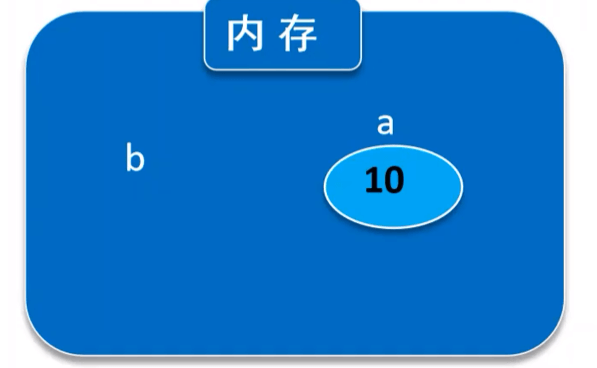
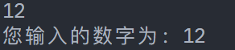
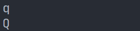

# 变量、数据类型和运算符

## 变量

- 计算机使用内存来存储程序运行过程中使用的数据
- **变量**是指程序执行过程中**值可以改变的量**
- 变量必须**先定义再使用**，定义时系统根据变量的**类型**分配存储空间



不同类型的变量占用的内存空间不同。

**变量的三要素**：类型、名称、值。

### 变量命名规范

1. 不能与系统保留字重名
2. 标识符只能包含字母、数字和下划线 `_`，且首字符必须是字母或下划线
3. 变量必须先定义后使用
4. 同一作用域内，变量名称不能重复
5. 标识符区分大小写，例如 `sum` 和 `Sum` 是不同变量
6. 命名应具有意义，便于代码可读性

## Java 中常用数据类型

| 数据类型           | 示例                                  |
| ------------------ | ------------------------------------- |
| `int`（整型）      | 存储整数，如：-1000、0、10000         |
| `double`（双精度） | 存储小数，如：1.2、2.5                |
| `char`（字符型）   | 存储单个字符，如：'a'、'1'            |
| `String`（字符串） | 存储一串字符，如："Java 编程"、"你好" |

## 常量

- 程序运行过程中，其值**不可改变**的量称为**常量**
- 示例：`final double PI = 3.14;`
- **常量的优点**：保证数据安全性，避免代码中不当修改常量值

### 注意事项

1. 常量名通常用大写字母表示
2. 常量只能赋值一次，通常在定义时初始化

## 运算符

- **赋值运算符**：`变量名 = 表达式;`
- **算术运算符**：`+ - * / %`

### 赋值运算符

赋值运算符将右侧的值或表达式的结果赋给左侧的变量。

### 算术运算符

在 Java 中，乘法符号为 `*`，除法符号为 `/`。例如：

- `a / 10` 表示 `a` 除以 10
- `a / b` 表示 `a` 除以 `b`

## 类型转换

- **自动类型转换**
  1. 两个类型必须相容
  2. 目标类型的存储空间应大于源类型（例如，`double` ← `int`）
- **强制类型转换**
  1. 格式：`(类型名) 表达式`
  2. 示例：`double a = 5.2;` → `int b = (int) a;`

## `Scanner` 接收输入

Java 提供 `Scanner` 类来接收用户输入。

```java
package scu.test_2024_9_28.package_17_51;

import java.util.Scanner;

public class T7 {
    public static void main(String[] args) {
        Scanner input = new Scanner(System.in);
        int num = input.nextInt();
        System.out.println("您输入的数字为：" + num);
        input.close();
    }
}
```



## 练习题

### 计算全体同学的平均分

已知某班有男同学 20 名，女同学 15 名，男生平均分 87，女生平均分 85。

```java
package scu.test_2024_9_28.package_17_51;

public class T8 {
    public static void main(String[] args) {
        int total = 20 * 87 + 15 * 85;
        int num = 20 + 15;
        double avg = total * 1.0 / num;
        System.out.println("平均分为：" + String.format("%.2f", avg));
    }
}
```

### 骨头问题

格莱尔买了 30 根骨头，第一天吃掉一半后再吃一根，第二天再吃一半加一根，第三天依然如此。

问：第三天吃完后还剩多少根骨头？

```java
package scu.test_2024_9_28.package_17_51;

public class T9 {
    public static void main(String[] args) {
        int num = 30;
        num = num / 2 - 1;
        num = num / 2 - 1;
        num = num / 2 - 1;
        System.out.println("还剩下：" + num);
    }
}
```

### 分离一个三位数的个位、十位和百位

将一个三位数 123 分离出个位、十位和百位。

```java
package scu.test_2024_9_28.package_17_51;

public class T10 {
    public static void main(String[] args) {
        int num = 123;
        int bit1 = num % 10;
        int bit2 = num / 10 % 10;
        int bit3 = num / 100;
        System.out.println("个位为：" + bit1);
        System.out.println("十位为：" + bit2);
        System.out.println("百位为：" + bit3);
    }
}
```

### 大小写转换

将输入的小写字母转换为大写字母。

```java
package scu.test_2024_9_28.package_17_51;

import java.util.Scanner;

public class T11 {
    public static void main(String[] args) {
        Scanner input = new Scanner(System.in);
        char ch = input.next().charAt(0);
        char bigCh = (char) (ch - 32);
        System.out.println(bigCh);
        input.close();
    }
}
```


