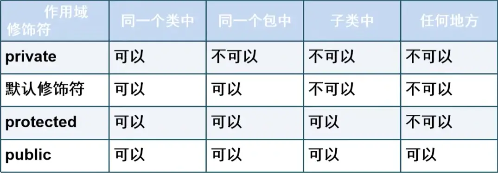

# 抽象和封装

## 类的提炼过程

在面向对象编程中，**类**的提炼过程包括将现实世界中的事物抽象为类，通过类的属性和方法描述其特性和行为。

例如，对于一组狗狗对象，可以通过提炼出 `Dog` 类来表示：


**提炼类的三步**：

1. **发现类**：确定类名，例如 `Dog` 类
2. **发现类的属性**：定义该类对象的特性，如品种、姓名、年龄
3. **发现类的方法**：定义该类对象的行为，如跑、叫等

## 类图

类图是面向对象设计中的重要工具，通过图形表示类的属性和方法，帮助设计和分析类结构。

| Dog                                                    |
| :----------------------------------------------------- |
| + `brand:String`<br />+ `name:String`<br />+ `age:int` |
| + `run():void`<br />+ `bark():void`                    |

- `+` 表示公开的成员（`public`）
- `-` 表示私有的成员（`private`）

## 类定义示例

```java
package scu.test_2024_10_1.package_17_14;

public class Dog {
    public String brand;  // 品种
    public String name;   // 名字
    public int age;       // 年龄

    public void run() {
        System.out.println("run");
    }

    public void bark() {
        System.out.println("bark");
    }
}
```

## 构造方法

构造方法用于初始化对象，在创建对象时自动调用。构造方法的名称与类名相同，且没有返回值。

### 示例：无参构造方法

```java
public Dog() {
    System.out.println("Dog");
}
```

### 自定义构造方法

通过自定义构造方法，可以在创建对象时为属性赋值。

```java
public Dog(String brand, String name, int age) {
    this.brand = brand;
    this.name = name;
    this.age = age;
}
```

### 使用构造方法创建对象

```java
package scu.test_2024_10_1.package_17_14;

public class T3 {
    public static void main(String[] args) {
        Dog dog = new Dog();  // 无参构造方法
        dog.brand = "拉布拉多";
        dog.name = "小黑子";
        dog.age = 5;
        dog.run();

        Dog dog2 = new Dog("边牧", "ikun", 2);  // 有参构造方法
        dog2.bark();
    }
}
```

## 方法重载

**方法重载**允许同一个类中存在多个参数列表不同的方法。方法重载的参数可以在类型、个数或顺序上不同，与返回值类型和访问修饰符无关。

```java
package scu.test_2024_10_2.package_3_08;

public class Cat {
    public void test() { }
    public void test(int num) { }
    public void test(int num, String name) { }
    public void test(String name, int num) { }
}
```

## `static` 的使用

`static` 关键字用于定义静态变量和静态方法。静态成员属于类本身，可以通过类名直接访问。

### 静态成员示例

```java
package scu.test_2024_10_2.package_3_08;

public class Dog {
    static String name;

    public static void show() {
        System.out.println("静态方法");
    }
}
```

### 访问静态成员

```java
package scu.test_2024_10_2.package_3_08;

public class T1 {
    public static void main(String[] args) {
        Dog.name = "Leaf";
        Dog.show();
    }
}
```

## `static` 代码块

`static` 代码块在类加载时执行，并且只执行一次。

```java
package scu.test_2024_10_2.package_3_08;

public class StaticTest {
    static int num = 100;

    static {
        num += 100;
        System.out.println(num);
    }

    static {
        num += 500;
        System.out.println(num);
    }
}
```

## 封装

**封装**是面向对象的三大特性之一。通过将类的属性设为私有（`private`）并提供公有方法（`getter` 和 `setter`）来控制访问，从而保护类的内部数据。

### 使用封装的步骤

1. 将属性的可见性设为 `private`
2. 提供公有的 `getter` 和 `setter` 方法
3. 在 `getter` 和 `setter` 方法中添加必要的检查逻辑

### 示例：使用 `this` 关键字

`this` 关键字用于引用当前对象的属性或方法，特别是在参数名与属性名相同时。

```java
package scu.test_2024_10_2.package_3_53;

public class Dog {
    private String name;
    private int age;

    public void setName(String name) {
        this.name = name;
    }

    public String getName() {
        return name;
    }

    public int getAge() {
        return age;
    }

    public void setAge(int age) {
        this.age = age < 0 ? 0 : age;
    }
}
```

## 访问控制

访问控制符用于限制对类及其成员的访问权限。

- `public`：可以在任何地方访问
- `private`：只能在类内部访问
- `protected`：可以在同一包内或子类中访问
- **默认访问控制符（包级私有）**：只能在同一个包内访问

### 类成员的访问控制



## 练习：歌星投票系统

模拟一个投票系统，每个网民只能投票一次，当投票总数达到 1000 时，投票结束。

### `Vote.java`

```java
package scu.test_2024_10_2.package_5_51;

public class Vote {
    static int count;  // 当前票数
    public static final int MAX_COUNT = 1000;  // 最大票数
    public String name;  // 投票人姓名

    public Vote(String name) {
        this.name = name;
    }

    public void vote() {
        if (count == MAX_COUNT) {
            System.out.println("活动已经结束");
        } else {
            ++count;
            System.out.println("感谢" + name + "投票");
        }
    }

    public static void show() {
        System.out.println("目前" + count + "票");
    }
}
```

### `T1.java`

```java
package scu.test_2024_10_2.package_5_51;

public class T1 {
    public static void main(String[] args) {
        Vote vote = new Vote("张三");
        Vote vote2 = new Vote("李四");
        Vote.show();
        vote.vote();
        Vote.show();
        vote2.vote();
        Vote.show();
    }
}
```
