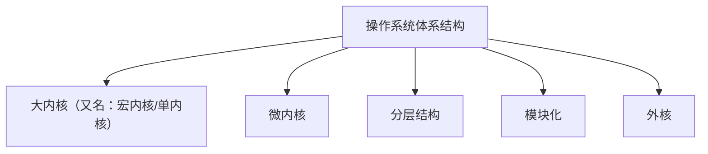

# 操作系统概述

## 操作系统的概念和功能

**知识总览**：

**操作系统**（Operator System, OS）是指**控制**和**管理**整个计算机系统的**硬件**和**软件**资源，并合理地组织调度计算机的工作和资源的分配；以**提供给用户和其他软件方便的接口和环境**；它是计算机系统中最基本的**系统软件**。

1. 操作系统是系统资源的管理者
2. 向上层提供方便易用的服务
3. 是最接近硬件的一层软件

### 作为系统资源的管理者

以使用 QQ 与朋友聊天举例：

1. 在特定文件夹中找到 QQ 安装的位置（逐层打开文件夹，找到 QQ.exe 这个可执行文件的存放位置）
2. 双击打开 QQ.exe（需要把该程序相关数据放入内存）
3. QQ 程序正常聊天（对应的进程被处理机（CPU）处理）
4. 开始和朋友视频聊天（需要将摄像头设备分配给进程）

### 向上层提供方便易用的服务

**封装思想**：

操作系统把一些丑陋的硬件功能封装成简单易用的服务，使用户能更方便地使用计算机，用户无需关心底层硬件的原理，只需要对操作系统发出命令即可。

GUI：图形化用户接口（Graphical User Interface）

用户可以使用形象的图形界面进行操作，而不需要记忆复杂的命令、参数。例如，在 Windows 操作系统中，删除一个文件只需要把文件“拖拽”到回收站即可。

**联机命令接口**实例（Windows 系统），又称**交互式**命令接口。（简而言之，用户说一句，系统跟着做一句）

举例：

1. `⌘` + `r`
2. 输出 `cmd`，按 `Enter`，打开命令解释器
3. 尝试输入 `time` 命令

**脱机命令接口**实例（Windows 系统），又称**批处理**命令接口。（用户说一堆，用户做一堆）

使用 Windows 系统的搜索功能，搜索 C 盘中的 `*.bat` 文件，使用记事本打开任意一个。

**程序接口**：可以在程序中通过**系统调用**来使用程序接口。普通用户不能直接使用程序接口，只能通过程序代码**间接**使用。（如写 C 语言程序时，在使用 `printf` 函数的底层就使用了操作系统提供的显示相关的“系统调用”）

系统调用类似于函数调用，是应用程序请求操作系统服务的唯一方式。

> **注意**：系统调用有时被称为广义指令。

### 作为最接近硬件的层次

需要实现**对硬件机器的拓展**。

没有任何软件支持的计算机成为**裸机**。在裸机上安装的操作系统，可以提供资源管理功能和方便用户的服务功能，将裸机改造为功能更强、使用更方便的机器。

通常将覆盖了软件的机器称为**扩充机器**，又称之为**虚拟机**。

类比汽车：发动机——只会转，轮胎——只会滚；在原始的硬件机器上覆盖一层传动系统——让发动机带着轮子转——使原始的硬件机器得到扩展。

操作系统对硬件机器的拓展：将 CPU、内存、磁盘、显示器、键盘等硬件合理地组织起来，让各种硬件能够相互协调配合，实现更多更复杂的功能。

---

## 操作系统的特征

**知识总览**：

### 并发

**并发**：指两个或多个事件在同一时间间隔内发生。这些事情**宏观上是同时发生**的，但**微观上是交替发生**的。

> **注意**：**并行**是两个或多个事件在同一时刻同时发生。 

**操作系统的并发性**指计算机系统中“同时”运行着多个程序，这些程序宏观上看是同时运行着的，而微观上看是交替运行的。

操作系统就是伴随着“多道程序技术”而出现的。因此，**操作系统和程序并发是一起诞生的**。

> **注意**：
>
> 1. **单核 CPU** 同一时刻只能执行**一个程序**，各个程序只能并发地执行
> 2. **多核 CPU** 同一时刻可以同时执行**多个程序**，多个程序可以并行地执行

即使是对于 4 核 CPU 来说，只要有 4 个以上的程序需要“同时”运行，那么并发性依然是必不可少的，因此**并发性是操作系统的一个最基本的特性**。

### 共享

**共享**即资源共享，是指系统中的资源可供内存中多个并发执行的进程共同使用。

> **注意**：*同时*往往是宏观上的，而在微观上，这些进程可能是交替地对该资源进行访问的（即分时共享）。

### 并发和共享的关系

**并发性**指计算机系统中同时存在着多个运行着的程序，**共享性**是指系统中的资源可供内存中的多个并发程序的进程共同使用。

举例：通过 QQ 发送文件 A，同时使用微信发生文件 B。

1. 两个进程正在并发执行（**并发性**）
2. 需要共享地访问硬盘资源（**共享性**）

> **注意**：
>
> 1. 若失去并发性，则系统中只有一个程序正在运行，则共享性失去存在的意义。
> 2. 若失去共享性，则 QQ 和微信不能同时访问硬盘资源，就无法实现同时发送文件，也就无法并发。
>
> 因此并发性和共享性**互为存在条件**。

### 虚拟

**虚拟**是指把一个<u>物理上</u>的实体变为若干个<u>逻辑上</u>的对应物。物理实体（前者）是实际存在的，而逻辑上对应物（后者）是用户感受到的。

> **注意**：一个程序**需要放入内存**并给它分配 CPU 才能执行。

例如，COD 需要 4GB 的运行内存，QQ 需要 256MB 的运行内存，迅雷需要 256MB 的运行内存……而电脑内存为 4GB。这些程序同时运行需要的内存远大于 4GB，为了使其同时执行，使用了虚拟存储器技术。实际仅有 4GB 的内存，在用户看来远大于 4GB。（使用了虚拟技术中的“空分复用技术”）

在某单核 CPU 的计算机中，用户打开了以下软件：

一个程序需要被分配 CPU 才可以运行，为了使单核 CPU 的电脑中能够同时运行多个程序，采用了虚拟处理器技术，实际上只有一个单核 CPU，在用户看来存在 6 个 CPU 同时为自己服务。

虚拟技术中的“时分复用技术”，微观上处理机在各个微小的时间段内交替着为各个进程服务。

---

**虚拟**是指把一个物理上的实体变为若干个逻辑上的对应物。物理实体（前者）是实际存在的，而逻辑上的对应物（后者）是用户感受到的。

显然，如果失去了并发性，则一个时间段内系统只需运行一道程序，那么就失去了虚拟性的意义了。因此，**没有并发性，就谈不上虚拟性**。

### 异步

**异步**指在多道程序环境下，允许多个程序并发执行，但由于资源有限，进程的执行不是一贯到底的，而是走走停停，以不可预知的速度向前推进，此为进程的异步性。 

如果失去了并发性，即系统仅能串行地运行各个程序，那么每个程序的执行会一贯到底。只要系统拥有并发性，才有可能导致异步性。

---

## 操作系统的发展和分类

### 手工操作阶段

**主要缺点**：用户独占全机、人机速度矛盾导致资源利用率极低。

### 批处理阶段——单道批处理系统

引入**脱机输入/输出技术**（用外围机+磁带完成），并由**监督程序**（操作系统的雏形）负责控制作业的输入、输出。

**主要优点**：缓解了一定程度的人机速度矛盾，资源利用率有所提升。

**主要缺点**：**内存中仅能有一道程序运行**，只有该程序运行结束之后才能调入下一道程序。**CPU 有大量的时间是在空闲等待 I/O 完成。**资源利用率依然很低。

### 批处理阶段——多道批处理系统

- **主要优点**：多道程序**并发**执行，**共享**计算机资源。**资源利用率大幅提升**，CPU 和其他资源更能保持“忙碌”状态，系统吞吐量增大。

- **主要缺点**：用户响应时间长，**没有人机交互功能**。（用户提交自己的作业后只能等待计算机处理完成，中间无法控制自己的作业执行。例如，无法调试程序或无法在程序运行过程中输入一些参数）

### 分时操作系统

**分时操作系统**：计算机以时间片为单位轮流为各个用户/作业服务，各个用户可通过终端与计算机进行交互。

**主要优点**：用户请求可以被即时响应，解决了人机交互问题。允许多个用户同时使用一台计算机，并且用户对计算机的操作相互独立，感受不到别人的存在。

**主要缺点**：不能优先处理一些**紧急任务**。操作系统对各个用户/作业都是<u>完全公平</u>的，循环地为每个用户/作业服务一个时间片，不区分任务的紧急性。

### 实时操作系统

**主要优点**：能够优先响应一些紧急任务，某些紧急任务无需时间片排队。

在实时操作系统的控制下，计算机系统接受到**外部信号**后及时进行处理，并且要在严格的时限内处理完事件。实时操作系统的主要特点是及时性和可靠性。

### 其他系统

- **网络操作系统**：是伴随着计算机网络的发展而诞生的，能把网络中的各个计算机有机地结合起来，实现数据传送等功能，实现网络中各种资源的共享（如文件共享）和各台计算机之间的通信。（如：Windows NT 就是一种典型的网络操作系统，网站服务器就可以使用）

- **分布式操作系统**：主要特点是分布性和并行性。系统中的各台计算机地位相同，任何工作都可以分布在这些计算机上，由它们并行、协同完成这个任务。

- **个人计算机操作系统**：如 Windows XP、macOS，方便个人使用。

---

## 操作系统的运行机制

---

程序运行的过程就是 CPU 执行一条一条机器指令的过程。

**“指令”就是处理器（CPU）能识别、执行的最基本命令。**

> **注意**：很多人习惯将 Linux、Windows、macOS 的命令行窗口中使用的命令也称为“指令”，其实此为“交互式命令接口”。上述“指令”为二进制机器指令。

### 内核程序 vs. 应用程序

一般地，程序员写的程序就是“应用程序”。（应用程序只能使用“<u>非特权指令</u>”，如：加法指令、减法指令等）

实现操作系统的程序员，写的是“内核程序”。（操作系统内核作为“管理者”，有时会让 CPU 执行一些“**特权指令**”，如：内存清零指令。这些指令影响重大，只允许“**管理者**”——即操作系统内核来使用）

内核程序组成了“操作系统内核”，或者简称“内核（Kernel）”。

内核是操作系统**最重要、最核心**的部分，也是最接近硬件的部分。甚至可以说，一个操作系统只需要内核即可。操作系统的功能未必都在内核中，如图形化界面 GUI。

> **注意**：CPU 在设计和生产的时候就划分了特权指令和非特权指令，因此 CPU 执行一条指令前就能判断出其类型。

### 内核态 vs. 用户态

为了判断此时运行的程序是内核程序或应用程序，CPU 有两种状态：内核态和用户态。

- 处于**内核态**时，说明此时正在运行的是**内核程序**，此时**可以执行特权指令**
- 处于**用户态**时，说明此时正在运行的是**应用程序**，此时**只能执行非特权指令**

> **拓展**：CPU 中有一个寄存器叫**程序状态字寄存器（PSW）**，其中有个二进制位，1 表示“内核态”，0 表示“用户态”。（不同 CPU 可能不相同）

**别名**：内核态=核心态=**管态**；用户态=**目态**。

### 内核态、用户态的切换

**内核态切换为用户态**：执行一条特权指令——修改 PSW 的标志位为“用户态”，这个动作意味着操作系统主动让出 CPU 使用权。

**用户态切换为内核态**：由中断引发，硬件自动完成变态过程，触发中断信号意味着操作系统将强行夺回 CPU 的使用权。

---

1. 刚开机时，CPU 为**内核态**，操作系统内核程序先上 CPU 运行
2. 开机完成后，用户就可以启动某个应用程序
3. 操作系统内核程序在合适的时候主动让出 CPU，让该应用程序上 CPU 运行（操作系统内核在让出 CPU 之前，会用一条特权指令将 PSW 的标志位设置为**用户态**）
4. 应用程序运行在**用户态**
5. 若此时应用程序中植入了一条特权指令，意图破坏操作系统
6. CPU 发现接下来执行的这条指令是特权指令，但此时又处于用户态
7. 这个非法事件会引发一个中断信号（**CPU 检测到中断信号以后**，会立即**变为“核心态”**，并停止运行当前的应用程序，转而运行处理中断信号的内核程序）
8. **中断**使操作系统再次夺回 CPU 的控制权
9. 操作系统会对引发中断的事件进行处理，处理完成后将 CPU 的使用权交给其他程序

---

## 中断和异常

**知识总览**：

### 中断的作用

CPU 上会运行两种程序，一种是**操作系统内核程序**（整个系统管理者），一种是**应用程序**。

在合适的情况下，操作系统内核会把 CPU 的使用权主动让给应用程序。

中断是让操作系统内核夺回 CPU 使用权的**唯一途径**，其会使 CPU 由用户态变为内核态，使操作系统重新夺回对 CPU 的控制权。

若无“中断”机制，那么一旦应用程序上 CPU 运行，CPU 就会<u>一直运行</u>这个应用程序。

> **注意**：若无“中断”，则<u>无法**并发**</u>。

### 中断的类型

### 内中断的例子

与当前执行的指令**有关**，中断信号来源于 **CPU 内部**。

1. 试图在用户态下执行特权指令
2. 执行除法指令时发现除数是 0（若当前执行的指令是**非法**的，则会引发一个中断信号）
3. 有时候应用程序想请求操作系统内核的服务，此时会执行一条特殊的指令——陷入指令（也可以称为<u>系统调用指令</u>），该指令会引发一个内部中断信号（执行<u>陷入指令</u>，意味着应用程序*主动地*将 CPU 控制权还给操作系统内核。**系统调用**就是通过陷入指令完成的）

### 外中断的例子

与当前执行的指令**无关**，中断信号来源于 **CPU 外部**。

1. **时钟中断**——由时钟部件发来的中断信号
2. **I/O 中断**——由输入/输出设备发来的中断信号

### 中断的分类

> **注意**：一般地，狭义的中断指的是外中断，将内中断称为异常。

### 中断机制的基本原理

不同的中断信号，需要不同的终端处理程序来处理。当 CPU 检测到中断信号后，会根据中断信号的类型去查询“中断向量表”，以此来找到相应的中断处理程序在内存中的存放位置。

显然，中断处理程序一定是内核程序，需要运行在**内核态**。

---

## 系统调用

**知识总览**：

### 系统调用的概念

操作系统作为用户和计算机硬件之间的接口，需要向上提供一些简单易用的服务。主要包括命令接口和程序接口。其中，程序接口由一组**系统调用**组成。

**系统调用**是操作系统提供给应用程序（程序员/编写人员）使用的接口，可以理解为一种可供应用程序调用的<u>特殊函数</u>，应用程序可以通过系统调用来请求获得操作系统内核的服务。

### 系统调用和库函数的区别

- 不涉及系统调用的库函数：如“取绝对值”函数
- 涉及系统调用的库函数：如”创建一个新文件“的函数

### 系统调用的必要性

以生活场景举例：

去学校打印店打印论文，A 使用 WPS 的“打印”选项，打印机开始工作。

A 的论文打印到一半，另一位同学按下了 Word 的“打印”按钮，开始打印他自己的论文。

若这两个进程可以随机地、并发地共享打印机资源，打印机设备交替地收到 WPS 和 Word 两个进程发来的打印请求，两篇论文的内容混杂在一起。（因此这些进程只能<u>互斥地</u>共享这些资源）

**解决方法**：

由操作系统内核对共享资源进行统一的管理，并向上提供“系统调用”，用户进程想要使用打印机这种共享资源，只能通过系统调用向操作系统内核发出请求。内核会对各个请求进行<u>**协调处理**</u>。

应用程序通过**系统调用**请求操作系统的服务。而系统中的各种共享资源都由操作系统内核统一掌握，因此**凡是与<u>共享资源</u>有关的操作（如存储分配、I/O 操作、文件管理等），都必须通过<u>系统调用</u>的方式向操作系统内核提出服务请求**，由操作系统内核代为完成。这样**可以保证系统的稳定性和安全性**，防止用户进行非法操作。

### 系统调用的过程

系统先使用**传参指令**将多个参数传入相应的寄存器中。例如在某个寄存器中放入了一个参数，指明了此次要进行的*系统调用的类型*。传递参数的指令可能有多条，主要看该系统调用需要的参数的数量。

之后**陷入指令**的执行会引发一个*内中断*，CPU 检测到该内中断后，发现该信号由陷入指令引发。

接下来执行的系统调用程序需要在内核态下运行。（可以视为某种中断处理程序，只不过处理的是由陷入指令引起的内中断）

然后执行系统调用入口程序的指令确定需要哪种系统调用服务。

之后系统调用处理程序（图中为 fork 系统调用）根据存储在寄存器的其他参数来执行。

---

首先，传递系统调用参数；随后在**用户态**下执行陷入指令，触发从用户态到核心态的切换；接着，内核处理程序在**核心态**下执行以完成系统调用的请求；最后，控制权返回用户态，应用程序继续运行。

> **注意**：
>
> 1. **陷入指令**是在**用户态**执行的，执行陷入指令之后立即引发一个**内中断**，使 CPU **进入核心态**
> 2. **发出系统调用请求**是在**用户态**，而**对系统调用的相应处理**在**核心态**下进行

**别名**：陷入指令 = trap 指令 = 访管指令

---

## 操作系统的体系结构

**知识总览**：

> **注意**：操作系统**内核**需要运行在**内核态**，操作系统的**非内核**功能运行在**用户态**。

**内核**是操作系统最基本、最核心的部分，实现操作系统内核功能的那些程序就是**内核程序**。

**大内核**与**微内核**的范围不同：

---

**举例**：现有应用程序想要提出请求操作系统的服务，这个服务同时涉及到进程管理、存储管理、设备管理。

大内核进行了两次变态，微内核进行了六次变态。

> **注意**：变态的过程是有成本的，要消耗不少时间，频繁地变态会降低系统性能。

- 典型的大内核/宏内核/单内核操作系统：Linux、UNIX
- 典型的微内核操作系统：Windows NT

---

### 分层结构

最底层是硬件，最高层是用户接口，每层可调用更低一层。

### 模块化

模块化是将操作系统按功能划分为若干个具有一定独立性的模块。每个模块具有某个方面的管理功能，并规定好各模块间的接口，使各模块之间能通过接口进行通信。还可以进一步将各模块细分为若干个具有一定功能的子模块，同样也规定好各子模块之间的接口。将这种设计称为模块-接口法。

### 外核（exokernel）

## 操作系统引导（Boot）

**知识总览**：

操作系统引导（Boot）——开机的时候，如何使操作系统运行起来。

安装完操作系统后：

将 C 盘内部进一步细分：

### 操作系统引导（开机过程）

1. 计算机开机时，CPU 执行 ROM（BIOS, Basic Input/Output System）中的引导程序（Boot 程序）的指令
2. 引导程序指示 CPU 将磁盘的主引导记录（MBR，其中包含磁盘引导程序和分区表）读入内存
3. CPU 执行主存中的磁盘引导程序
4. 磁盘引导程序根据分区表判断 C 盘的位置
5. 读入 C 盘的引导记录（PBR, Partition Boot Record）
6. 执行 PBR 中的程序
7. CPU 找到启动管理器（通常存放在根目录下的某个位置）
8. CPU 执行启动管理程序
9. 启动管理程序完成操作系统的初始化工作

**举例**：Windows 操作系统的初始化程序，完整的**操作系统初始化（即启动管理器）**可在根目录下找到。

## 虚拟机

### 传统计算机

### 虚拟机

虚拟机，使用虚拟化技术，将一台物理机器虚拟化为多台虚拟机器（Virtual Machine, VM），每个虚拟机器都可以独立运行一个操作系统。

同义术词：虚拟机管理程序/虚拟机监控程序/Virtual Machine Monitor/Hyper-visor

支持虚拟化的 CPU 通常分更多指令等级（VMM 运行在 Ring 0，而第一类的虚拟机的虚拟内核空间是 Ring 1，这种设计可以使虚拟机更好地运行一些不敏感的特权指令，敏感的特权指令位于 Ring 0）：

