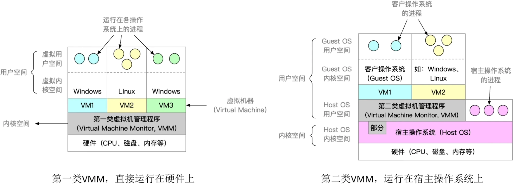

# 操作系统概述

## 操作系统的概念和功能

**知识总览**：

操作系统（Operator System, OS）是指控制和管理整个计算机系统的硬件和软件资源，并合理地组织调度计算机的工作和资源的分配；以**提供给用户和其他软件方便的<u>接口和环境</u>**；它是计算机系统中最基本的**系统软件**。

1. 操作系统是系统资源的管理者。
2. 向上层提供方便易用的服务。
3. 是最接近硬件的一层软件。

### 作为系统资源的管理者

以使用 QQ 与朋友聊天举例：

1. 在特定文件夹中找到 QQ 安装的位置（逐层打开文件夹，找到 QQ.exe 这个可执行文件的存放位置）。
2. 双击打开 QQ.exe（需要把该程序相关数据放入内存）。
3. QQ 程序正常聊天（对应的进程被处理机处理）。
4. 开始和朋友视频聊天（需要将摄像头设备分配给进程）。

### 向上层提供方便易用的服务

**封装思想**：

操作系统把一些**丑陋**的硬件功能封装成简单易用的服务，使用户能更方便地使用计算机，用户无需关心**底层硬件的原理**，只需要对操作系统发出命令即可。

图形化用户接口（GUI, Graphical User Interface）。用户可以使用形象的图形界面进行操作，而不需要记忆复杂的命令、参数。例如，在 Windows 操作系统中，删除一个文件只需要把文件“拖拽”到回收站即可。

**联机命令接口**实例（Windows 系统），又称**交互式**命令接口。（简而言之，用户说一句，系统跟着做一句）

举例：

1. `⌘` + `r`。
2. 输出 `cmd`，按 `Enter`，打开命令解释器。
3. 尝试输入 `time` 命令。

**脱机命令接口**实例（Windows 系统），又称**批处理**命令接口。（用户说一堆，系统做一堆）

使用 Windows 系统的搜索功能，搜索 C 盘中的 `*.bat` 文件，使用记事本打开任意一个。

**程序接口**，由一系列系统调用组成，可以在程序中通过**系统调用**来使用程序接口。普通用户<u>不能直接</u>使用程序接口，只能通过程序代码**间接**使用。（如写 C 语言程序时，在使用 `printf` 函数的底层就使用了操作系统提供的显示相关的系统调用）

系统调用类似于函数调用，是应用程序请求操作系统服务的<u>唯一方式</u>。

> [!TIP]
>
> 系统调用有时被称为广义指令。

### 作为最接近硬件的层次

需要实现对硬件机器的拓展。

没有任何软件支持的计算机成为**裸机**。在裸机上安装的操作系统，可以提供资源管理功能和方便用户的服务功能，将裸机改造为功能更强、使用更方便的机器。

通常将覆盖了软件的机器称为扩充机器，又称之为**虚拟机**。

类比汽车：发动机——只会转，轮胎——只会滚；在原始的硬件机器上覆盖一层传动系统——让发动机带着轮子转——使原始的硬件机器得到扩展。

操作系统对硬件机器的拓展：将 CPU、内存、磁盘、显示器、键盘等硬件合理地组织起来，让各种硬件能够相互协调配合，实现更多更复杂的功能。

---

__知识回顾__：

## 操作系统的特征

**知识总览**：

### 并发

**并发**：指两个或多个事件在同一时间间隔内发生。这些事情**宏观上是同时发生**的，但**微观上是交替发生**的。

> [!TIP]
>
> **并行**是两个或多个事件在同一时刻同时发生。 

**操作系统的并发性**指计算机系统中“同时”运行着多个程序，这些程序宏观上看是同时运行着的，而微观上看是交替运行的。

操作系统就是伴随着多道程序技术而出现的。因此，**操作系统和程序并发是一起诞生的**。

> [!TIP]
>
> 1. **单核 CPU** 同一时刻只能执行**一个程序**，各个程序只能并发地执行。
> 2. **多核 CPU** 同一时刻可以同时执行**多个程序**，多个程序可以并行地执行。

即使是对于 4 核 CPU 来说，只要有 4 个以上的程序需要“同时”运行，那么并发性依然是必不可少的，因此**并发性是操作系统的一个最基本的特性**。

### 共享

**共享**即资源共享，是指系统中的资源可供内存中多个并发执行的进程共同使用。

- **互斥共享方式**：系统中的某些资源，虽然可以提供给多个进程使用，但一个时间段内只允许一个进程访问该资源。
- **同时共享方式**：系统中的某些资源，允许一个时间段内由多个进程“同时”对它们进行访问。

> [!TIP]
>
> “同时”往往是宏观上的，而在微观上，这些进程可能是交替地对该资源进行访问的（即分时共享）。

### 并发和共享的关系

并发性指计算机系统中同时存在着多个运行着的程序，共享性是指系统中的资源可供内存中的多个并发程序的进程共同使用。

**举例**：通过 QQ 发送文件 A，同时使用微信发生文件 B。

1. 两个进程正在并发执行（**并发性**）
2. 需要共享地访问硬盘资源（**共享性**）

> [!TIP]
>
> 1. 若失去并发性，则系统中只有一个程序正在运行，则共享性失去存在的意义。
> 2. 若失去共享性，则 QQ 和微信不能同时访问硬盘资源，就无法实现同时发送文件，也就无法并发。
>
> 因此并发性和共享性**互为存在条件**。

### 虚拟

虚拟是指把一个<u>物理上</u>的实体变为若干个<u>逻辑上</u>的对应物。物理实体（前者）是实际存在的，而逻辑上对应物（后者）是用户感受到的。

> [!TIP]
>
> 一个程序**需要放入内存**并给它分配 CPU 才能执行。

例如，COD 需要 4GB 的运行内存，QQ 需要 256MB 的运行内存，迅雷需要 256MB 的运行内存……而电脑内存为 4GB。这些程序同时运行需要的内存远大于 4GB，为了使其同时执行，使用了虚拟存储器技术。实际仅有 4GB 的内存，在用户看来远大于 4GB。（使用了虚拟技术中的空分复用技术）

在某单核 CPU 的计算机中，用户打开了以下软件：

一个程序需要被分配 CPU 才可以运行，为了使单核 CPU 的电脑中能够同时运行多个程序，采用了虚拟处理器技术，实际上只有一个单核 CPU，在用户看来存在 6 个 CPU 同时为自己服务。

虚拟技术中的时分复用技术，微观上处理机在各个微小的时间段内交替着为各个进程服务。

显然，如果失去了并发性，则一个时间段内系统只需运行一道程序，那么就失去了虚拟性的意义了。因此，**没有并发性，就谈不上虚拟性**。

### 异步

**异步**指在多道程序环境下，允许多个程序并发执行，但由于资源有限，进程的执行不是一贯到底的，而是走走停停，以不可预知的速度向前推进，此为进程的异步性。 

如果失去了并发性，即系统仅能串行地运行各个程序，那么每个程序的执行会一贯到底。只要系统拥有并发性，才有可能导致异步性。

---

**知识回顾**：

## 操作系统的发展和分类

### 手工操作阶段

**主要缺点**：用户独占全机、人机速度矛盾导致资源利用率极低。

### 批处理阶段——单道批处理系统

引入脱机输入/输出技术（用外围机 + 磁带完成），并由**监督程序**（操作系统的雏形）负责控制作业的输入、输出。

- **主要优点**：缓解了一定程度的人机速度矛盾，资源利用率有所提升。

- **主要缺点**：内存中仅能有一道程序运行，只有该程序运行结束之后才能调入下一道程序；CPU 有大量的时间是在空闲等待 I/O 完成，资源利用率依然很低。

### 批处理阶段——多道批处理系统

- **主要优点**：多道程序并发执行，共享计算机资源；资源利用率大幅提升，CPU 和其他资源更能保持“忙碌”状态，系统吞吐量增大。

- **主要缺点**：用户响应时间长，没有人机交互功能。（用户提交自己的作业后只能等待计算机处理完成，中间无法控制自己的作业执行。例如，无法调试程序或无法在程序运行过程中输入一些参数。）

### 分时操作系统

**分时操作系统**：计算机以时间片为单位轮流为各个用户/作业服务，各个用户可通过终端与计算机进行交互。

- **主要优点**：用户请求可以被即时响应，解决了人机交互问题；允许多个用户同时使用一台计算机，并且用户对计算机的操作相互独立，感受不到别人的存在。

- **主要缺点**：不能优先处理一些紧急任务；操作系统对各个用户/作业都是完全公平的，循环地为每个用户/作业服务一个时间片，<u>不区分任务的紧急性</u>。

### 实时操作系统

**主要优点**：能够优先响应一些紧急任务，某些紧急任务无需时间片排队。

在实时操作系统的控制下，计算机系统接受到**外部信号**后及时进行处理，并且要在严格的时限内处理完事件。实时操作系统的主要特点是及时性和可靠性。

### 其他系统

- **网络操作系统**：是伴随着计算机网络的发展而诞生的，能把网络中的各个计算机有机地结合起来，实现数据传送等功能，实现网络中各种资源的共享（如文件共享）和各台计算机之间的通信。（例如，Windows NT 就是一种典型的网络操作系统，网站服务器就可以使用。）

- **分布式操作系统**：主要特点是分布性和并行性；系统中的各台计算机地位相同，任何工作都可以分布在这些计算机上，由它们并行、协同完成这个任务。

- **个人计算机操作系统**：如 Windows XP、macOS，方便个人使用。

---

**知识回顾**：

## 操作系统的运行机制

程序运行的过程就是 CPU 执行一条一条机器指令的过程。

**“指令”就是处理器（CPU）能识别、执行的最基本命令。**

> [!TIP]
>
> 很多人习惯将 Linux、Windows、macOS 的命令行窗口中使用的命令也称为“指令”，其实此为“交互式命令接口”。上述“指令”为二进制机器指令。

### 内核程序 vs. 应用程序

一般地，程序员写的程序就是“应用程序”。（应用程序只能使用“**非特权指令**”，如加法指令、减法指令等）

实现操作系统的程序员，写的是“内核程序”。（操作系统内核作为“管理者”，有时会让 CPU 执行一些“**特权指令**”，如内存清零指令。这些指令影响重大，只允许“**管理者**”——即操作系统内核来使用）

内核程序组成了“操作系统内核”，或者简称“内核（Kernel）”。

内核是操作系统**最重要、最核心**的部分，也是最接近硬件的部分。甚至可以说，一个操作系统只需要内核即可。操作系统的功能未必都在内核中，如图形化界面 GUI。

> [!TIP]
>
> CPU 在设计和生产的时候就划分了特权指令和非特权指令，因此 CPU 执行一条指令前就能判断出其类型。

### 内核态 vs. 用户态

为了判断此时运行的程序是内核程序或应用程序，CPU 有两种状态：内核态和用户态。

- 处于**内核态**时，说明此时正在运行的是**内核程序**，此时**<u>可以</u>执行特权指令**。
- 处于**用户态**时，说明此时正在运行的是**应用程序**，此时**<u>只能</u>执行非特权指令**。

> [!TIP]
>
> CPU 中有一个寄存器叫**程序状态字寄存器（Program Status Word, PSW）**，其中有个二进制位，1 表示“内核态”，0 表示“用户态”。（不同 CPU 可能不相同）

**别名**：内核态 = 核心态 = **管态**；用户态 = **目态**。

### 内核态、用户态的切换

- **内核态切换为用户态**：执行一条特权指令——修改 PSW 的标志位为<u>用户态</u>，这个动作意味着操作系统<u>主动</u>让出 CPU 使用权。

- **用户态切换为内核态**：由中断引发，硬件自动完成变态过程，触发中断信号意味着操作系统将<u>强行夺回</u> CPU 的使用权。

---

1. 刚开机时，CPU 为**内核态**，操作系统内核程序先上 CPU 运行。
2. 开机完成后，用户就可以启动某个应用程序。
3. 操作系统内核程序在合适的时候主动让出 CPU，让该应用程序上 CPU 运行。（操作系统内核在让出 CPU 之前，会用一条<u>特权指令</u>将 PSW 的标志位设置为**用户态**）
4. 应用程序运行在**用户态**。
5. 若此时应用程序中植入了一条特权指令，意图破坏操作系统。
6. CPU 发现接下来执行的这条指令是特权指令，但此时又处于用户态。
7. 这个非法事件会引发一个中断信号。（**CPU 检测到中断信号以后**，会立即**变为“核心态”**，并停止运行当前的应用程序，转而运行处理中断信号的**内核程序**）
8. **中断**使操作系统再次夺回 CPU 的控制权。
9. 操作系统会对引发中断的事件进行处理，处理完成后将 CPU 的使用权交给其他程序。

---

**知识总览**：

## 中断和异常

**知识总览**：

### 中断的作用

CPU 上会运行两种程序，一种是**操作系统内核程序**（整个系统管理者），一种是**应用程序**。

在合适的情况下，操作系统内核会把 CPU 的使用权主动让给应用程序。

中断是让操作系统内核夺回 CPU 使用权的唯一途径，其会使 CPU 由**用户态**变为**内核态**，使操作系统重新夺回对 CPU 的控制权。

若无“中断”机制，那么一旦应用程序上 CPU 运行，CPU 就会一直运行这个应用程序。

> [!TIP]
>
> 若无“中断”，则<u>无法**并发**</u>。

### 中断的类型

### 内中断的例子

与当前执行的指令**有关**，中断信号来源于 **CPU 内部**。

1. 试图在用户态下执行特权指令。
2. 执行除法指令时发现除数是 0。（若当前执行的指令是**非法**的，则会引发一个中断信号）
3. 有时候应用程序想请求操作系统内核的服务，此时会执行一条特殊的指令——陷入指令（也可以称为<u>系统调用指令</u>），该指令会引发一个内部中断信号。（执行**陷入指令**，意味着应用程序主动地将 CPU 控制权还给操作系统内核；**系统调用**就是通过陷入指令完成的。）

### 外中断的例子

与当前执行的指令**无关**，中断信号来源于 **CPU 外部**。

1. **时钟中断**：由时钟部件发来的中断信号。
2. **I/O 中断**：由输入/输出设备发来的中断信号。

### 中断的分类

> [!TIP]
>
> 一般地，狭义的中断指的是外中断，将内中断称为异常。

### 中断机制的基本原理

不同的中断信号，需要不同的中断处理程序来处理。当 CPU 检测到中断信号后，会根据中断信号的类型去查询“中断向量表”，以此来找到相应的中断处理程序在内存中的存放位置。

显然，中断处理程序一定是内核程序，需要运行在**内核态**。

---

**知识回顾**：

## 系统调用

**知识总览**：

### 系统调用的概念

操作系统作为用户和计算机硬件之间的接口，需要向上提供一些简单易用的服务。主要包括命令接口和程序接口。其中，程序接口由一组**系统调用**组成。

**系统调用**是操作系统提供给应用程序（程序员/编写人员）使用的接口，可以理解为一种可供应用程序调用的<u>特殊函数</u>，应用程序可以通过系统调用来请求获得操作系统内核的服务。

### 系统调用和库函数的区别

- 不涉及系统调用的库函数：如“取绝对值”函数。
- 涉及系统调用的库函数：如”创建一个新文件“的函数。

### 系统调用的必要性

以生活场景举例：

去学校打印店打印论文，A 使用 WPS 的“打印”选项，打印机开始工作。

A 的论文打印到一半，另一位同学按下了 Word 的“打印”按钮，开始打印他自己的论文。

若这两个进程可以随机地、并发地共享打印机资源，打印机设备交替地收到 WPS 和 Word 两个进程发来的打印请求，两篇论文的内容混杂在一起。（因此这些进程只能<u>互斥地</u>共享这些资源）

**解决方法**：

由操作系统内核对共享资源进行统一的管理，并向上提供系统调用，用户进程想要使用打印机这种共享资源，**只能**通过系统调用向操作系统内核发出请求，内核会对各个请求进行协调处理。

应用程序通过系统调用请求操作系统的服务，而系统中的各种共享资源都由操作系统内核统一管理，因此**凡是与<u>*共享资源*</u>有关的操作（如存储分配、I/O 操作、文件管理等），都必须通过<u>*系统调用*</u>的方式向操作系统内核提出服务请求**，由操作系统内核代为完成。这样**可以保证系统的稳定性和安全性**，防止用户进行非法操作。

### 系统调用的过程

系统先使用传参指令将多个参数传入相应的寄存器中。例如在某个寄存器中放入了一个参数，指明了此次要进行的系统调用的类型。传递参数的指令可能有多条，主要看该系统调用需要的参数的数量。

之后陷入指令的执行会引发一个内中断，CPU 检测到该内中断后，发现该信号由陷入指令引发。

接下来执行的系统调用入口程序需要在内核态下运行。（可以视为某种中断处理程序，只不过处理的是由陷入指令引起的内中断。）

然后执行系统调用入口程序的指令确定需要哪种系统调用服务。

之后系统调用处理程序（图中为 `fork` 系统调用）根据存储在寄存器的其他参数来执行。

---

首先，传递系统调用参数；随后在**用户态**下执行陷入指令，触发从用户态到核心态的切换；接着，内核处理程序在**核心态**下执行以完成系统调用的请求；最后，控制权返回用户态，应用程序继续运行。

> [!TIP]
>
> 1. **陷入指令**是在**用户态**执行的，执行陷入指令之后立即引发一个**内中断**，使 CPU **进入核心态**。
> 2. **发出系统调用请求**是在**用户态**，而**对系统调用的相应处理**在**核心态**下进行。

**别名**：陷入指令 = trap 指令 = 访管指令。

---

**知识回顾**：

> [!tip]
>
> 凡是与共享资源有关的操作、会直接影响到其他进程的操作，就一定需要操作系统介入，就需要通过系统调用来实现。

## 操作系统的体系结构

**知识总览**：

> [!TIP]
>
> 操作系统**内核**需要运行在**内核态**，操作系统的**非内核**功能运行在**用户态**。

**内核**是操作系统最基本、最核心的部分，实现操作系统内核功能的那些程序就是**内核程序**。

**大内核**与**微内核**的范围不同：

---

**举例**：现有应用程序想要提出请求操作系统的服务，这个服务同时涉及到进程管理、存储管理、设备管理。

大内核进行了两次变态，微内核进行了六次变态。

> [!TIP]
>
> 变态的过程是有成本的，要消耗不少时间，频繁地变态会降低系统性能。

- 典型的大内核/宏内核/单内核操作系统：Linux、UNIX
- 典型的微内核操作系统：Windows NT

---

### 分层结构

最底层是硬件，最高层是用户接口，每层可调用更低一层。

### 模块化

模块化是将操作系统按功能划分为若干个具有一定独立性的模块。每个模块具有某个方面的管理功能，并规定好各模块间的接口，使各模块之间能<u>通过接口进行通信</u>。还可以进一步将各模块细分为若干个具有一定功能的子模块，同样也规定好<u>各子模块之间的接口</u>。将这种设计称为模块-接口法。

### 外核（exokernel）

## 操作系统引导（Boot）

**知识总览**：

操作系统引导（Boot）——开机的时候，如何使操作系统运行起来。

安装完操作系统后：

> [!TIP]
>
> 在 MBR 硬盘中，分区分为两类：**主分区**（最多 4 个）和**扩展分区**（1 个，内部可分为多个逻辑分区）。而“活动分区”是在这些主分区中，被**手动标记为“可用于启动操作系统”的那个分区**——它的本质是给 BIOS 一个“明确指令”：”我这里有操作系统的引导文件，你从这里加载启动程序。”

将 C 盘内部进一步细分：

### 操作系统引导（开机过程）

1. 计算机开机时，CPU 执行 ROM（BIOS, Basic Input/Output System）中的引导程序（Boot 程序）的指令。

   > [!TIP]
   >
   > BIOS 引导程序的作用是先完成**硬件自检（POST，Power-On Self-Test，加电自检）**，例如检查 CPU、内存、磁盘是否正常，若硬件故障会报错，如”内存报警“；自检通过后，立即启动”引导流程“，此为开机的起点。

2. 引导程序指示 CPU 将磁盘的主引导记录（MBR，其中包含磁盘引导程序和分区表）读入内存。

3. CPU 执行主存中的磁盘引导程序。

4. 磁盘引导程序根据分区表判断 C 盘的位置。

5. 读入 C 盘的分区引导记录（PBR, Partition Boot Record）。

6. 执行 PBR 中的程序。

7. CPU 找到启动管理器（通常存放在根目录下的某个位置）。

8. CPU 执行启动管理程序。

9. 启动管理程序完成操作系统的初始化工作。

**举例**：Windows 操作系统的初始化程序，完整的**操作系统初始化（即启动管理器）**可在根目录下找到。

## 虚拟机

### 传统计算机

### 虚拟机

虚拟机，使用虚拟化技术，将一台物理机器虚拟化为多台虚拟机器（Virtual Machine, VM），每个虚拟机器都可以独立运行一个操作系统。

**同义术词**：虚拟机管理程序 = 虚拟机监控程序 = Virtual Machine Monitor = Hyper-visor。

支持虚拟化的 CPU 通常分更多指令等级（VMM 运行在 Ring 0，而第一类的虚拟机的虚拟内核空间是 Ring 1，这种设计可以使虚拟机更好地运行一些不敏感的特权指令，敏感的特权指令位于 Ring 0）：

