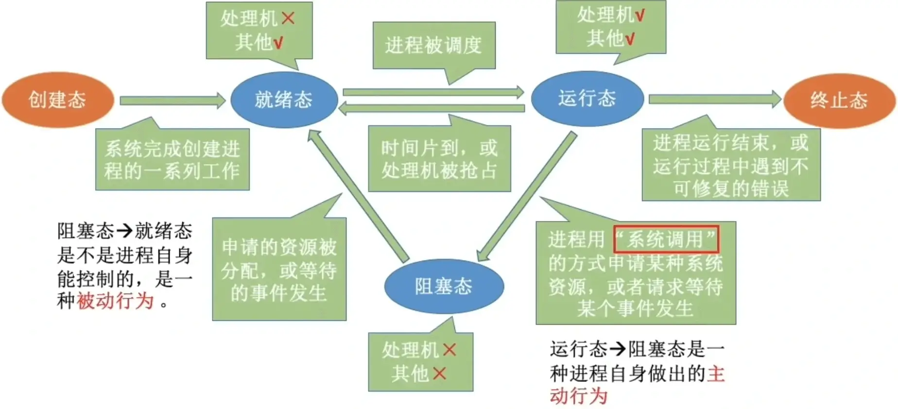
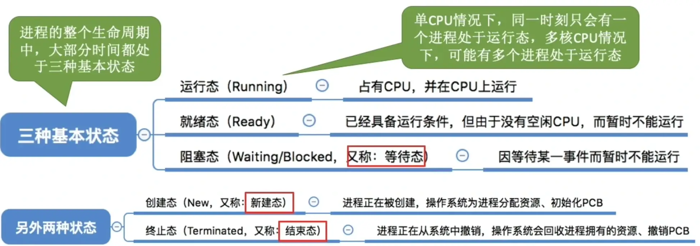
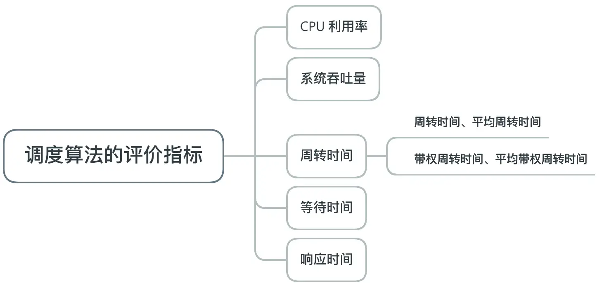
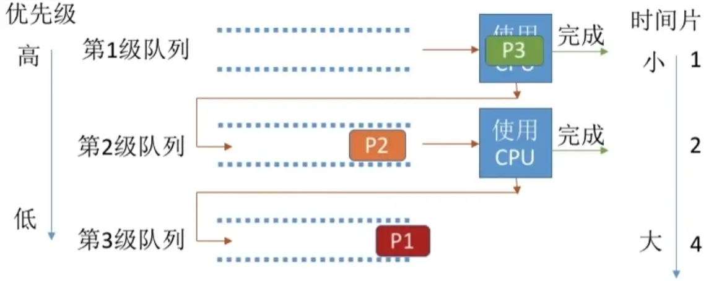
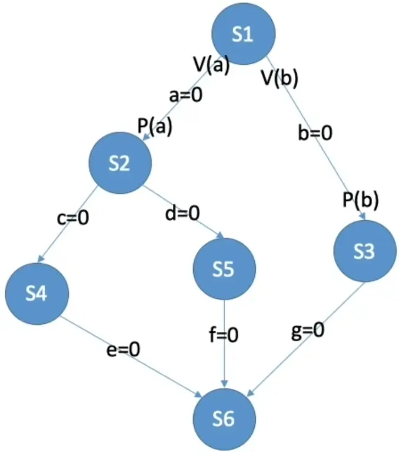
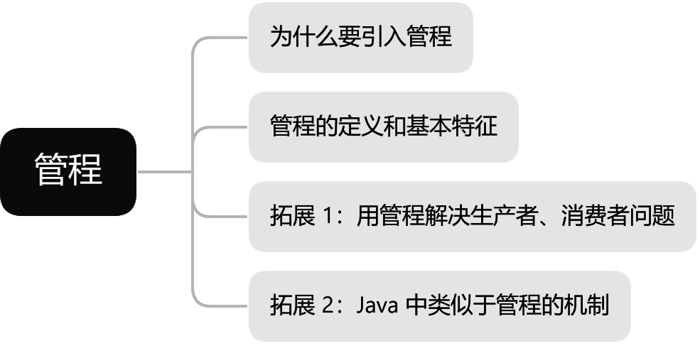

# 进程管理

## 进程的概念、组成、特征

**知识总览**：


### 进程的概念


- **程序**：是<span style="color:#F7374F">静态的</span>，就是个存放在<u>磁盘</u>里的可执行文件，就是一系列的指令集合
- **进程（Process）**：是<span style="color:#F7374F">动态的</span>，是程序的一次执行过程（同一个程序会对应多个进程）

### 进程的组成——PCB

作为进程的管理者，操作系统为了更好地区分进程，在进程被创建时，会为该进程分配一个<span style="color:#CF0F47">唯一的、不重复</span>的“身份证号”——<span style="color:red">PID</span>（Process ID，进程 ID）。


操作系统要记录 PID、进程所属用户 ID（UID），这是基本的进程描述信息，可以让操作系统区分各个进程；还记录给进程分配的资源（例如，分配了多少内存、正在使用哪些 I/O 设备、正在使用哪些文件）以用于实现操作系统对资源的管理；还要记录进程的运行情况（例如，CPU 使用时间、磁盘使用情况、网络流量使用情况等）可用于实现操作系统对进程的控制、调度。

这些信息都被保存在一个数据结构 <span style="color:red">PCB</span>（Process Control Block）中，即<span style="color:red">进程控制块</span>。操作系统需要对各个并发运行的进程进行管理，<span style="color:#FF0B55">但凡管理时所需要的信息，都会被放在 PCB 中</span>。


### 进程的组成——程序段、数据段


<span style="color:#E9A319">**PCB**</span> 是<span style="color:#640D5F">**给操作系统使用的**</span>，<span style="color:#E9A319">**程序段、数据段**</span>是<span style="color:#640D5F">**给进程自己使用的**</span>（与进程自身的运行逻辑有关）。

**程序的运行**：


一个**进程实体（进程映像，Process Image）**由 **PCB、程序段、数据段**组成，**进程**是**动态**的，**进程实体（进程映像）**是**静态**的，进程实体反应了进程在<u>某一时刻</u>的状态（如 `x++` 后，`x = 2`）。

更准确的说，上述**进程的组成**实际上指的是**进程实体的组成**。

<span style="color:#F5004F">程序段、数据段、PCB</span> 三部分组成了<span style="color:#AF47D2">进程实体（进程映像）</span>，引入进程实体的概念，可把进程定义为：进程是进程实体的<span style="color:blue">运行过程</span>，是系统进行<span style="color:red">资源分配</span>和<span style="color:red">调度</span>（指操作系统决定让这个进程上 CPU 运行）的一个独立单位。

> **注意**：PCB 是进程存在的 **<u>唯一标识</u>**。

**举例**：在计算机上同时登陆 3 个 QQ 号，会对应 3 个 QQ 进程，它们的 PCB、数据段各不相同，但程序段的内容都是相同的（运行着相同的 QQ 程序）。

### 进程的特征

程序是*静态的*，进程是*动态的*，相比于程序，进程有以下特征：

- **动态性（最基本的特征）**：进程是程序的一次执行过程，是动态地产生、变化和消亡的
- **并发性**：内存中有多个进程实体，各进程可并发执行
- **独立性**：进程是能独立运行、独立获得资源、独立接受调度的基本单位
- **异步性**：各进程按各自独立运行的、不可预知的速度向前推进，操作系统要提供“进程同步机制”来解决异步问题
- **结构性**：每个进程都会配置一个 PCB。结构上看，进程由程序段、数据段、PCB 组成

---


## 进程的状态与转换

**知识总览**：


### 进程的状态——创建态、就绪态


进程正在被创建时，它的状态是“<span style="color:red">创建态</span>”，在这个阶段操作系统会为<u>进程分配资源、初始化 PCB</u>。

当进程创建完成后，便进入“<span style="color:red">就绪态</span>”，处于就绪态的进程已经具备运行条件，但由于<span style="color:#6528F7">没有空闲 CPU</span>，就暂时不能运行。


### 进程的状态——运行态


如果一个进程此时在 CPU 上运行，那么这个进程处于“<span style="color:#FE6244">运行态</span>”；CPU 会执行该进程对应的程序（执行*指令序列*）。


### 进程的状态——阻塞态

在进程运行的过程中，可能会<span style="color:#39B5E0">**主动**请求等待某个事件的发生</span>（如等待某种系统资源的分配，或者等待某种进程的响应）。

在这个事件发生之前，进程无法继续往下执行，此时操作系统会让这个进程下 CPU，并让它进入“<span style="color:red">阻塞态</span>”。


当 CPU 空闲时，又会选择另一个“就绪态”进程上 CPU 运行。

当打印机空闲时，它就可以分配给刚刚请求资源的进程 2，此时进程 2 其“等待的某个事件”已经发生了，此时操作系统会让该进程由阻塞态转换回就绪态。


### 进程的状态——终止态

一个进程可以执行 `exit` 系统调用，请求操作系统终止该进程。此时该进程会进入“<span style="color:#332FD0">终止态</span>”，操作系统会让该进程下 CPU，并回收内存空间等资源，最后还要回收该进程的 PCB。


### 进程状态的转换



---



在进程 PCB 中，会有一个<span style="color:#8E1616">变量 `state`</span> 来表示进程的当前状态。可假定：1 表示创建态、2 表示就绪态、3 表示运行态等等。

为了对同一个状态下的各个进程进行统一的管理，操作系统会将各个进程的 PCB 组织起来。

### 进程的组织——链接方式


很多操作系统还会根据阻塞原因不同，再分为多个阻塞队列。


### 进程的组织——索引方式


### 进程的组织


---


## 进程控制

进程控制的主要功能是<span style="color:#8F87F1">对系统中的所有进程实施有效的管理</span>，它具有创建新进程、撤销已有进程、实现进程状态转换等功能。（简而言之，<u>**进程控制**实现**进程的状态转换**</u>）


**知识总览**：


### 进程控制的实现

使用“<span style="color:#309898">原语</span>”实现，原语的执行具有“**原子性**”，一气呵成。


**举例**：假设 PCB 中的变量 `state` 表示进程所处的状态，1 表示就绪态、2 表示阻塞态……


假设此时进程 2 等待的空闲事件发生，则操作系统中，负责进程控制的内核程序<u>至少需要做这样两件事</u>：

1. 将 PCB 的 `state` 设置为 1
2. 将 PCB 从阻塞队列放到就绪队列

若完成了第一步后收到中断信号，那么进程 2 的 `state = 1`，但是<u>它却被放在阻塞队列中</u>。

若无法“一气呵成”，就有可能导致操作系统中的**某些关键数据结构信息不统一**的情况，这会影响操作系统进行别的管理工作。

<span style="color:#FFA55D">**因此使用“原语”来实现一气呵成。**</span>

### 原语的“原子性”

<span style="color:red">原语</span>的执行具有<span style="color:red">原子性</span>，即执行过程只能一气呵成，期间<span style="color:red">不允许被中断</span>。可以用“<span style="color:red">关中断</span>指令”和“<span style="color:red">开中断</span>指令”这两个**特权指令**实现**原子性**。


正常情况下，CPU 每执行完一条指令都会<u>例行检查是否有中断信号需要处理</u>；若有，则暂停运行当前这段程序，转而执行相应的中断处理程序。

CPU 执行了<span style="color:red">关中断指令</span>之后，就不再例行检查中断信号，直到<span style="color:red">开中断指令</span>之后才会恢复检查。


之后 CPU 会处理之前没有处理的外部中断信号，转向执行中断处理程序。


如此，关中断、开中断之间的这些指令序列就是**不可被中断**的，这就实现了“**原子性**”。

为了防止用户程序使用这两个指令，这两个是<span style="color:#FE4F2D">特权指令</span>，只能让**内核程序**使用。

### 进程控制相关的原语

**进程的创建**：


**进程的撤销**：


**进程的阻塞和唤醒**：


**进程的切换**：


---


这些指令顺序执行的过程中，很多中间结果是放在各种寄存器中的。若执行完指令 3 后，另一个进程开始上 CPU 运行。

> **注意**：另一个进程在运行过程中也会**使用各个寄存器**。

为了方便切换会原来的进程，在进程切换时先在 PCB 中保存这个进程的运行环境。 （保存一些必要的寄存器信息，如 PSW、PC、通用寄存器等）


当原本的进程再次投入运行时，可以<span style="color:red">通过 PCB 恢复它的运行环境</span>。

---


各个**进程控制原语**做的工作，概括后有：

1. 更新 PCB 中的信息（修改进程状态、保存/恢复运行环境）
2. 将 PCB 插入合适的队列
3. 分配/回收资源

## 进程通信（IPC）

进程间通信（Inter-Process Communication, <span style="color:red">IPC</span>）是指两个进程之间产生数据交互。

进程是分配系统资源的单位（包括内存地址空间），因此<span style="color:red">各进程</span>拥有的<span style="color:red">内存地址空间**相互独立**</span>。


为了保证安全，<span style="color:purple">一个进程不能直接访问另一个进程的**地址空间**</span>。


### 共享存储


Linux 中，实现共享内存的方式：

```c
int shm_open(...);  // 通过 shm_open 系统调用，申请一片共享内存区
void* mmap(...);    // 通过 mmap 系统调用，将共享内存区映射到进程自己的地址空间
```

> **注意**：通过“增加页表项/段表项”即可将同一片共享内存区映射到各个进程的地址空间中。

为避免出错，各个进程对共享空间的<span style="color:red">访问</span>应该是<span style="color:red">互斥</span>的。

各个进程可使用操作系统内核提供的同步互斥工具（如 P、V 操作）。

- **<span style="color:red">基于数据结构</span>的共享**：比如共享空间里只能放一个长度为 10 的数组。这种共享方式速度慢、限制多，是一种<span style="color:red">低级通信</span>方式
- **<span style="color:red">基于存取区</span>的共享**：操作系统在内存中划出一块共享存储区，数据的形式、存放位置都由<u>通信进程控制</u>，而非操作系统。这种共享方式速度很快，是一种<span style="color:red">高级通信</span>方式


### 消息传递

进程间的数据交换以<span style="color:red">格式化的信息</span>（Message）为单位。进程通过操作系统提供的“发送信息/接受信息”两个<span style="color:red">原语</span>进行数据交换。


#### 直接通信方式

进程 P 通过调用发送原语 `send(Q, msg)`，将消息 `msg` 发送给进程 Q。在内存中，进程 P 的地址空间包含消息 `msg`，而进程 Q 的地址空间和操作系统内核的进程控制块（PCB）位于其他部分。进程 Q 的消息队列最初是空的。


进程 P 继续发送消息给进程 Q，此时消息 `msg` 已经被放入进程 Q 的消息队列中。进程 P 的地址空间不再包含该消息，而进程 Q 的地址空间和操作系统内核的进程控制块（PCB）<u>保持不变</u>。


进程 P 发送消息给进程 Q 后，进程 Q 通过调用接收原语 `receive(P, &msg)`，从其消息队列中取出消息 `msg` 并放入其地址空间。此时，进程 Q 的消息队列变为空。


#### 间接通信方式

间接通信方式以“信箱”作为中间实体进行消息传递。

进程 P 准备发送消息 `msg` 给进程 Q。在内存中，进程 P 的地址空间包含消息 `msg`，而进程 Q 的地址空间下方有两个信箱，分别是信箱 A 和信箱 B，此时信箱中没有消息。


进程 P 调用发送原语 `send(A, msg)`，将消息 `msg` 发送到信箱 A 中。进程 P 的地址空间不再包含该消息，而信箱 A 中现在包含了消息 `msg`。


进程 Q 调用接收原语 `receive(A, &msg)`，从信箱 A 中接收消息 `msg`。此时，进程 Q 的地址空间包含消息 `msg`，而信箱 A 中的消息被取出，信箱 A 为空。


可以多个进程往同一个信箱 `send` 消息，也可以多个进程从同一个信箱中 `receive` 消息。

### 管道通信


“管道”是一种特殊的共享文件，又名 `pipe` 文件。其实就是在内存中开辟一个大小固定的<u>内存缓冲区</u>（类比循环队列）。

1. 管道只能采用<span style="color:#C5172E">半双工通信</span>，某一时间段内只能实现单向的传输。如果要实现<span style="color:#C5172E">双向同时通信</span>，则<span style="color:#C5172E">需要设置两个管道</span>。

   

2. 各进程要<span style="color:#C5172E">互斥</span>地访问管道。（由操作系统实现）

3. 当**管道写满**时，**写进程**将**阻塞**，直到读进程将管道中管道数据取走，即可唤醒写进程。

   

4. 当**管道读空**时，**读进程**将**阻塞**，直到写进程往管道中写入数据，即可唤醒读进程。
5. 管道中的数据一旦被读出，就<span style="color:#7F55B1"><u>彻底消失</u></span>。因此，当多个进程读同一个管道时，可能会错乱。对此，通常有两种解决方案：
   - **一个管道允许多个写进程、一个读进程**
   - 允许有**多个写进程、多个读进程**，但系统会让各个读进程轮流从管道中读数据（Linux 的方案）

---


> **注意**：
>
> - 写进程往管道写数据，即便管道没被写满，**只要管道没空，读进程就可以从管道读数据**
> - 读进程从管道读数据，即便管道没被读空，**只要管道没满，写进程就可以往管道写数据**

## 线程

**知识总览**：


### 线程概念

还未引入进程前，系统中各个程序只能串行执行。


引入进程后：


进程是程序的一次执行。但上述功能显然不可能是由一个程序顺序处理就能实现的。

有的进程可以需要“同时”处理很多事，而传统的进程只能串行地执行一系列程序。**为此，引入了“线程”，来增加并发度。**


> **注意**：在传统的进程机制中，进程是程序执行流的最小单位。


> **注意**：引入线程后，线程成了程序执行流的最小单位。

可以将线程理解为“轻量级进程”。**线程**是一个**基本的 CPU 执行单元**，也是**程序执行流的最小单位**。

引入线程之后，不仅进程之间可以并发，进程内的**各线程之间**也可以**并发**，从而进一步**提升了系统的并发度**，使得一个进程内也可以并发处理各种任务（如 QQ、视频、文字聊天、传文件等）。

引入线程后，**进程**只作为**除 CPU 之外的<span style="color:#FE7743">系统资源</span>的分配单元**（如打印机、内存地址空间等都是分配给进程的）。


**举例**：去图书馆看书。

- **切换进程运行环境**：有一个不认识的人要使用桌子，你需要将你的书收走，他把自己的书放在桌上。
- **同一进程内的线程切换**：你舍友要使用这个桌子，可以不将桌子上的书收走。

### 线程属性


## 线程实现方式、多线程模型

**知识总览**：


### 线程实现方式

#### 用户级线程

用户级线程（User-Level Thread, ULT）的历史背景：早期的操作系统（如：早期 UNIX）只支持进程，不支持线程。当时的“线程”是由线程库实现的。


```c
int main() {
    int i = 0;
    while (true) {
        if (i == 0) {
            // 处理视频聊天的代码
        }
        if (i == 1) {
            // 处理文字聊天的代码
        }
        if (i == 2) {
            // 处理文件传输的代码
        }
        // i 的值为 0, 1, 2, 0, 1, 2......
        i = (i + 1) % 3;
    }
}
```

从代码的角度来看，线程其实就是一段代码逻辑。上述三段代码逻辑上可以看作三个“线程”。`while` 循环可以看为一个简化的“线程库”，线程库完成了对线程的管理工作（如调度）。

很多编程语言提供了强大的线程库，可以实现线程的创建、销毁、调度等功能。

> **注意**：
>
> 1. 用户级线程由应用程序通过线程库实现，所有的**线程管理工作**都由**应用程序负责**（包括线程切换）
> 2. 用户级线程中，**线程切换**可以在<span style="color:#C95792">**用户态下即可完成**</span>，无需操作系统干预
> 3. 在用户看来，有多个线程。但在操作系统内核看来，并<u>意识不到线程的存在</u>。**”用户级线程“**就是**“从用户视角看能看到的线程”**

- **优点**：用户级线程的切换在用户空间即可完成，不需要切换到核心态，线程管理的系统开销小，效率高。
- **缺点**：当一个用户级线程被阻塞后，整个进程都会被阻塞，并发度不高。多个线程不可在多核处理机上并行运行。

#### 内核级线程

内核级线程（Kernel-Level Thread, KLT）又称“内核支持的线程”，由操作系统支持。


> **注意**：
>
> 1. **内核级线程的管理工作**由**操作系统内核**完成
> 2. 线程调度、切换等工作都由内核负责，因此**内核级线程的切换**必然需要在**核心态**下才能完成
> 3. 操作系统会为每个内核级线程建立相应的线程控制块（Thread Control Block, TCB），通过 TCB 对线程进行管理。**”内核级线程“**就是**”从操作系统内核视角看能看到的线程“**

- **优点**：当一个线程被阻塞后，<u>别的线程还可以继续执行</u>，并发能力强。多线程可在多核处理机上并发执行。
- **缺点**：一个用户进程会占用多个内核级线程，线程切换有操作系统内核完成，需要切换到核心态，因此线程管理的成本高，开销大。

### 多线程模型

在支持内核级线程的系统中，根据用户级线程和内核级线程的映射关系，可以划分为几种多线程模型。

- <span style="color:red">**一对一**模型</span>：一个用户级线程映射到一个内核级线程。每个用户级进程有与用户级线程<span style="color:#129990"><u>同数量</u></span>的内核级线程。

  **优点**：当一个线程被阻塞后，别的线程还可以继续执行，并发能力强。多线程可在多核处理机上并行执行。

  **缺点**：一个用户进程会占用多个内核级线程，线程切换由操作系统内核完成，需要切换到核心态，因此线程管理成本高，开销大。

  

- <span style="color:red">**多对一**模型</span>：多个用户级线程映射到一个内核级线程。且一个进程只被分配一个内核级线程。

  **优点**：用户级线程的切换在用户空间即可完成，不需要切换到核心态，线程管理的系统开销小，效率高。

  **缺点**：当一个用户级线程被阻塞后，整个进程都会被阻塞，并发度不高。多个线程不可在多核处理机上并发运行。

  

  > **注意**：操作系统只“看得见”内核级线程，因此只有<span style="color:red">内核级线程才是**处理机分配的单位**</span>。

- <span style="color:red">**多对多**模型</span>：n 用户及线程映射到 m 个内核级线程（$\text{n} \ge \text{m}$）。每个用户进程对应 m 个内核级线程。

  克服了多对一模型并发度不高的缺点（一个阻塞，全体阻塞），又克服了一对一模型中一个用户进程占用太多内核级线程、开销太大的缺点。

  

用户级线程是“代码逻辑”的载体，内核级线程是“运行机会”的载体。

> **注意**：<span style="color:#8AB2A6">内核级线程才是处理机分配的单位。</span>例如，多核 CPU 环境下，上图中的进程最多被分配两个核。

一个“代码逻辑”只有获得了“运行机会”才能被 CPU 执行。

内核级线程中可以运行任意一个有映射关系的用户级线程代码，只有两个内核级线程中正在运行的代码逻辑都阻塞时，<u>这个进程才会阻塞</u>。


## 线程的状态与转换


## 线程的组织与控制


## 处理机调度

**知识总览**：


### 调度的基本概念

当有一堆任务要处理，但由于资源有限，这些事情没法同时处理。此时需要确定**某种规则**来**决定**处理这些任务的**顺序**，这就是“调度”研究的问题。


### 高级调度

作业，一个具体的任务。用户向系统提交一个作业相当于用户让操作系统启动一个程序（来处理具体的任务）。

内存空间有限，有时无法将用户提交的任务全部放入内存。

**高级调度（作业调度）**，按一定的原则从外存的作业后备队列中挑选一个作业调入内存，并创建进程。**每个作业只调入一次，调出一次**。作业调入时会建立 PCB，调出时才撤销 PCB。（<span style="color:#3D90D7">简而言之，多个程序需要启动，操作系统决定启动哪个</span>）

### 低级调度

**低级调度（进程调度/处理机调度）**——按照某种策略从就绪队列中选取一个进程，将处理机分配给它。


进程调度是操作系统中**最基本的一种调度**，在一般的操作系统中都必须配置进程调度。

进程调度的**频率很高**，一般几十毫秒一次。

### 中级调度

内存不够时，可将某些进程的数据调出外存。等内存空闲或者进程需要运行时再重新调入内存。

暂时调到外存等待的进程状态是**挂起状态**。被挂起的进程 PCB 会被组织成**挂起队列**。

**中级调度（内存调度）**——按照某种策略决定将<u>哪个处于挂起状态的进程<span style="color:#537D5D">**重新调入**</span>内存</u>。

一个进程可能会被多次调出、调入内存，因此**中级调度**发生的**频率**要比高级调度**更高**。

---

暂时调到外存等待的进程状态为**挂起状态（挂起态，suspend）**，挂起态又可以进一步细分为**就绪挂起**、**阻塞挂起**两种状态，扩张五状态模型至七状态模型。


> **注意**：
>
> “挂起”和“阻塞”的区别，两种状态都是暂时不能获得 CPU 服务，但挂起态是将进程映像<u>调到外存中</u>，而阻塞态下进程映像<u>还在内存中</u>。
>
> 有的操作系统会将就绪挂起、阻塞挂起分为两个挂起队列，甚至会根据阻塞原因不同再把阻塞挂起进程进一步细分为多个队列。

### 三层调度的联系、对比

|                      | 要做什么                                                     | 调度发生在……          | 发生频率 | 对进程状态的影响                   |
| -------------------- | ------------------------------------------------------------ | --------------------- | -------- | ---------------------------------- |
| 高级调度（作业调度） | 按照某种规则，从后备队列中选择合适的作业将其调入内存，并为其创建进程 | 外存→内存（面向作业） | 最低     | 无→创建态→就绪态                   |
| 中级调度（内存调度） | 按照某种规则，从挂起队列中选择合适的进程将其数据调回内存     | 外存→内存（面向进程） | 中等     | 就绪挂起→就绪态（阻塞挂起→阻塞态） |
| 低级调度（进程调度） | 按照某种规则，从就绪队列中选择一个进程为其分配处理机         | 内存→CPU              | 最高     | 就绪态→运行态                      |

---


## 进程调度的时机、切换与过程、方式

**知识总览**：


### 进程调度的时机

<span style="color:red">**进程调度**</span>（低级调度），就是按照某种算法从就绪队列中选择一个进程为其分配处理机。


进程在<span style="color:red">操作系统内核程序临界区</span>中<span style="color:red">不能</span>进行调度与切换。（进程处于<span style="color:red">临界区</span>时<span style="color:red">不能</span>进行处理机调度是<u>**错误**</u>的）

> **注意**：
>
> - **临界资源**：一个时间段只允许一个进程使用的资源，各进程需要<span style="color:#CD5656">互斥地</span>访问临界资源。
> - **临界区**：访问临界资源的那段代码。

**内核程序临界区**一般是用来访问**某种内核数据结构**的，比如进程的就绪队列（由各就绪进程的 PCB 组成）。


区别在于一个是**操作系统的内核程序的临界区**访问的临界资源，一个是**普通的应用程序的临界区**访问的临界资源。因此得出结论——<span style="color:red">进程在普通临界区中是**可以进行调度、切换的**</span>。

- 有的系统中，只允许进程主动放弃处理机
- 有的系统中，进程可以主动放弃处理机，当有<u>更紧急的任务</u>需要处理时，也会强行剥夺处理机（被动放弃）

### 进程调度的方式

- <span style="color:#E55050">非剥夺调度方式</span>，又称<span style="color:#E55050">非抢占方式</span>。即，只允许进程主动放弃处理机。在运行过程中即便有更紧迫的任务到达，当前进程依然会继续使用处理机，直到该进程终止或主动要求进入阻塞态。

  实现简单，系统开销小但是无法及时处理紧急任务，适合于早期的批处理系统

- <span style="color:#E55050">剥夺调度方式</span>，又称<span style="color:#E55050">抢占方式</span>。当一个进程正在处理机上执行时，如果有一个更重要或更紧迫的进程需要使用处理机，则立即暂停正在执行的进程，将处理机分配给更重要紧迫的那个进程。

  可以优先处理更紧急的进程，也可实现让进程按时间片轮流执行的功能（通过时钟中断）。适合于分时操作系统、实时操作系统。

### 进程的切换与过程

“狭义的进程调度”与“进程切换”的区别：

<span style="color:#03A791">**狭义的进程调度**</span>指的是从就绪队列中<span style="color:#03A791">选中一个要运行的进程</span>。（这个进程可以是刚刚被暂停执行的进程，也可能是<span style="color:#03A791">另一个进程</span>，后一种情况就需要<span style="color:#03A791">进程切换</span>）

<span style="color:#03A791">进程切换</span>是指一个进程让出处理机，由另一个进程占用处理机的过程。

<span style="color:#03A791">**广义的进程调度**</span>包含了选择一个进程和进程切换两个步骤。

进程切换的过程主要完成了：

1. 对原来运行进程各种数据的保存

2. 对新的进程各种数据的恢复

   （如：程序计数器、程序状态字、各种数据寄存器等处理机现场信息，这些信息一般保存在进程控制块中）

> **注意**：
>
> <span style="color:#03A791">进程切换是有代价的</span>，因此如果<span style="color:#03A791">过于频繁的</span>进行进程<span style="color:#03A791">调度、切换</span>，必然会使整个<span style="color:#03A791">系统的效率降低</span>，使系统大部分时间都花在了进程切换上，而真正用于执行进程的时间减少。

## 调度器、闲逛进程

### 调度器/调度程序（Scheduler）


②、③ 由调度程序引起，调度程序决定：

- 让谁运行？——调度算法
- 运行多长时间？——时间片大小
- 什么事件会触发“调度程序”？——调度时机
  - **创建新进程**
  - **进程退出**
  - 运行**进程阻塞**
  - **I/O 中断**发生（可能唤醒某些阻塞进程）
  - 非抢占式调度策略，只有运行进程阻塞或退出才出发调度程序工作
  - 抢占式调度策略，每个**时钟中断**或 k 个时钟中断会触发调度程序工作

---


### 闲逛进程

调度进程永远的备胎，没有其他就绪进程时，运行闲逛进程（idle）。


<span style="color:#FE7743">**闲逛进程的特性**</span>：

- 优先级最低
- 可以是 0 地址指令，占一个完整的指令周期（指令周期末尾例行检查中断）
- 能耗低

## 调度算法的评价指标



### CPU 利用率

由于早期的 CPU 造价极其昂贵，因此人们会**希望让 CPU 尽可能多地工作**。

<span style="color:red">**CPU 利用率**</span>：指 CPU ”忙碌“的时间占总时间的比例。
$$
\text{利用率} = \frac{\text{忙碌的时间}}{总时间}
$$
**举例**：某计算机只支持单道程序，某个作业刚开始需要在 CPU 上运行 5 秒，再用打印机打印输出 5 秒，之后再执行 5 秒，才能结束。在此过程中，CPU 利用率、打印机利用率分别是多少？
$$
\text{CPU 利用率} = \frac{5 + 5}{5 + 5 + 5} = 66.66 \% \\
\text{打印机利用率} = \frac{5}{15} = 33.33 \%
$$

### 系统吞吐量

对于计算机而言，希望能用尽可能少的时间处理完尽可能多的作业。

<span style="color:red">**系统吞吐量**</span>：单位时间内完成作业的数量。
$$
\text{系统吞吐量} = \frac{\text{总共完成了多少道作业}}{\text{总共花了多少时间}}
$$


**举例**：某计算机系统处理完 10 道作业，共花费 100 秒，则系统吞吐量为？
$$
\frac{10}{100} = 0.1 \text{道/秒}
$$

### 周转时间

对于计算机用户而言，其关心自己的作业从提交到完成花了多少时间。

**<span style="color:red">周转时间</span>**：指从作业被提交给系统开始，到作业完成为止的这段时间间隔。

它包括四个部分：

- 作业在外存后备队列上等待作业调度（高级调度）的时间

- 进程在就绪队列上等待进程调度（低级调度）的时间

- 进程在 CPU 上执行的时间

- 进程等待 I/O 操作完成的时间

后三项在一个作业的整个处理过程中，可能发生多次。


> **思考**：有的作业运行时间短，有的作业运行时间长，因此在周转时间相同的情况下，运行时间不同的作业，给用户的感觉肯定是不一样的。


- 对于周转时间相同的两个作业，实际运行时间长的作业在相同时间内被服务的时间更多，带权周转时间更小，用户满意度更高
- 对于实际运行时间相同的两个作业，周转时间短的带权周转时间更小，用户满意度更高

$$
\text{平均带权周转时间} = \frac{\text{各作业带权周转时间之和}}{\text{作业数}}
$$

### 等待时间

计算机的用户希望自己的作业尽可能少的等待处理机。

<span style="color:red">**等待时间**</span>：指进程/作业处于等待处理机状态时间之和，等待时间越长，用户满意度越低。


- 对于**进程**来说，等待时间就是指进程建立后**等待被服务的时间之和**，在等待 I/O 完成的期间其实进程也是在被服务的（被 I/O 设备服务），所以不计入等待时间

- 对于**作业**来说，不仅要考虑**建立进程后的等待时间，还要加上作业在外存后备队列中的等待的时间**

一个作业总共需要被 CPU 服务多久，被 I/O 设备服务多久一般是确定不变的，因此调度算法其实只会影响作业/进程的<u>等待时间</u>。当然，与前面的指标类似，也有“**平均等待时间**”来评价整体性能。

### 响应时间

对于计算机用户来说，会希望自己的提交的请求（比如通过键盘输入了一个调试命令）尽早地开始被系统服务、回应。

**响应时间**：指从用户**提交请求**到**首次产生响应**所用的时间。

---


## 调度算法

**知识总览**：


> **注意**：<span style="color:red">饥饿</span>指某进程/作业长期得不到服务。

### 先来先服务（First Come First Serve, FCFS）

- **算法思想**：主要从“公平”的角度考虑（类似于日常生活中排队购买东西）
- **算法规则**：按照作业/进程到达的先后顺序进行服务
- **用于作业/进程调度**：用于作业调度时，考虑的是哪个作业先到达后备队列；用于进程调度时，考虑的是哪个进程先到达就绪队列
- **是否抢占**：非抢占式的算法
- **优缺点**：
  1. **优点**：公平、算法实现简单
  2. **缺点**：排在长作业（进程）后面的短作业需要等待很长时间，<u>带权周转时间很大</u>，对短作业来说用户体验不好。即，FCFS 算法**对长作业有利，对短作业不利**
- **是否饥饿**：不会

**举例**：

各进程到达就绪队列的时间、需要的运行时间如下表所示。使用**先来先服务**调度算法，计算各进程的等待时间、平均等待时间、周转时间、平均周转时间、带权周转时间、平均带权周转时间。

| 进程 | 到达时间 | 运行时间 |
| ---- | -------- | -------- |
| P1   | 0        | 7        |
| P2   | 2        | 4        |
| P3   | 4        | 1        |
| P4   | 5        | 4        |

<span style="color:red">**先来先服务调度算法**</span>：按照到达的先后顺序调度，事实上就是等待时间越久的越优先得到服务。因此，**调度顺序**为：P1 → P2 → P3 → P4。


### 短作业优先（SJF, Shortest Job First）

- **算法思想**：追求最少的平均等待时间、最少的平均周转时间、最少的平均带权周转时间
- **算法规则**：最短的作业/进程优先得到服务（所谓“最短”，是指要求服务时间最短）
- **用于作业/进程调度**：即可用于作业调度，也可用于进程调度。用于进程调度时称为“短进程优先（SPF, Shortest Process First）算法”
- **是否抢占**：SJF 和 SPF 是<span style="color:#5409DA">非抢占式</span>的算法。但是也有<span style="color:#129990">抢占式的版本</span>——<span style="color:#E55050">最短剩余时间优先</span>算法（SRTN, Shortest Remaining Time Next）
- **优缺点**：
  - **优点**：“最短的“平均等待时间、平均周转时间
  - **缺点**：不公平。<span style="color:#27548A;font-weight:bold">对短作业有利，对长作业不利</span>。可能产生<span style="color:#27548A">饥饿现象</span>。另外，作业/进程的运行时间是由用户提供的，并不一定真实，不一定能做到真正的短作业优先
- **是否饥饿**：会。若源源不断地有短作业/进程到来，可能使长作业/进程长时间得不到服务，产生“<span style="color:#27548A">饥饿</span>“现象。如果一直得不到服务，则称为”<span style="color:#27548A">饿死</span>“

**举例**：

各进程到达就绪队列的时间、需要的运行时间如下表所示。使用**非抢占式**的**短作业优先**调度算法（严格来说，用于进程调度应该称为*<u>短作业优先调度算法</u>*），计算各进程的等待时间、平均等待时间、周转时间、平均周转时间、带权周转时间、平均带权周转时间。

| 进程 | 到达时间 | 运行时间 |
| ---- | -------- | -------- |
| P1   | 0        | 7        |
| P2   | 2        | 4        |
| P3   | 4        | 1        |
| P4   | 5        | 4        |

<span style="color:#A53860;font-weight:bold">短作业/进程优先调度算法</span>：每次调度时选择**当前已到达**且**运行时间最短**的作业/进程。因此，**调度顺序**为：P1 → P3 → P2 → P4。


---

各进程到达就绪队列的时间、需要的运行时间如下表所示。使用**抢占式**的**短作业优先**调度算法（抢占式的短作业优先算法又称“最短剩余时间优先算法”），计算各进程的等待时间、平均等待时间、周转时间、平均周转时间、带权周转时间、平均带权周转时间。

| 进程 | 到达时间 | 运行时间 |
| ---- | -------- | -------- |
| P1   | 0        | 7        |
| P2   | 2        | 4        |
| P3   | 4        | 1        |
| P4   | 5        | 4        |

<span style="color:#F79B72;font-weight:bold">最短剩余时间优先算法</span>：每当有进程加入**就绪队列改变时就需要调度**，如果新到达的进程**剩余时间**比当前运行的进程剩余时间**更短**，则由新进程**抢占**处理机，当前运行进程重新回到就绪队列。另外，当一个**进程完成时也需要调度**。

需要注意的是，当有新进程到达时就绪队列就会改变：就要按照上述规则进行检查。以下 $P_n(m)$ 表示当前 $P_n$ 进程剩余时间为 $m$。各个时刻的情况如下：

$0$ 时刻（$P_1$ 到达）：<span style="color:red">$P_1(7)$</span>

$2$ 时刻（$P_2$ 到达）：$P_1(5)$、<span style="color:red">$P_2(4)$</span>

$4$ 时刻（$P_3$ 到达）：$P_1(5)$、$P_2(2)$、<span style="color:red">$P_3(1)$</span>

$5$ 时刻（$P_3$ 完成且 $P_4$ 刚好到达）：$P_1(5)$、<span style="color:red">$P_2(2)$</span>、$P_4(4)$

$7$ 时刻（$P_2$ 完成）：$P_1(5)$、<span style="color:red">$P_4(4)$</span>

$11$ 时刻（$P_4$ 完成）：<span style="color:red">$P_1(5)$</span>


> **注意**：
>
> 1. **未特别说明**，一般提到的“短作业/进程优先算法”**默认**是**非抢占式**的
>
> 2. “SJF 调度算法的平均等待时间、平均周转时间最少“，严格来说，这个表述是错误的、不严谨的；
>
>    上述例子表明，<u>最短剩余时间优先算法</u>得到的平均等待时间、平均周转时间还要更少；
>
>    应该加上一个条件“在**所有进程同时可运行**时，采用 SJF 调度算法的平均等待时间、平均周转时间最少”，或者说“在**所有进程都几乎同时到达**时，采用 SFJ 调度算法的平均等待时间、平均周转时间最少”；
>
>    若不加上述前提条件，则应该说“**抢占式的**短作业/进程优先调度算法（**最短剩余时间优先，SRNT 算法**）的平均等待时间、平均周转时间最少”
>
> 3. 严格来说，SFJ 的平均等待时间、平均周转时间并不一定最少，但相比于其他算法（如 FCFS），SJF 依然可以得到较少的平均等待时间、平均周转时间

### FCFS vs. SJF

FCFS 算法是在每次调度的时候选择一个等待时间最长的作业（进程）为其服务。但是没有考虑到作业的运行时间，因此导致了对短作业不友好的问题。

SJF 算法是选择一个执行时间最短的作业为其服务。但是又完全不考虑各个作业的等待时间，因此考虑了对长作业不友好的问题，甚至还会造成饥饿问题。

### 高相应比优先算法（HRRN, Highest Response Ratio Next）

- **算法思想**：要综合考虑作业/进程的等待时间和要求服务的时间

- **算法规则**：在每一次调度时先计算各个作业/进程的<span style="color:red">响应比</span>，选择<span style="color:red">响应比最高的</span>作业/进程为其服务：
  $$
  响应比 = \frac{等待时间 + 要求服务时间}{要求服务时间}
  $$
  响应比大于等于 1

- **用于作业/进程调度**：<span style="color:#5F99AE">非抢占式</span>的算法。因此只有当前运行的作业/进程主动放弃处理机时，才需要调度，才需要计算响应比

- **优缺点**：综合考虑了等待时间和运行时间（要求服务时间）。等待时间相同时，要求服务时间短的优先（SJF 的优点）；要求服务时间相同时，等待时间长的优先（FCFS 的优点）；

  对于长作业来说，随着等待时间越来越久，其响应比也会越来越大，从而避免了长作业饥饿的问题

- **是否饥饿**：不会

**举例**：

各进程到达就绪队列的时间、需要的运行时间如下表所示。使用**高响应比优先**调度算法，计算各进程的等待时间、平均等待时间、周转时间、平均周转时间、带权周转时间、平均带权周转时间。

| 进程 | 到达时间 | 运行时间 |
| :--- | -------- | -------- |
| P1   | 0        | 7        |
| P2   | 2        | 4        |
| P3   | 4        | 1        |
| P4   | 5        | 4        |

<span style="color:#FF2DF1;font-weight:bold">高响应比优先算法</span>：**非抢占式**的调度算法，只有当前运行的进程**主动放弃 CPU 时**（正常/异常完成，或主动阻塞），才需要进行调度，调度时**计算所有就绪队列的响应比，选响应比最高的**进程上处理机。

- $0$ 时刻：只有 $P_1$ 到达就绪队列，<span style="color:red">$P_1$</span> 上处理机

- $7$ 时刻（$P_1$ 主动放弃 CPU）：就绪队列中有 $P_2(\frac{5 + 4}{4}=2.25)$、<span style="color:red">$P_3(\frac{3 + 1}{1} = 4)$</span>、$P_4(\frac{2 + 4}{4} = 1.5)$

- $8$ 时刻（$P_3$ 完成）：<span style="color:red">$P_2(2.5)$</span>、$P_4(1.75)$

- $12$ 时刻（$P_2$ 完成）：就绪队列仅剩下 <span style="color:red">$P_4$</span>

---


> **注意**：这几种算法主要关心对用户的公平性、平均周转时间、平均等待时间等评价系统整体性能的指标，但是不关心“响应时间”，也不区分任务的紧急程度，因此对于用户而言，交互性很糟糕。因此这三种算法一般适合用于<span style="color:#D5451B;font-weight:bold">早期的批处理系统</span>。当然，FCFS 算法也常结合其他的算法使用，在现在也扮演着很重要的角色。

### 时间片轮转（Round-Robin, RR）

- **算法思想**：公平地、轮流地为各个进程服务，让每个进程在一定时间间隔内都可以得到响应
- **算法规则**：按照各进程到达就绪队列的顺序，轮流让各个进程执行一个<span style="color:#8F87F1">时间片</span>（如 100ms）。若一个进程未在一个时间片内执行完，则剥夺处理机，让进程重新<u>放到就绪队列队尾重新排队</u>。
- **用于作业/进程调度**：用于<u>进程调度</u>（只有作业放入内存建立了相应的进程后，才能被分配处理机时间片）
- **是否抢占**：若进程未能在时间片内运行完，将被强行剥夺处理机使用权，因此时间片轮转调度算法属于**抢占式**的算法。由时钟装置发出**时钟中断**来通知 CPU 时间片已到
- **优缺点**：
  - **优点**：公平；响应快，适用于分时操作系统
  - **缺点**：由于高频率的进程切换，因此有一定开销；不区分任务的紧急程度
- **是否饥饿**：不会

**举例**：

各进程到达就绪队列的时间、需要的运行时间如下表所示。使用**时间片轮转**调度算法(常用于分时操作系统，更注重“响应时间”，因而此处不计算周转时间），分析时间片大小分别是 2、5 时的进程运行情况。

| 进程 | 到达时间 | 运行时间 |
| ---- | -------- | -------- |
| P1   | 0        | 5        |
| P2   | 2        | 4        |
| P3   | 4        | 1        |
| P4   | 5        | 6        |

**时间片大小为 2**：

- $0$ 时刻（$P_1(5)$）：$0$ 时刻只有 $P_1$ 到达就绪队列，让 $P_1$ 上处理机运行一个时间片

- $2$ 时刻（<span style="color:red">$P_2(4)$</span> $\rightarrow$ $P_1(3)$）：$2$ 时刻 $P_2$ 到达就绪队列，$P_1$ 运行完一个时间片，被剥夺处理机，重新放到队尾。此时 $P_2$ 排在队头，因此让 $P_2$ 上处理机

  > **注意**：$2$ 时刻，$P_1$ <span style="color:red">下处理机</span>，同一时刻<span style="color:red">新进程</span> $P_2$ 到达。一般地，<span style="color:red">默认新到达的进程先进入就绪队列</span>。
  
  
  
- $4$ 时刻（<span style="color:red">$P_1(3)$</span> $\rightarrow$ $P_3(1)$ $\rightarrow$ $P_2(2)$）：$4$ 时刻，$P_3$ 到达，先插到就绪队尾，紧接着，$P_2$ 下处理机也插到队尾

  

- $5$ 时刻（$P_3(1)$ $\rightarrow$ $P_2(2)$ $\rightarrow$ $P_4(6)$）：$5$ 时刻，$P_4$ 到达插入就绪队尾

  > **注意**：由于 $P_1$ 的<span style="color:red">时间片还没用完</span>，因此<span style="color:red">暂时不调度</span>。另外，此时 <span style="color:red">$P_1$ 处于运行态</span>，就并不在就绪队列中。

  

- $6$ 时刻（<span style="color:red">$P_3(1)$</span> $\rightarrow$ $P_2(2)$ $\rightarrow$ $P_4(6)$ $\rightarrow$ $P_1(1)$）：$6$ 时刻，$P_1$ 时间片用完，下处理机，重新放回就绪队尾，发生调度

  

- $7$ 时刻（<span style="color:red">$P_2(2)$</span> $\rightarrow$ $P_4(6)$ $\rightarrow$ $P_1(1)$）：虽然 $P_3$ 的<span style="color:red">时间片没用完</span>，但是由于 $P_3$ 只需要运行一个单位的时间，运行完了会<span style="color:red">主动放弃处理机</span>，因此也会发生调度。队头进程 $P_2$ 上处理机

  

- $9$ 时刻（<span style="color:red">$P_4(6)$</span> $\rightarrow$ $P_1(1)$）：进程 $P_2$ 时间片用完，并刚好运行完，发生调度，$P_4$ 上处理机

  

- $11$ 时刻（<span style="color:red">$P_1(1)$</span> $\rightarrow$ $P_4(4)$）：$P_4$ 时间片用完，重新回到就绪队列。$P_1$ 上处理机

- $12$ 时刻（<span style="color:red">$P_4(4)$</span>）：$P_1$ 运行完，主动放弃处理机，此时就绪队列中只剩 $P_4$，$P_4$ 上处理机

- $14$ 时刻（）：就绪队列为空，因此让 $P_4(4)$ 接着运行一个时间片


---

**时间片大小为 5**：

- $0$ 时刻（<span style="color:red">$P_1(5)$</span>）：只有 $P_1$ 到达，$P_1 $ 上处理机
- $2$ 时刻（$P_2(4)$）：$P_2$ 到达，但 $P_1$ 时间片尚未结束，因此<span style="color:red">暂不调度</span>
- $4$ 时刻（$P_2(4)$ $\rightarrow$ $P_3(1)$）：$P_3$ 到达，但 $P_1$ 时间片尚未结束，因此暂不调度
- $5$ 时刻（<span style="color:red">$P_2(4)$</span> $\rightarrow$ $P_3(1)$ $\rightarrow$ $P_4(6)$）：$P_4$ 到达，同时，$P_1$ 运行结束。发生调度，$P_2$ 上处理机
- $9$ 时刻（<span style="color:red">$P_3(1)$</span> $\rightarrow$ $P_4(6)$）：$P_2$ 运行结束，虽然时间片没用完，但是会主动放弃处理机。发生调度
- $10$ 时刻（<span style="color:red">$P_4(6)$</span>）：$P_3$ 运行结束，虽然时间片没用完，但是会主动放弃处理机。发生调度
- $15$ 时刻（）：$P_4$ 时间片用完，但就绪队列为空，因此会让 $P_4$ 继续执行一个时间片
- $16$ 时刻（）：$P_4$ 运行完，主动放弃处理机。但所有进程运行完


若按照<span style="color:red">先来先服务</span>调度算法：


如果<span style="color:red">时间片太大</span>，使得每个进程都可以在一个时间片内完成，则时间片轮转算法<span style="color:red">退化为先来先服务</span>调度算法，并且<span style="color:red">会增大进程响应时间</span>。因此<span style="color:red">时间片不能太大</span>。

例如一个系统中有 10 个进程在并发执行，如果时间片为 1 秒，则一个进程被响应可能需要等 9 秒。也就是说，如果用户在自己进程的时间片外通过键盘发出调试命令，可能需要等待 9 秒才能被系统响应。

另一方面，进程调度、切换是有时间代价的（保存、恢复运行环境），因此若<span style="color:red">时间片太小</span>，会导致<span style="color:red">进程切换过于频繁</span>，系统会花大量的时间来处理进程切换，从而导致实际用于进程执行的时间比例减少。可见<span style="color:red">时间片也不能太小</span>。

> **注意**：一般地，设计时间片时要让切换进程的开销占比不超过 1%。

---

**<span style="color:#7F55B1">时间片轮转调度算法</span>**：轮流让就绪队列中的进程依次执行一个时间片（每次选择的都是排在就绪队列队头的进程）。

### 优先级调度算法

- **算法思想**：随着计算机的发展，特别是实时操作系统的出现，越来越多的应用场景需要根据任务的紧急程度来决定处理顺序
- **算法规则**：每个作业/进程都有各自的优先级，调度时选择优先级最高的作业/进程
- **用于作业/进程调度**：既可用于作业调度，也可用于进程调度；除此之外也可用于 I/O 调度
- **是否抢占**：抢占式、非抢占式均有；非抢占式只需在进程主动放弃处理机时进程调度即可，而抢占式还需要就绪队列变化时，检查是否会发生抢占
- **优缺点**：
  - **优点**：用优先级区分紧急程度、重要程度，适用于实时操作系统；可灵活地调整对各种作业/进程的偏好程度
  - **缺点**：若源源不断地有高优先级进程到来，则可能导致饥饿

- **是否饥饿**：是

**举例**：

各进程到达就绪队列的时间、需要的运行时间、进程优先数如下。使用<span style="color:#4E71FF">非抢占式</span>的<span style="color:#4E71FF">优先级</span>调度算法，分析进程运行情况。（<span style="color:#FE5D26">优先数</span>越大，<span style="color:#FE5D26">优先级</span>越高）

| 进程 | 到达时间 | 运行时间 | 优先数 |
| ---- | -------- | -------- | ------ |
| P1   | 0        | 7        | 1      |
| P2   | 2        | 4        | 2      |
| P3   | 4        | 1        | 3      |
| P4   | 5        | 4        | 2      |

**非抢占式的优先级调度算法**：每次调度时选择<span style="color:#F79B72">当前已到达</span>且<span style="color:#F79B72">优先级最高</span>的进程；当前进程<span style="color:#F79B72">主动放弃处理机时</span>会发生调度。


- $0$ 时刻（<span style="color:#FF9F00">$P_1$</span>）：只有 $P_1$ 到达，$P_1$ 上处理机
- $7$ 时刻（$P_2$、<span style="color:#FF9F00">$P_3$</span>、$P_4$）：$P_1$ 运行完成主动放弃处理机，其余进程都已到达，$P_3$ 优先级最高，$P_3$ 上处理机
- $8$ 时刻（<span style="color:#FF9F00">$P_2$</span>、$P_4$）：$P_3$ 完成，$P_2$、$P_4$ 优先级相同，由于 $P_2$ 先到达，因此 $P_2$ 优先上处理机
- $12$ 时刻（<span style="color:#FF9F00">$P_4$</span>）：$P_2$ 完成，就绪队列只剩 $P_4$，$P_4$ 上处理机
- $16$ 时刻（）：$P_4$ 完成，所有进程都结束

---

各进程到达就绪队列的时间、需要的运行时间、进程优先数如下。使用<span style="color:#4E71FF">抢占式</span>的<span style="color:#4E71FF">优先级</span>调度算法，分析进程运行情况。（<span style="color:#FE5D26">优先数</span>越大，<span style="color:#FE5D26">优先级</span>越高）

| 进程 | 到达时间 | 运行时间 | 优先数 |
| ---- | -------- | -------- | ------ |
| P1   | 0        | 7        | 1      |
| P2   | 2        | 4        | 2      |
| P3   | 4        | 1        | 3      |
| P4   | 5        | 4        | 2      |

<span style="color:#27548A;font-weight:bold">抢占式的优先级调度算法</span>：每次调度时选择<span style="color:#A53860">当前已到达</span>且<span style="color:#A53860">优先级最高</span>的进程。当前进程<span style="color:#A53860">主动放弃处理机时</span>发生调度。另外，当<span style="color:#A53860">就绪队列发生改变时</span>也需要检查是否会发生抢占。


- $0$ 时刻（<span style="color:#89AC46">$P_1$</span>）：只有 $P_1$ 到达，$P_1$ 上处理机
- $2$ 时刻（<span style="color:#89AC46">$P_2$</span>）：$P_2$ 到达就绪队列，优先级比 $P_1$ 更高，发生抢占。$P_1$ 回到就绪队列，$P_2$ 上处理机
- $4$ 时刻（$P_1$、<span style="color:#89AC46">$P_3$</span>）$P_3$ 到达，优先级比 $P_2$ 更高，$P_2$ 回到就绪队列，$P_3$ 抢占处理机
- $5$ 时刻（$P_1$、<span style="color:#89AC46">$P_2$</span>、$P_4$）：$P_3$ 完成，主动释放处理机，同时，$P_4$ 也到达，由于 $P_2$ 比 $P_4$ 更先进入就绪队列，因此选择 $P_2$ 上处理机
- $7$ 时刻（$P_1$、<span style="color:#89AC46">$P_4$</span>）：$P_2$ 完成，就绪队列仅剩 $P_1$、$P_4$，$P_4$ 上处理机
- $11$ 时刻（<span style="color:#89AC46">$P_1$</span>）：$P_4$ 完成，$P_1$ 上处理机

> **注意**：
>
> 1. 就绪队列未必只有一个，可以按照不同优先级来组织。另外，也可以把优先级高的进程排在更靠近队头的位置
> 2. 根据优先级是否可以动态变化，可将优先级分为<span style="color:#F564A9;font-weight:bold">静态优先级</span>和<span style="color:#F564A9;font-weight:bold">动态优先级</span>
>    - **静态优先级**：创建进程时确定，此后一直不变
>    - **动态优先级**：创建进程时有一个初始值，之后会根据动态地调整优先级

如何合理地设置各类进程的优先级？

- 系统进程优先级**高于**用户进程

- 前台进程优先级**高于**后台进程

- 操作系统更**偏高 I/O 型进程（或称 I/O 繁忙型进程）**

  > **注意**：I/O 进程相对的是**计算型进程（或称 CPU 繁忙型进程）**。I/O 设备和 CPU 可以<u>*并行*</u>工作。如果优先让 I/O 繁忙型进程优先运行的话，则越有可能让 I/O 设备尽早地投入工作，则资源利用率、系统吞吐量都会提升。

如果采用的是动态优先级，什么时候应该调整？

可以从追求公平、提升资源利用率等角度考虑。如果某进程在就绪队列中等待了很长时间，则可以适当提升其优先级；如果某进程占用处理机运行了很长时间，则可适当降低其优先级。

如果发现一个进程频繁地进行 I/O 操作，则可适当提升其优先级。

---

- FCFS 算法的优点是公平
- SJF 算法的优点是能尽快处理完短作业，平均等待/周转时间等参数很优秀
- 时间片轮转调度算法可以让各个进程得到及时的响应
- 优先级调度算法可以灵活地调整各种进程被服务的时间

---

### 多级反馈队列调度算法

- **算法思想**：对其他调度算法的折中权衡
- **算法规则**：
  1. 设置多级就绪队列，各级队列<span style="color:#4E71FF">优先级从高到低</span>，<span style="color:#4E71FF">时间片从小到大</span>
  2. 新进程到达时先进入第 1 级队列，按 FCFS 原则等待被分配时间片，若用完时间片进程还未结束，则进程进入下一级队列队尾；如果此时已经是最下级的队列，则重新放回该队列队尾
  3. 只有第 k 级队列为空时，才会为 k + 1 级队头的进程分配时间片
- **用于作业/进程调度**：用于进程调度
- **是否抢占**：<span style="color:#CD5656">抢占式</span>的算法。在 k 级队列的进程运行过程中，若更上级的队列（1~k - 1）中进入了一个新进程，则由于新进程处于优先级更高的队列中，因此新进程会抢占处理机，<span style="color:#E9A319">原来运行的进程放回 k 级队列队尾</span>
- **优缺点**：对各类型进程相对公平（FCFS 的优点）；每个新到达的进程都可以很快就得到响应（RR 的优点）；短进程只用较少的时间就可以完成（SPF 的优点）；不必实现估计进程的运行时间（避免用户作假）；可灵活地调整对各类进程的偏好程度，比如 CPU 密集型进程、I/O 密集型进程（可以将因 I/O 而阻塞的进程重新放回原队列，这样 I/O 型进程就可以保持较高优先级）
- **是否饥饿**：会

**举例**：

各进程到达就绪队列的时间、需要的运行时间如下。使用<span style="color:#F79B72">多级反馈队列</span>调度算法，分析进程运行的过程。

| 进程 | 到达时间 | 运行时间 |
| ---- | -------- | -------- |
| P1   | 0        | 8        |
| P2   | 1        | 4        |
| P3   | 5        | 1        |

设置多级就绪队列，各级队列<span style="color:#7F55B1">优先级</span>从<span style="color:#7F55B1">高到第</span>，<span style="color:#7F55B1">时间片</span>从<span style="color:#7F55B1">小到大</span>。

<span style="color:#7F55B1">新进程</span>到达时<span style="color:#7F55B1">先进入第 1 级</span>队列，按<span style="color:#7F55B1">FCFS 原则</span>排队等待被分配时间片。若用完时间片进程还<span style="color:#7F55B1">未结束</span>，则进程<span style="color:#7F55B1">进入下一级</span>队尾。如果此时<span style="color:#7F55B1">已经在最下级</span>的队列，则<span style="color:#7F55B1">重新放回</span>最下级队列队尾。

只有<span style="color:#7F55B1">第 k 级队列为空</span>时，才会为<span style="color:#7F55B1">第 k + 1 级</span>队头的进程<span style="color:#7F55B1">分配时间片</span>，<span style="color:#7F55B1">被抢占处理机</span>的进程重新<span style="color:#7F55B1">放回原队列</span>队尾。

$P_1(1) \rightarrow P_2(1) \rightarrow P_1(2) \rightarrow P_2(1) \rightarrow P_3(1) \rightarrow P_2(2) \rightarrow P_1(4) \rightarrow P_1(1)$





---


> **注意**：比起早期的批处理操作系统来说，由于计算机造价大幅降低，因此之后出现的交互式操作系统（包括分时操作系统、实时操作系统等）更注重系统的响应时间、公平性、平衡性等指标。而这些算法恰好能较好地满足交互式系统的需求。因此这三种算法适合用于<span style="color:#FE5D26">交互式系统</span>。（例如 UNIX 使用的是多级反馈队列调度算法）

### 多级队列调度算法

系统中按进程类型设置多个队列，进程创建成功后插入某队列。


队列之间可采取固定优先级，或按时间片划分。

- **固定优先级**：高优先级空时，低优先级进程才能被调度
- **时间片划分**：如三个队列分配时间 50%、40%、10%

各队列可采用不同的调度策略，如：系统进程队列采用优先级调度、交互式队列采用 RR、批处理队列采用 FCFS。

## 多处理机调度

**知识总览**：


### 单处理机调度 vs. 多处理机调度

**单处理机调度**：只需决定让哪个就绪进程上处理机即可。


**多处理机调度**：

1. 用调度算法决定让哪个就绪队列优先上处理机
2. 还需决定被调度的进程到底上<span style="color:#FE7743">哪个处理机</span>


### 负载均衡、处理机亲和性

多处理机调度中，应追求的目标：

- <span style="color:#F16767;font-weight:bold">负载均衡</span>：尽可能让每个 CPU 都同等忙碌
- <span style="color:#F16767;font-weight:bold">处理机亲和型</span>：尽量让一个进程调度到同一个 CPU 上运行，以发挥 CPU 中缓存的作用（Cache）


### 公共就绪队列

- 所有 CPU 共享同一个就绪进程队列（位于内核区）
- <span style="color:#F564A9">每个 CPU 空闲时</span>运行调度程序，从公共就绪队列中选择一个进程运行
- 每个 CPU 访问公共就绪队列时<span style='color:#CA7842'>需要上锁（确保互斥）</span>


- <span style="color:#97866A;font-weight:bold">优点</span>：可以天然地实现负载均衡
- <span style="color:#5F8B4C;font-weight:bold">缺点</span>：各个进程频繁地切换 CPU 运行，<u>**亲和性**不好</u>

如何提升处理机亲和性？

- <span style="color:#7D0A0A;font-weight:bold">软亲和</span>：由进程调度程序尽量保证**亲和性**
- <span style="color:#A5158C;font-weight:bold">硬亲和</span>：由用户进程通过<u>系统调用</u>，主动要求操作系统分配固定的 CPU，确保**亲和性**

### 私有就绪队列

- 每一个 CPU 都有一个私有就绪队列
- CPU 空闲时运行调度程序，从私有就绪队列选择一个进程运行


如何实现负载均衡？

1. **<span style="color:#F564A9">推迁移（Push）策略</span>**：一个特定的系统程序周期性检查每个处理器的负载，如果负载不平衡，就从忙碌 CPU 的就绪队列中“推”一些就绪进程到空闲 CPU 的就绪队列

   

   

2. <span style="color:#9B7EBD;font-weight:bold">拉迁移（Pull）策略</span>：每个 CPU 运行调度程序时，周期性检查自身负载与其他 CPU 负载。如果一个 CPU 负载很低，就从其他高负载 CPU 的就绪队列中“拉”一些就绪进程到自己的就绪队列

   

如何提升处理机亲和性？

<span style="color:#E55050">私有就绪队列天然地实现了“**处理机亲和性**”。</span>

> **注意**：私有就绪队列同样可以采用<u>硬亲和</u>。

---


## 进程同步与进程互斥

**知识总览**：


### 进程同步的定义

**知识点回顾**：进程具有<span style="color:#CA7842">异步性</span>的特征。异步性是指，各并发执行的进程以各自独立的、不可预知的速度向前推进。

**举例 1**：


**举例 2**：


读进程和写进程并发地运行，由于并发必然导致异步性，因此“写数据”和“读数据”两个操作执行的先后顺序是不确定的。而实际应用中，又必须按照“<span style="color:#309898">写数据 → 读数据</span>“的顺序来执行的。如何解决这种<span style="color:#4E71FF">异步</span>问题，就是“<span style="color:#F79B72">进程同步</span>“所讨论的内容。

<span style="color:red">同步</span>亦称<span style="color:#D5451B">直接制约关系</span>，它是指为完成某种任务而建立的两个或多个进程，这些进程因为需要在某些位置上<span style="color:#CA7842">协调</span>它们的<span style="color:#088395">工作次序</span>而产生的制约关系。进程间的直接制约关系就是源于它们之间的相互合作。

### 进程互斥的定义

进程的“并发”需要“共享”的支持。各个并发执行的进程不可避免的需要共享一些系统资源（比如内存，又如打印机、摄像头等 I/O 设备）。

将<span style="color:blue">一个时间段内只允许一个进程使用</span>的资源称为<span style="color:#AD49E1">临界资源</span>。许多物理设备（比如摄像机、打印机）都属于临界资源。此外还有许多变量、数据、内存缓冲区都属于临界资源。

对临界资源的访问，必须<span style="color:red">互斥地</span>进行。互斥，亦称<span style="color:blue">间接制约关系</span>。**进程互斥**指当一个进程访问某临界资源时，另一个想要访问该临界资源的进程<u>必须等待</u>。当前访问临界资源的进程访问结束，释放该资源之后，另一个进程才能去访问临界资源。

---

对临界资源的互斥访问，可以在逻辑上分为如下四个部分：

```c
do {
    entry section;		// 进入区
    critical section;	// 临界区
    exit section;		// 退出区
    remainer section;	// 剩余区
} while(true);
```

- **进入区**：负责检查是否可以进入临界区，若可进入，则应设置***<u>正在访问临界资源的标志</u>***（可理解为“上锁”），以阻止其他进程同时进入临界区
- **临界区**：访问临界资源的代码
- **退出区**：负责接触***<u>正在访问临界资源的标志</u>***（可理解为“解锁”）
- **剩余区**：做其他处理

> **注意**：<span style="color:#CA7842">临界区</span>是进程中<span style="color:#AF3E3E">访问临界资源</span>的代码段；<span style="color:#FE5D26">进入区</span>和<span style="color:#309898">退出区</span>是**负责实现互斥**的代码段；临界区也可称为“临界段”。

如果一个进程暂时不能进入临界区，那么该进程是否应该一直占着处理机？该进程有没有可能一直进不了临界区？

为了实现对临界资源的互斥访问，同时保证系统整体性能，需要遵循以下原则：

1. **空闲让进**：临界区空闲时，可以允许一个请求进入临界区的进程立即进入临界区
2. **忙则等待**：当已有进程进入临界区时，其他试图进入临界区的进程必须等待
3. **有限等待**：对请求访问的进程，应保证能在有限时间内进入临界区（保证不会饥饿）
4. **让权等待**：当进程不能进入临界区时，应立即释放处理机，防止进程<u>*忙等待*</u>

---


## 进程互斥的软件实现方法

**知识总览**：


---

若没有注意进程互斥？

进程 A、进程 B 在系统中并发地运行。

```c
进程 A {
  其他代码;
  使用打印机;
  其他代码;
}
```

```c
进程 B {
  其他代码;
  使用打印机;
  其他代码;
}
```

先调度 A 上处理机运行。当 A 在使用打印机的过程中，分配给它的时间片用完了，接下来操作系统调度 B 让它上处理机运行。

进程 B 也在使用打印机。最终 A、B 的打印内容混在一起了。

### 单标志法

**算法思想**：两个进程在<span style="color:#E4508F">访问完临界区后</span>会使用临界区的权限转交给另一个进程。也就是说<span style="color:#E4508F">每个进程进入临界区的权限只能被<u>另一个进程赋予</u></span>。

```c
int turn = 0;  // trun 表示当前进入临界区的进程号
```

P0 进程：

```c
while (turn != 0);  // 1. 进入区
critical section;   // 2. 临界区
turn = 1;			// 3. 退出区
remainer section; 	// 4. 剩余区
```

P1 进程：

```c
while (turn != 1);  // 5. 进入区
critical section;   // 6. 临界区
turn = 0;			// 7. 退出区
remainer section; 	// 8. 剩余区
```

`trun` 的初值为 0，即刚开始运行只允许 0 号进程进入临界区。若 P1 先上处理机运行，则会一直卡在 `5`。直达 P1 的时间片用完，发生调度，切换 P0 上处理机运行。

代码 `1` 不会卡住 P0，P0 可以正常访问临界区，在 P0 访问临界区期间即使切换回 P1，P1 依然会卡在 `5`。

因此，算法<span style="color:#CF4647">可以实现“同一时刻最多只允许一个进程访问临界区”</span>。


**但是**，只能按 P0 → P1 → P0 → P1 →……这样轮流访问。这种必须“轮流访问”带来的问题是，如果此时允许进入临界区的进程是 P0，而 <u>P0 一直不访问临界区</u>，那么虽然此时临界区空闲，但是并不运行 P1 访问。

因此，<span style="color:#B206B0">单标志法</span>存在的<span style="color:#B206B0">主要问题</span>是：<span style="color:#E8647C">违背“空闲让进”原则</span>。

### 双标志先检查法

**算法思想**：设置一个布尔型数组 `flag[]`，数组中的各个元素用来<span style="color:#125B50">标记各进程想进入临界区的意愿</span>，比如 `flag[0] = true` 代表 0 号进程 P0 现在想进入临界区。每个进程在进入临界区之前先检查有没有别的进程想进入临界区，若无，则把自身对应的标志 `flag[i]` 设置为 `true`，之后开始访问临界区。

```c
bool flag[2];  	  // 表示进入临界区意愿的数组
flag[0] = false;  
flag[1] = false;  // 刚开始设置两个进程都不想进入临界区
```

P0 进程：


若按照 `1` → `5` → `2` → `6` → `3` → `7` →……的顺序执行，P0 和 P1 将会同时访问临界区。因此，双标志先检查法的<span style="color:#F09872">主要问题</span>是：<span style="color:#F09872">违法“忙则等待”原则</span>。

原因在于，<span style="color:#CD1818">进入区</span>的“检查”和“上锁”<span style="color:#388E3C">两个处理不是一气呵成的</span>。“检查”后，“上锁”前可能发生**进程切换**。

> **注意**：若能使“检查”和“上锁”的动作一气呵成，则此方法极佳。

### 双标志后检查法

**算法思想**：双标志先检查法的改版。前一个算法的问题是先“检查”后“上锁”，但是这两个操作又无法一气呵成，因此导致了两个进程同时进入临界区的问题。因此，人们又想到先“上锁”后“检查”的方法，来避免上述问题。

```c
bool flag[2];     // 表示进入临界区意愿的数组
flag[0] = false;
flag[1] = false;  // 刚开始设置为两个进程都不想进入临界区
```


若按照 `1` → `5` → `2` → `6` →……的顺序执行，P0 和 P1 都将无法进入临界区。

因此，双标志后检查法虽然<span style="color:#CA7842">解决了“忙则等待”</span>的问题，但是<span style="color:#FE5D26">又违背了“空闲让进”和“有限等待”原则</span>，会因各进程都长期无法访问临界资源而<span style="color:#129990">产生“饥饿”</span>现象。

两个进程都争着想进入临界区，但是谁也不让谁，最后谁都无法进入临界区。

### Peterson 算法

**算法思想**：结合双标志法、单标志法的思想。若双方都争着想进入临界区，那可以让进程尝试“孔融让梨”（谦让）。做一个有礼貌的进程。


**进入区**：

1. 主动争取
2. 主动谦让
3. 检查对方是否也想使用，且最后一次是不是自己说了“客气话”

> **注意**：谁<u>最后</u>说了“客气话”，谁就**失去了行动的优先权**。

Peterson 算法用软件方法解决了进程互斥问题，<span style="color:#D50B8B">遵循了空闲让进、忙则等待、有限等待三个原则</span>，但是依然<span style="color:#27548A">未遵循让权等待</span>的原则。

Peterson 算法相较于之前三种软件解决方案来说，是最好的，但依然不够好。

---


## 进程互斥的硬件实现方法

**知识总览**：


### 中断屏蔽方法

利用“开/关中断指令”实现。（与原语实现思想相同，即在某进程开始访问临界区到结束访问为止都不允许被中断，也就不能发生进程切换，因此也不可能发生两个同时访问临界区的情况）


- <span style="color:#52357B">**优点**</span>：简单、高效
- <span style="color:#CA7842">**缺点**</span>：
  1. 不适合于多处理机（<u>*其他处理机仍有可能进入该处理机*</u>）
  2. <u>只适用于操作系统内核进程</u>，不适用于用户进程（因为开/关中断指令只能运行在内核态，这组指令如果能让用户随意使用很危险）

### TestAndSet 指令

简称 TS 指令，也有地方称为 TestAndSetLock 指令，或 TSL 指令。

TSL 指令<span style="color:#FF9B45">是用硬件实现的</span>，执行的过程不允许被中断，只能一气呵成。

```c
// 布尔型共享变量 lock 表示当前临界区是否被加锁
// true 表示已加锁，false 表示未加锁
bool TestAndSet(bool* lock) {
    bool old;
    old = *lock;   // old 用来存储 lock 原来的值
    *lock = true;  // 无论之前是否已加锁，都将 lock 设为 true
    return old;    // 返回 lock 原来的值
}
```

以下是使用 TSL 指令实现互斥的算法逻辑：

```c
while(TestAndSet(&lock));  // “上锁”并“检查”
临界区代码段;
lock = false;  			   // “解锁”
剩余区代码段;
```

若刚开始 `lock` 是 `false`，则 TSL 返回的 `old` 值为 `false`，`while`  循环条件不满足，直接跳过循环，进入临界区。若刚开始 `lock` 是 `true`，则执行 TSL 后 `old` 返回的值为 `true`，`while` 循环条件满足，会一直循环，直到当前访问临界区的进程在退出区进行“解锁”。

相比软件实现方法，TSL 指令把“上锁”和“检查”操作用硬件的方式变成了<u>*一气呵成*</u>的原子操作。

- <span style="color:#5B8A72">**优点**</span>：实现简单，无需像软件实现方法那样严格检查是否会有漏洞；适用于多处理机环境
- <span style="color:#4A249D;font-weight:bold">缺点</span>：不满足“让权等待”原则，暂时无法进入临界区的进程会占用 CPU 并循环执行 TSL 指令，从而导致“<span style="color:#FF3F33">忙等</span>”

### Swap 指令

有的地方叫 Exchange 指令，或简称 XCHG 指令。

Swap 指令<span style="color:#FF616D">是用硬件实现的</span>，执行的过程不允许被中断，只能一气呵成。

```c
// Swap 指令的作用是交换两个变量的值
Swap(bool* a, bool *b) {
    bool temp;
    temp = *a;
    *a = *b;
    *b = temp;
}
```

以下使用 Swap 指令实现算法逻辑：

```cpp
// lock 表示当前临界区是否被加锁
bool old = true;
while (old == true)
    Swap(&lock, &old);
临界区代码段;
lock = false;
剩余区代码段;
```

逻辑上来看 Swap 和 TSL 并无太大区别，都是先记录下此时临界区是否已经被上锁（记录在 `old` 变量上），再将上锁标记 `lock` 设置为 `true`，最后检查 `old`；如果 `old` 为 `false`，则说明之前没有别的进程对临界区上锁，则可跳出循环，进入临界区。

- <span style="color:#5B8A72">**优点**</span>：实现简单，无需像软件实现方法那样严格检查是否会有漏洞；适用于多处理机环境
- <span style="color:#4A249D;font-weight:bold">缺点</span>：不满足“让权等待”原则，暂时无法进入临界区的进程会占用 CPU 并循环执行 TSL 指令，从而导致“忙等”

---


## 互斥锁

解决临界区最简单的工具就是互斥锁（Mutex Lock）。一个进程在进入临界区时应获得锁；在退出临界区时释放锁。函数 `acquire()` 获得锁，而函数 `release()` 释放锁。

每个互斥锁有一个布尔变量 `available`，表示锁是否可用。如果锁是可用的，调用 `acquire()` 会成功，且锁不再可用。当一个进程试图获取不可用的锁时，会被阻塞，直到锁被释放。

```c
acquire() {
    while(!available) {
        ;				// 忙等待
    }
    available = false;  // 获得锁
}

realease() {
    available = true;	// 释放锁
}
```

`acquire()` 或 `release()` 的执行必须是原子操作，因此互斥锁通常采用硬件机制来实现。

<span style="color:#A86523">互斥锁</span>的主要缺点是<span style="color:#E78B48">忙等待</span>，当有一个进程在临界区中，任何其他进程在进入临界区时必须连续循环调用 `acquire()`。当多个进程共享同一 CPU 时，就浪费了 CPU 周期。因此互斥锁通常用于<span style="color:#F97A00">多处理器系统</span>，一个线程可以在<u>*一个处理器*</u>上等待，不影响其他线程的执行。

需要连续循环忙等的互斥锁，都可称为<span style="color:#F7374F">自旋锁（Spin Lock）</span>，如 TSL 指令、Swap 指令、单标志法。

特性如下：

- 需忙等，进程时间片用完才下处理机，违法“让权等待”
- <span style='color:#1DCD9F;font-weight:bold'>优点</span>：等待期间<u>不用切换进程上下文</u>，多处理机系统中，若上锁时间短，则等待代价低
- 常用于多处理器系统，一个核忙等，其他核照常工作，并快速释放临界区
- 不太适用于单处理机系统，忙等的过程中不可能解锁


## 信号量机制

**知识总览**：


用户可以通过使用操作系统提供的<span style="color:#4D55CC">一对原语</span>来对<span style="color:#4D55CC">信号量</span>进行操作，从而很方便地实现了进程互斥、进程同步。

<span style='color:#4D55CC'>信号量</span>其实就是一个变量（可以是一个整数，也可以是更复杂的记录型变量），可以用一个信号量来<span style='color:#4D55CC'>表示系统中某种资源的数量</span>，比如：系统中只有一台打印机，就可以设置一个处置为 1 的信号量。

<span style='color:#4D55CC'>原语</span>是一种特殊的程序段，其<span style="color:#4D55CC">执行只能一气呵成，不可被中断</span>。原语是由<span style="color:#4D55CC">关中断/开中断指令</span>实现的。软件解决方案的主要问题是由“进入区的各种操作无法一气呵成”，因此如果能把进入区、退出区的操作都用“原语”实现，使这些操作能“一气呵成”就能避免问题。

<span style="color:#4D55CC;font-weight:bold">一对原语</span>：`wait(S)` 原语和 `signal(S)` 原语，可以把原语理解为函数，函数名分别为 `wait` 和 `signal`，<span style="color:#4D55CC">信号量 S</span> 其实就是函数调用时传入的一个参数。

> **注意**：`wait`、`signal` 原语常<span style="color:#BE5985">简称为 P、V 操作</span>（来自荷兰语 Proberen 和 Verhogen）。因此，常把 `wait(S)`、`signal(S)` 两个操作称为 `P(S)`、`V(S)`。

### 整型信号量

用一个<span style="color:#D98324">整数型的变量</span>作为信号量，用来<span style="color:#578FCA">表示系统中某种资源的数量</span>。与普通整数变量不同，对信号量的操作只有三种，即初始化、P 操作、V 操作。

```c
int S = 1;  		  // 初始化整型信号量 S，表示当前系统中可用的打印机资源数

void wait(int S) {    // wait 原语，相当于“进入区”
    while (S <= 0) {  // 如果资源数不够，就一直循环等待
        ;
    }
    S--;			  // 如果资源数够，则占有一个资源
}

void signal(int S) {  // signal 原语，相当于“退出区”
    S++;			  // 使用完资源后，在退出区释放资源
}
```


“检查”和“上锁”一气呵成，避免了并发、异步导致的问题。

**存在的问题**：不满足“让权等待”原则，会发生“忙等”。

### 记录型信号量

整型信号量的缺陷是存在“忙等”问题，因此人们又提出了“记录型信号量”，即用记录型数据结构表示的信号量。

```c
// 记录型信号量的定义
typedef struct {
    int value;          // 剩余资源数
    struct process* L;  // 等待队列
} semaphore;
```

如果剩余资源数不够，使用 `block` 原语使进程从运行态进入阻塞态，并把挂到信号量 S 的等待队列（即阻塞队列）中。

```c
// 某进程需要使用资源时，通过 wait 原语申请
void wait(semaphore S) {
    S.value--;
    if (S.value < 0) {
        block(S.L);
    }
}
```

释放资源后，若还有别的进程在等待这种资源，则使用 `wakeup` 原语唤醒等待队列中的一个进程，该进程从阻塞态变成就绪态。

```c
// 进程使用完资源后，通过 signal 原语释放
void signal(semaphore S) {
    S.value++;
    if (S.value <= 0) {
        wakeup(S.L);
    }
}
```


<span style='color:#C68EFD'>`S.value` 的初值</span>表示系统中的<span style="color:#C68EFD">某种资源的数目</span>。

对信号量 `S` 的<span style="color:#C68EFD">一次 P 操作</span>意味着进程<span style="color:#C68EFD">请求一个单位的该类资源</span>，因此需要执行 `S.value--`，表示资源数减 1，当 `S.value < 0` 时，表示该类资源已分配完毕，因此进程应<span style="color:#C68EFD">调用 `block` 原语进行**自我阻塞**</span>（当前运行的进程从<span style="color:#3F7D58">运行态 → 阻塞态</span>），主动放弃处理机，并插入该类资源的等待队列 `S.L` 中。可见，该机制<span style='color:#007074'>**遵循了“让权等待”原则**</span>，不会出现“忙等”现象。

对信号量 `S` 的<span style="color:#015551">一次 V 操作</span>意味着进程<span style="color:#015551">释放一个单位的该类资源</span>，因此需要执行 `S.value++`，表示资源数加 1，若加 1 后仍是 `S.value <= 0`，表示依然有进程在等待该类资源，因此应<span style="color:#E55050">调用 `wakeup` 原语唤醒等待队列中的第一个进程</span>（被唤醒进程从<span style="#BB3E00">阻塞态 → 就绪态</span>）。


## 用信号量机制实现进程互斥、同步、前驱关系

**知识总览**：


> **注意**：<span style="color:#16610E">一个信号量对应一种资源</span>，信号量的值代表这种资源的数量（信号量的值如果小于 0，说明此时有进程在等待这种资源）。

- `P(S)` 代表申请一个资源 `S`，如果<span style="color:#5A827E">资源不够就阻塞等待</span>
- `V(S)` 代表释放一个资源 `S`，如果有进程在等待该资源，则<span style="color:#52357B">唤醒一个进程</span>

### 信号量机制实现进程互斥

1. 分析并发进程的关键活动，划定临界区（例如，对临界资源打印机的访问就应放在临界区）
2. 设置<span style="color:#FFAAAA">**互斥信号量**</span> `mutex`，**初值为 1**（信号量 `mutex` 表示“进入临界区的名额”）

```c
// 信号量机制实现互斥
semaphore mutex = 1;  // 初始化信号量

P1() {
  ...
  P(mutex);  // 使用临界资源前需要加锁
  临界区代码段...
  V(mutex);  // 使用临界资源后需要解锁
}

P2() {
  ...
  P(mutex);
  临界区代码段...
  V(mutex); 
  ...
}
```

> **注意**：
>
> - 对<span style="color:#483AA0">不同的临界资源</span>需要<span style="color:#483AA0">设置不同的互斥信号量</span>
> - <span style="color:#AF3E3E">P、V 操作必须成对出现</span>。缺少 `P(mutex)` 就不能保证临界资源的互斥访问，缺少 `V(mutex)` 会导致资源永不被释放，等待进程永不被唤醒
>
> 

### 信号量机制实现进程同步

**进程同步**：要让各并发进程按要求有序地推进。

```c
P1() {
    代码 1;
    代码 2;
    代码 3;
}

P2() {
    代码 4;
    代码 5;
    代码 6;
}
```

例如，P1、P2 并发执行，由于存在异步性，因此二者交替推进的次序是不确定的。

若 P2 的“代码 4”要基于 P1 的“代码 1”和“代码 2”的运行结果才能执行，那么我们就必须保证“代码 4”一定是在“代码 2”之后才会执行。

此为进程同步问题，让本来异步并发的进程互相配合。

---

用信号量实现进程同步：

1. 分析何处需要实现“同步关系”，即必须保证“<span style="color:#FF3F33">一前一后</span>”执行的两个操作（或两句代码）
2. 设置<span style="color:#FF3F33">同步信号量 `S`，初始值为 0</span>
2. 在“前操作”之后执行 `V(S)`
2. 在“后操作”之后执行 `P(S)`

```c
// 信号量机制实现同步
semephore S = 0;  // 初始化同步信号量，初始值为 0

P1() {
    代码 1;
    代码 2;
    V(S);
    代码 3;
}

P2() {
    P(S);
    代码 4;
    代码 5;
    代码 6;
}
```

若先执行 `V(S)` 操作，则 `S++` 后 `S = 1`。之后当执行到 `P(S)` 操作时，由于 `S = 1`，表示有可用资源，会执行 `S--`，`S` 的值变回 0，P2 进程不会执行 `block` 原语，而是继续往下执行代码 4。


若先执行到 `P(S)` 操作，由于 `S = 0`，`S--` 后 `S = -1`，表示此时没有可用资源，因此 P 操作中会执行 `block` 原语，主动请求阻塞。之后当执行完代码 2，继而执行 `V(S)` 操作，`S++`，使 S 变回 0，由于此时有进程在该信号量对应的阻塞队列中，因此会在 V 操作中执行 `wakeup` 原语，唤醒 P2 进程。这样 P2 就可以继续执行代码 4 了。

> **注意**：信号量 S 代表“某种资源”。刚开始是没有这种资源的。P2 需要使用这种资源，而又只能由 P1 产生这种资源。

### 信号量机制实现前驱关系

进程 P1 中有句代码 S1，P2 中有句代码 S2，P3中有句代码 S3......P6 中有句代码 S6。这些代码要求按如下前驱图所示的顺序来执行：


其实每一对前驱关系都是一个进程同步问题（需要保证一前一后的操作）。

因此：

1. <span style="color:#16610E">为**每一对**前驱关系各设置**一个**同步信号量</span>

2. <span style="color:#16610E">在“前操作”之后对相应的同步信号量执行 V 操作</span>
3. <span style="color:#16610E">在“后操作”之前对相应的同步信号量执行 P 操作</span>




---


## 生产者、消费者问题

系统中有一组生产者进程和一组消费者进程，生产者进程每次生产一个产品放入缓冲区，消费者进程每次都从缓冲区中取出一个产品并使用。（这里的***产品***可以理解为某种数据）

生产者、消费者共享一个<span style="color:#E6521F">初始为空、大小为 n 的**缓冲区**</span>。

只有缓冲区没满时，生产者才能把产品放入缓冲区，否则必须等待。


只有缓冲区不空时，消费者才能从中取出产品，否则必须等待。


缓冲区是临界资源，各进程必须<span style="color:#EA2F14">**互斥地**访问</span>。

> **注意**：
>
> 1. **关系分析**：找出问题描述的各个进程，分析它们之间的同步、互斥关系
> 2. **整理思路**：根据各进程的操作流程确定 P、V 操作的大致顺序
> 2. **设计信号量**：根据问题条件确定信号量初值（互斥信号量初值一般为 1，同步信号量初值需要看对应资源的初始值为多少）


```c
semaphore mutex = 1;  // 互斥信号量，实现对缓冲区的互斥访问
semaphore empty = n;  // 同步信号量，表示空闲缓冲区的数量
semaphore full = 0;   // 同步信号量，表示产品的数量，也即是非空缓冲区的数量
```

```c
producer() {
    while (1) {
        生产一个产品;
        P(empty);  // 消耗一个空闲缓冲区
        P(mutex);
        把产品放入缓冲区;
        V(mutex);
        V(full);   // 增加一个产品
    }
}
```

```c
consumer() {
    while (1) {
        P(full);   // 消耗一个产品（非空缓冲区）
        P(mutex);
        从缓冲区取出一个产品;
        V(mutex);
        V(empty);  // 增加一个空闲缓冲区
        使用产品;
    }
}
```

1. <span style="color:#725CAD">**实现互斥**</span>是在同一进程中进行一对 P、V 操作
2. 实现两进程的<span style="color:#725CAD">**同步关系**</span>，是在其中一个进程执行 P，另一个进程中执行 V

---

**能否改变相邻 P、V 操作的顺序？**


若此时缓冲区内已放满产品，则 `empty = 0`、`full = n`。

若此时生产者进程执行 1️⃣ 使 `mutex = 0`，再执行 2️⃣，由于已没有空闲缓冲区，因此生产者被堵塞。

由于生产者阻塞，因此切换回消费者进程。消费者进程再执行 3️⃣，由于 `mutex = 0`，即生产者还没释放对临界资源的“锁”，因此消费者也被阻塞。

这就造成了生产者等待消费者释放出<span style="color:#725CAD">**空闲缓冲区**</span>，而消费者又等待生产者释放<span style="color:#725CAD">**临界区**</span>的情况，生产者和消费者循环等待对方被唤醒，出现“死锁”。

因此，<span style="color:#B33791">**实现互斥**的 P 操作一定要在**实现同步**的 P 操作之后</span>。

V 操作不会导致进程阻塞，因此<span style="color:#16610E">两个 V 操作顺序可以交换</span>。

> **注意**：理论上来看，`生产一个产品` 和 `使用产品` 也可以放在临界区中，但是为了使上锁时间尽量短、临界区的使用更加高效，将这些代码放入剩余区。

生产者消费者问题是一个互斥、同步的综合问题。有时候是消费者需要等待生产者生产，有时候是生产者要等待消费者消费，这是两个不同的“一前一后问题”，因此需要设置两个同步信号量。


<span style="color:#5459AC">实现互斥和实现同步的两个 P 操作的先后顺序。</span>

## 多生产者、多消费者问题

桌子上有一只盘子，每次只能向其中放入一个水果。爸爸专向盘子中放苹果，妈妈专向盘子中放橘子，儿子专等着吃盘子中的橘子，女儿专等着吃盘子中的苹果。只有盘子空时，爸爸或妈妈才可向盘子中放一个水果。仅当盘子中有自己需要的水果时，儿子或女儿可以从盘子中取出水果。用 P、V 操作实现上述过程。


- <span style="color:#725CAD">**互斤关系**</span>（`mutex = 1`）：对缓冲区（盘子）的访问要互斥地进行
- <span style="color:#725CAD">**同步关系（一前一后）**</span>：
  1. 父亲将苹果放入盘子后，女儿才能取苹果
  2. 母亲将橘子放入盘子后，儿子才能取橘子
  3. 只有<span style="color:#FF3F33">盘子为空</span>时，<span style="color:#FF3F33">父亲或母亲</span>才能放入水果（*<u>**盘子为空**</u>*这个事件可以由儿子或女儿触发，事件发生后才允许父亲或母亲放水果）


```c
semaphore mutex = 1;   // 实现互斥访问盘子（缓冲区）
semaphore apple = 0;   // 盘子中有几个苹果
semaphore orange = 0;  // 盘子中有几个橘子
semaphore plate = 1;   // 盘子中还可以放多少个水果
```

```c
dad() {
    while(1) {
        准备一个苹果;
        P(plate);
        P(mutex);
        把苹果放入盘子;
        V(mutex);
        V(apple);
    }
}
```

```c
mom() {
    while(1) {
        准备一个橘子;
        P(plate);
        P(mutex);
        把橘子放入盘子;
        V(mutex);
        V(orange);
    }
}
```

```c
daughter() {
    while(1) {
        P(apple);
        P(mutex);
        从盘中取出苹果;
        V(mutex);
        V(plate);
        吃掉苹果;
    }
}
```

```c
son() {
    while(1) {
        P(orange);
        P(mutex);
        从盘中取出橘子;
        V(mutex);
        V(plate);
        吃掉橘子;
    }
}
```

**可以不用互斥信号量吗？**

**分析**：刚开始，儿子、女儿进程即使上处理机运行也会被阻塞。如果刚开始是父亲进程先上处理机运行，则父亲 `P(plate)`，可以访问盘子 → 母亲 `P(plate)`，阻塞等待盘子 → 父亲放入苹果 `V(apple)`，女儿进程被唤醒，其他进程即使运行也都会阻塞，暂时不可能访问临界资源（盘子）→ 女儿 `P(apple)`，访问盘子 `V(plate)`，等待盘子的母亲进程被唤醒 → 母亲进程访问盘子（其他进程暂时都无法进入临界区）→……

**结论**：即使不设置专门的互斥变量 `mutex`，也不会出现多个进程同时访问盘子的现象。

> **注意**：<u>缓冲区（`plate`）大小为 1</u>，在任何时刻，`apple`、`orange`、`plate` 三个同步信号量中最多只有一个是 1。因此在任何时刻，最多只有一个进程的 P 操作不会被阻塞，并顺利地进入临界区。

若盘子的容量为 2，此时父亲 `P(plate)`，可以访问盘子 → 母亲 `P(plate)`，可以访问盘子→父亲在往盘子里放苹果，同时母亲也可以往盘子里放橘子。于是就出现了两个进程<span style="color:#C5172E">**同时访问**缓冲区</span>的情况，有可能导致两个进程写入缓冲区的<span style="color:#27548A">数据**相互覆盖**</span>的情况。

在生产者消费者问题中，如果缓冲区大小为 1，那么有可能不需要设置互斥信号量就可以实现互斥访问缓冲区的功能。不过具体问题具体分析为妙。

---

解决<span style="color:#657C6A">**多生产者、多消费者问题**</span>的关键在于理清复杂的同步关系。

在分析同步问题（一前一后问题）的时候不能从单个进程行为的角度来分析，要把**一前一后**发生的事看做是两种**事件**的前后关系。比如，如果<span style="color:#03A791">从单个进程行为的角度来考虑</span>的话，我们会有以下结论：

1. <span style="color:#27548A">如果盘子里装有苹果，那么一定要女儿取走苹果后父亲或母亲才能再放入水果</span>
2. <span style="color:#27548A">如果盘子里装有橘子，那么一定要儿子取走橘子后父亲或母亲才能再放入水果</span>

这么看是否就意味着要设置四个同步信号量分别实现这四个“一前一后”的关系了？

正确的分析方法应该<span style="color:#8A2D3B">从**事件**的角度来考虑</span>，我们可以把上述四对**进程行为的前后关系**抽象为一对**事件的前后关系**。

盘子变空事件 → 放入水果事件。**盘子变空事件**既可由儿子引发，也可由女儿引发；**放水果事件**既可能是父亲执行，也可能是母亲执行。这样的话，就可以用一个同步信号量解决问题了。

## 读者、写者问题

有读者和写者两组并发进程，共享一个文件，当两个或两个以上的读进程同时访问共享数据时不会产生副作用，但若某个写进程和其他进程（读进程或写进程）同时访问共享数据时则可能导致数据不一致的错误。因此要求：

1. 允许<span style="color:#547792">**多个读者**</span>可以同时对文件执行<span style="color:#547792">**读操作**</span>
2. 只允许<span style="color:#077A7D">**一个写者**</span>往文件中<span style="color:#077A7D">**写信息**</span>
3. <span style="color:#8E1616">**任一写者**</span>在完成写操作之前不允许<span style="color:#8E1616">**其他读者或写者**</span>工作
4. <span style="color:#8F87F1;font-weight:bold">写者</span>执行写操作前，应让已有的<span style="color:#8F87F1;font-weight:bold">读者和写者</span>全部退出


> **注意**：
>
> 1. 与消费者进程不同，读者进程在读数据后<u>并不会将数据清空</u>，并不会改变数据。因此多个读者可同时访问共享数据。
> 2. 读进程与写进程同时共享数据，可能导致读出的数据不一致的问题

- **两类进程**：写进程、读进程
- **互斥关系**：写进程 vs. 写进程、写进程 vs. 读进程；读进程与读进程不存在互斥问题

```c
semaphore rw = 1;     // 用于实现对共享文件的互斥访问
int count = 0;        // 记录当前有几个读进程在访问文件
semaphore mutex = 1;  // 用于保证对 count 变量的互斥访问
```

```c
writer() {
    while(1) {
        P(rw);   // 写之前“加锁”
        写文件;
        V(rw);   // 写完了“解锁”
    }
}
```

```c
reader() {
    while(1) {
        if (count == 0) {  // 由第一个进程负责
            P(rw);         // 读之前“加锁”
        }
        count++;           // 访问文件的读进程数加一
        读文件;
        count--;           // 访问文件的读进程数减一
        if (count == 0) {  // 由最后一个进程负责
            V(rw);         // 读完了“解锁”
        }
    }
}
```

若两个读进程并发执行，则 `count = 0` 时两个进程也许都能满足 `if` 条件，都会执行 `P(rw)`，从而使第二个读进程阻塞的情况。

<span style="color:#1DCD9F">原因在于对 `count` 变量的检查和赋值无法**一气呵成**</span>，因此可以设置另一个互斥信号量来保证各读进程对 `count` 的访问是互斥的。

```c
reader() {
    while(1) {
        P(mutex);          // 各读进程互斥访问 count
        if (count == 0) {  // 由第一个进程负责
            P(rw);         // 读之前“加锁”
        }
        count++;           // 访问文件的读进程数加一
        V(mutex);
        读文件;
        P(mutex);
        count--;           // 访问文件的读进程数减一
        if (count == 0) {  // 由最后一个进程负责
            V(rw);         // 读完了“解锁”
        }
        V(mutex);
    }
}
```

> **注意**：现在有潜在问题，只要有读进程还在读，写进程就要一直阻塞等待，<u>可能“饿死”</u>。因此，这种算法中，读进程就要一直等待阻塞等待，可能“饿死“。因此，这种算法中，读进程是优先的。

为了解决上面的问题，有：

```c
semaphore rw = 1;     // 用于实现对共享文件的互斥访问
int count = 0;        // 记录当前有几个读进程在访问文件
semaphore mutex = 1;  // 用于保证对 count 变量的互斥访问
semaphore w = 1;      // 用于实现“写优先”
```

```c
writer() {
    while(1) {
        P(w);
        P(rw);   // 写之前“加锁”
        写文件;
        V(rw);   // 写完了“解锁”
		V(w);
    }
}
```

```c
reader() {
    while(1) {
        P(w);
        P(mutex);          // 各读进程互斥访问 count
        if (count == 0) {  // 由第一个进程负责
            P(rw);         // 读之前“加锁”
        }
        count++;           // 访问文件的读进程数加一
        V(mutex);
        V(w);
        读文件;
        P(mutex);
        count--;           // 访问文件的读进程数减一
        if (count == 0) {  // 由最后一个进程负责
            V(rw);         // 读完了“解锁”
        }
        V(mutex);
    }
}
```

分析以下并发执行 `P(w)` 的情况：

- **读者 1 → 读者 2**：可以并行读取，因为 `mutex` 保证了 `count` 的互斥访问
- **写者 1 → 写者 2**：写者之间是互斥的，第二个写者必须等第一个完成才能执行
- **写者 1 → 读者 1**：写者完成后，读者才能进入
- **读者 1 → 写者 1 → 读者 2**：第一个读者完成后，写者才能执行；写者完成后，第二个读者才能继续
- **写者 1 → 读者 1 → 写者 2**：第二个写者必须等读者 1 完成后才能执行

**结论**：在该算法中，连续进入的多个读者可以同时读文件；写者和其他进程不能同时访问文件；写者不会饥饿，但也并不是真正的**写优先**，而是相对公平的先来先服务原则。（因此也把这种算法称为“读写公平法”）

---

读者、写者问题为我们解决复杂的互斥问题提供了一个参考思路。

其<span style="color:#8E1616">核心思想</span>在于设置了一个<span style="color:#8E1616">计数器 `count`</span> 用来记录当前正在访问共享文件的读进程数。我们可以用 `count` 的值来判断当前进入的进程是否是第一个/最后一个读进程，从而做出不同的处理。

另外，对 `count` 变量的检查和赋值不能一气呵成导致了一些错误，如果<span style="color:#8E1616">需要实现**一气呵成**，自然应该想到用互斥信号量</span>。

## 哲学家进餐问题

一张圆桌上坐着 5 名哲学家，每两个哲学家之间的桌上摆一根筷子，桌子的中间是一碗米饭。哲学家们倾注毕生的精力用于思考和进餐，哲学家在思考时，并不影响他人。只有当哲学家机饿时，才试图拿起左、右两根筷子（一根一根地拿起）。如果筷子已在他人手上，则需等待。饥饿的哲学家只有同时拿起两根筷子才可以开始进餐，当进餐完毕后，放下筷子继续思考。

1. **关系分析**：系统中有 5 个哲学家进程，5 位哲学家与左右邻居对其中间筷子的访问是互斥关系
2. **整理思路**：这个问题中只有互斥关系，但与之前遇到的问题不同的事，每个哲学家进程需要同时持有两个临界资源才能开始吃饭；如何<span style="color:#901E3E">避免</span>临界资源分配不当造成的<span style="color:#901E3E">死锁现象</span>，是哲学家问题的精髓

3. **信号量设置**：定义互后信号量数组 `chopstick[5] = { 1, 1, 1, 1, 1 }` 用于实现对 5 个筷子的互斥访问，并对哲学家按 0～4 编号，哲学家 `i` 左边的筷子编号为 `i`，右边的筷子编号为 `(i + 1) % 5`


```c
semaphore chopstick[5] = { 1, 1, 1, 1, 1 };
Pi() {								// i 号哲学家的进程
    while(1) { 
        P(chopstick[i]);            // 拿左
        P(chopstick[(i + 1) % 5]);  // 拿右
        吃饭;
        V(chopstick[i]);            // 放左
        V(chopstick[(i + 1) % 5]);  // 拿右
        思考;
    }
}
```

若 5 个哲学家<span style="color:#DC2525">并发地</span>拿起了自己左手边的筷子，每个哲学家循环等待右边的人放下筷子（阻塞），发生<span style="color:#725CAD">死锁</span>。

为了防止死锁的发生，有三种可行的解决方案：

1. 可以对哲学家进程施加一些限制条件，比如最多允许四个哲学家同时进餐；这样可以保证至少有一个哲学家是可以拿到左右两只筷子的

   ```c
   semaphore chopstick[5] = { 1, 1, 1, 1, 1 };
   semaphore limit = 4;
   Pi() {								// i 号哲学家的进程
       while(1) { 
           P(limit);
           P(chopstick[i]);            // 拿左
           P(chopstick[(i + 1) % 5]);  // 拿右
           吃饭;
           V(chopstick[i]);            // 放左
           V(chopstick[(i + 1) % 5]);  // 拿右
           V(limit);
           思考;
       }
   }
   ```

2. 要求偶数号哲学家先拿左边的筷子，然后再拿右筷子，而奇数号哲学家刚好相反；用这种方法可以如果相邻的两个奇偶号哲学家都想吃饭，那么只会其中一个可以拿起第一支筷子，另一个会直接阻塞；这就避免了占有一支后再等待另一支的情况

   ```c
   semaphore chopstick[5] = { 1, 1, 1, 1, 1 };
   
   Pi() {								    // i 号哲学家的进程
       while(1) { 
           if (i % 2 == 0) {               // 偶数号哲学家
               P(chopstick[i]);            // 拿左
               P(chopstick[(i + 1) % 5]);  // 拿右
           } else {                        // 奇数号哲学家
               P(chopstick[(i + 1) % 5]);  // 拿右
               P(chopstick[i]);            // 拿左
           }
           吃饭;
           V(chopstick[i]);                // 放左
           V(chopstick[(i + 1) % 5]);      // 拿右
           思考;
       }
   }
   ```

3. 仅当一个哲学家左右两支筷子都可用时才允许他拿起筷子（更准确的说法应该是，各哲学家拿筷子这件事必须<u>**互斥地执行**</u>；这就保证了即使一个暂学家在拿筷子拿到一半时被阻塞，也不会有别的哲学家会继续尝试拿筷子；如此，当前正在吃饭的哲学家放下筷子后，被阻塞的哲学家就可以获得等待的筷子了）

   ```c
   semaphore chopstick[5] = { 1, 1, 1, 1, 1 };
   semaphore mutex = 1;
   Pi() {								// i 号哲学家的进程
       while(1) { 
           P(mutex);
           P(chopstick[i]);            // 拿左
           P(chopstick[(i + 1) % 5]);  // 拿右
           V(mutex);
           吃饭;
           V(chopstick[i]);            // 放左
           V(chopstick[(i + 1) % 5]);  // 拿右
           思考;
       }
   }
   ```

---

哲学家进餐问题的关键在于<span style="color:#7F8CAA">**解决进程死锁**</span>。

这些进程之间只存在互斥关系，但是与之前接触到的互斥关系不同的是，每个进程都需要同时持有<span style="color:#DC2525">两个临界资源</span>，因此就有<span style="color:#FF3F33">死锁</span>问题的隐患。

## 管程

**知识总览**：



### 引入管程的原因

**信号量机制存在的问题**：编写程序困难、易出错。


是否可以设计一种机制，让程序员写程序时不需要再关注复杂的 P、V 操作，让编写代码更加轻松呢？

1973 年，Brinch Hansen 首次在程序设计语言（Pascal）中引入了“管程”成分——一种高级同步机制。

### 管程的定义和基本特征

管程是一种特殊的软件模块，由这些部分组成：

1. 局部于管程的<span style="color:#F97A00">**共享数据结构**</span>说明
2. 对该数据结构进行操作的<span style="color:#F97A00">**一组过程**</span>（过程就是函数）
3. 对局部于管程的共享数据设置初始值的语句
4. 管程有一个名字

**管程的基本特征**：

1. 局部于管程的数据只能被局部于管程的过程所访问
2. 一个进程只有通过调用管程内的过程才能进入管程访问共享数据
3. <span style="color:#0065F8">每次仅允许一个进程在管程内执行某个内部过程</span>

### 使用管程解决生产者、消费者问题

```c
monitor ProducerConsumer
    condition full, empty;    // 条件变量用来实现同步（排队）
    int count = 0;            // 缓冲区中的产品数
    void insert(Item item) {  // 把产品 item 放入缓冲区
        if (count == N) {
            wait(full);
        }
        count++;
        insert_item(item);
        if (count == 1) {
            signal(empty);
        }
    }
    Item remove() {           // 从缓冲区中取出一个产品
        if (count == 0) {
            wait(empty);
        }
        count--;
        if (count == N - 1) {
            signal(full);
        }
        return remove_item();
    }
end monitor;
```

> **注意**：
>
> 1. 由<span style="color:#3674B5">**编译器**</span>负责实现各进程<span style="color:#3674B5">**互斥地**</span>进入管程中的过程
> 2. 管程中设置条件变量和等待/唤醒操作，以解决同步问题
> 3. 每次仅允许一个进程在管程内执行某个内部过程

```c
// 生产者进程
producer() {
    while(1) {
        item = 生产一个产品;
        ProdecerConsumer.insert(item);
    }
}
```

```c
// 消费者进程
consumer() {
    while(1) {
        item = ProdecerConsumer.remove();
        消费产品 item;
    }
}
```

---

引入管程的目的无非是要更方便地实现进程互斥和同步。

1. 需要在管程中定义共享数据（如生产者、消费者问题的缓冲区）
2. 需要在管程中定义用于访问这些共享数据的<span style="color:#FF7D29">**入口**</span>——其实就是一些函数（如生产者消费者问题中，可以定义一个函数用于将产品放入缓冲区，再定义一个函数用于从缓冲区取出产品）
3. 只有<span style="color:#FF7D29">通过这些特定的**入口**才能访问共享数据</span>
4. 管程中有很多<span style="color:#901E3E">**入口**</span>，但是<span style="color:#901E3E">每次只能开放其中一个**入口**</span>，并且<span style="color:#725CAD">只能让一个进程或线程进入</span>（如生产者消费者问题中，各进程需要互斤地访问共享缓冲区；管程的这种特性即可保证一个时间段内最多只会有一个进程在访问缓冲区；<u>这种互斥特性是由编译器负责实现的程序员不用关心</u>）
5. 可在管程中设置<span style="color:#00809D">条件变量</span>及<span style="color:#00809D">等待/唤醒操作</span>以解决同步问题。可以让一个进程或线程在条件变量上等待（<span style="color:#00809D">此时，该进程应先释放管程的使用权，也就是让出**入口**</span>）；可以通过唤醒操作将等待在条件变量上的进程或线程唤醒

程序员可以用某种特殊的语法定义一个管程，之后其他程序员就可以使用这个管程提供的特定**入口**很方便地使用实现进程同步/互序了。（**封装**思想）

### Java 中类似管程的机制

Java 中，如果用关键字 `synchronized` 来描述一个函数，那么这个同一时间段内只能被一个线程调用。

```java
static class monitor {
    private Item buffer[] = new Item[N];
    private int count = 0;
    
    public synchronized void insert(Item item) {
        ...
    }
}
```

每次只能有一个线程进入 `insert` 函数，如果多个线程同时调用 `insert` 函数，则后来者需要排队等待。

---


## 死锁的概念

**知识总览**：


### 死锁的定义

哲学家进餐问题中，如果 5 位哲学家进程并发执行，都拿起了左手边的筷子。

```c
semaphore chopstick[5] = { 1, 1, 1, 1, 1 };
Pi() {								// i 号哲学家的进程
    while(1) { 
        P(chopstick[i]);            // 拿左
        P(chopstick[(i + 1) % 5]);  // 拿右
        吃饭;
        V(chopstick[i]);            // 放左
        V(chopstick[(i + 1) % 5]);  // 拿右
        思考;
    }
}
```

此时，每位哲学家都在等待自己右边的人放下筷子，这些哲学家进程都因等待筷子资源而被阻塞，即发生**死锁**。

有一首歌的歌词：我爱你，你爱他，他爱她，她爱我......这世界每个人都爱别人。我们从资源占有的角度来分析，这段关系为什么看起来那么纠结。


每个人都占有一个资源，同时又在等待另一个人手里的资源，发生“死锁”。

在并发环境下，各进程因竞争资源而造成的一种***<u>互相等待对方手中的资源，导致各进程都阻塞，都无法向前推进</u>***的现象，就是**死锁**。发生死锁后，若无外力干涉，这些进程都无法向前推进。

### 死锁、饥饿、死循环的区别

- <span style="color:#FF3F33">**死锁**</span>：各进程互相等待对方手里的资源，导致各进程都阻塞，无法向前推进的现象
- <span style="color:#FF3F33">**饥饿**</span>：由于长期得不到想要的资源，某进程无法向前推进的现象，比如在短进程优先（SPF）算法中，若有源源不断的短进程到来，则长进程将一直得不到处理机，从而发生长进程**饥饿**
- <span style="color:#FF3F33">**死循环**</span>：某进程执行过程中一直跳不出某个循环的现象；有时是因为程序逻辑漏洞导致的，有时是程序员故意设计的

<table>
  <thead>
    <tr>
      <th>名称</th>
      <th>共同点</th>
      <th>区别</th>
    </tr>
  </thead>
  <tbody>
    <tr>
      <td>死锁</td>
      <td rowspan="3">都是进程无法顺利向前推进的现象（故意设计的死循环除外）</td>
      <td>死锁一定是<span style="font-weight:bold">循环等待对方手里的资源</span>导致的，因此如果有死锁现象，
        <span style="color:#4300FF">那至少有两个或两个以上的进程同时发生死锁</span>。
        另外，发生死锁的进程一定处于阻塞态。
      </td>
    </tr>
    <tr>
      <td>饥饿</td>
      <td><span style="color:#4300FF">可能只有一个进程发生饥饿</span>。
        发生饥饿的进程既可能是阻塞态（如长期得不到需要的 I/O 设备），也可能是就绪态（长期得不到处理机）。
      </td>
    </tr>
    <tr>
      <td>死循环</td>
      <td>可能只有一个进程发生死循环。死循环的进程可以上处理机运行（可以是运行态），只不过无法像期待的那样顺利推进。
        死锁和饥饿问题是由于操作系统分配资源的策略不合理导致的，而死循环是由代码逻辑的错误导致的。
        <span style="color:#4300FF">死锁和饥饿是管理者（操作系统）的问题，死循环是被管理者的问题</span>。
      </td>
    </tr>
  </tbody>
</table>


### 死锁产生的必要条件

产生死锁必须同时满足以下四个条件，只要其中任一条件不成立，死锁就不会发生。

- **<span style="color:#71C0BB">互斥条件</span>**：只有对必须互斥使用的资源的争抢才会导致死锁（如哲学家的筷子、打印机设备），像内存、扬声器这样可以同时让多个进程使用的资源是不会导致死锁的（因为进程不用阻塞等待这种资源）
- **<span style="color:#71C0BB">不剥夺条件</span>**：进程所获得的资源在未使用完之前，<span style="color:#C5172E">不能由其他进程强行夺走</span>，只能主动释放 
- <span style="color:#71C0BB;font-weight:bold">请求和保持条件</span>：进程<span style="color:#C5172E">已经保持了至少一个资源</span>，但又提出了新的资源<span style="color:#C5172E">请求</span>，而该资源又被其他进程占有，此时请求进程被阻塞，但又对自己已有的资源<span style="color:#C5172E">不进行释放</span>
- <span style="color:#71C0BB;font-weight:bold">循环等待条件</span>：存在一种进程<span style="color:#C5172E">资源的循环等待链</span>，链中的每一个进程已获得的资源同时被下一个进程所请求

> **注意**：
>
> 发生死锁时必定有循环等待，但是发生循环等待时未必死锁。（循环等待是死锁的必要不充分条件）
>
> 如果同类资源数大于 1，则即使有循环等待，也未必发生死锁。但是如果系统中每类资源都只有一个，那循环等待就是死锁的充分必要条件了。

### 死锁发生的时机

1. <span style="color:#8E1616">**对系统资源的竞争**</span>：各进程对不可剥夺的资源（如打印机）的竞争可能引起死锁，对可剥夺的资源（CPU）的竞争是不会引起死锁的
2. <span style="color:#8E1616">**进程推进顺序非法**</span>：请求和释放资源的顺序不当，也同样会导致死锁；例如，并发执行的进程 P1、P2 分别申请并占有了资源 R1、R2，之后进程 P1 又紧接着申请资源 R2，而进程 P2 又申请资源 R1，两者会因为申请的资源被对方占有而阻塞，从而发生死锁
3. <span style="color:#8E1616">**信号量使用不当**</span>：如生产者、消费者问题中，如果互斥的 P 操作在实现同步的 P 操作之前，就有可能导致死锁（可以把互斥信号量、同步信号量也看作是一种抽象的系统资源）

总之，对不可剥夺资源的不合理分配，可能导致死锁。

### 死锁的处理策略

1. <span style="color:#4F1C51">**预防死锁**</span>：破坏死锁产生的四个必要条件中的一个或几个
2. <span style="color:#4F1C51">**避免死锁**</span>：用某种方法防止系统进入不安全状态，从而避免死锁（银行家算法）
3. <span style="color:#4F1C51;font-weight:bold">死锁的检测和解除</span>：允许死锁的发生，不过操作系统会负责检测出死锁的发生，然后采取某种措施解除死锁

---


## 死锁的处理策略——预防死锁

**知识总览**：


死锁的产生必须满足四个必要条件，只要其中一个或者几个条件不满足，死锁就不会发生。

### 破坏互斥条件

<span style="color:#FF7D29;font-weight:bold">互斥条件</span>：只有对必须互斥使用的资源的争抢才会导致死锁。

如果把只能互序使用的资源改造为允许共享使用，则系统不会进入死锁状态。比如：<span style="color:#FF7D29">SPOOLing 技术</span>，操作系统可以采用 SPOOLing 技术把独占设备在逻辑上改造成共享设备。比如，用 SPOOLing 技术将打印机改造为共享设备。


使用了 SPOOLing 技术后，在各进程看来，自身对打印机资源的使用立即就被接收处理了，不需要再阻塞等待。

<span style="color:#901E3E;font-weight:bold">该策略的缺点</span>：并不是所有的资源都可以改造成可共享使用的资源。并且为了系统安全，很多地方还必须保护这种互斥性。因此，<span style="color:#901E3E">很多时候都无法破坏**互斥条件**</span>。

### 破坏不剥夺条件

<span style="color:#00809D">**不剥夺条件**</span>：进程所获得的资源在未使用完之前，不能由其他进程强行夺走，只能主动释放。

<span style="color:#00809D;font-weight:bold">破坏不剥夺条件</span>：

1. 当某个进程请求新的资源得不到满足时，<span style="color:#F7AD45">它必须**立即释放**保持的所有资源</span>，待以后需要时再重新申请；也就是说，<u>即使某些资源尚未使用完</u>，也需要主动释放，从而破坏了不可剥夺条件
2. 当某个进程需要的资源被其他进程所占有的时候，可以由操作系统协助，<span style="color:#F7AD45">将想要的资源**强行剥夺**</span>；这种方式一般需要<span style="color:#F7AD45">考虑各进程的优先级</span>（比如：剥夺调度方式，就是将处理机资源强行剥夺给优先级更高的进程使用）

<span style="color:#273F4F">**该策略的缺点**</span>：

1. 实现方式比较<u>复杂</u>
2. 释放已获得的资源可能造成前一阶段工作的失效；因此这种方法一般只适用于*<u>易保存</u>*和<u>*恢复状态*</u>的资源，如 CPU 释放已获得的资源可能造成前一阶段工作的失效；因此这种方法一般只适用于易保存和恢复状态的资源，如 CPU
3. 反复地申请和释放资源会<span style="color:#E69DB8">**增加系统开销，降低系统吞吐量**</span>
4. 若采用方案一，意味着只要暂时得不到某种资源，之前获得的那些资源就都需要放弃，以后再重新申请；如果一直发生这样的情况，就会导致<span style="color:#E69DB8">**进程饥饿**</span>

### 破坏请求和保持条件

<span style="color:#00879E;font-weight:bold">请求和保持条件</span>：进程<span style="color:#DF6D14">已经保持了至少一个资源</span>，但又提出了新的资源<span style="color:#DF6D14">请求</span>，而该资源又被其他进程占有，此时请求进程被阻塞，但又对自己已有的资源<span style="color:#DF6D14">保持</span>不放。

可以<span style="color:#4635B1">采用静态分配方法</span>，即进程在运行前一次申请完它所需要的全部资源，在它的资源未满足前不让它投入运行。一旦投入运行后，这些资源就<u>一直归它所有</u>，该进程就不会再请求别的任何资源了。

实现简单，但也有明显的<span style="color:#4635B1">缺点</span>：

有些资源可能只需要用<u>很短的时间</u>，因此如果进程的整个运行期间都一直保持着所有资源，就会造成严重的资源浪费，<span style="color:#F05A7E">资源利用率极低</span>。另外，该策略也有<span style="color:#F05A7E">可能导致某些进程饥饿</span>。


### 破坏循环等待条件

<span style="color:#FF4E88;font-weight:bold">循环等待条件</span>：存在一种进程<span style="color:#E76F51">资源的循环等待链</span>，链中的每一个进程已获得的资源同时被下一个进程所请求。

可采用<span style="color:#005C78">顺序资源分配法</span>。首先给系统中的资源编号，规定每个进程<span style="color:#005C78">必须按编号递增的顺序请求资源</span>，同类资源（即编号相同的资源）一次申请完。

**原理分析**：一个进程只有已占有小编号的资源时，才有资格申请更大编号的资源；按此规则，已持有大编号资源的进程不可能逆向地回来申请小编号的资源，从而就不会产生循环等待的现象。


在任何一个时刻，总有一个进程拥有的资源编号是最大的，那这个进程申请之后的资源<u>必然畅通无阻</u>。因此，不可能出现所有进程都阻塞的死锁现象。

**该策略的<span style="color:#FC4100">缺点</span>**：

1. 不方便添加新的设备，因为可能需要重新分配所有的编号
2. 进程实际<u>使用资源</u>的顺序可能和<u>编号递增顺序（申请顺序）</u>不一致，会导致资源浪费
3. 必须按照规定次序申请资源，用户编程麻烦

---


## 死锁的处理策略——避免死锁

**知识总览**：


### 安全序列的定义

你是一位成功的银行家，手里掌握着 100 个亿的资金。

有三个企业想找你贷款，分别是企业 B、企业 A、企业 T，为描述方便，简称 BAT。

B 表示：“大哥，我最多会跟你借 70 亿……”
A 表示：“大哥，我最多会跟你借 40 亿……“
T 表示：“大哥，我最多会跟你借 50 亿……”

然而，江湖中有个不成文的规矩：如果你借给企业的钱总数达不到企业提出的最大要求，那么不管你之前给企业借了多少钱，那些钱都拿不回来了。

刚开始，BAT 三个企业分别从你这儿借了 20、10、30 亿。

|      | 最大需求 | 已借走 | 最多还会借                        |
| ---- | -------- | ------ | --------------------------------- |
| B    | 70       | 20     | <span style="color:red">50</span> |
| A    | 40       | 10     | <span style="color:red">30</span> |
| T    | 50       | 30     | <span style="color:red">20</span> |

手中还有 40 亿，若此时 B 还想借 30 亿，能借吗？若借出去。

|      | 最大需求 | 已借走   | 最多还会借                              |
| ---- | -------- | -------- | --------------------------------------- |
| B    | 70       | 20+30=50 | 50-30=<span style="color:red">20</span> |
| A    | 40       | 10       | <span style="color:red">30</span>       |
| T    | 50       | 30       | <span style="color:red">20</span>       |

但此时手里还有 10 亿，只剩下 10 亿，如果 BAT 都提出再借 20 亿的请求，那么任何一个企业的需求<u>都得不到满足</u>。

因此向 B 借 30 亿的请求无法答应。

若此时是 A 还想再借 20 亿，能借吗？

|      | 最大需求 | 已借走   | 最多还会借                              |
| ---- | -------- | -------- | --------------------------------------- |
| B    | 70       | 20       | <span style="color:red">50</span>       |
| A    | 40       | 10+20=30 | 30-20=<span style="color:red">10</span> |
| T    | 50       | 30       | <span style="color:red">20</span>       |

手里还有 20 亿，可以先把 20 亿全部借给 T，等 T 把钱全部还回来了，手里就会有 20+30=50 亿，再把这些钱全借给 B，B 还钱后总共有 50+20=70 亿，最后再借给 A。

或者，先借给 A 10 亿，等 A 还钱了手里就有 20+30=50 亿，再给 T 20 亿，等 T 还钱了就有 50+30=80 亿，最后再给 B 借。

因此按照 T → B → A 的顺序或 A → T → B 的顺序借钱都可以，因此 A 想借 20 亿的请求是安全的。

### 安全序列、不安全序列、死锁的联系

上述例子中，T → B → A 是<u>安全序列</u>。

所请<span style="color:#A5158C">安全序列</span>，就是指如果系统按照这种序列分配资源，则每个进程都能顺利完成。只要能找出一个安全序列，系统就是<span style="color:#A5158C">安全状态</span>。当然，<span style="color:#A5158C">安全序列可能有多个</span>。

如果分配了资源之后，系统中找不出任何一个安全序列，系统就进入了<span style="color:#344CB7">不安全状态</span>。这就意味着之后<span style="color:#344CB7">可能</span>所有进程都无法顺利的执行下去。当然，如果有进程提前归还了一些资源，那<span style="color:#344CB7">系统也有可能重新回到安全状态</span>，不过我们在分配资源之前总是要考虑到最坏的情况。

如果系统处于<span style="color:#FF8F00">安全状态</span>，就**<span style="color:#FF8F00">一定不会</span>发生<span style="color:#FF8F00">死锁</span>**。如果系统进入<span style="color:#FF8F00">不安全状态</span>，就**<span style="color:#FF8F00">可能</span>发生<span style="color:#FF8F00">死锁</span>**。（处于不安全状态未必就是发生了死锁，但发生死锁时一定是在不安全状态）

因此可以<span style="color:#FF0080">在资源分配之前预先判断这次分配是否会导致系统进入不安全状态</span>，以此决定是否答应资源分配请求。这也是<span style="color:#FF0080;font-weight:bold">银行家算法</span>的核心思想。

### 银行家算法

银行家算法是荷兰学者 Dijkstra 为银行系统设计的，以确保银行在发放现金贷款时，不会发生不能满足所有客户需要的情况。后来该算法被用在操作系统中，用于<span style="color:#FF76CE">避免死锁</span>。

**核心思想**：在进程提出资源申请时，先预判此次分配是否会导致系统进入不安全状态。如果会进入不安全状态，就暂时不答应这次请求，让该进程先阻塞等待。

为了将之前的算法拓展为多种资源的情况，将一维的数字拓展为多维的向量。例如，系统中有 5 个进程 P0～P4，3 中资源 R0～R2，初始数量为 $(10,\ 5,\ 7)$，则某一时刻的情况可表示如下：

| 进程 | 最大需求      | 已分配        | 最多还需要                                   |
| ---- | ------------- | ------------- | -------------------------------------------- |
| P0   | $(7,\ 5,\ 3)$ | $(0,\ 1,\ 0)$ | <span style="color:red">$(7,\ 4,\ 3)$</span> |
| P1   | $(3,\ 2,\ 2)$ | $(2,\ 0,\ 0)$ | <span style="color:red">$(1,\ 2,\ 2)$</span> |
| P2   | $(9,\ 0,\ 2)$ | $(3,\ 0,\ 2)$ | <span style="color:red">$(6,\ 0,\ 0)$</span> |
| P3   | $(2,\ 2,\ 2)$ | $(2,\ 1,\ 1)$ | <span style="color:red">$(0,\ 1,\ 1)$</span> |
| P4   | $(4,\ 3,\ 3)$ | $(0,\ 0,\ 2)$ | <span style="color:red">$(4,\ 3,\ 1)$</span> |

此时已分配 $(7,\ 2,\ 5)$，还剩余 $(3,\ 3,\ 2)$。

判断是否处于安全状态，则尝试寻找一个安全序列。

依次检查剩余可用资源 $(3,\ 3,\ 2)$ 是否能满足各进程的需求。

可满足 P1 需求，将 P1 加入安全序列，并更新剩余可用资源值为 $(5,\ 3,\ 2)$。

依次检查剩余可用资源 $(5,\ 3,\ 2)$ 是否能满足剩余进程（<span style="color:#FF76CE">不包括已加入安全序列的进程</span>）的需求。

以此类推，最终存在安全序列 <span style="color:#836FFF;font-weight:bold"> $\{P_1,\ P_3,\ P_0,\ P_2,\ P_4 \}$</span>，该算法称为<span style="color:#836FFF">安全性算法</span>，可以很方便地用代码实现上流程，每一轮检查都从编号较小的进程开始检查。（实际手算可以更快）

以下是找不到安全序列的例子：

| 进程 | 最大需求      | 已分配        | 最多还需要                                   |
| ---- | ------------- | ------------- | -------------------------------------------- |
| P0   | $(8,\ 5,\ 3)$ | $(0,\ 1,\ 0)$ | <span style="color:red">$(8,\ 4,\ 3)$</span> |
| P1   | $(3,\ 2,\ 2)$ | $(2,\ 0,\ 0)$ | <span style="color:red">$(1,\ 2,\ 2)$</span> |
| P2   | $(9,\ 5,\ 2)$ | $(3,\ 0,\ 2)$ | <span style="color:red">$(6,\ 5,\ 0)$</span> |
| P3   | $(2,\ 2,\ 2)$ | $(2,\ 1,\ 1)$ | <span style="color:red">$(0,\ 1,\ 1)$</span> |
| P4   | $(4,\ 3,\ 6)$ | $(0,\ 0,\ 2)$ | <span style="color:red">$(4,\ 3,\ 4)$</span> |

资源总数 $(10,\ 5,\ 7)$，剩余可用资源 $(3,\ 3,\ 2)$。

经对比发现，$(3,\ 3,\ 2)$ 可满足 P1、P3，说明无论如何，这两个进程的资源需求一定是可以依次被满足的，因此 P1、P3 一定可以顺利的执行完，并归还资源。可把 P1、P3 先加入安全序列。

此时剩余可以用资源为 $(7,\ 4,\ 3)$，没有一个进程的需求可以得到满足，于是无法找到任何一个安全序列，说明此时系统处于<span style="color:#DD58D6">不安全状态，有可能发生死锁</span>。

---

假设<span style="color:#E90064">系统中有 $n$ 个进程，$m$ 种资源。</span>

每个进程在运行前先声明对各种资源的最大需求数，则可用一个 $n \times m$ 的矩阵（可用二维数组实现）表示所有进程对各种资源的最大需求数。不妨称为<span style="color:#39B5E0;font-weight:bold">最大需求矩阵 </span>，$\text{Max}[i,\ j] = K$ 表示进程 $P_i$ 最多需要 $K$ 个资源 $R_j$。同理，系统可以用一个 $n \times m$ 的<span style="color:#39B5E0;font-weight:bold">分配矩阵 $\text{Allocation}$ </span>表示对所有进程的资源分配情况。$\text{Max} - \text{Allocation} =$ <span style="color:#39B5E0;font-weight:bold">$\text{Need}$ 矩阵</span>，表示各进程最多还需要多少各类资源。另外，还要用一个<span style="color:#39B5E0;font-weight:bold">长度为 $m$ 的一维数组 $\text{Available}$</span> 表示当前系统中还有多少可用资源。某进程 $P_i$ 向系统申请资源，可用一个<span style="color:#39B5E0;font-weight:bold">长度为 $m$ 的一维数组 $\text{Request}_i$</span> 表示本次申请的各种资源量。


可以用<span style="color:#FB2576">银行家思想</span>预判本次分配是否会导致系统进入不安全状态：

1. 如果 $\text{Request}_i[j] \le \text{Need}[i,\ j]\ (0 \le j \le m)$ 便转向 2；否则认为出错（因为它所需要的资源已超过它所宣布的最大值）
2. 如果 $\text{Request}_i[j] \le \text{Available}[j]\ (0 \le j \le m)$，便转向 3；否则表示尚无足够资源，$P_i$ 必须等待
3. 系统<span style="color:#FF9551">试探着</span>把资源分配给进程 $P_i$，并修改相应的数据（<span style="color:#3B44F6">并非真的分配，修改数值只是为了做预判</span>）：$\text{Available} = \text{Available} - \text{Request}_i$，$\text{Allocation}[i,\ j] = \text{Allocation}[i,\ j] + \text{Request}_i[j]$，$\text{Need}[i,\ j] = \text{Need}[i,\ j] - \text{Request}_i[j]$
4. 操作系统执行<span style="color:#43919B">安全性算法</span>，检查此次资源分配后，系统<span style="color:#43919B">是否处于安全状态</span>。若安全，才正式分配；否则，恢复相应数据，让进程阻塞等待

---

**数据结构**：

长度为 $m$ 的一维数组 $\text{Available}$ 表示还有多少可用资源。

$n \times m$ 矩阵 $\text{Max}$ 表示各进程对资源的最大需求数。

$n \times m$ 矩阵 $\text{Allocation}$ 表示已经给各进程分配了多少资源。

$\text{Max} - \text{Allocation} = \text{Need}$ 矩阵表示各进程最多还需要多少资源。

用长度为 $m$ 的一位数组 $\text{Request}$ 表示进程此次申请的各种资源数。

**银行家算法步骤**：

1. 检查此次申请是否超过了之前声明的最大需求数
2. 检查此时系统剩余的可用资源是否还能满足这次请求
3. 试探着分配，更改各数据结构
4. 用<u>安全性算法</u>检查此次分配是否会导致系统进入不安全状态

**安全性算法步骤**：

检查当前的剩余可用资源是否能满足某个进程的最大需求，如果可以，就把该进程加入安全序列，并把该进程持有的资源全部回收。不断重复上述过程，看最终是否能让所有进程都加入安全序列。

系统处于不安全状态未必死锁，但死锁时一定处于不安全状态。系统处于安全状态一定不会死锁。

## 死锁的处理策略——检测和解除

**知识总览**：


如果系统中既不采取预防死锁的措施，也不采取避免死锁的措施，系统就很<span style="color:#FF6464">可能**发生死锁**</span>。在这种情况下，系统应当提供两个算法：

1. **死锁检测算法**：用于检测系统状态，以确定系统中是否发生了死锁
2. **死锁解除算法**：当认定系统中已经发生了死锁，利用该算法可将系统从死锁状态中解脱出来

### 死锁的检测

为了能对系统是否已发生了死锁进行检测，必须：

1. 用<span style="color:#FF6464">某种数据结构</span>来保存资源的请求和分配信息
2. 提供<span style="color:#FF6464">一种算法</span>，利用上述信息来检测系统是否已进入死锁状态


如果系统中剩余的可用资源数足够满足进程的需求，那么这个进程暂时<u>是不会阻塞的，可以顺利地执行下去</u>。


如果这个进程执行结束了把资源归还系统，就可能使某些正在等待资源的进程被激活，并顺利地执行下去。


相应的，这些被激活的进程执行完了之后又会归还一些资源，这样可能又会激活另外一些阻塞的进程。

如果按上述过程分析，最终<span style="color:#FF6464">能消除所有边</span>，就称这个图是<span style="color:#FF6464">***可完全简化的***</span>。此时一定<span style="color:#FF6464">没有发生死锁</span>（相当于能找到一个安全序列）。

如果最终<span style="color:#FF6464">不能消除所有边</span>，那么此时就是<span style="color:#FF6464">发生了死锁</span>，<span style="color:#D22779">最终还连着边的那些进程就是处于死锁状态的进程</span>。

以下为不能消除所有边的示例：


当 P3 进程结束后，归还 R2 资源：


此时无法继续化简，发生了死锁。

---

<span style="color:#FF1700">**检测死锁的算法**</span>：

1. 在资源分配图中，找出既不阻塞又不是孤点的进程 Pi（即找出一条有向边与它相连，且该有向边<u>**对应资源的申请数量**小于等于系统中**已有空闲资源数量**</u>；若所有的连接该进程的边均满足上述条件，则这个进程能继续运行直至完成，然后释放它所占有的所有资源）；消去它所有的**请求边和分配边**，使之称为孤立的结点
2. 进程 Pi 所释放的资源，可以<u>**唤醒**某些因等待这些资源而**阻塞**的进程</u>，原来的阻塞进程可能变成**非阻塞进程**；使用 1 的方法进行简化后，若能消除图中的所有边，则称该图是<span style="color:#FF1700">可完全简化的</span>

<span style="color:#FF1700">**死锁定理**</span>：如果某时刻系统的资源分配图是<span style="color:#FF1700">不可完全简化</span>的，那么此时系统<span style="color:#FF1700">死锁</span>。

### 死锁的解除

一且检测出死锁的发生，就应该立即解除死锁。并不是系统中所有的进程都是死锁状态，用死锁检测算法<span style="color:#FF5DA2">化简资源分配图后，还连着边的那些进程就是死锁进程</span>。

解除死锁的主要方法有：

1. **<span style="color:#FF0000">资源剥夺法</span>**：挂起（暂时放到外存上）某些死锁进程，并抢占它的资源，将这些资源分配给其他的死锁进程。但是应防止被挂起的进程<u>长时间得不到资源而饥饿</u>
2. **<span style="color:#FF0000">撤销进程法（或称终止进程法）</span>**：强制撤销部分、甚至全部死锁进程，并剥夺这些进程的资源。这种方式的优点是实现简单，但所付出的***代价可能会很大***。因为有些进程可能已经运行了很长时间，已经接近结束了，一旦被终止可谓功亏一赞，以后还得从头再来
3. **<span style="color:#FF0000">进程回退法</span>**：让一个或多个死锁进程回退到足以避免死锁的地步，这要求系统***记录进程的历史信息，设置还原点***

如何决定对哪个进程进行处理？

1. 进程优先级
2. 已执行多长时间
3. 还要多久能完成
4. 进程已经使用了多少资源
5. 进程是交互式的还是批处理式的

---


