# 内存管理

## 内存的基础知识

**知识总览**：


### 内存的定义与作用

内存可存放数据。程序执行前<span style="color:#03A6A1;font-weight:bold">需要先放到内存中才能被 CPU 处理</span>——缓和 CPU 与硬盘之间的速度矛盾。

在多道程序环境下，系统中会有多个程序并发执行，也就是说会有多个程序的数据需要同时放到内存中。那么，如何区分各个程序的数据是放在什么地方的呢？


解决方法就是给内存的存储单元编码地址。与酒店类似，内存中也有一个个的**小房间**，每个小房间就是一个<span style="color:#FF4F0F">**存储单元**</span>。

内存地址从 0 开始，<span style="color:#4300FF">**每个地址对应一个存储单元**</span>；如果计算机<span style="color:#4300FF">**按字节编址**</span>，则<span style="color:#4300FF">每个存储单元大小</span>为<span style="color:#4300FF"> 1 字节</span>，即 1B，即 8 个二进制位。

如果<span style="color:#D70654">字长为 16 位</span>的计算机<span style="color:#D70654;font-weight:bold">按字编址</span>，则<span style="color:#D70654">每个存储单元大小</span>为<span style="color:#D70654"> 1 个字</span>；每个字的大小为 16 个二进制位。

> **注意**：
> $$
> 2^{10} = 1 \text{K} \\
> 2^{20} = 1 \text{M} \\
> 2^{30} = 1 \text{G}
> $$
> 例如 4GB 指的是该内存可以存放 $4 \times 2^{30}$ 个字节。如果是按字节编址的话，也就是有 $4 \times 2^{30} = 2^{32}$ 个**小房间**。
>
> 如此多**小房间**，需要 $2^{32}$ 个地址才能一一标识，所以地址需要用 32 个二进制位来表示（$0 \sim 2^{32} - 1$）。

### 指令的工作原理


某个寄存器，其地址为 00000011(3)。（有的系统中，寄存器和内存可能统一编址）

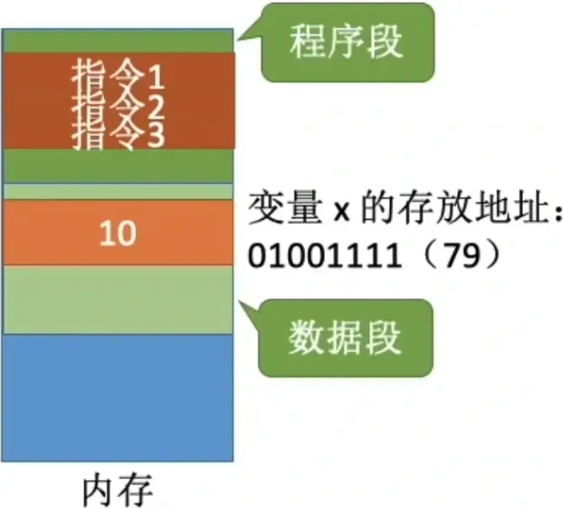


上述数据传送指令就是将地址为 01001111(79) 的数据传送到 00000011(3) 对应地址的内存单元，执行完后，00000011(3) 中就会有 10 这个数据。


上述加法指令代表将地址为 00000011(3) 的数据加上 00000001(1)。


拥有和第一个指令同样的操作码，说明也是数据传送指令。将地址为 00000011(3) 的数据传送回 01001111(79) 地址的内存单元处。

---

指令的工作基于**地址**，每个地址对应一个数据的存储单元。

可见，我们写的代码要翻译成 CPU 能识别的指令。这些指令会告诉 CPU 应该去内存的哪个地址读/写数据，这个数据应该做什么样的处理。在这个例子中，我们默认<span style="color:#FF0000">让这个进程的相关内容从地址 0 开始连续存放</span>，指令中的地址参数直接给出了变量 `x` 的实际存放地址（<span style="color:#FF0000">物理地址</span>）。

**如果这个进程不是从地址 0 开始存放的，会影响指令的正常执行吗？**

下面是物理地址从 0 开始的情况：

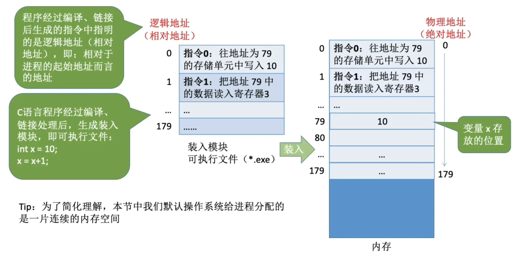

下面是物理地址不是从 0 开始的情况，可以看到程序中是逻辑地址，而装入时的物理地址是要重新计算的：


### 装入的三种方式——绝对装入

<span style="color:#CA7842;font-weight:bold">绝对装入</span>：在编译时，如果知道程序将放到内存中的哪个位置，编译程序<u>*将产生**绝对地址**的目标代码*</u>，装入程序按照装入模块中的地址，将程序和数据装入内存。

例如知晓装入模块要从地址 100 的地方开始存放：

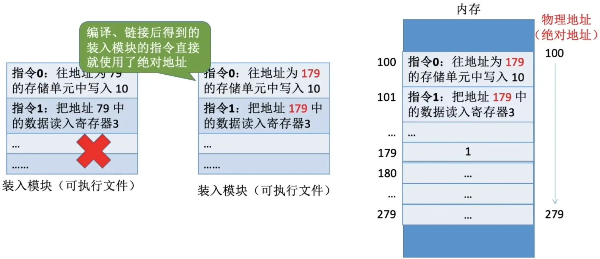

绝对装入方式灵活性较差，**仅适用于单道程序环境**。需要注意的是，一个可执行程序在某台电脑上能够正常运行，并不意味着它在其他电脑上也能顺利执行。

### 装入的三种方式——可重定位装入

<span style="color:#FF6500">**静态重定位**</span>：又称<span style="color:#3674B5">可重定位装入</span>。编译、链接后的装入模块的地址都是从 0 开始的，指令中使用的地址、数据存放的地址都是相对于起始地址而言的逻辑地址。可根据内存的当前情况，将装入模块装入到内存的适当位置。*装入时对地址进行<span style="color:#3674B5">**重定位**</span>*，<u>将逻辑地址变换为物理地址</u>。（地址变换是在**装入时一次完成的**）


静态重定位的特点是在一个作业装入内存时，<span style="color:#2D4F2B">**必须分配其要求的<u>*全部内存空间*</u>**</span>，如果没有足够的内存，就不能装入该作业。

作业一旦进入内存后，<span style="color:#2D4F2B;font-weight:bold">在运行期间就不能再移动</span>，也不能*<u>**再申请内存空间**</u>*。

### 装入的三种方式——动态运行时装入

<span style="color:#725CAD">**动态重定位**</span>：又称<span style="color:#AE445A">动态运行时装入</span>。编译、链接后的装入模块的地址都是从 0 开始的。装入程序把装入模块装入内存后，并不会立即把逻辑地址转换为物理地址，而是<span style="color:#AE445A">把地址转换**推迟**到程序真正要执行时才进行</span>。因此装入内存后所有的地址依然是<u>*逻辑地址*</u>。这种方式需要一个<span style="color:#AE445A">**重定位寄存器**</span>的支持。


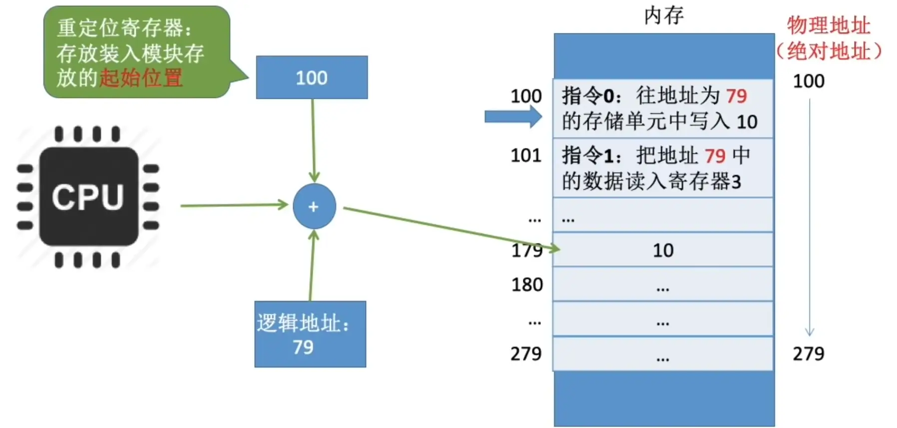

采用动态重定位时，<span style="color:#F564A9">允许程序在内存中**发生移动**</span>。

并且可将程序分配到不连续的存储区中；在程序运行前只需<u>*装入它的部分代码即可投入运行*</u>，然后在程序运行期间，根据需要动态申请分配内存：便于<u>程序段的共享</u>，可以向用户提供更灵活的存储空间，提供一个比实际存储空间大得多的**虚拟地址空间**。

### 从写程序到程序运行

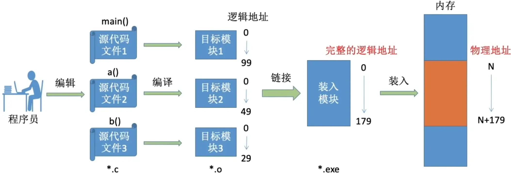

- **编译**：由编译程序将用户源代码编译成若干个目标模块（编译就是把高级语言<span style="color:#CB0404">翻译为机器语言</span>）
- **链接**：由链接程序将编译后形成的一组目标模块，以及所需库函数链接在一起，形成一个完整的装入模块
- **装入（装载）**：由装入程序将装入模块装入内存运行

### 链接的三种方式

1. **静态链接**：在程序运行之前，先将各目标模块及它们所需的库函数连接成一个*<u>完整的可执行文件</u>*（装入模块），之后不再拆开

   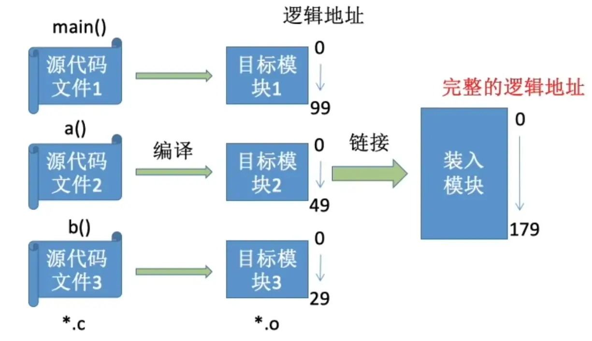

2. **装入时动态链接**：将各目标模块装入内存时，<u>边装入边链接</u>的链接方式

   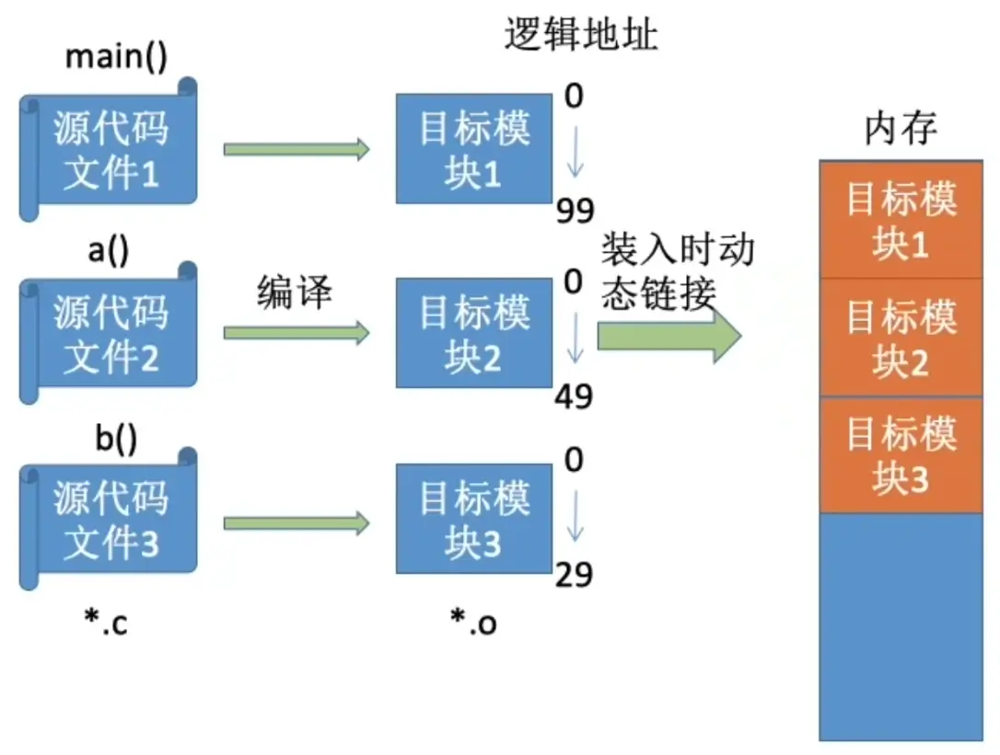
   
3. **运行时动态链接**：在程序执行中<u>*需要该目标模块时，才对它进行链接*</u>；其优点是便于修改和更新，便于<u>*实现对目标模块的共享*</u>

   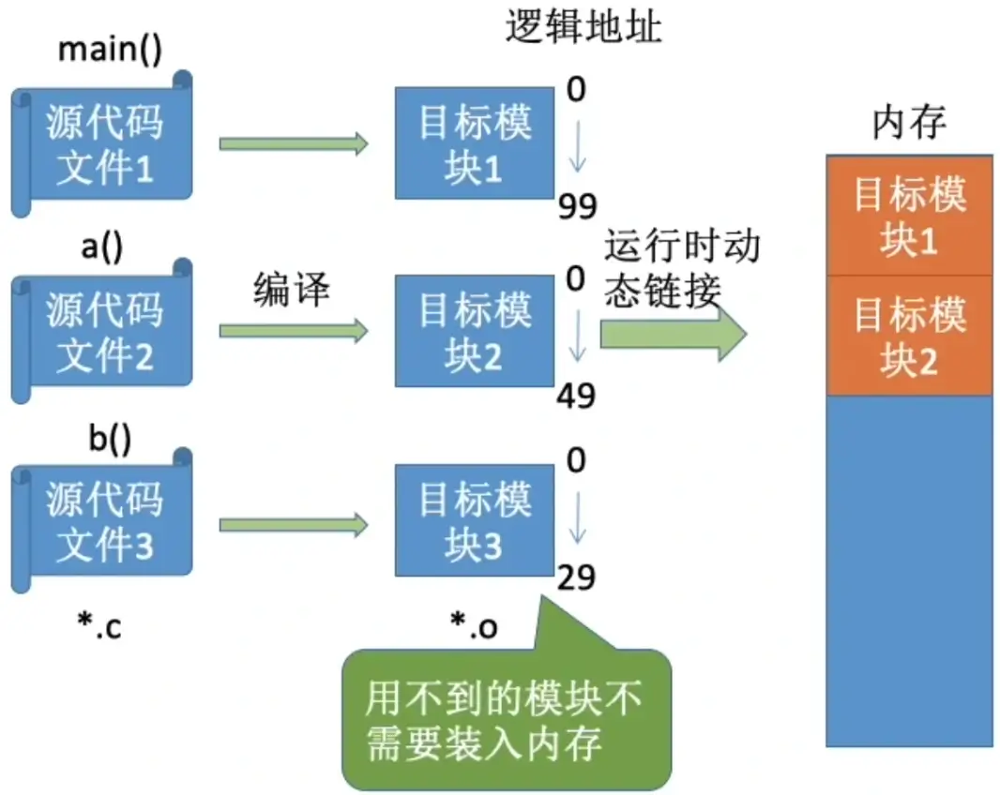

---


## 内存管理的概念

**知识总览**：


操作系统作为系统资源的管理者，当然也需要对内存进行管理。

### 内存的分配与回收

操作系统负责***内存空间的分配与回收***。


### 内存空间的扩充

操作系统需要提供某种技术（虚拟技术，操作系统的虚拟性）从逻辑上***对内存空间进行补充***。

例如游戏《侠盗猎车手》的大小超过 60GB，按理来说这个游戏程序运行之前需要把 60GB 数据全部放入内存。然而，实际我的电脑内存才 4GB，但为什么这个游戏可以顺利运行呢？


### 地址转换

操作系统需要提供***地址转换功能***，负责程序的<span style="color:#4D3C77">**逻辑地址**</span>与<span style="color:#4D3C77">**物理地址**</span>的转换。（使用前面提到的三种方式，即<u>绝对装入、可重定向装入以及动态运行时装入</u>）

为了使编程更方便，程序员写程序时应该只需要关注指令、数据的逻辑地址。而<span style="color:#994D1C">逻辑地址到物理地址的转换</span>（这个过程称为<span style="color:#994D1C">**地址重定位**</span>）应该*由操作系统负责*，这样就保证了程序员写程序时不需要关注物理内存的实际情况。

### 内存保护

操作系统需要提供***内存保护***功能。保证各进程在各自存储空间内运行，互不干扰。

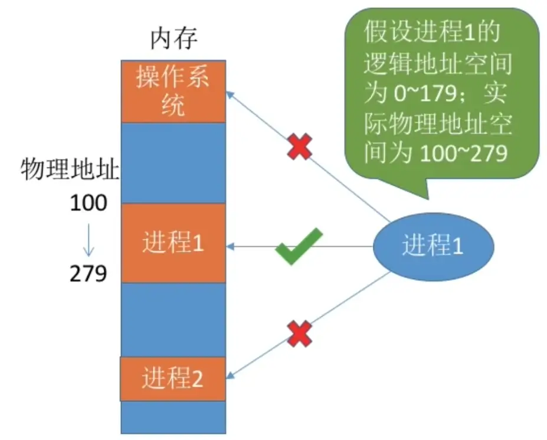

1. 在 CPU 中<span style="color:#D14D72">设置一对上、下限寄存器</span>，存放进程的上、下限地址；进程的指令要访问某个地址时，CPU 检查是否越界

   

2. 采用<span style="color:#DC2525">重定位寄存器</span>（又称<span style="color:#DC2525">基址寄存器</span>）和<span style="color:#DC2525">界地址寄存器</span>（又称<span style="color:#DC2525">限长寄存器</span>）进行越界检查；重定位寄存器中存放的是进程的<span style="color:#DC2525">起始物理地址</span>；界地址寄存器中存放的是进程的<span style="color:#DC2525">最大逻辑地址</span>

   

---


## 进程的内存映像

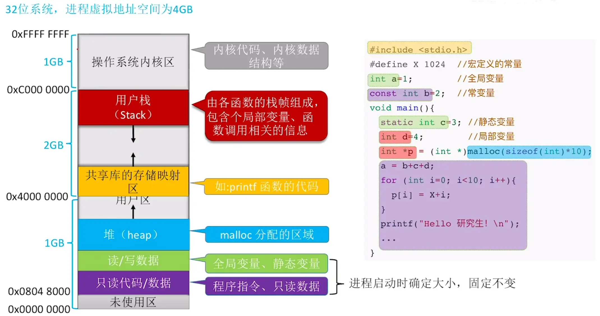

> **注意**：宏定义的常量不专门分配存储空间，在预编译阶段，会将代码中的 `X` 替换为 1024。

## 覆盖与交换

**知识总览**：


### 覆盖技术

早期的计算机内存很小，比如 IBM 推出的第一台 PC 机最大只支持 1MB 大小的内存。因此经常会出现内存大小不够的情况。

后来人们引进了<span style="color:#F14A00">覆盖技术</span>，用来<span style="color:#F14A00">解决**程序大小超过物理内存总和**的问题</span>。


**覆盖技术的思想**：将<span style="color:#5409DA">**程序**分为多个段</span>（多个模块），常用的段常驻内存，不常用的段在需要时调入内存。

内存中分为<span style="color:#5409DA">一个**固定区**</span>和<span style="color:#5409DA">若干个**覆盖区**</span>。

需要常驻内存的段放在<span style="color:#5409DA">**固定区**</span>中，<span style="color:#5409DA">调入后就<u>不再调出</u></span>（除非运行结束）；不常用的段放在<span style="color:#5409DA">**覆盖区**</span>，<span style="color:#5409DA">需要用到时调入内存，用不到时调出内存</span>。

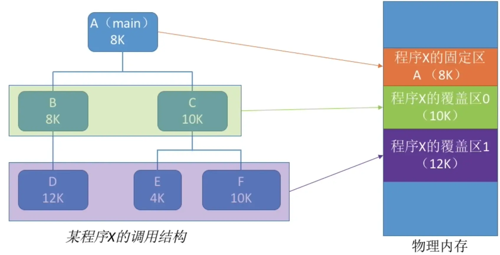

按照自身逻辑结构，让那些不可能同时被访问的程序段共享同一覆盖区。

<span style="color:#3D90D7">必须由程序员**声明覆盖结构**</span>，操作系统完成自动覆盖。<span style="color:#3D90D7;font-weight:bold">但是对用户不透明</span>，增加了用户编程负担。

### 交换技术

**交换（对换）技术的设计思想**：内存空间紧张时，系统将内存中某些进程时<span style="color:#3D8D7A">**换出**</span>外存，把外存中某些<u>已具备运行条件</u>的进程<span style="color:#3D8D7A">**换入**</span>内存。（进程在<u>内存与磁盘间***动态调度***</u>）


<span style="color:#DD88CF">**中级调度（内存调度）**</span>，就是要决定将哪个处于挂起状态的进程重新调入内存。

暂时换出外存等待的进程状态为<span style="color:#6A9C89">挂起状态（挂起态，suspend）</span>，挂起态又可以细分为<span style="color:#36C2CE">就绪挂起、阻塞挂起</span>两种状态。


应该在外存（磁盘）的什么位置保存被换出的进程？

具有对换功能的操作系统中，通常把磁盘空间分为<span style="color:#03A791">**文件区**</span>和<span style="color:#03A791">**对换区**</span>两部分。

<span style="color:#03A791">**文件区**</span>主要用于存放文件，<span style="color:#03A791">主要追求存储空间的**利用率**</span>，因此对文件区空间的管理<span style="color:#03A791">采用**离散分配方式**</span>。

<span style="color:#03A791">**对换区**</span>空间只占磁盘空间的小部分，<span style="color:#03A791">被换出的进程数据就存放在对换区</span>。由于对换的速度直接影响到系统的整体速度，因此对换区空间的管理<span style="color:#03A791">主要追求**换入换出速度**</span>，因此通常对换区<span style="color:#03A791">采用**连续分配方式**</span>。

总之，<span style="color:#03A791">对换区的 **I/O 速度**比文件区的更快</span>。


何时进行交换？

交换通常在**许多进程运行且内存吃紧**时进行，而**系统负荷降低**就暂停。例如：在发现许多进程运行时经常发生缺页，就说明内存紧张，此时可以换出一些进程；如果缺页率明显下降，就可以暂停换出。

应该换出什么进程呢？

可优先换出**阻塞进程**；可换出**优先级低的进程**；为了防止优先级低的进程在被调入内存后很快又被换出，有的系统还会考虑进程在**内存的驻留时间**。

> **注意**：<span style="color:#FF6363">PCB 会常驻内存</span>，不会被换出外存。

---


## 连续分配管理方式

**知识总览**：


<span style="color:#60B5FF">**连续分配**</span>：指为用户进程分配的必须是一个<span style="color:#60B5FF">连续的内存空间</span>。

### 单一连续分配

在单一连续分配方式中，内存被分为<span style="color:#3F7D58">**系统区**</span>和<span style="color:#3F7D58">**用户区**</span>。

- 系统区通常位于内存的低地址部分，用于存放操作系统相关数据
- 用户区用于存放用户进程相关数据。

使用该种分配方式，内存中<span style="color:#3F7D58">**只能有一道用户程序**</span>，用户程序<u>独占</u>整个用户区空间。


- <span style="color:#37AFE1">**优点**</span>：实现简单；<span style="color:#F09319">无外部碎片</span>；可以采用覆盖技术扩充内存；不一定需要采取内存保护（例如早期的 PC 操作系统 MS-DOS，不过有些系统也会采用越界检查的机制）
- <span style="color:#37AFE1">**缺点**</span>：只能用于单用户、单任务的操作系统中，<span style="color:#F95454">有**内部碎片**</span>（分配给某进程的内存区域中，如果有些部分没有用上，就是**内部碎片**），存储器利用率极低

### 固定分区分配

20 世纪 60 年代出现了支持多道程序的系统，为了能在内存中装入多道程序，且这些程序之间又不会相互干扰，于是将整个<span style="color:#FFAF00">用户空间</span>划分为<span style="color:#FFAF00">若干个**固定大小**的分区</span>，在<span style="color:#FFAF00">每个分区中只装入一道作业</span>，这样就形成了最早的、最简单的一种可运行多道程序的内存管理方式。


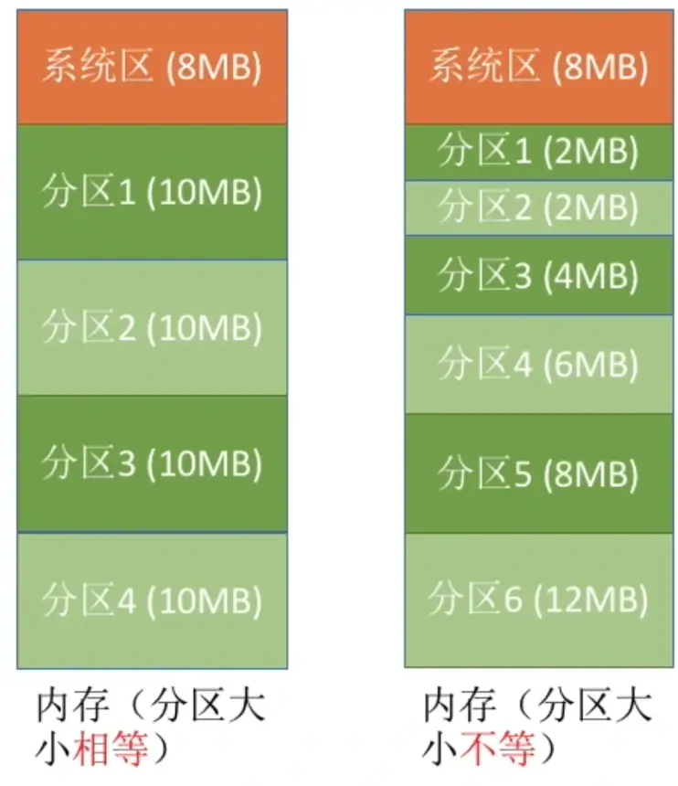

- <span style="color:#36BA98">**分区大小相等**</span>：缺乏灵活性，但是很<span style="color:#E76F51">适合用于用一台计算机控制**多个相同对象**的场合</span>（比如，钢铁厂有 n 个相同的炼钢炉，就可把内存分为 n 个大小相等的区域存放 n 个炼钢炉控制程序）
- <span style="color:#36BA98">**分区大小不等**</span>：增加了灵活性，可以满足不同大小的进程需求；根据常在系统中运行的作业大小情况进行划分（比如，划分多个小分区、适量中等分区、少量大分区）

操作系统需要建立一个数据结构——<span style="color:#219C90">**分区说明表**</span>，来实现各个分区的分配与回收。每个表项对应一个分区，通常按分区大小排列。每个表项包括对应分区的<span style="color:#219C90">大小、起始地址、状态</span>（是否已分配）。

| 分区号 | 大小（MB） | 起始地址（M） |  状态  |
| :----: | :--------: | :-----------: | :----: |
|   1    |     2      |       8       | 未分配 |
|   2    |     2      |      10       | 未分配 |
|   3    |     4      |      12       | 已分配 |
|   ……   |     ……     |      ……       |   ……   |

可以使用数据结构中的数组（或链表）来表示这个表。

当某用户程序要装入内存时，由操作系统内核程序根据用户程序大小检索该表，从中找到一个能满足大小的、未分配的分区，将之分配给该程序，然后修改状态为**已分配**。

- **优点**：实现简单，<span style="color:#06D001">无外部碎片</span>
- **缺点**：
  1. 当用户程序太大时，可能所有的分区都不能满足需求，此时不得不采用覆盖技术来解决，但这又会降低性能
  2. <span style="color:#06D001">会产生内部碎片</span>，内存利用率低

### 动态分区分配

<span style="color:#FF6500">动态分区分配</span>又称为<span style="color:#FF6500">可变分区分配</span>。这种分配方式<span style="color:#FF6500">不会**预先**划分内存分区</span>，而是在进程装入内存时，<span style="color:#FF6500">根据进程的大小**动态地建立分区**</span>，并使分区的大小正好适合进程的需要。因此系统分区的大小和数目是可变的。（例如，假设某计算机内存大小为 64MB，系统区 8MB，用户区共 56MB）

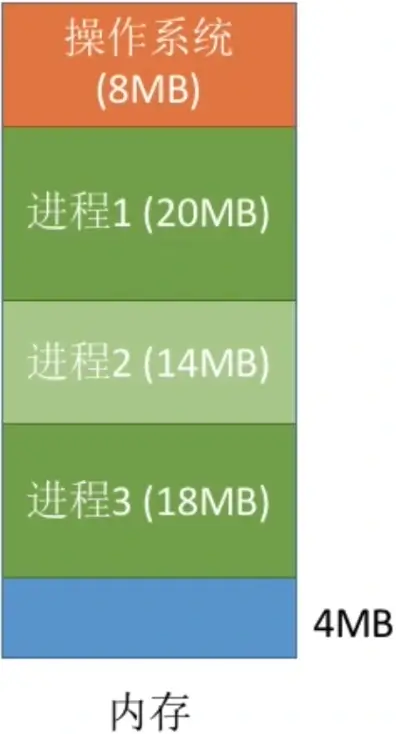

系统要用什么样的数据结构来记录内存的使用情况呢？


- **空闲分区表**：每个空闲分区对应个表项；表项中包含分区号、分区大小、分区起始地址等信息

  | 分区号 | 分区大小（MB） | 起始地址（M） | 状态 |
  | :----: | :------------: | :-----------: | :--: |
  |   1    |       20       |       8       | 空闲 |
  |   2    |       10       |      32       | 空闲 |
  |   3    |       4        |      60       | 空闲 |

- **空闲分区链**：每个分区的起始部分和末尾部分分别设置前向指针和后向指针，起始部分处还可记录分区大小等信息

  

当有很多空闲分区都可以满足需求时，应该选择哪个分区进行分配？


把一个新作业装入内存时，须按照一定的<span style="color:#E72929">动态分区分配算法</span>，从空闲分区表（或空闲分区链）中选出一个分区分配给该作业。由于分配算法算法对系统性能有很大的影响，因此人们对它进行了广泛的研究。

**如何进行分区的分配与回收操作？假设系统采用的数据结构是空闲分区表，如何回收？**

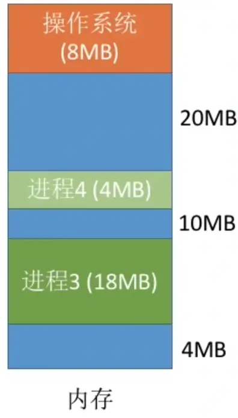

| 分区号 | 分区大小（MB） | 起始地址（M） | 状态 |
| :----: | :------------: | :-----------: | :--: |
|   1    |       20       |       8       | 空闲 |
|   2    |       10       |      32       | 空闲 |
|   3    |       4        |      60       | 空闲 |

进行如下分配：

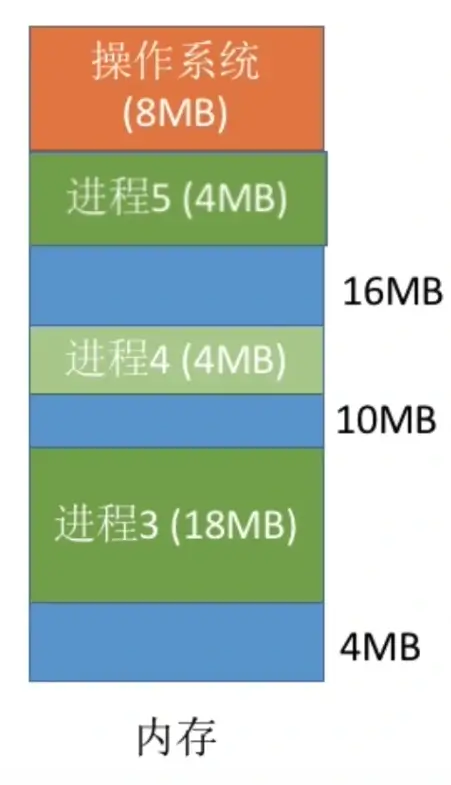

分配后，空闲分区表为：

| 分区号 |          分区大小（MB）           |           起始地址（M）           | 状态 |
| :----: | :-------------------------------: | :-------------------------------: | :--: |
|   1    | <span style="color:red">16</span> | <span style="color:red">12</span> | 空闲 |
|   2    |                10                 |                32                 | 空闲 |
|   3    |                 4                 |                60                 | 空闲 |

类似的，若进行下面的分配：

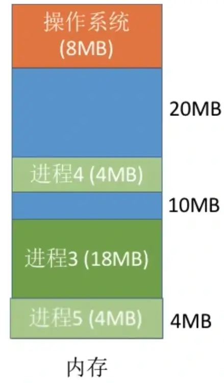

分配后，申请的内存大小与空闲分区大小恰好相等，将表项删除（空闲分区链就是将对应的节点删除）：

| 分区号 | 分区大小（MB） | 起始地址（M） | 状态 |
| :----: | :------------: | :-----------: | :--: |
|   1    |       20       |       8       | 空闲 |
|   2    |       10       |      32       | 空闲 |

---

回收时，有以下几种情况：

1. 回收区的后面有一个相邻的空闲分区：

   | 分区号 | 分区大小（MB） | 起始地址（M） | 状态 |
   | :----: | :------------: | :-----------: | :--: |
   |   1    |       10       |      32       | 空闲 |
   |   2    |       4        |      60       | 空闲 |

   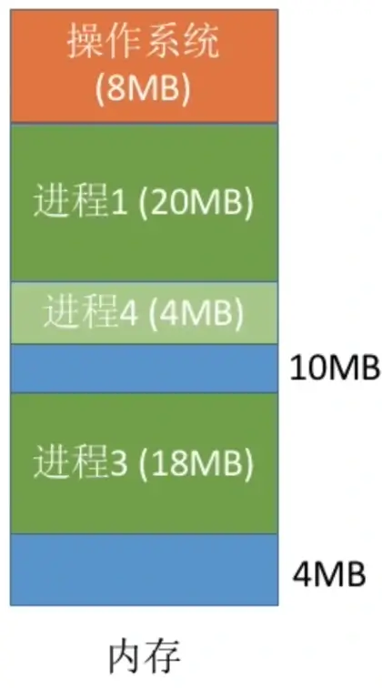

   对进程 4 进行回收后，有：

   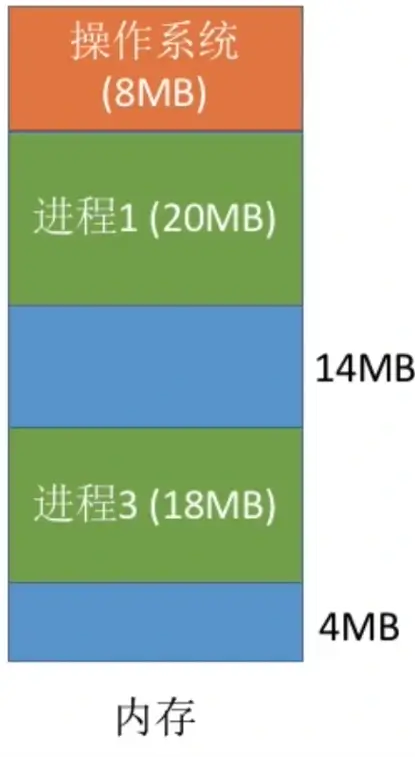

   | 分区号 |          分区大小（MB）           |           起始地址（M）           | 状态 |
   | :----: | :-------------------------------: | :-------------------------------: | :--: |
   |   1    | <span style="color:red">14</span> | <span style="color:red">28</span> | 空闲 |
   |   2    |                 4                 |                60                 | 空闲 |

   两个相邻的空闲分区合并为一个。

2. 回收区的前面有一个相邻的空闲分区：

   | 分区号 | 分区大小（MB） | 起始地址（M） | 状态 |
   | :----: | :------------: | :-----------: | :--: |
   |   1    |       20       |       8       | 空闲 |
   |   2    |       10       |      32       | 空闲 |

   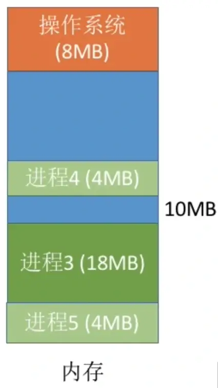

   对进程 3 进行回收后，有：

   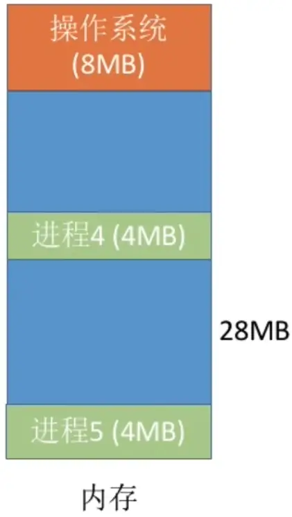

   | 分区号 |          分区大小（MB）           | 起始地址（M） | 状态 |
   | :----: | :-------------------------------: | :-----------: | :--: |
   |   1    |                20                 |       8       | 空闲 |
   |   2    | <span style="color:red">28</span> |      32       | 空闲 |

   两个相邻的空闲分区合并为一个。

3. 回收区的前、后各有一个相邻的空闲分区：

   | 分区号 | 分区大小（MB） | 起始地址（M） | 状态 |
   | :----: | :------------: | :-----------: | :--: |
   |   1    |       20       |       8       | 空闲 |
   |   2    |       10       |      32       | 空闲 |
   |   3    |       4        |      60       | 空闲 |

   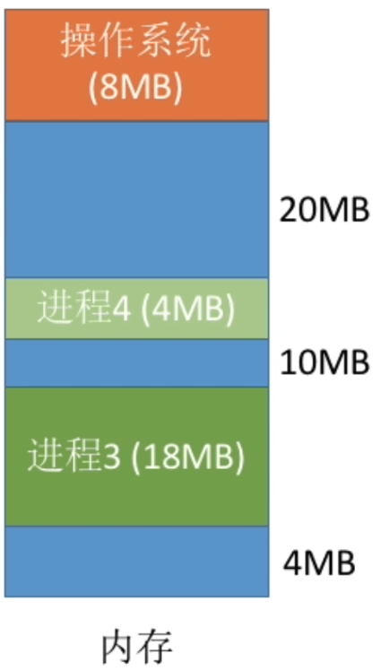

   将进程 4 的空间进行回收后，有：

   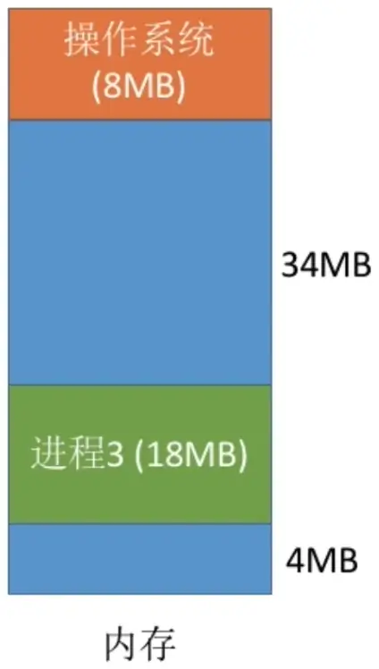

   | 分区号 |          分区大小（MB）           |          起始地址（M）           | 状态 |
   | :----: | :-------------------------------: | :------------------------------: | :--: |
   |   1    | <span style="color:red">34</span> | <span style="color:red">8</span> | 空闲 |
   |   2    |                 4                 |                60                | 空闲 |

   三个相邻的空闲分区合并为一个。

4. 回收区的前、后都没有相邻的空闲分区：

   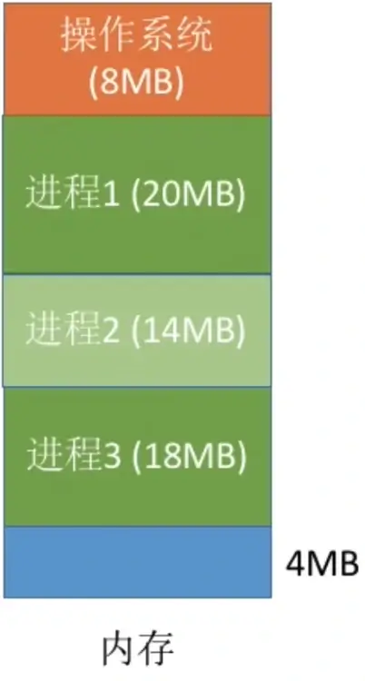

   | 分区号 | 分区大小（MB） | 起始地址（M） | 状态 |
   | :----: | :------------: | :-----------: | :--: |
   |   1    |       4        |      60       | 空闲 |

   当进程 2 的内存空间被回收以后，有：

   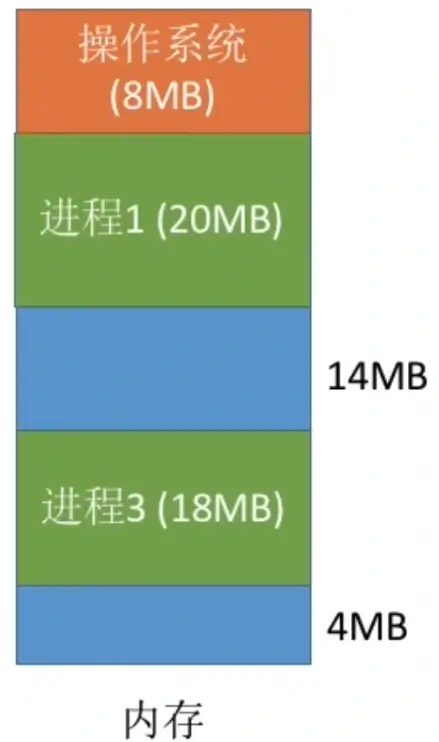

   |              分区号              |          分区大小（MB）           |           起始地址（M）           |                状态                 |
   | :------------------------------: | :-------------------------------: | :-------------------------------: | :---------------------------------: |
   | <span style="color:red">1</span> | <span style="color:red">14</span> | <span style="color:red">28</span> | <span style="color:red">空闲</span> |
   |                2                 |                 4                 |                60                 |                空闲                 |

   新增一个表项。

   > **注意**：各表项的顺序不一定按照地址递增顺序排列，具体的排列方式需要依据动态分区分配算法来确定。

总结，相邻的空闲区间是要合并的。

---

动态分区分配<span style="color:#E178C5">没有内部碎片</span>，但是<span style="color:#E178C5">有外部碎片</span>。

- <span style="color:#E178C5">**内部碎片**</span>：分配给某进程的内存区域中，如果有些部分没有用上
- <span style="color:#E178C5">**外部碎片**</span>：内存中的某些空闲分区<u>由于太小</u>而难以利用

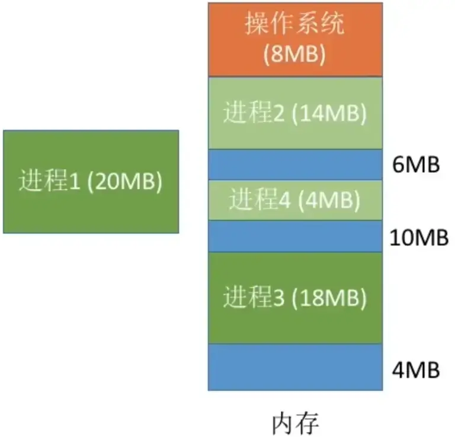

如果内存中空闲空间的总和本来可以满足某进程的要求，但由于进程需要的是一整块连续的内存空间，因此这些**碎片**不能满足进程的需求。

可以采用<span style="color:#89B9AD">**紧凑（拼凑，Compaction）**</span>技术来解决外部碎片。


动态分区分配应该使用*<u>**动态重定位**</u>*的技术，便于实现以上操作。紧凑之后，要将各个进程的起始地址进行修改，进程的起始地址这个信息一般存在进程对应的 PCB 中。当进程上 CPU 运行之前，要将进程的起始地址放在重定位寄存器（基址寄存器）中。

---


## 动态分区分配算法

**知识总览**：


### 首次适应算法

- <span style="color:#DA498D">**算法思想**</span>：每次都从低地址开始查找，找到第一个能满足大小的空闲分区
- <span style="color:#DA498D">**如何实现**</span>：<span style="color:#E16A54">空闲分区以***地址递增***的次序排列</span>，每次分配内存时顺序查找<span style="color:#E16A54">空闲分区链</span>（或<span style="color:#E16A54">空闲分区表</span>），找到大小能满足要求的第一个空闲分区

### 最佳适应算法

- <span style="color:#E4003A">**算法思想**</span>：由于动态分区分配是一种连续分配方式，为各进程分配的空间必须是连续的一整片区域。因此为了保证当**大进程**到来时能有*<u>连续的大片空间</u>*，可以尽可能多地留下大片的空闲区，即，优先使用<u>*更小的空闲区*</u>
- <span style="color:#E4003A">**如何实现**</span>：<span style="color:#E16A54">空闲分区以***容量递增***的次序排列</span>，每次分配内存时顺序查找<span style="color:#E16A54">空闲分区链</span>（或<span style="color:#E16A54">空闲分区表</span>），找到大小能满足要求的第一个空闲分区
- <span style="color:#E4003A">**缺点**</span>：每次都选最小的分区进行分配，会留下越来越多的、很小的、难以利用的内存块，因此该方法会产生很多的外部碎片

> **注意**：在分配完后，要对空闲分区表或空闲分区链的<u>排序</u>和信息进行更新。

### 最坏适应算法

又称为<span style="color:#2A629A">**最大适应算法**</span>（Largest Fit）。

- <span style="color:#2A629A">**算法思想**</span>：为了解决最佳适应算法的问题——即留下太多难以利用的*<u>**小碎片**</u>*，可以在每次分配时优先使用***<u>最大的连续空闲区</u>***，这样分配后剩余的空闲区就不会太小，更方便使用
- <span style="color:#2A629A">**如何实现**</span>：<span style="color:#E16A54">空闲分区以***容量递减***的次序排列</span>，每次分配内存时顺序查找<span style="color:#E16A54">空闲分区链</span>（或<span style="color:#E16A54">空闲分区表</span>），找到大小能满足要求的第一个空闲分区
- <span style="color:#2A629A">**缺点**</span>：每次都选最大的分区进行分配，虽然可以让分配后留下的空闲区更大、更可用，但是这种方式会导致较大的连续空闲区被迅速用完；如果之后有**大进程**到达，就没有内存分区可用了

### 邻近适应算法

- <span style="color:#756AB6">**算法思想**</span>：首次适应算法每次都从链头开始查找的；这可能会导致*<u>**低地址部分**</u>*出现很多***<u>小的空闲分区</u>***，而每次分配查找时，都要经过这些分区，因此也增加了**查找的开销**；如果每次都从上次查找结束的位置开始检索，就能解决上述问题
- <span style="color:#756AB6">**如何实现**</span>：空闲分区以地址递增的顺序排列（可排成一个循环链表）；每次分配内存时<span style="color:#F6635C">从上次查找结束的位置开始</span>查找<span style="color:#F6635C">空闲分区链</span>（或<span style="color:#F6635C">空闲分区表</span>），找到大小能满足要求的第一个空闲分区
- <span style="color:#756AB6">**缺点**</span>：
  1. 首次适应算法每次都要从头查找，每次都需要检索低地址的小分区但是这种规则也决定了当低地址部分有更小的分区可以满足需求时，会更有**<u>可能用到低地址部分的小分区</u>**，也会更有可能把**<u>高地址部分的大分区</u>**保留下来（最佳适应算法的优点）
  2. 邻近适应算法的规则可能会导致无论低地址、高地址部分的空闲分区<u>*都有相同的概率被使用*</u>，也就导致了高地址部分的<u>*大分区更可能被使用，划分为小分区*</u>，最后导致**无大分区可用**（最大适应算法的缺点）

> **注意**：邻近适应算法和首次适应算法相较于最佳适应算法和最坏适应算法的优点在于它们是按照地址顺序进行排序，无需对空闲分区链和空闲分区表进行位置上的改动。

综合来看，<span style="color:#C23373">四种算法中，首次适应算法的效果反而更好</span>。

---

| 算法     | 算法思想                                           | 分区排列顺序                                   | 优点                                                         | 缺点                                                         |
| -------- | -------------------------------------------------- | ---------------------------------------------- | ------------------------------------------------------------ | ------------------------------------------------------------ |
| 首次适应 | 从头到尾找适合的分区                               | 空闲分区以地址递增次序排列                     | 综合看性能最好。***算法开销小***，回收分区后一般不需要对空闲分区队列重新排序 |                                                              |
| 最佳适应 | 优先使用更小的分区，以保留更多大分区               | 空闲分区以容量递增次序排列                     | 会有更多的大分区被保留下来，更能满足大进程需求               | 会产生很多太小的、难以利用的碎片；***算法开销大***，回收分区后可能需要对空闲分区队列重新排序 |
| 最坏适应 | 优先使用更大的分区，以防止产生太小的不可用的碎片   | 空闲分区以容量递减次序排列                     | 可以减少难以利用的小碎片                                     | 大分区容易被用完，不利于大进程；***算法开销大***，回收分区后可能需要对空闲分区队列重新排序 |
| 邻近适应 | 由首次适应演变而来，每次从上次查找结束位置开始查找 | 空闲分区以地址递增次序排列（可排列成循环链表） | 不用每次都从低地址的小分区开始检索。***算法开销小***，回收分区后一般不需要对空闲分区队列重新排序 | 会使高地址的大分区也被用完                                   |

## 基本分页存储管理的基本概念

**知识总览**：


**非连续分配**：为用户进程分配的可以是一些<span style="color:#4DA8DA">**分散的内存空间**</span>。

### 分页存储的定义

将内存空间分为一个个<span style="color:#F564A9">大小相等的**分区**</span>（比如，每个分区 4KB），每个分区就是一个<span style="color:#F564A9">**页框**</span>（<span style="color:#B33791">页框</span> = <span style="color:#B33791">页帧</span> = <span style="color:#B33791">内存块</span> = <span style="color:#B33791">物理块</span> = <span style="color:#B33791">物理页面</span>）。每个页框有一个编号，即<span style="color:#B33791">**页框号**</span>（<span style="color:#B33791">页框号</span> = <span style="color:#B33791">页帧号</span> = <span style="color:#B33791">内存块号</span> = <span style="color:#B33791">物理块号</span> = <span style="color:#B33791">物理页号</span>），页框号<span style="color:#B33791">___从 0 开始___</span>。


将<span style="color:#52357B">进程的逻辑地址空间</span>也分为<span style="color:#FE5D26">与页框大小相等</span>的一个个部分，每个部分称为一个<span style="color:#FE5D26">**页**</span>或<span style="color:#FE5D26">**页面**</span>。每个页面也有一个编号即<span style="color:#FE5D26">**页号**</span>，页号也是<span style="color:#FE5D26">___从 0 开始___</span>。

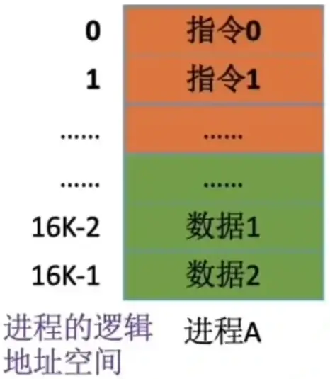

操作系统<span style="color:#F564A9">以页框为单位为各个进程分配</span>内存空间，进程的每个页面分别放入一个页框中。也就是说，进程的<span style="color:#F564A9">页面</span>与内存的<span style="color:#F564A9">页框</span>有<span style="color:#F564A9">**一一对应**</span>的关系。

各个页面不必连续存放，可以放到不相邻的各个页框中。

### 重要的数据结构——页表

为了能知道进程的每个页面在内存中存放的位置，操作系统要为每个进程建立一张<span style="color:#CA7842">**页表**</span>，页表通常存在 <u>*PCB（进程控制块）*</u>中。

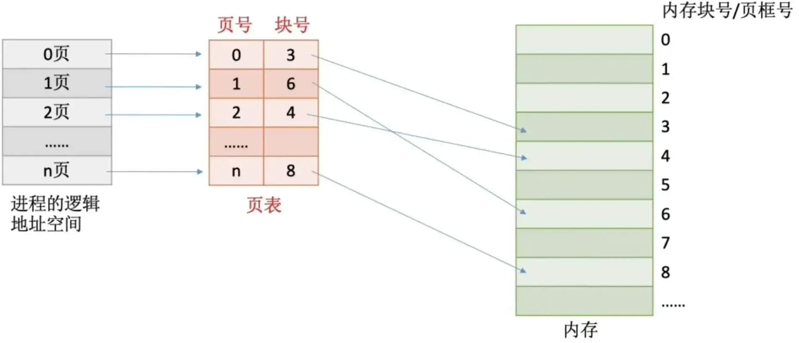

1. 一个进程对应一张页表
2. 进程的每个页面对应一个页表项
3. 每个<span style="color:#687FE5">页表项</span>由**页号**和**块号**组成
4. 页表记录进程<span style="color:#687FE5">页面</span>和实际存放的<span style="color:#687FE5">内存块</span>之间的<span style="color:#687FE5">映射关系</span>

### 页表项大小

假设某系统物理内存为 4GB，页面大小为 4KB，则每个页表项至少应该为多少字节？

因为内存块大小 = 页面大小 = 4KB = $2^{12} \text{B}$，所以 4GB 的内存总共会被分成 $\dfrac{2^{32}}{2^{12}} = 2^{20}$ 个内存块，内存块编号的范围应该是 $0 \sim 2^{20} - 1$，因此至少需要 20bit 才可以表示内存块号；而计算机以字节为单位来分配，因此至少需要 <span style="color:#DC2525">3B</span> 来表示<span style="color:#DC2525">块号</span>。（$3 \times 8 = 24$）

> **注意**：通过计算机内存块的数量来判断页表项中块号至少占多少字节。

因为页表项<u>连续存放</u>，因此<span style="color:#D5451B">页号</span>是<span style="color:#D5451B">隐藏</span>的，<span style="color:#FF3F33">**不占存储空间**（类比数组）</span>。

假设页表中的各页表项从内存地址为 `X` 的地方开始连续存放，如何找到页号为 `i` 的页表项？

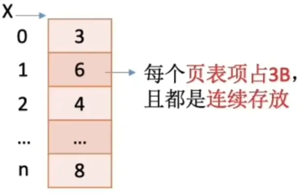

`i` 号页表项的存放地址为 `X + 3 * i`。

由于页号是**隐藏**的，因此每个页表项占 3B，存储整个页表至少需要 $\left(3 \times (n + 1) \right) \text{B}$。

> **注意**：页表记录的只是内存块号，而不是内存块的起始地址，J 号内存块的起始地址为 $J \times \text{内存块大小}$。

### 地址转换

进程在内存中**连续存放时**，操作系统是如何实现逻辑地址到物理地址的转换的？


将进程地址空间**分页**后，操作系统该如何实现逻辑地址到物理地址的转换呢？

<span style="color:#4E6688">**特点**</span>：虽然进程的各个页面是**离散存放**，但是页面**内部**是连续存放的。

若要访问逻辑地址 A，则有：

1. 确定逻辑地址 A 对应的**<span style="color:#4E6688">页号</span>** P
2. 找到 P 号页面在内存中的起始地址（需要查页表）
3. 确定逻辑地址 A 的<span style="color:#4E6688">**页内偏移量**</span> W

**逻辑地址 A 对应的物理地址**为 **P 号页面在<u>内存中的起始地址</u>**加上**页内偏移量 W**。

举例而言，在某计算机系统中，页面大小是 50B。某进程逻辑地址空间大小为 200B，则逻辑地址 110 对应的页号、页内偏移量是多少？


- **页号**：$\text{逻辑地址} \mid \text{页面长度}$，也就是取除法的<span style="color:#129990">整数</span>部分
- **页内偏移量**：$\text{逻辑地址} \% \text{页面长度}$，也就是取除法的<span style="color:#129990">余数</span>

因此上述例子页号为 2，页内偏移量为 10。

<span style="color:#732255;font-weight:bold">逻辑地址</span>可以拆分为 `(页号, 页内偏移量)`，通过页号查询页表，可知页面在<u>内存中的起始地址</u>。

页面在内存中的起始地址加上页内偏移量就是实际的物理地址。

> **注意**：在计算机内部，地址是用二进制来表示的，如果<span style="color:#732255">页面大小</span>刚好是<span style="color:#27548A"> 2 的整数幂</span>，则计算机硬件可以很快速地把逻辑地址拆分为 `(页号, 页内偏移量)`。

假设某计算机用 32 个二进制位来表示逻辑地址，页面大小为 4KB = $2^{12} \text{B}$ = 4096B。

**0 号页**的逻辑地址范围应该是 $0 \sim 4095$，用二进制表示应该是：


**1 号页**的逻辑地址范围应该是 $4096 \sim 8191$，用二进制表示应该是：


**2 号页**的逻辑地址范围应该是 $8192 \sim 12287$，用二进制表示应该是：


可以发现，前面的 20 位是页号，末尾的 12 位是页内偏移量。

**结论**：若每个页面的大小为<span style="color:#B13BFF"> $2^K \text{B}$</span>，用二进制数表示逻辑地址，则<span style="color:#B13BFF">末尾 K 位</span>即为<span style="color:#B13BFF">页内偏移量</span>，其余部分就是<span style="color:#B13BFF">页号</span>。

假设<span style="color:#B13BFF">物理地址</span>也用 32 个二进制位表示，则由于<u>内存块大小 = 页面大小</u>（代表页内偏移量相等），因此：


假设通过查询页表得知 1 号页面存放的内存块号是 9（1001），则：

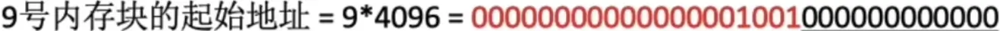

因此逻辑地址 4097 对应的物理地址为**页面在内存中存放的起始地址**加上**页内偏移量**，即：

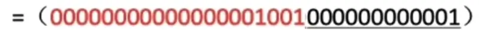

可以看出相当于将后面的 12 位数字替换掉。

**结论**：如果页面大小刚好为 2 的整数幂，则只需把页表中记录的<span style="color:#FF7D29">物理块号拼接上页内偏移量</span>就可以得到对应的<span style="color:#FF7D29">物理地址</span>。（相当于把页号换成页框号）

如果不是的话，需要通过<u>***页框起始物理地址加上页内偏移量***</u>。

---

页面大小是 2 的整数幂有什么好处？

1. **逻辑地址的拆分更加迅速**：如果每个页面大小为 2KB，用二进制数表示逻辑地址，如末尾 K 位即为页内偏移量，其余部分就是页号。因此，如果让每个页面的大小为 2 的整数幕，计算机硬件就可以很方便地得出一个逻辑地址对应的页号和页内偏移量，而无需进行除法运算，从而提升了运行速度
2. **物理地址的计算更加迅速**：根据逻辑地址得到页号，根据页号查询页表从而找到页面存放的内存块号，将二进制表示的内存块号和页内偏移量拼接起来，就可以得到最终的物理地址

### 逻辑地址结构

分页存储管理的**逻辑地址结构**如下：

| 31……12 |    11……0     |
| :----: | :----------: |
| 页号 P | 页内偏移量 W |

地址结构包含两个部分：前一部分为页号，后一部分为页内偏移量 W。在上述例子中，地址长度为 32 位，其中 0~11 位为<span style="color:#075B5E">**页内偏移量**</span>，或称**页内地址**；12~31 位为**<span style="color:#075B5E">页号</span>**。

<span style="color:#075B5E">如果有 K 位表示**页内偏移量**，则说明该系统中一个页面的大小是 $2^K $个内存单元。</span>

<span style="color:#075B5E">如果有 M 位表示**页号**，则说明在该系统中，一个进程最多允许 $2^M$ 个页面</span>。

有关系如下：

页面大小 ⇔ 页内偏移量位数 ⇔ 逻辑地址结构

---


## 基本地址变换机构

**知识总览**：


基本地址变换机构是用于实现逻辑地址到物理地址转换的**一组硬件机构**。

---

基本地址变换机构可以借助进程的页表将逻辑地址转换为物理地址。

通常会在系统中设置一个<span style="color:#4DA8DA">**页表寄存器**</span>（PTR），存放<span style="color:#4DA8DA">页表在内存中的起始地址 F</span> 和<span style="color:#4DA8DA">页表长度 M</span>。进程未执行时，页表的始址和页表长度<span style="color:#4DA8DA">放在**进程控制块（PCB）**中</span>，当进程被调度时，操作系统内核会把它们放到页表寄存器中。

> **注意**：页面大小是 2 的整数幂。


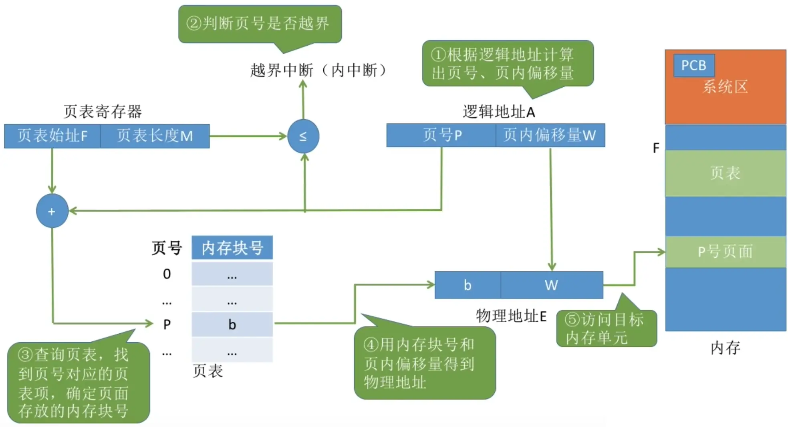

---

设页面大小为 L，实现逻辑地址 A 到物理地址 E 的变换过程如下：

1. 计算页号 P 和页内偏移量 W（如果用十进制数手算，则 $P = A \mid L$，$W = A \% L$；但是在计算机实际运行时，逻辑地址结构是固定不变的，因此计算机硬件可以更快地得到二进制表示的页号、页内偏移量）
2. 比较页号 P 和页表长度 M，若 $P \le M$，则产生越界中断，否则继续执行（页号是从 0 开始的，而页表长度至少是 1，因此 $P = M$ 时也会越界）
3. 页表中页号 P 对应的$页表项地址 = 页表起始地址 F + 页号 P \times 页表项长度$，取出该页表项内容 b 即为内存块号（区分页表项长度、页表长度、页面大小的区别；页表长度指的是这个页表中总共有几个页表项，即总共有几个页；页表项长度指的是每个页表项占多大的存储空间；页面大小指的是一个页面占多大的存储空间）
4. 计算 $E = b \times L+W$，用得到的物理地址 $E$ 去访存（如果内存块号、页面偏移量是用二进制表示的，那么把二者拼接起来就是最终的物理地址了）

---

举例，若页面大小 L 为 1K 字节，页号 2 对应的内存块号 $b = 8$，将逻辑地址 $A=2500$ 转换为物理地址 E。

**等价描述**：某系统<span style="color:#8A784E">**按字节寻址**</span>，逻辑地址结构中，<span style="color:#8A784E">**页内偏移量占 10 位**</span>（说明一个页面的大小为 $2^{10} \text{B} = 1 \text{KB}$，页号 2 对应的内存块号 $b=8$，将逻辑地址 $A=2500$ 转换为物理地址 E。

1. **计算页号、页内偏移量**：

   页号 $P = A \mid L = 2500 \mid 1024 = 2$，页内偏移量 $W = A % L = 2500 % 1024 = 452$

2. 根据题中条件可知，页号 2 没有越界，其存放的内存块号 $b = 8$
   
3. 物理地址 $E = b \times L + W = 8 \times 1024 + 425 = 8644$

在分页存储管理（页式管理）的系统中，只要确定了每个页面的大小，逻辑地址结构就确定了。因此，<span style="color:#5459AC">页式管理中地址是**一维的**</span>。即，<u>只要给出一个逻辑地址</u>，系统就可以自动地算出页号、页内偏移量两个部分，并不需要显式地告诉系统这个逻辑地址中，页内偏移量占多少位。

---

<span style="color:#7965C1">每个页表项的长度是相同的，页号是**隐含**的。</span>

举例，假设某系统物理内存大小为 4GB，页面大小为 4KB，的内存总共会被分为 $\dfrac{2^{32}}{2^{12}} = 2^{20}$ 个内存块，因此内存块号的范围应该是 $0 \sim 2^{20} - 1$。

因此至少要 20 个二进制位才能表示这么多的内存块号，因此至少要 3 个字节才够。（每个字节 8 个二进制位，3 个字节共 24 个二进制位）


各页表项会按顺序连续地存放在内存中。

如果该页表在内存中存放的起始地址为 `X`，则 M 号页对应的页表项是存放在内存地址为 `X + 3 * M`，一个页面为 4KB，则每个页框可以存放 $4096 \mid 3=1365$ 个页表项，但是这个页框会剩余 $4096 \% 3 = 1 \text{B}$ 页内碎片。因此，1365 号页表项存放的地址为 `X + 3 * 1365 + 1`，无法跨页框的存储。

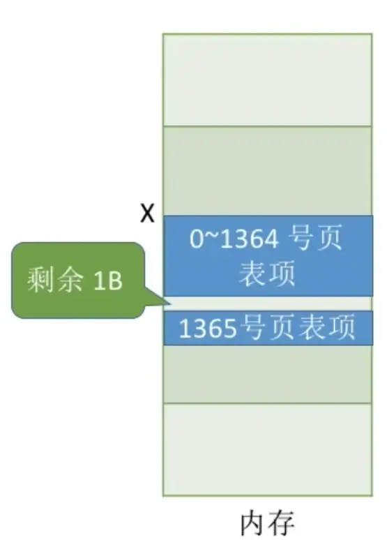

为了像之前计算的一样来查找页表项，假定<span style="color:#7965C1">每个页表项占 **4 字节**</span>，则每个页框刚好可以存放 1024 个页表项。


1024 号页表项虽然是存放在下一个页框中的，但是它的地址依然可以用 `X + 4 * 1024` 得出。

<span style="color:#7965C1">**结论**</span>：理论上，页表项长度为 3B 即可表示内存块号的范围，但是，为了<u>*方便页表的查询*</u>，常常会让一个页表项占更多的字节，使得<span style="color:#7965C1">每个页面恰好可以装得下整数个页表项</span>。

进程页表通常是<span style="color:#7965C1">装在**连续的**内存块中</span>的。（便于使用统一的计算方式）

---


CPU 在地址变换过程中访问了两次内存，第一次访问内存是查页表，第二次访问内存是访问目标内存单元。

## 具有快表的地址变换机构

**知识总览**：


是基本地址变换机构的改进版本。

### 快表的定义（TLB）

<span style="color:#725CAD">**快表**</span>，又称<span style="color:#725CAD">**联想寄存器**</span>（TLB，translation lookaside buffer），是一种<span style="color:#725CAD">访问速度比内存快很多</span>的<span style="color:#F97A00">**高速缓存**</span>（<u>***TLB 不是内存***</u>），用来存放<span style="color:#725CAD">最近访问的**页表项的副本**</span>，可以加速地址变换的速度与此对应，内存中的页表常称为<span style="color:#725CAD">**慢表**</span>。


能否把整个页表都放在 TLB 中？不可，要顾虑<u>成本</u>和<u>效率</u>等因素。

### 地址变换过程（TLB）

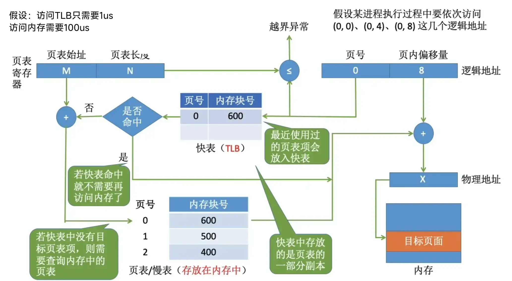

1. CPU 给出逻辑地址，由某个硬件算得页号、页内偏移量，将页号与快表中的所有页号进行比较
2. 如果找到匹配的页号，说明要访问的页表项在快表中有副本，则直接从中取出该页对应的内存块号，再将内存块号与页内偏移量拼接形成物理地址，最后，<span style="color:#0065F8">访问</span>该物理地址对应的<span style="color:#0065F8">内存单元</span>；因此，若<span style="color:#0065F8">快表命中</span>，则访问某个逻辑地址仅需<span style="color:#0065F8">一次访存</span>即可
3. 如果没有找到匹配的页号，则需要<span style="color:#0065F8">访问内存中的页表</span>，找到对应页表项，得到页面存放的内存块号，再将内存块号与页内偏移量拼接形成物理地址，最后，<span style="color:#0065F8">访问</span>该物理地址对应的<span style="color:#0065F8">内存单元</span>；因此，若<span style="color:#0065F8">快表未命中</span>，则访问某个逻辑地址需要<span style="color:#0065F8">两次访存</span>（<span style="color:#0065F8">在找到页表项后，应同时将其存入快表</span>，以便后面可能的再次访问；但若快表已满，则必须按照一定的算法对旧的页表项进行替换）

因为查询快表的速度要比查询页表的速度快很多，因此只要快表命中，就可以节省时间。因为局部性原理，一般快表的命中率可以达到 90% 以上。

某系统使用基本分页存储管理，并采用了具有快表的地址变换机构。访问一次快表耗时 1us，访问一次内存耗时 100us。若快表的命中率为 90%，那么访问一个逻辑地址的平均耗时是多少？
$$
(1 + 100) \times 0.9 + (1 + 100 + 100) \times 0.1 = 111
$$
有的系统支持<span style="color:#D5451B">快表和慢表同时查找</span>，如果是这样，平均耗时有：
$$
(1 + 100) \times 0.9 + (100 + 100) \times 0.1 = 110.9
$$
若未采用快表机制，则访问一个逻辑地址需要：
$$
100 + 100 = 200
$$
显然，引入快表机制后，访问一个逻辑地址的速度就快多了。

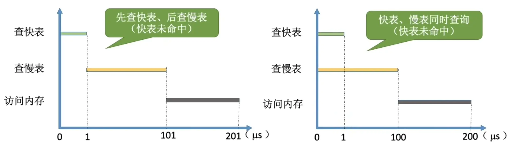

### 局部性原理

```c
int i = 0;
int a[100];
while (i < 100) {
    a[i] = i;
    i++;
}
```

这个程序执行时，会很频繁地访问 10 号页面、23 号页面。


- <span style="color:#F564A9;font-weight:bold">时间局部性</span>：如果执行了程序中的某条指令，那么不久后这条指令很有可能再次执行；如果某个数据被访问过，不久之后该数据很可能再次被访问（因为程序中存在<u>*大量的循环*</u>）
- <span style="color:#F564A9;font-weight:bold">空间局部性</span>：一且程序访间了某个存储单元，在不久之后，其附近的存储单元也很有可能被访问（因为很多数据在内存中都是<u>*连续存放的*</u>）

在**<span style="color:#9B7EBD">基本地址变换机构</span>**中，每次要访问一个逻辑地址，都需要**<span style="color:#9B7EBD">查询内存中的页表</span>**；由于局部性原理，<span style="color:#9B7EBD">**可能连续很多次查到的都是同一个页表项**</span>。

| 地址变换机构               | 地址变换过程                                                 | 访问一个逻辑地址的访存次数                                   |
| -------------------------- | ------------------------------------------------------------ | ------------------------------------------------------------ |
| **基本地址变换机构**       | ① 算页号、页内偏移量<br>② 检查页号合法性<br>③ 查页表，找到页面存放的内存块号<br>④ 根据内存块号与页内偏移量得到物理地址<br>⑤ 访问目标内存单元 | 两次访存                                                     |
| **具有快表的地址变换机构** | ① 算页号、页内偏移量<br>② 检查页号合法性<br>③ 查快表：<span style="color:red">若命中</span>，可直接获取内存块号（跳至 ⑤）；<span style="color:red">若未命中</span>则进行 ④<br>④ 查页表获取内存块号，并将页表项复制到快表<br>⑤ 组合物理地址<br>⑥ 访问目标内存单元 | <span style="color:red">快表命中</span>：一次访存<br><span style="color:red">快表未命中</span>：两次访存 |

TLB 和普通 Cache 的区别——TLB 中只有页表项的副本，而普通 Cache 中可能会有<u>*其他各种数据的副本*</u>。

## 两级页表

**知识总览**：


### 单级页表存在的问题

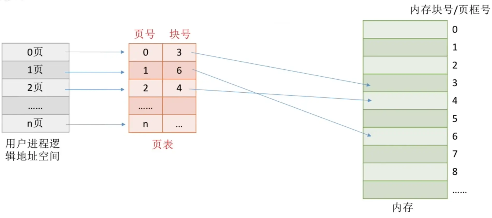

| 31……12 |    11……0     |
| :----: | :----------: |
| 页号 P | 页内偏移量 W |

某计算机系统按字节寻址，支持 32 位的逻辑地址，采用分页存储管理，页面大小为 4KB，页表项长度为 4B。

$4 \text{KB} = 2^{12}\text{B}$，因此页内地址要用 12 位表示，剩余 20 位表示页号。

因此，该系统中用户进程最多有 $2^{20}$ 页。相应的，一个进程的页表中，最多会有 $2^{20} = 1 \text{M} = 1,048,576$ 个页表项，所以一个页表最大需要 $2^{20} \times 4 \text{B} = 2^{22} \text{B}$，共需要 $\dfrac{2^{22}}{2^{12}} = 2^{10}$ 个页框存储该页表。（需要专门给进程分配 $2^{10} = 1024$ 个<u>连续的页框来存放它的页表</u>）

根据页号查询页表的方法：$K 号页对应的页表项存放位置 = 页表始址 + K \times 4$，要在<span style="color:#5459AC">所有的页表项都**连续存放**</span>的基础上才能用这种方法找到页表项。

根据**局部性原理**可知，大部分情况下，<span style="color:#483AA0">进程在一段时间内**只需要访问某几个页面**就可以正常运行了</span>，因此<span style="color:#CA7842">没有必要让整个页表都**常驻内存**</span>。

存在以下两个问题：

1. 页表必须连续存放，因此当页表很大时，需要占用很多个连续的页框（此时与离散分配存储管理的思想是相悖的）
2. 没有必要让整个页表常驻内存，因为进程在一段时间内可能只需要访问某几个特定的页面

---

如何解决进程在内存中必须连续存储的问题？将进程地址空间分页，并为其建立一张页表，记录各页面的存放位置。

类似的，为了解决**页表必须连续存放**的问题，把必须连续存放的页表再分页。

可将长长的页表进行分组，使每个内存块刚好可以放入一个分组。（比如上个例子中，页面大小 4KB，每个页表项 4B，每个页面可存放 1K 个页表项，因此每 1K 个连续的页表项为一组，每组刚好占一个内存块，再将各组离散地放到各内存块中；此外，有 $\frac{2^{20}}{2^{10}} = 2^{10}$ 组，可以发现外层组的数量是由页面大小决定的）

另外，要为离散分配的页表再建立一张页表，称为<span style="color:#F79B72">页目录表</span>，或称<span style="color:#F79B72">外层页表</span>，或称<span style="color:#F79B72">顶层页表</span>。

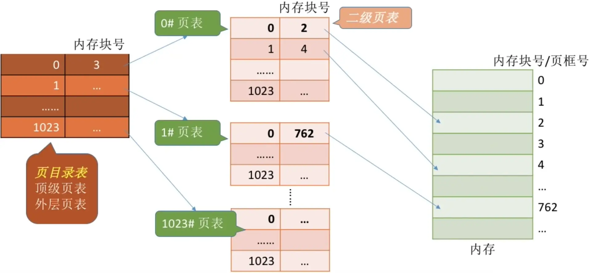

| 31……22   |  21……12  |   11……0    |
| -------- | :------: | :--------: |
| 一级页号 | 二级页号 | 页内偏移量 |

10 位的一级页号刚好可表示 $0 \sim 1023$，类似的，二级的 10 位也可以表示。

### 地址变换过程

举例，将 `(0000000000, 0000000001, 111111111111)` 转换为物理地址。（用十进制表示）

1. 按照地址结构将逻辑地址拆分为三部分
2. 从 PCB 中读出<u>*页目录表始址*</u>，再根据一级页号查<u>*页目录表*</u>，找到下一级页表在内存中的位置
3. 根据二级页表查表，找到最终想访问的内存块号
4. 结合页内偏移量得到物理地址

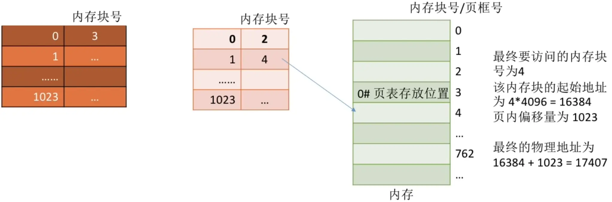

---

对于问题二，可以在需要访问页面时才把页面调入内存（虚拟存储技术），可以在页表项中增加一个标志位，用于表示该页面是否已经调入内存。

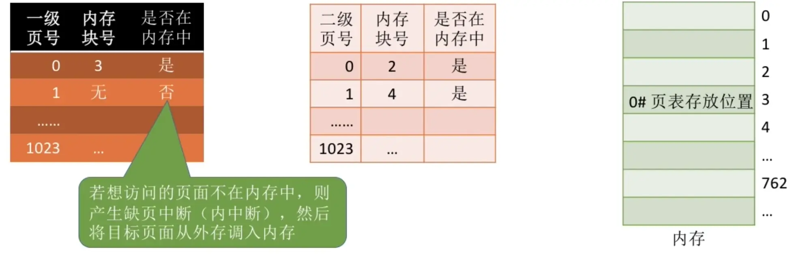

---

> **注意**：
>
> 1. 若采用多级页表机制，则<span style="color:#129990">各级页表的大小**不能超过一个页面**</span>：
>
>    例如，某系统按字节编址，采用 40 位逻辑地址，页面大小为 4KB，页表项大小为 4B，假设采用纯页式存储，则要<u>*采用**多少级**页表*</u>，<u>*页内偏移量为**多少位***</u>？
>
>    $页面大小=4\text{KB}=2^{12}\text{B}$，按字节编址，因此页内偏移量为 12 位，页号为 $40-12=28$ 位，页面大小为 $2^{12}\text{B}$，页表项大小为 $4\text{B}$，则每个页面可存放 $\dfrac{2^{12}}{4}=2^{10}$ 个页表项，因此各级页表最多包含 $2^{10}$ 个页表项，需要 10 位二进制位才能映射到 $2^{10}$ 个页表项，因此每一级的页表对应页号应为 10 位；总共 28 位的页号至少要分为三级。
>
>    （如果只分为两级页表，则一级页号占 18 位，也就是说页目录中最多可能有 $2^{18}$ 个页表项，显然，***<u>一个页面是放不下这么多页表项的</u>***）
>
> 2. 两级页表的<span style="color:#F79B72">**访存次数**</span>分析（假设没有快表结构）：
>
>    - **第一次访存**：访问内存中的页目录表
>    - **第二次访存**：访问内存中的二级页表
>    - **第三次访存**：访问目标内存单元
>
>    对内存利用率的上升带来的是访问效率的下降，N 级页表访问一个逻辑地址需要 N + 1 次访存。

---


要能根据逻辑地址位数、页面大小、页面项大小确定多级页表的逻辑地址结构。

## 基本分段存储管理方式

**知识总览**：


与**分页**最大的区别就是离散分配时所分配地址空间的<u>***基本单位***</u>不同。

### 分段

<span style="color:#64E2B7">**进程的地址空间**</span>：按照程序<span style="color:#FFB823">**自身的逻辑**</span>关系<span style="color:#FFB823">划分为**若干个段**</span>，每个段都有一个段名（在低级语言中，程序员使用段名来编程），<span style="color:#FFB823">每段从 0 开始编址</span>。

**<span style="color:#B13BFF">内存分配规则</span>**：以段为单位进行分配，<span style="color:#687FE5">每个段在内存中**占据连续空间**</span>，但<span style="color:#687FE5">各段之间可以不相邻</span>。

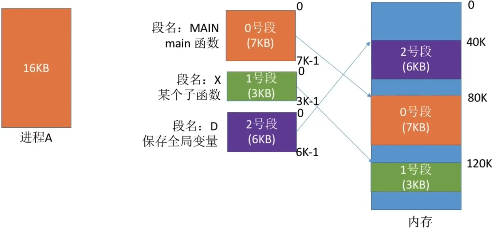

由于是按逻辑地址功能模块划分，用户<span style="color:#03A6A1">编程更方便，程序的可读性更高</span>。（编译程序会将**段名**转换为**段号**）

```assembly
LOAD 1,  [D] | <A>;  // 将分段 D 中的 A 单元内的值读入寄存器 1
STORE 1, [X] | <B>;  // 将寄存器 1 的内容存入 X 分段的 B 单元中
```

分段系统的逻辑地址结构由段号（段名）和段内地址（段内偏移量）所组成。如：

| 31……16 |  15……0   |
| :----: | :------: |
|  段号  | 段内地址 |

段号的位数决定了每个进程**最多**可以分几个段，段内地址位数决定了每个段的**最大**长度是多少。

上述例子中，若系统是按字节寻址的，则段号占 16 位，因此在该系统中，每个进程最多有 $2^{16} = 64 \text{K}$ 个段；段内地址占 16 位，因此每个段的最大长度为 $2^{16} = 64 \text{KB}$。


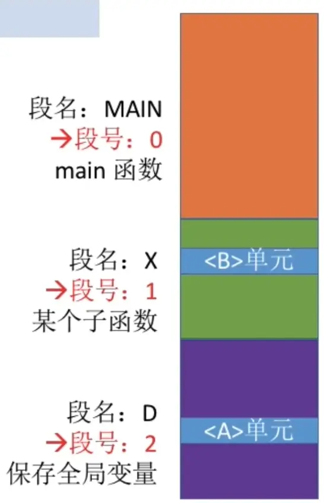

### 段表

程序分多个段，各段离散地装入内存，为了保证程序能正常运行，就必须能从物理内存中找到各个逻辑段的存放位置。为此，需为每个进程建立一张段映射表，简称<span style="color:#FFC107">**段表**</span>。

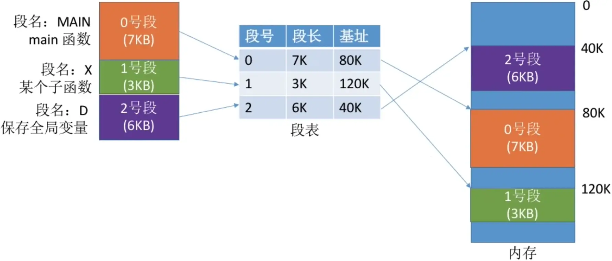

1. 每个段对应一个段表项，其中记录了该段在内存中的<span style="color:#06923E">起始位置</span>（又称<span style="color:#06923E">**基址**</span>）和<span style="color:#06923E">段的长度</span>（与分页存储不同，段并不<u>*等长*</u>，且存储的是**基址**，而不是**内存块号**）
2. <span style="color:#06923E">各个**段表项的长度是相同**的</span>。例如，某系统按字节寻址，采用分段存储管理，逻辑地址结构为 `(段号 16 位, 段内地址 16 位)`，因此用 16 位即可表示最大段长。物理内存大小为 4GB（可用 32 位表示整个物理内存地址空间）。因此，可以让每个段表项占 $16+32=48$ 位，即 6B。由于段表项长度相同，因此<span style="color:#E67514">段号可以是隐含的，不占存储空间</span>；若段表存放的起始地址为 M，则 K 号段对应的段表项存放的地址为 `M + K * 6`

### 地址变换

```assembly
LOAD 1, [D] | <A>;  // 将分段 D 中 A 单元内的值读入寄存器 1
```

经过编译程序编译后，形成等价的机器指令。

“取出**段号为 2，段内地址为 1024**的内存单元中的内容，放到寄存器 1 中。”


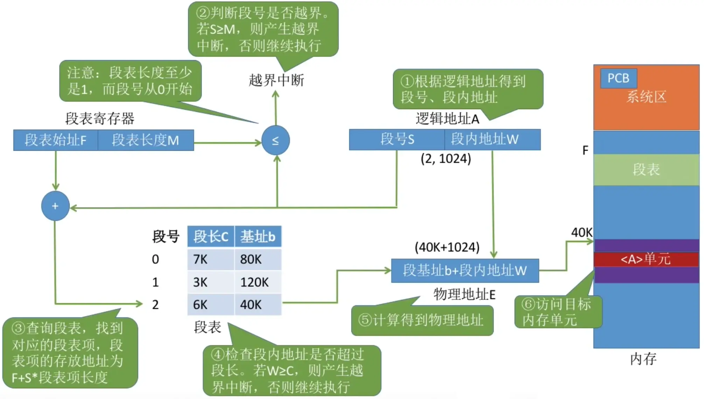

### 分段、分页管理的对比

<span style="color:#CA7842">页</span>是<span style="color:#CA7842">信息的物理单位</span>。分页的主要目的是为了实现离散分配，提高内存利用率。分页仅仅是<u>系统管理上</u>的需要，完全是系统行为，<span style="color:#CA7842">对用户是**不可见的**</span>。

<span style="color:#CA7842">段</span>是<span style="color:#CA7842">信息的逻辑单位</span>。分段的主要目的是更好地满足用户需求。一个段通常包含着一组属于一个逻辑模块的信息。<span style="color:#CA7842">分段对用户是**可见的**</span>，用户编程时需要显式地给出段名。

页的大小固定且由系统决定。段的长度<u>*却不固定*</u>，决定于用户编写的程序。

<span style="color:#CA7842">分页</span>的用户进程<span style="color:#CA7842">地址空间是**一维的**</span>，程序员只需给出一个记忆符即可表示一个地址。（因为在用户眼里就是一整块，分页是操作系统做的，所以以类似数组的方式访问）

<span style="color:#CA7842">分段</span>的用户进程<span style="color:#CA7842">地址空间是**二维的**</span>，程序员在标识一个地址时，既要给出段名，也要给出段内地址。（用户知道这个是分段的，因此自己也要指定段名和段内地址）

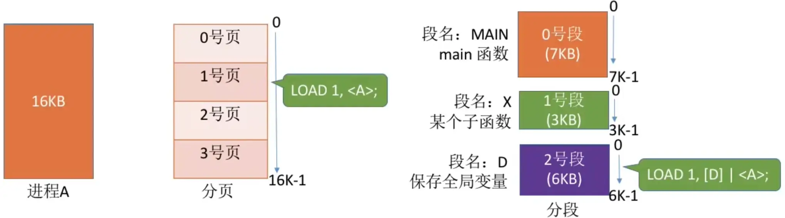

<span style="color:#FE5D26">分段</span>比分页<span style="color:#FE5D26">更容易实现信息的**共享与保护**</span>。

不能被修改的代码称为<span style="color:#A4B465">**纯代码**</span>或<span style="color:#A4B465">**可重入代码**</span>（不属于临界资源），这样的代码是可以共享的。（比如，有一个代码段只是简单的输出，`"Hello World!"`）

可修改的代码是不能共享的。（比如，有个代码段中有<u>***很多变量***</u>，各进程并发地同时访问可能造成<u>*数据不一致*</u>）


为什么页面难以实现？


访问一个逻辑地址需要几次访存？

- <span style="color:#328E6E">**分页（单级页表）**</span>：第一次访存——查内存中的页表，第二次访存——访问目标内存单元；总共<span style="color:#328E6E">两次访存</span>
- <span style="color:#328E6E">**分段**</span>：第一次访存——查内存中的段表，第二次访存——访问目标内存单元；总共<span style="color:#328E6E">两次访存</span>

与分页系统类似，分段系统中也<span style="color:#328E6E">可以引入***快表***机构</span>，将近期访问过的<u>*段表项*</u>放到快表中，这样<span style="color:#328E6E">可以少一次访问</span>，加快地址变换速度。

---


## 段页式管理方式

**知识总览**：


### 分页、分段的优缺点分析

|          | 优点                                                         | 缺点                                                         |
| -------- | ------------------------------------------------------------ | ------------------------------------------------------------ |
| 分页管理 | 内存空间利用率高，<span style="color:#03A791">不会产生**外部碎片**</span>，只会有少量的页内碎片 | 不方便按照逻辑模块实现信息的共享与保护                       |
| 分段管理 | 很方便按照逻辑模块实现信息的共享和保护                       | 如果段长过大，为其分配很大的连续空间会很不方便；此外，段式管理<span style="color:#03A791">会产生**外部碎片**</span> |

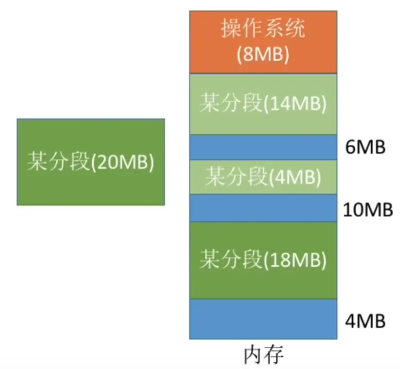

虽然上述的采用分段管理方式而产生的外部碎片也可用**紧凑**来解决，只是需要付出较大的<u>*时间代价*</u>。

### 分段 + 分页 = 段页式管理

紧凑会按照逻辑模块分段，再将各段分页（如每个页面 4KB），之后将内存空间分为大小相同的内存块（页框/页帧/物理块），进程将各页面分别装入各内存块中

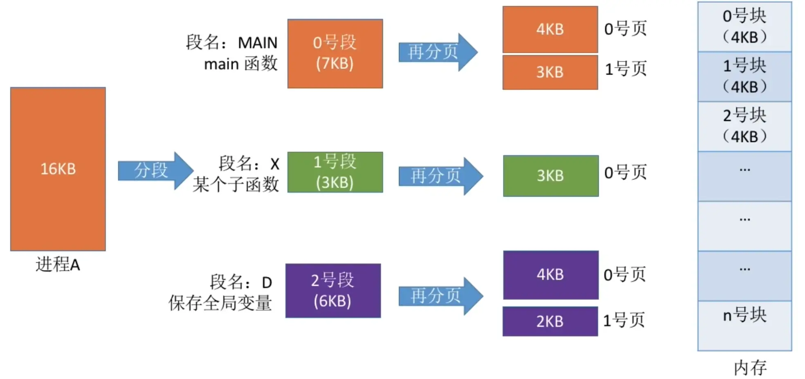

### 段页式管理的逻辑地址结构

段页式管理的逻辑地址结构由段号、页号、页内地址（页内偏移量）组成。如：

| 31……16 | 15……12 |   11……0    |
| :----: | :----: | :--------: |
|  段号  |  页号  | 页内偏移量 |

<span style="color:#DC2525">**段号的位数**决定了每个进程**最多可以分几个段**，**页号位数**决定了每个段**最大有多少页**，**页内偏移量**决定了**页面大小、内存块大小是多少**。</span>

在上述例子中，若系统是按字节寻址的，则段号占 16 位，因此在该系统中，每个进程最多有 $2^{16} = 64 \text{K}$ 个段；页号占 4 位，因此每个段最多有 $2^{4} = 16$ 页；页内偏移量占 12 位，因此每个页面（内存块）大小为 $2^{12} = 4096 = 4 \text{KB}$。

> **注意**：
>
> **分段**对用户是可见的，程序员编程时需要显式地给出段号、段内地址。而将各段**分页**对用户是不可见的。系统会根据段内地址<u>*自动划分页号和页内偏移量*</u>。
>
> 因此<span style="color:#C5172E">段页式</span>管理的<span style="color:#C5172E">地址结构是二维的</span>。

### 段表、页表

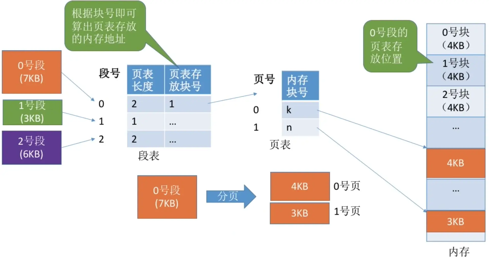

每个段对应一个段表项，每个段表项由段号、<span style="color:#640D5F">页表长度、页表存放块号（页表起始地址）</span>组成。每个<span style="color:#640D5F">段表项长度相等，段号是隐含的</span>。

每个页面对应一个页表项，每个页表项由页号、页面存放的内存块号组成。每个页表项长度相等，页号是隐含的。

> **注意**：
>
> 由上述可知，一个进程对应一个段表，且一个进程可能对应多个页表。


---


## 虚拟内存的基本概念

**知识总览**：


在传统存储管理方式的基础上引入了交换技术、覆盖技术，使得内存利用率有所提升，并且能从逻辑上扩充内存容量。


### 传统存储管理方式的特征、缺点


很多暂时用不到的数据也会长期占用内存，导致内存利用率不高。

<span style="color:#EB5B00;font-weight:bold">一次性</span>：作业必须一次性*<u>全部</u>*装入内存后才能开始运行。

这回会导致两个问题：

1. 作业很大时，不能全部装入内存，导致<span style="color:#AD49E1">大作业无法运行</span>
2. 当大量作业要求运行时，由于内存无法容纳所有作业，因此只有少量作业能运行，导致<span style="color:#F2613F">多道程序并发性下降</span>

<span style="color:#EB5B00;font-weight:bold">驻留性</span>：一旦作业被装入内存，就<span style="color:#008170">会一直驻留在内存</span>中，直至作业*<u>运行结束</u>*。

事实上，在一个时间段内，只需要访问作业的一小部分数据即可正常运行，这就导致了内存中会驻留大量的、暂时用不到的数据，浪费了宝贵的内存资源。

---

可以用虚拟存储技术解决问题。

### 局部性原理

<span style="color:#EA1179">**时间局部性**</span>：如果执行了程序中的某条指令，那么不久后这条指令很有可能再次执行；如果某个数据被访问过，不久之后该数据很可能再次被访问。（因为程序中存在大量的循环）

<span style="color:#EA1179">**空间局部性**</span>：一旦程序访问了某个存储单元，在不久之后，其附近的存储单元也很有可能被访问。（因为很多数据在内存中都是连续存放的，并且程序的指令也是顺序地在内存中存放的）

```c
int i = 0;
int a[100];
while (i < 100) {
    a[i] = i;
    i++;
}
```

### 虚拟内存的定义和特征

基于局部性原理，在程序装入时，可以将程序中<span style="color:#116D6E">很快会用到的**部分装入内存**，暂时用不到的**部分留在外存**</span>，就可以让程序开始执行。

在程序执行过程中，当所访问的<span style="color:#116D6E">**信息不在内存**时</span>，由<span style="color:#116D6E">操作系统负责将所需信息**从外存调入内存**</span>，然后继续执行程序。

若**内存空间不够**，由<span style="color:#116D6E">操作系统负责</span>将内存中<span style="color:#116D6E">暂时用不到的信息换出到外存</span>。

在操作系统的管理下，在用户看来似乎有一个比实际内存大得多的内存，这就是<span style="color:#116D6E">虚拟内存</span>。（操作系统虚拟性的一个体现，实际的物理内存大小没有变，只是在逻辑上进行了补充）


虚拟内存有以下三个主要特征：

- **<span style="color:#CA7842">多次性</span>**：无需在作业运行时一次性全部装入内存，而是允许被分成多次调入内存
- **<span style="color:#CA7842">对换性</span>**：在作业运行时无需一直常驻内存，而是允许在作业运行过程中，将作业<u>*换入、换出*</u>
- **<span style="color:#CA7842">虚拟性</span>**：从逻辑上扩充了内存的容量，使用户看到的内存容量，远大于实际的容量

### 如何实现虚拟内存技术

虚拟内存技术，允许一个作业分多次调入内存。如果采用连续分配方式，会不方便实现。因此虚拟内存的实现需要建立在<span style="color:#E55050">离散分配</span>的内存管理方式基础上。


**主要区别**：

在程序执行过程中，当所<span style="color:#F38C79">访问的信息不在内存时，由操作系统负责将所需信息从外存调入内存</span>，然后继续执行程序。若内存空间不够，由操作系统负贵<span style="color:#F38C79">将内存中暂时用不到的信息换出到外存</span>。

操作系统需要提供两个功能：

1. **请求调页**（或请求调段）的功能
2. 操作系统要提供**页面置换**（或段置换）的功能

---


## 请求分页管理方式

**知识总览**：

<span style="color:#E07A5F">请求分页</span>存储管理与<span style="color:#E07A5F">基本分页</span>存储管理的主要区别：

在程序执行过程中，当所<span style="color:#3B6790">访问的信息不在内存时，由操作系统负责将所需信息**从外存调入内存**</span>，然后继续执行程序。

若内存空间不够，由操作系统负责<span style="color:#DDA853">将内存中**暂时用不到的信息换出到外存**</span>。


### 页表机制

与基本分页管理相比，请求分页管理中，为了实现<span style="color:#295F98">**请求调页**</span>，操作系统需要知道每个页面**<span style="color:#295F98">是否已经调入内存</span>**：如果<span style="color:#295F98">**还没调入**</span>，那么也需要知道该页面在外存中**<span style="color:#295F98">存放的位置</span>**。

当内存空间不够时，要实现**<span style="color:#982B1C">页面置换</span>**，操作系统需要通过某些指标来决定到底换出哪个页面；有的页面**<span style="color:#982B1C">没有被修改</span>**过，就不用再<span style="color:#982B1C;font-weight:bold">浪费时间写回外存</span>。有的页面**<span style="color:#982B1C">修改过</span>**，就需要将**<span style="color:#982B1C">外存中的旧数据覆盖</span>**，因此，操作系统也需要记录各个页面是否被修改的信息。


### 缺页中断机制

假设此时要访问的逻辑地址为 `(0, 1024)`（`(页号, 页内偏移量)`）。

在请求分页系统中，每当要访问的<span style="color:#E82561">页面不在内存</span>时，便产生一个<span style="color:#E82561">缺页中断</span>，然后由操作系统的<span style="color:#E82561">**缺页中断处理程序处理中断**</span>。

此时<span style="color:#E82561">缺页的进程阻塞</span>，放入阻塞队列，调页<span style="color:#E82561">完成后再将其唤醒</span>，放回就绪队列。


如果内存中<span style="color:#E82561">有空闲块</span>，则为进程<span style="color:#E82561">分配一个空闲块</span>，将所缺页面装入该块，并修改页表中相应的页表项。

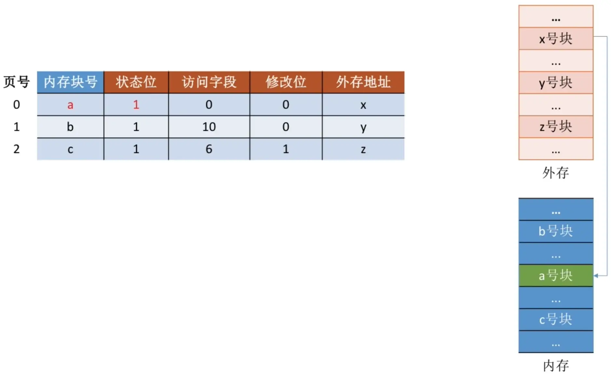

如果内存中<span style="color:#E82561">没有空闲块</span>，则<span style="color:#E82561">由页面置换算法选择一个页面淘汰</span>，若该页面在内存期间<span style="color:#E82561">被修改过</span>，则要将其<span style="color:#E82561">写回外存</span>。未修改过的页面不用写回外存。

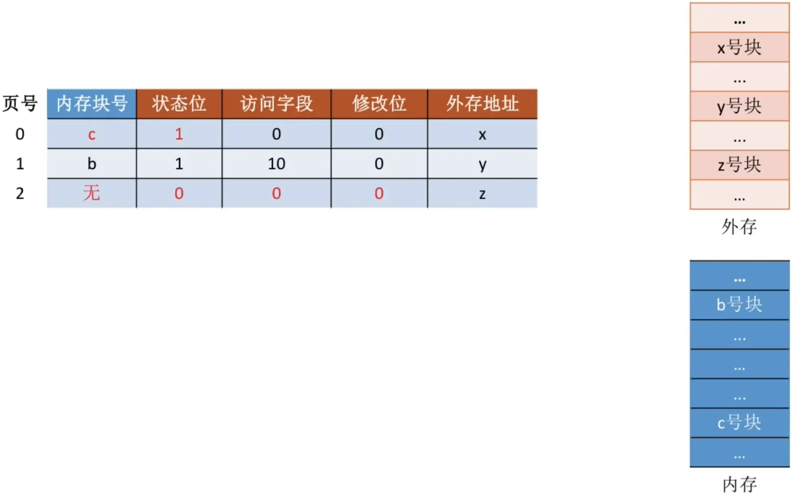

<span style="color:#EB8317">**缺页中断**</span>是因为当前执行的指令想要访问的目标页面未调入内存而产生的，因此<span style="color:#EB8317">**属于内中断**</span>。


故障是由错误条件引起的，可能被故障处理程序修复，如<span style="color:#F38C79">缺页中断</span>。

<span style="color:#E07A5F">一条指令</span>在执行期间，<span style="color:#E07A5F">可能产生**多次缺页中断**</span>。（例如，`copy A to B`，即将逻辑地址 A 中的数据复制到逻辑地址 B，而 A、B 属于不同的页面，则有可能产生两次中断）

**新增步骤**：

1. 请求调页（查到页表项时进行判断）
2. 页面置换（需要调入页面，但没有空闲内存块时进行）
3. 需要修改请求页表中新增的表项

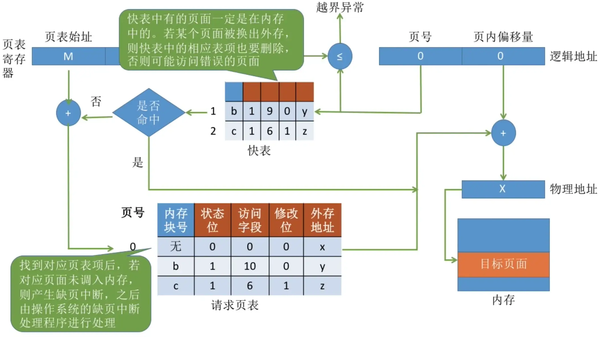

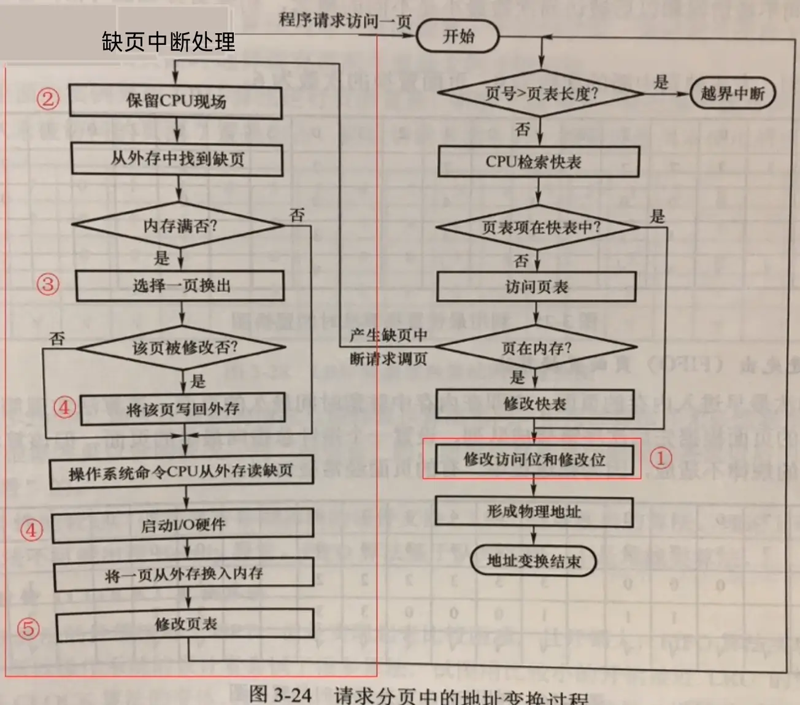

> **注意**：
>
> 1. 只有**<span style="color:#7D8ABC">写指令</span>**才需要修改**<span style="color:#7D8ABC">修改位</span>**；并且，一般来说<span style="color:#1679AB">只需**修改快表中的数据**</span>，只有要将<span style="color:#1679AB">快表项删除时才需要写**回内存中的慢表**</span>；这样可以**减少访存次数**
> 2. 和普通的中断处理一样，缺页中断处理依然需要保留 CPU 现场
> 3. 需要用某种<span style="color:#C738BD">**页面置换算法**</span>来决定一个换出页面
> 4. 换入/换出页面都需要启动慢速的 I/O 操作，可见，如果**换入换出太频繁，会有很大的开销**
> 5. 页面调入内存后，需要修改慢表，同时也需要<span style="color:#C738BD">将表项复制到快表中</span>

在具有快表机构的请求分页系统中，访问一个逻辑地址时，若发生缺页，则地址变换步骤是：

1. 查快表（未命中）
2. 查慢表（发现未调入内存）
3. 调页（**调入的页面对应的表项会直接加入快表**）
4. 查快表（命中）
5. 访问目标内存单元

---


## 页面置换算法

**知识总览**：


页面的换入、换出需要磁盘 I/O，会有较大的开销，因此好的页面置换算法应该<span style="color:#694F8E">**追求更少的缺页率**</span>。

### 最佳置换算法（OPT）

**<span style="color:#698474">最佳置换算法（OPT, Optimal）</span>**：每次选择<span style="color:#1679AB">淘汰的页面</span>将是<span style="color:#1679AB">以后**永不使用**</span>，或者<span style="color:#1679AB">在**最长时间内不再被访问**的页面</span>，这样可以保证最低的缺页率。  

例如，假设系统为某进程分配了三个内存块，并考虑到有一下页面号引用串（会依次访问这些页面）：

```bash
7, 0, 1, 2, 0, 3, 0, 4, 2, 3, 0, 3, 2, 1, 2, 0, 7, 0, 1
```

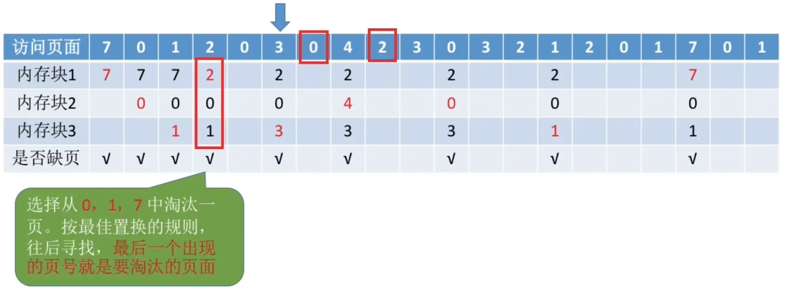

整个过程<span style="color:#C738BD">缺页中断</span>发生了 <span style="color:#C738BD">9 次</span>，<span style="color:#C738BD">页面置换</span>发生了 <span style="color:#C738BD">6 次</span>。

> **注意**：
>
> 缺页时未必发生页面置换；若还有可用的空闲内存块，就不用进行页面置换。

$$
缺页率 = \frac{9}{20} = 45 \%
$$

最佳置换算法可以保证最低的缺页率，但实际上，只有<span style="color:#891652">在**进程执行**的过程中才能知道接下来会**访问到的是哪个页面**</span>。操作系统无法提前预判页面访问序列。因此，<span style="color:#891652">最佳置换算法是**无法实现的**</span>。

### 先进先出置换算法（FIFO）

<span style="color:#76ABAE;font-weight:bold">先进先出置换算法（FIFO）</span>：每次选择<span style="color:#76ABAE">淘汰的页面</span>是<span style="color:#76ABAE">**最早进入内存**的页面</span>。

**实现方法**：把调入内存的页面根据调入的先后顺序排成一个队列，需要换出页面时选择队头页面即可。队列的最大长度取决于系统为进程分配了多少个内存块。

例如，假设系统为某进程分配了<span style="color:#FF71CD">**三个内存块**</span>，并考虑到有以下页面号引用串：

```bash
3, 2, 1, 0, 3, 2, 4, 3, 2, 1, 0, 4
```

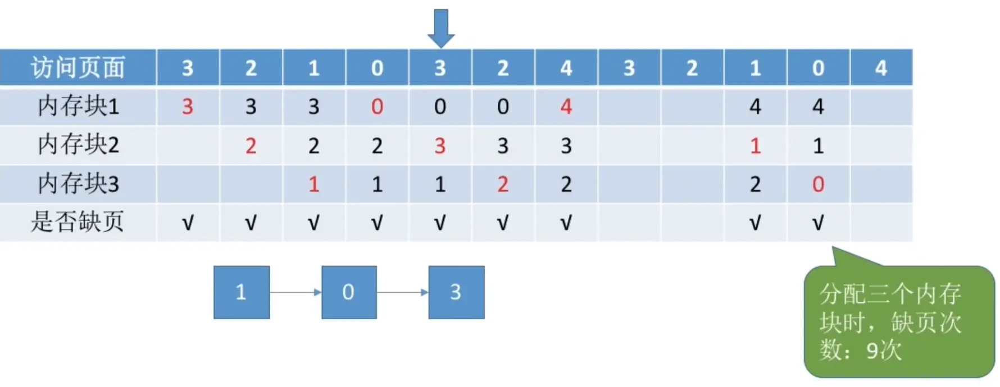

若分配了<span style="color:#C70039">四个</span>内存块：


<span style="color:#86A7FC">**Belady 异常**</span>：当为进程分配的物理块数增大时，缺页次数不减反增的异常现象。

<span style="color:#B80000">只有 FIFO 算法会产生 Belady 异常。</span>另外，FIFO 算法虽然<span style="color:#B80000">实现简单</span>，但是该算法与进程实际运行时的规律不适应，因为先进入的页面也有可能最经常被访问。因此，<span style="color:#B80000">算法性能差</span>。

### 最近最久未使用置换算法（LRU）

<span style="color:#A25772;font-weight:bold">最近最久未使用置换算法（LRU, Least Recently Used）</span>：每次<span style="color:#A25772">淘汰的页面</span>是<span style="color:#A25772">最近最久未使用的页面</span>。

<span style="color:#F99417">**实现方法**</span>：赋予每个页面对应的页表项中，用<span style="color:#427D9D">**访问字段记录该页面自上次被访问以来所经历的<u>时间 t</u>**</span>，当需要淘汰一个页面时，选择现有页面中 t 值最大的，即最近最久未使用的页面。


例如，假设系统为某进程分配了<span style="color:#FF7D29">四个</span>内存块，并考虑到有以下页面号引用串：

```bash
1, 8, 1, 7, 8, 2, 7, 1, 8, 3, 8, 2, 1, 3, 1, 7, 1, 3, 7
```

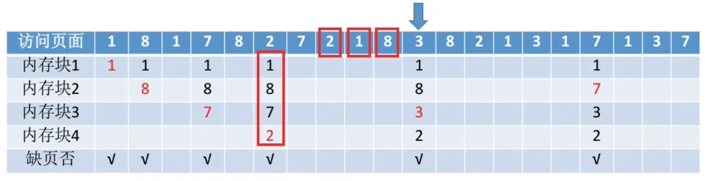

若需要淘汰页面，可以逆向检查此时在内存中的几个页面号。在<span style="color:#4300FF">逆向扫描过程中最后个出现的页号就是要淘汰的页面</span>。

该算法的实现需要专门的硬件支持，虽然算法<span style="color:#725CAD">**性能好**</span>，但是<span style="color:#725CAD; font-weight:bold">实现困难、开销大</span>。

### 时钟置换算法（CLOCK）

最佳置换算法性能最好，但无法实现；先进先出置换算法实现简单，但算法性能差；最近最久未使用置换算法性能好，是最接近 OPT 算法性能的，但是实现起来需要专门的硬件支持，算法开销大。

<span style="color:#CA7842">**时钟置换算法**</span>是一种性能和开销较均衡的算法，又称 **<span style="color:#CA7842">CLOCK 算法</span>**，或**<span style="color:#CA7842">最近未用算法（NRU, Not Recently Used）</span>**。

<span style="color:#CD5656;font-weight:bold">简单的 CLOCK 算法实现方法</span>：为每个页面设置一个<span style="color:#4E71FF">访问位</span>，再将内存中的页面都通过链接指针<span style="color:#4E71FF">链接成个**循环队列**</span>。当某页被访问时，其访问位置为 1。当需要淘汰一个页面时，只需检查页的访问位。如果是 0，就选择该页换出；如果是 1，则将它置为 0，暂不换出，继续检查下一个页面，若第一轮扫描中所有页面都是 1，则将这些页面的访问位依次置为 0 后，再进行第二轮扫描。（第二轮扫描中一定会有访问位为 0 的页面，因此<span style="color:#4E71FF">简单的 CLOCK 算法</span>选择一个淘汰页面<span style="color:#4E71FF">最多会经过**两轮扫描**</span>）


例如，假设系统为某进程分配了<span style="color:#F79B72">**五个内存块**</span>，并考虑到有以下页面号引用串：

```bash
1, 3, 4, 2, 5, 6, 3, 4, 7
```

初始访问，将 5 个内存块全部占用：

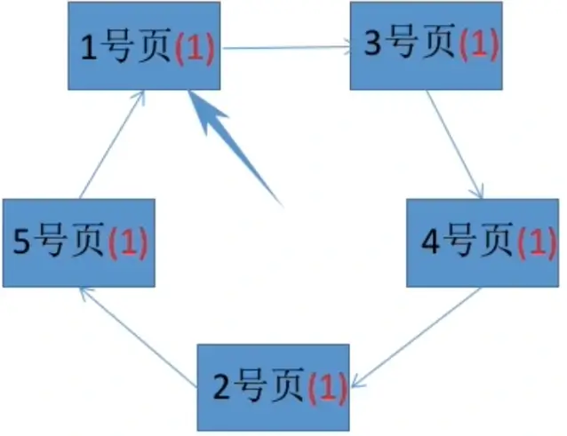

之后要进来 6 号页，在第一轮扫描中发现所有的页面为 1，因此均置为 0；在第二轮扫描中，将 1 号页换为 6 号页，将其访问位置为 1，扫描指针指向 3 号位。

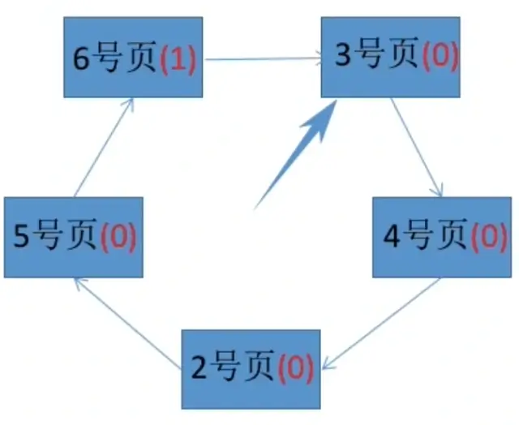

之后访问了 3 号页和 4 号页，其访问位被置为 1：

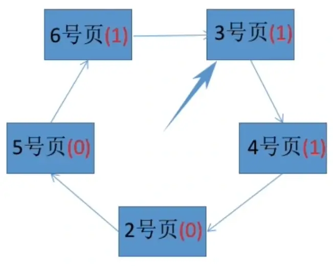

为了插入 7 号页，扫描指针从当前位置依次扫描，并将 1 置为 0；2 号页符合，将 2 号页换为 7 号页，并将其访问位置为 1，指针再指向下一个页面的位置：

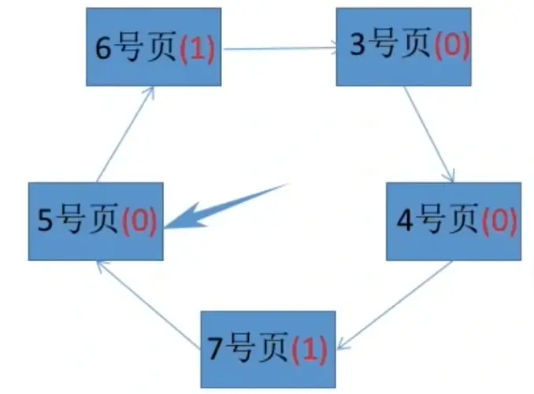

### 改进型的时钟置换算法

<span style="color:#FE7743">简单的**时钟置换算法**</span>仅考虑到一个页面最近**是否被访问过**。事实上，如果被淘汰的页面没有被修改过，就不需要执行 I/O 操作写回外存。<span style="color:#FE7743">只有被淘汰的页面被修改过时，才需要写回外存。</span>

因此，除了考虑一个页面最近有没有被访问过之外，操作系统还应考虑页面有没有被修改过。<span style="color:#FF0B55">在其他条件都相同时，应优先淘汰**没有修改过的页面，避免 I/O 操作**。</span>这就是改进型的时钟置换算法的思想。

<span style="color:#3A59D1">修改位 = 0</span>，表示页面没有被修改过；<span style="color:#3A59D1">修改位 = 1</span>，表示页面被修改过。

为方便讨论，用 `(访问位, 修改位)` 的形式表示各页面状态。如 `(1, 1)` 表示一个页面近期被访问过，且被修改过。

<span style="color:#102E50">**算法规则**</span>：将所有可能被置换的页面排成一个循环队列。

- <span style="color:#1DCD9F;font-weight:bold">第一轮</span>：从当前位置开始扫描到第一个 `(0, 0)` 的帧用于替换；本轮扫描不修改任何标志位

- **<span style="color:#1DCD9F">第二轮</span>**：若第一轮扫描失败，则重新扫描，查找第一个 `(0, 1)` 的帧用于替换；本轮将所有扫描过的帧访问位设为 0

- **<span style="color:#1DCD9F">第三轮</span>**：若第二轮扫描失败，则重新扫描，查找第一个 `(0, 0)` 的帧用于替换；本轮扫描不修改任何标志位

- **<span style="color:#1DCD9F">第四轮</span>**：若第三轮扫描失败，则重新扫描，查找第一个 `(0, 1)` 的帧用于替换

由于第二轮已将所有帧的访问位设为 0，因此经过第三轮、第四轮扫描一定会有一个帧被选中，因此<span style="color:#B7B1F2; font-weight:bold">改进型 CLOCK 置换算法</span>选择一个淘汰页面最多会进行<span style="color:#B7B1F2; font-weight:bold">四轮扫描</span>。

- **一轮扫描**的情况下，有：

  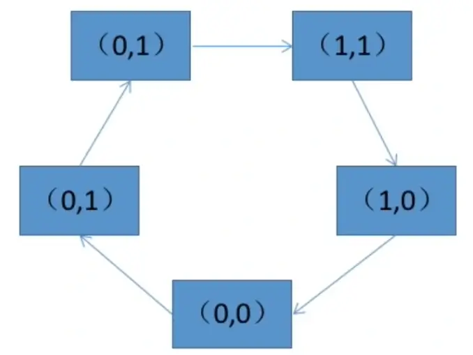

  在第一轮中便找到了符合的页面：

  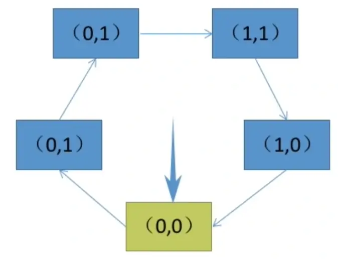

- **二轮扫描**的情况下，有：

  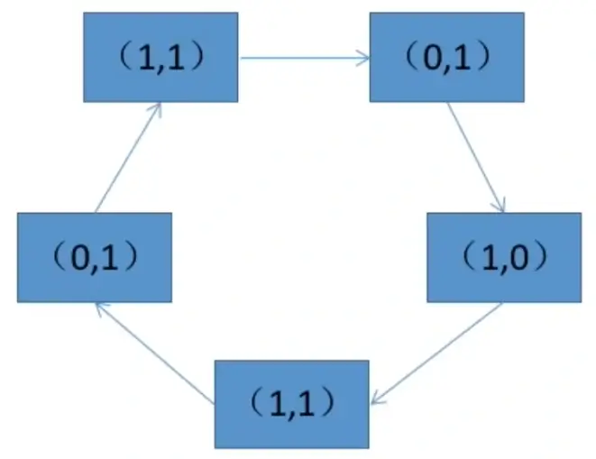

  第一轮的扫描没有找到符合 `(0, 0)` 的，也没有找到标志位；在第二轮扫描中，访问位会置为 0，最终找到 `(0, 1)` 的页面（一开始就是 `(0, 1)`，而不是访问后变成 `(0, 1)`）：

  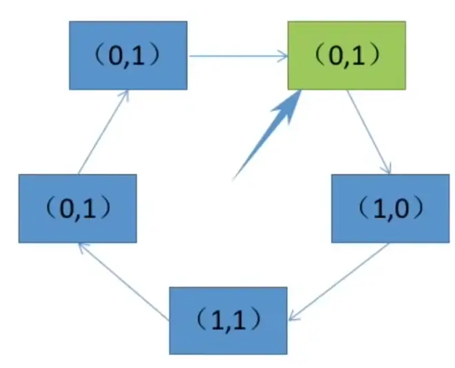

- **三轮扫描**的情况下，有：

  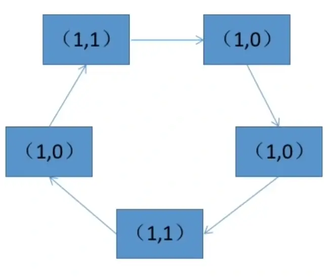

  在第一轮扫描中，没有发现 `(0, 0)` 的页面；在第二轮扫描中，将访问位置为 0，但是依旧没有找到 `(0, 1)` 的帧：

  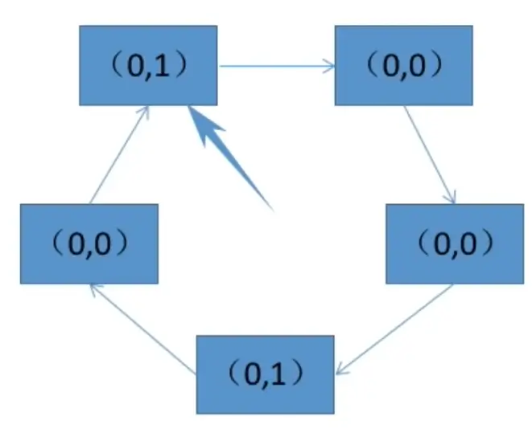

  最终在第三轮中找到 `(0, 0)` 这个界面：

  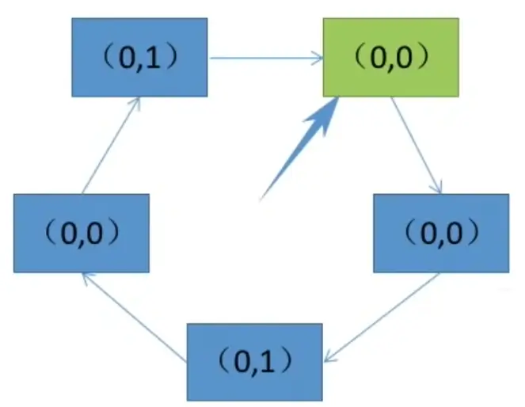

- **四轮扫描**的情况下，有：

  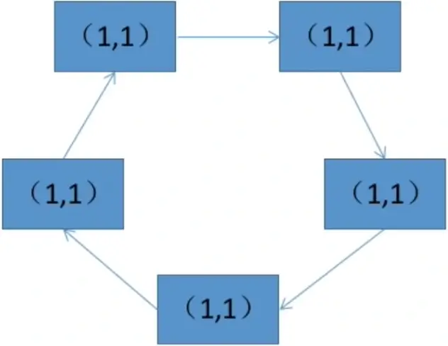

  在前两轮扫描后：

  

  第三轮扫描过程中，没有找到 `(0, 0)` 标志位的；最后在第四轮中选取了 `(0, 1)` 标志位的页面：

  

---

- **第一优先级**：最近<span style="color:#693382">**没访问**</span>，且<span style="color:#693382; font-weight:bold">没修改</span>的页面
- **第二优先级**：最近<span style="color:#693382; font-weight:bold">没访问</span>，但<span style="color:#693382; font-weight:bold">修改过</span>的页面
- **第三优先级**：最近<span style="color:#693382; font-weight:bold">访问过</span>，但<span style="color:#693382; font-weight:bold">没修改</span>的页面
- **第四优先级**：最近<span style="color:#693382">**访问过**</span>，且<span style="color:#693382; font-weight:bold">修改过</span>的页面

---

| 算法名称                   | 算法规则                                                     | 优缺点                                         |
| -------------------------- | ------------------------------------------------------------ | ---------------------------------------------- |
| OPT                        | 优先淘汰最长时间内不会被访问的页面                           | 缺页率最小，性能最好；但无法实现               |
| FIFO                       | 优先淘汰最先进入内存的页面                                   | 实现简单；但性能很差，可能出现 Belady 异常     |
| LRU                        | 优先淘汰最近最久没访问的页面                                 | 性能很好；但需要硬件支持，算法开销大           |
| CLOCK（NRU）               | 循环扫描各页面第一轮淘汰访问位为 0 的，并将扫描过的页面访问位改为 1；若第一轮没选中，则进行第二轮扫描 | 实现简单，算法开销小；但未考虑页面是否被修改过 |
| 改进型 CLOCK（改进型 NRU） | 若用 `(访问位, 修改位)` 的形式表述，则第一轮：淘汰 `(0, 0)` ；第二轮：淘汰 `(0, 1)`，并将扫描过的页面访问位都置为 0；第三轮：淘汰 `(0, 0)`；第四轮：淘汰 `(0, 1)` | 算法开销较小，性能也不错                       |

## 页面分配策略

**知识总览**：



### 页面分配、置换策略

<span style="color:#A53860; font-weight:bold">驻留集</span>：指<span style="color:#FA812F">请求分页存储管理</span>中给进程分配的<span style="color:#FA812F">物理块（页框）</span>的集合。（针对的是单个进程）

在采用了虚拟技术的系统中，驻留集大小一般小于进程的总大小。

考虑一个极端情况，若某进程共有 100 个页面，则该进程的驻留集大小为 100 时，进程可以全部放入内存，运行期间不可能再发生缺页；若驻留集大小为 1，则进程运行期间必定会极频紧地缺页。

若驻留集太小，会导致缺页频繁，系统要花大量的时间来处理缺页，实际用于进程推进的时间很少；驻留集太大，又会导致多道程序并发度下降，资源利用率降低。所以应该选择一个合适的驻留集大小。

- **<span style="color:#C95792">固定分配</span>**：操作系统为每个进程分配一组**固定数目**的物理块，在进程运行期间不再改变；即，<span style="color:#077A7D">驻留集大小不变</span>
- **<span style="color:#C95792">可变分配</span>**：先为每个进程分配**一定数目**的物理块，在进程运行期间，可根据情况做适当的增加或减少；即，<span style="color:#077A7D">驻留集大小可变</span>

- <span style="color:#FF6363">**局部置换**</span>：发生缺页时只能选**进程自己的物理块**进行置换
- <span style="color:#FF6363; font-weight:bold">全局置换</span>：可以将操作系统**保留的空闲物理块**分配给缺页进程，也可以将**别的进程持有的物理块置换**到外存，再分配给缺页进程（自己已有的内存块数量保持不变）

|          | 局部置换 | 全局置换 |
| :------: | :------: | :------: |
| 固定分配 |    ✔     |    ➖     |
| 可变分配 |    ✔     |    ✔     |

> **注意**：
>
> <span style="color:#024CAA">**全局置换**</span>意味着一个进程拥有的物理块数量必然会改变，因此<span style="color:#024CAA">**不可能是固定分配**</span>。

<span style="color:#1DCD9F">**固定分配局部置换**</span>：系统为每个进程分配一定数量的物理块，在整个运行期间都不改变。若进程在运行中发生缺页，则只能从**该进程在内存中的页面中选出一页换出**，然后再调入需要的页面。这种策略的缺点是<span style="color:#BE3D2A">**很难在刚开始就确定应为每个进程分配多少个物理块才算合理**</span>。（采用这种策略的系统可以根据进程大小、优先级、或是根据程序员给出的参数来确定为一个进程分配的内存块数）

<span style="color:#1DCD9F; font-weight:bold">可变分配全局置换</span>：刚开始会为每个进程分配一定数量的物理块。操作系统会保持一个**空闲物理块队列**。当某进程发生缺页时，从空闲物理块中取出一块分配给该进程；若已无空闲物理块，则可选择个<span style="color:#FF9B17">未锁定</span>的页面换出外存（*系统会锁定一些页面，这些页面中的内容不能置换出外存，例如重要的内核数据可以设为**锁定***），再将该物理块分配给缺页的进程。采用这种策略时，<span style="color:#FF9B17">只要某进程**发生缺页**，都将获得**新的物理块**</span>，仅当空闲物理块用完时，系统才选择一个未锁定的页面调出。被选择调出的页可能是系统中任何一个进程中的页，因此这个<span style="color:#FF9B17">被选中的进程拥有的**物理块会减少，缺页率会增加**</span>。

<span style="color:#1DCD9F; font-weight:bold">可变分配局局置换</span>：刚开始会为每个进程分配一定数量的物理块。当某进程发生缺页时，只允许从该进程<span style="color:#5F8B4C">**自己的物理块**中选出一个进行换出外存</span>。如果进程在运行中**频繁地缺页**，系统会为该进程<span style="color:#AB886D">**多分配几个物理块**</span>，直至该进程缺页率<u>降至适当程度</u>；反之，如果进程在运行中**缺页率特别低**，则可<span style="color:#AB886D; font-weight: bold">适当减少分配</span>给该进程的物理块。

> **注意**：
>
> - <span style="color:#FF9A9A; font-weight:bold">可变分配*<u>全局</u>*置换</span>：只要缺页就给分配新物理块
> - <span style="color:#FF9A9A; font-weight:bold">可变分配*<u>局部</u>*置换</span>：要根据发生<span style="color:#27548A">缺页的频率</span>来动态地增加或减少进程的物理块

### 何时调入页面

1. <span style="color:#C68EFD;font-weight:bold">预调页策略</span>：根据**局部性原理**，一次调入若干个相邻的页面可能比一次调入一个页面更高效。但如果提前调入的页面中大多数都没被访问过，则又是低效的。因此可以预测不久之后可能访问到的页面，将它们预先调入内存，但目前预测成功率只有 50% 左右。故这种策略<span style="color:#FE4F2D">主要用于进程的**首次调入**</span>（运行前调入），由程序员指出应该先调入哪些。
2. **<span style="color:#C68EFD">请求调页策略</span>**：进程<span style="color:#FF9D23">在运行期间**发现缺页**时才将所缺页面**调入内存**</span>（运行时调入）。由这种策略调入的页面一定会被访问到，但由于每次只能调入一页，而每次调页**都要磁盘 I/O 操作，因此 I/O 开销较大**。

### 从何处调入页面

1. <span style="color:#7886C7">**系统拥有足够的对换区空间**</span>：页面的调入、调出都是在内存与**对换区之间进行**，这样可以保证页面的**调入、调出速度很快**；在进程运行前需将进程相关的数据**从文件区复制到对换区**

   

2. **<span style="color:#497D74">系统缺少足够的对换区空间</span>**：凡是**不会被修改**的数据都直接从**文件区调入**，由于这些页面不会被修改，因此换出时**不必写回磁盘**，下次需要时再从文件区调入即可；对于可能被修改的部分，换出时需写回磁盘对换区，下次需要时再从对换区调入

   

3. <span style="color:#DE3163; font-weight:bold">UNIX 方式</span>：运行之前进程有关的数据**全部**放在**文件区**，故未使用过的页面，都**可从文件区调入**；若被使用过的页面需要换出，则写回对换区，下次需要时从对换区调入

   

### 抖动（颠簸）现象

刚刚换出的页面马上又要换入内存，刚刚换入的页面马上又要换出外存，这种频繁的页面调度行为称为<span style="color:#A35C7A">**抖动**</span>，或<span style="color:#A35C7A; font-weight:bold">颠簸</span>。产生抖动的<span style="color:#A35C7A; font-weight:bold">主要原因</span>是进程频繁访问的页面数目高于可用的物理块数。（<span style="color:#A35C7A; font-weight:bold">分配给进程的物理块不够</span>）

为进程分配的**物理块太少**，会使进程**发生抖动现象**；为进程分配的**物理块太多**，又会**降低系统整体的并发度**，**降低某些资源的利用率**。

为了研究为应该为每个进程分配多少个物理块，Denning 提出了进程**工作集**的概念。

### 工作集

<span style="color:#D84040; font-weight:bold">驻留集</span>：指请求分页存储管理中给进程分配的内存块的。

<span style="color:#D84040; font-weight:bold">集合工作集</span>：指在某段时间间隔里，进程实际访问页面的集合。

操作系统会根据**窗口尺寸**来算出工作集。例如，某进程的页面访问序列如下，<span style="color:#578E7E">**窗口尺寸为 4**</span>，各时刻的工作集为？

```bash
24, 15, 18, 23, 24, 17, 18, 24, 18, 17, 17, 15
```

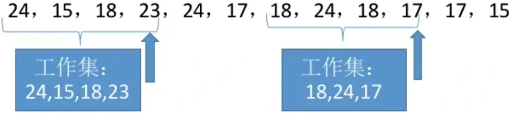

<span style="color:#16C47F;font-weight:bold">工作集大小</span>可能小于窗口尺寸，实际应用中，操作系统可以统计进程的工作集大小，**根据工作集大小给进程分配若干内存块**。例如，窗口尺寸为 5，经过一段时间的监测发现某进程的工作集最大为 3，那么说明该进程有很好的局部性，可以给这个进程分配 3 个以上的内存块即可满足进程的运行需要。

一般来说，<span style="color:#3E7B27">驻留集大小**不能小于**工作集大小，否则进程运行过程中将**频繁缺页**</span>。

> **注意**：
>
> 基于局部性原理可知，进程在一段时间内访问的页面与不久之后会访问的页面是有相关性的。因此，可以根据进程近期访问的页面集合（工作集）来设计一种页面置换算法——<span style="color:#5DB996">**选择一个不在工作集中的页面进行淘汰**</span>。

---


## 内存映射文件

**知识总览**：


### 传统的文件访问方式

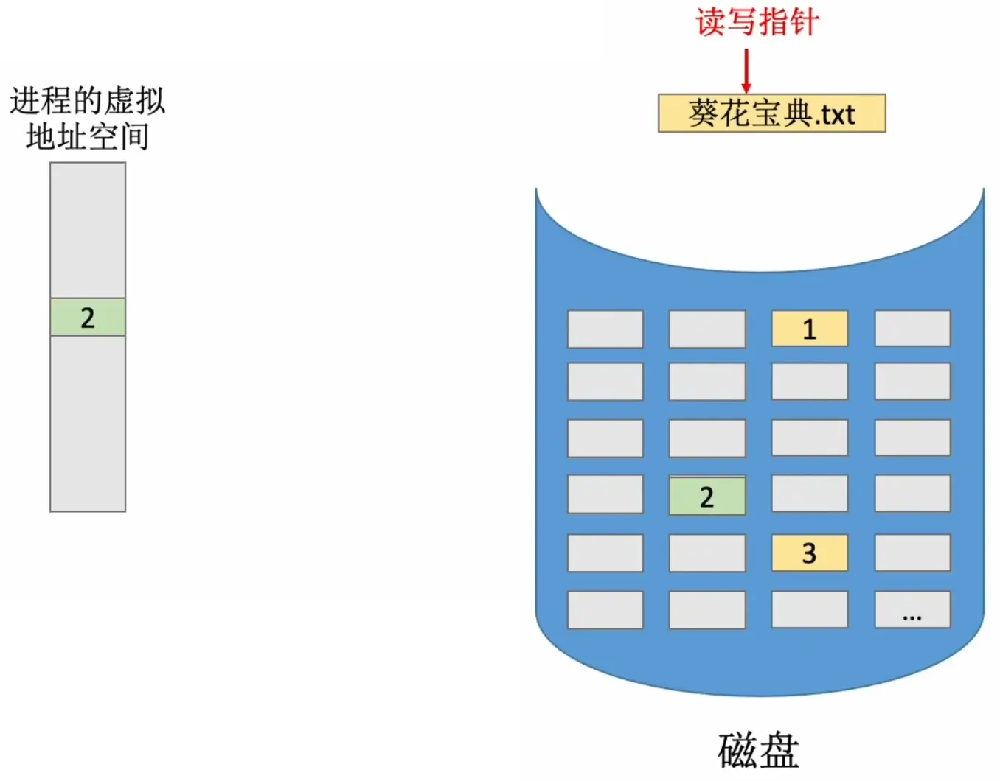

传统的文件访问方式：

1. **`open` 系统调用**——打开文件
2. **`seek` 系统调用**——将读写指针移到某个位置
3. **`read` 系统调用**——从读写指针所指位置读入若干数据（从磁盘读入内存）
4. **`write` 系统调用**——将内存中的指定数据，写回磁盘（根据读写指针确定要写回什么位置）

### 内存映射文件（Memory-Mapped Files）

<span style="color:#8E7DBE; font-weight:bold">内存映射文件</span>：操作系统向上层程序员提供的功能（系统调用）。

- 方便程序员访问文件数据
- 方便多个进程**共享**同一个文件

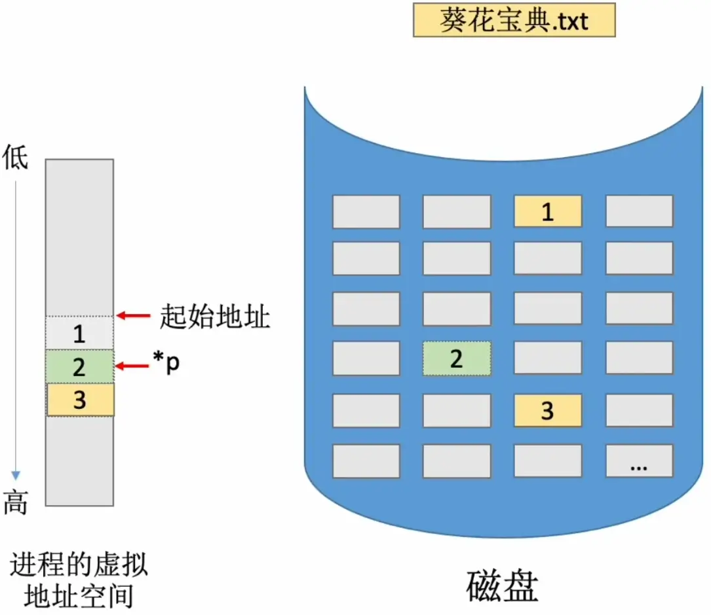

内存映射文件的访问方式：

- **`open` 系统调用**——打开文件
- **`mmap` 系统调用**——将文件映射到进程的**虚拟地址空间**

1. 以<span style="color:#BE3D2A">**访问内存**的方式</span>访问文件数据
2. 文件数据的读入、写出由操作系统<span style="color:#BE3D2A">**自动**完成</span>
3. 进程关闭文件时，操作系统<span style="color:#BE3D2A">自动将文件**被修改的数据**写回磁盘</span>

多个进程可以映射同一个文件，实现<span style="color:#EA7300">共享</span>。

在物理内存中，一个文件对应同一份数据，当一个进程修改文件数据时，另一个进程可以立马**看到**。

---


