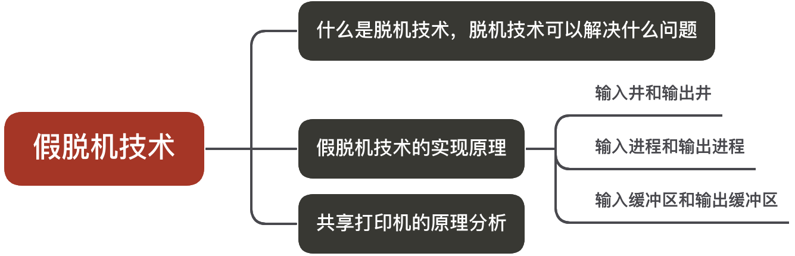
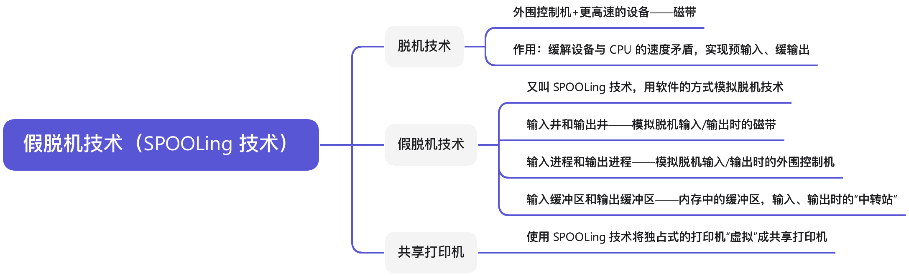

# 设备管理

## I/O 设备的基本概念和分类

**知识总览**：


### I/O 设备的定义

**I/O** 就是**输入/输出**（Input/Output）；I/O 设备就是可以将数据输出到计算机，或者可以接收计算机输出数据的外部设备，属于计算机中的硬件部件。

- 鼠标、键盘——典型的输入型设备
- 显示器——输出型设备
- 移动硬盘——即可输入、又可输出的设备

UNIX 系统将外部设备抽象为一种<span style="color:#F68537">**特殊的文件**</span>，用户可以使用与文件操作相同的方式对外部设备进行操作；例如，`write` 操作就是向外部设备写出数据，`read` 操作就是从外部设备读入数据。

### I/O 设备的分类——按使用特性


- <span style="color:#E14434">**人机交互类外设**</span>：鼠标、键盘、打印机等；数据传输速度慢
- <span style="color:#E14434">**存储设备**</span>：移动硬盘、光盘等；数据传输速度快
- <span style="color:#E14434">**网络通信设备**</span>：调制解调器等；数据传输速度介于二者之间

### I/O 设备的分类——按传输速率分类


- <span style="color:#BA487F; font-weight:bold">低速设备</span>：鼠标、键盘等；传输速率为每秒几个至几百字节
- <span style="color:#BA487F; font-weight:bold">中速设备</span>：激光打印机等；传输速率为每秒数千至上万个字节
- <span style="color:#BA487F; font-weight:bold">高速设备</span>：磁盘等；传输速率为每秒数千字节至千兆字节的设备

### I/O 设备的分类——按信息交换的单位分类


- <span style="color:#FE7743; font-weight:bold">块设备</span>：如磁盘等；数据传输的基本单位是**块**；传输速率较高，可寻址，即对它可随机地读/写任一块
- <span style="color:#FE7743; font-weight:bold">字符设备</span>：鼠标、键盘等；数据传输的基本单位是**字符**；传输速率较慢，不可寻址，在输入/输出时常采用中断驱动方式

---


## I/O 控制器

**知识总览**：


I/O 设备由机械部件和电子部件组成。

### I/O 设备的机械部件


I/O 设备的<span style="color:#BA487F; font-weight:bold">机械部件</span>主要用来执行具体 I/O 操作。如我们看得见、摸得着的鼠标、键盘的按钮；显示器的 LED 屏；移动硬盘的磁臂、磁盘背面。

I/O 设备的<span style="color:#0D5EA6; font-weight:bold">电子部件</span>通常是一块插入主板扩充槽的印刷电路板。

### I/O 设备的电子部件（I/O 控制器）

CPU 无法直接控制 I/O 设备的机械部件，因此 I/O 设备还要有一个电子部件作为 CPU 和 I/O 设备机械部件之间的<span style="color:#ED3500; font-weight:bold">中介</span>，用于实现 CPU 对设备的控制。

这个电子部件就是 <span style="color:#093FB4; font-weight:bold">I/O 控制器</span>，又称<span style="color:#093FB4; font-weight:bold">设备控制器</span>。CPU 可控制 I/O 控制器，又由 I/O 控制器来控制设备的机械部件。


- **接受和识别 CPU 发出的命令**：如 CPU 发出的 `read`、`write` 命令，I/O 控制器中会有相应的<span style="color:#E67514">**控制寄存器**</span>来存放命令和参数
- **向 CPU 报告设备的状态**：I/O 控制器中会有相应的<span style="color:#471396">**状态寄存器**</span>，用于记录 I/O 设备的当前状态；例如，1 表示空闲，0 表示忙碌
- **数据交换**：I/O 控制器中会设置相应的<span style="color:#347433">**数据寄存器**</span>；输出时，数据寄存器用于暂存 CPU 发来的数据，之后再由控制器传送到设备；输入时，数据寄存器用于暂存设备发来的数据，之后 CPU 从数据寄存器中取走数据
- **地址识别**：类似于内存的地址，为了区分设备控制器中的各个寄存器，也需要给各个寄存器设置一个<span style="color:#00809D">**地址**</span>；I/O 控制器通过 CPU 提供的<span style="color:#00809D">**地址**</span>来判断 CPU 要读/写的是哪个寄存器

### I/O 控制器的组成


- <span style="color:#EA2F14; font-weight:bold">CPU 与控制器的接口</span>：用于实现 CPU 与控制器之间的通信；CPU 通过控制线发出命令；通过地址线指明要操作的设备；通过数据线来取出（输入）数据，或放入（输出）数据
- <span style="color:#EA2F14; font-weight:bold">I/O 逻辑</span>：负责接收和识别 CPU 的各种命令（如地址译码），并负责对设备发出命令
- <span style="color:#EA2F14; font-weight:bold">控制器和设备的接口</span>：用于实现控制器与设备之间的通信
- <span style="color:#EA2F14; font-weight:bold">数据</span>：传送输入/输出数据
- <span style="color:#EA2F14; font-weight:bold">状态</span>：设备要反馈状态（忙碌/空闲）
- <span style="color:#EA2F14; font-weight:bold">控制</span>：控制器向设备发出控制信息

> **注意**：
>
> 1. 一个 I/O 控制器可能会对应多个设备
> 2. 数据寄存器、控制寄存器、状态寄存器可能有多个（例如，每个控制/状态寄存器对应一个具体的设备），且这些寄存器都要有相应的地址，才能方便 CPU 操作；有的计算机会让这些寄存器占用内存地址的一部分，称为<span style="color:#B33791">**内存映像 I/O**</span>；另一些计算机则采用 I/O 专用地址，即<span style="color:#B33791">**寄存器独立编址**</span>

### 内存映像 I/O vs. 寄存器独立编址


内存映射 I/O，控制器中的寄存器与内存统一编址；优点是简化了指令，可以采用对内存进行操作的指令来对控制器进行操作。

寄存器独立编址，控制器中的寄存器使用单独的地址；缺点是需要设置专门的指令来实现对控制器的操作，不仅要指明寄存器的地址，还要指明控制器的编号。

---


## I/O 控制方式

**知识总览**：


> **注意**：
>
> 1. 完成一次读/写操作的流程
> 2. CPU 干预的频率
> 3. 数据传送的单位
> 4. 数据的流向
> 5. 主要缺点和主要优点

### 程序直接控制方式

完成一次读/写操作的流程（以<span style="color:#E6521F">**读操作**</span>为例）：


1. CPU 向控制器发出读指令；于是设备启动，并且状态寄存器设为 1（未就绪）
2. 轮询检查控制器的状态（本质上就是不断执行程序的循环；若是状态位始终为 1，说明设备还没准备好要输入的数据，于是 CPU 会不断地轮询）
3. 输入设备准备好数据后将数据传给控制器，并报告自身状态
4. 控制器将输入的数据放到数据寄存器中，并将状态改为 0（已就绪）
5. CPU 发现设备已就绪，即可将寄存器中的内容读入 CPU 的寄存器中，再把 CPU 寄存器中的内容放入内存
6. 若还要继续读入数据，则 CPU 继续发出指令


```c
#include <stdio.h>
#include <stdlib.h>

int main() {
    int a, b, c, d;
    scanf("%d", &a);  // 输入整数并赋值给变量 a
    scanf("%d", &b);  // 输入整数并赋值给变量 b
    printf("a + b = %d\n", a + b); // 计算 a + b 的值
    scanf("%d %d", &c, &d);        // 输入两个整数并赋值给 c、d
    printf("c * d = %d\n", c * d); // 计算 c * b 的值
    
    system("pause");
    return 0;
}
```

由代码可知，输入的数据最终要放到内存中（因为 `a`、`b`、`c`、`d` 等变量存放在内存中）；同理，输出的数据也存放在内存中，需要从内存中取出。

在使用<span style="color:#0046FF">**轮询**</span>这种方式时，CPU 干预的频率很频繁，I/O 操作开始之前、开始之后需要 CPU 介入，并且<span style="color:#E43636; font-weight:bold">在等待 I/O 完成的过程中，CPU 需要不断地轮询检查</span>。

数据传送的单位是每次读/写<span style="color:#7ADAA5; font-weight:bold">一个字</span>。

数据的流向：

- <span style="color:#B9375D">**读操作（数据输入）**</span>：I/O 设备 → CPU（指的是 CPU 的寄存器） → 内存
- <span style="color:#B9375D; font-weight:bold">写操作（数据输出）</span>：内存 → CPU → I/O 设备

每个字的读/写都需要 CPU 的帮助。

- <span style="color:#386641; font-weight:bold">优点</span>：实现简单；在读/写指令之后，加上实现循环检查的一系列指令即可（因此才称为**程序直接控制方式**）
- <span style="color:#386641; font-weight:bold">缺点</span>：<span style="color:#FB4141">CPU 和 I/O 设备只能**串行**工作，CPU 需要一直轮询检查，长期处于**忙等**状态</span>，CPU 利用率低

### 中断驱动方式

引入<span style="color:#001BB7">中断机制</span>；由于 I/O 设备速度很慢，因此在 CPU 发出读/写命令后，可<span style="color:#001BB7">将等待 I/O 的进程阻塞</span>，先切换到别的进程执行；当 I/O 完成后，控制器会向 CPU 发出一个中断信号，CPU <span style="color:#001BB7">检测到中断信号后</span>，会保存当前进程的运行环境信息，转去执行中断处理程序处理该中断。处理中断的过程中，CPU 从 I/O 控制器读一个字的数据传送到 CPU 寄存器，再写入主存。接着，<span style="color:#001BB7">CPU 恢复等待 I/O 的进程（或其他进程）的运行环境，然后继续执行</span>。


> **注意**：
>
> 1. CPU 会在每个指令周期的末尾检查中断
> 2. 中断处理过程中需要保存、恢复进程的运行环境，这个过程是需要一定的时间开销的；可见，如果中断发生的频率太高，也会降低系统性能（每次中断读取一个字，因此读取大量数据会产生大量的中断）

CPU 干预频率，在每次 I/O 操作开始之前、完成之后需要 CPU 介入；<span style="color:#B9375D">等待 I/O 完成的过程中，CPU 可以切换到别的进程执行</span>。

数据传送的单位为每次读/写<span style="color:#B9375D">一个字</span>。

数据的流向：

- <span style="color:#F97A00">**读操作（数据输入）**</span>：I/O 设备 → CPU（指的是 CPU 的寄存器） → 内存
- <span style="color:#F97A00; font-weight:bold">写操作（数据输出）</span>：内存 → CPU → I/O 设备

主要缺点与主要优点：

- <span style="color:#799EFF; font-weight:bold">优点</span>：与**程序直接控制方式**相比，在**中断驱动方式**中，I/O 控制器会通过中断信号主动报告 I/O 已完成，CPU 不再需要不停地轮询；<span style="color:#9929EA">CPU 和 I/O 设备可并行工作</span>，CPU 利用率得到明显提升
- <span style="color:#799EFF; font-weight:bold">缺点</span>：每个字在 I/O 设备和内存之间的传输，都需要经过 CPU；而<span style="color:#9929EA">频繁的中断处理会消耗较多的 CPU 时间</span>

### DMA 方式

与**中断驱动方式**相比，<span style="color:#FF2DD1">DMA 方式</span>（Direct Memory Access，<span style="color:#FF2DD1">直接存储器存取</span>；主要用于块设备的 I/O 控制）有以下改进：

1. <span style="color:#ED3500">数据的传送单位是**块**</span>；不再是字单位的传送
2. 数据的流向是从设备直接放入内存，或者从内存直接到设备；不再需要 CPU 作为中介
3. 仅在传送一个或多个数据块的开始和结束时，才需要 CPU 干预


CPU 指明此次<span style="color:#E43636">要进行的操作</span>（如读操作），并说明<span style="color:#E43636">要读入多少数据</span>、数据<span style="color:#E43636">要存放在内存的什么位置</span>、数据<span style="color:#E43636">在外部设备上的地址</span>（如磁盘上的地址）。

控制器会根据 CPU 提出的要求完成数据的读/写工作，整块数据的传输完成后，才向 CPU <u>发出中断信号</u>。


- <span style="color:#FF7D29; font-weight:bold">DR（Data Register，数据寄存器）</span>：暂存从设备到内存或从内存到设备的数据
- <span style="color:#FF7D29; font-weight:bold">MAR（Memory Address Register，内存地址寄存器）</span>：在输入时，MAR 表示数据存放到内存的位置；输出时，MAR 表示要输出的数据存放在内存中的位置
- <span style="color:#FF7D29; font-weight:bold">DC（Data Counter，数据计算器）</span>：表示<u>剩余</u>要读/写的字节数
- <span style="color:#FF7D29; font-weight:bold">CR（Command Register，命令/状态寄存器）</span>：用于存放 CPU 发来的 <u>I/O 命令</u>，或设备的<u>状态信息</u>

> **注意**：DMA 控制器读取数据也是以字为单位读取，暂存于 DR 中。

---

CPU 仅在传送一个或多个数据块的开始和结束时进行干预。

每次读/写<span style="color:#725CAD">**一个或多个块**</span>。（每次读写的只能是连续的多个块，且这些块读入内存后在内存中也必须是连续的）

数据的流向（<span style="color:#0ABAB5; font-weight:bold">不再需要经过 CPU</span>）：

- <span style="color:#B33791; font-weight:bold">读数据（数据输入）</span>：I/O 设备 → 内存
- <span style="color:#B33791; font-weight:bold">写数据（数据输出）</span>：内存  → I/O 设备

主要缺点与主要优点：

- <span style="color:#254D70; font-weight:bold">优点</span>：数据传输以<span style="color:#FF8040">**块**</span>为单位，CPU 介入频率进一步减低；数据的传输不再需要先经过 CPU 再写入内存，数据传输效率进一步增加；CPU 和 I/O 设备的并行性得到提高
- <span style="color:#254D70; font-weight:bold">缺点</span>：CPU 每发出一条 I/O 指令，只能读/写一个或多个连续的数据块

如果要读/写多个<u>离散存储</u>的数据块，或者要将数据分别写到<u>不同的内存区域</u>时，CPU 要分别发出多条 I/O 指令，进行多次中断处理才能完成。

### 通道控制方式

<span style="color:#B9375D">**通道（Channel，即 I/O 通道处理器）**</span>，一种<span style="color:#B9375D">硬件</span>，可以理解为<span style="color:#B9375D; font-weight:bold">弱化版的 CPU</span>；通道可以识别并执行一系列的<span style="color:#B9375D">通道指令</span>。

1. CPU 向通道发出 I/O 指令；指明<u>通道程序</u>在内存中的位置，并指明要操作的是<u>哪个 I/O 设备</u>；之后，CPU 就切换到其他进程执行了
2. 通道执行内存中的<u>通道程序</u>（Channel Program，也叫 Channel Command Word 列表；其中指明了要读入/写出多少数据，读/写的数据应放在内存的什么位置等信息）
3. 通道执行完规定的任务后，向 CPU 发出中断信号，之后 CPU 对中断进行处理


与 CPU 相比，通道可以执行的指令很单一，并且通道程序是放在主机内存中的，也就是说通道与 CPU <u>共享内存</u>。

CPU 的干预频率极低，通道会根据 CPU 的指示执行相应的通道程序，只有完成一组数据块的读/写后才需要发出中断信号，请求 CPU 干预。


数据传送的单位是每次读/写<span style="color:#BA487F">一组数据块</span>。

数据的流向（<span style="color:#C83F12">在通道的控制下进行</span>）：

- <span style="color:#C68EFD; font-weight:bold">读操作（数据输入）</span>：I/O 设备 → 内存
- <span style="color:#C68EFD; font-weight:bold">写操作（数据输出）</span>：内存 → I/O 设备

主要缺点和主要优点：

- <span style="color:#3674B5; font-weight:bold">缺点</span>：实现复杂，需要专门的通道硬件支持
- <span style="color:#3674B5; font-weight:bold">优点</span>：CPU、通道、I/O 设备可并行工作，资源利用率很高

---

<table>
  <thead>
    <tr>
      <th></th>
      <th>完成一次读/写的过程</th>
      <th>CPU 干预频率</th>
      <th>每次 I/O 的数据传输单位</th>
      <th>数据流向</th>
      <th>优缺点</th>
    </tr>
  </thead>
  <tbody>
    <tr>
      <td>程序直接控制方式</td>
      <td>CPU 发出 I/O 命令后需要不断轮询</td>
      <td>极高</td>
      <td>字</td>
      <td class="data-flow-cell">设备 → CPU → 内存, 内存 → CPU → 设备</td>
      <td rowspan="4" class="advantages-cell">
        每一个阶段的优点都是解决了上一阶段的最大缺点。总体来说，整个发展过程就是要尽量减少 CPU 对 I/O 过程的干预，把 CPU 从繁杂的 I/O 控制事务中解脱出来，以便更多地去完成数据处理任务。
      </td>
    </tr>
    <tr>
      <td>中断驱动方式</td>
      <td>CPU 发出 I/O 命令后可以做其他事，本次 I/O 完成后设备控制器发出中断信号</td>
      <td>高</td>
      <td>字</td>
      <td class="data-flow-cell">设备 → CPU → 内存, 内存 → CPU → 设备</td>
    </tr>
    <tr>
      <td>DMA 方式</td>
      <td>CPU 发出 I/O 命令后可以做其他事，本次 I/O 完成后 DMA 控制器发出中断信号</td>
      <td>中</td>
      <td>块</td>
      <td class="data-flow-cell">设备 → 内存, 内存 → 设备</td>
    </tr>
    <tr>
      <td>通道控制方式</td>
      <td>CPU 发出 I/O 命令后可以做其他事。通道会执行通道程序以完成 I/O，完成后通道向 CPU 发出中断信号</td>
      <td>低</td>
      <td>一组块</td>
      <td class="data-flow-cell">设备 → 内存, 内存 → 设备</td>
    </tr>
  </tbody>
</table>

## I/O 软件层次结构

**知识总览**：


每一层会利用其下层提供的服务，实现某些功能，并屏蔽实现的具体细节，向高层提供服务。（<span style="color:#E43636">封装思想</span>）

### 用户层软件


用户层软件（又称系统调用处理层），<span style="color:#0046FF">实现了与用户交互的接口</span>，用户可直接使用该层提供的、与 I/O 操作相关的<u>库函数</u>对设备进行操作。（例如 `printf("Hello World!");`）

用户层软件将用户请求翻译成格式化的 I/O 请求，并通过<span style="color:#239BA7">系统调用</span>请求系统内核的服务。（`printf("Hello World!");` 会被翻译为等价的 `write` 系统调用，当然，用户层软件也会在系统调用时填入相应参数）

Windows 操作系统向外提供的一系列系统调用，但是由于系统调用的格式严格、使用麻烦，因此在用户层上封装了一系列更方便的库函数接口供用户使用。（Windows API）

### 设备独立性软件

<span style="color:#689B8A">**设备独立性软件**</span>，又称<span style="color:#3B38A0">设备无关性软件</span>；与设备的硬件特性无关的功能几乎均在这层实现。


主要实现的功能：

- 向上层提供统一的调用接口（如 `read`、`write` 系统调用）

- 设备的保护：原理类似于<u>文件保护</u>。设备被看做是一种特殊的文件，不同用户对各个文件的访问权限是不一样的；同理，对设备的访问权限也不一样

- 差错处理：设备独立性软件需要对一些设备的错误进行处理

- 设备的分配与回收（设备是一种<u>临界资源</u>）

- 数据缓冲区管理：可以通过缓冲技术屏蔽设备之间数据交换单位大小和传输速度的差异

- 建立逻辑设备名到物理设备名的映射关系；根据设备类型选择调用相应的驱动程序。

  例如用户或用户层软件发出 I/O 操作相关系统调用的系统调用时，需要指明此次要操作的 I/O 设备的逻辑设备名。（举例，去学校打印店打印时，需要选择“打印机 1”、“打印机 2”、“打印机 3”，其实这些都是<span style="color:#FF7A30">逻辑设备名</span>）

  <span style="color:#B12C00">设备独立性软件</span>需要通过<span style="color:#B12C00; font-weight:bold">逻辑设备表（LUT，Logical Unit Table）</span>来确定设备对应的<span style="color:#B12C00">物理设备</span>，并找到该设备对应的<span style="color:#B12C00">设备驱动程序</span>。

  | 逻辑设备名      | 物理设备名 | 驱动程序入口地址 |
  | --------------- | ---------- | ---------------- |
  | `/dev/打印机 1` | 3          | 1024             |
  | `/dev/打印机 2` | 5          | 2046             |
  | $\cdots$        | $\cdots$   | $\cdots$         |

  > **注意**：
  >
  > - I/O 设备被当做一种特殊的文件
  > - 不同类型的 I/O 设备需要有不同的驱动程序处理

  操作系统可以采用两种方式管理<span style="color:#34699A">逻辑设备表（LUT）</span>。

  1. <span style="color:#34699A">**整个系统**只设置一份 LUT</span>，代表所有用户不能使用相同的逻辑设备名，因此该方式仅适用于单用户操作系统
  2. <span style="color:#34699A">为**每个用户**设置一份 LUT</span>，各个用户使用的逻辑设备名可重复，适用于多用户操作系统；系统会在用户登陆时为其建立一个<u>用户管理进程</u>，而 LUT 就存放在用户管理进程的 PCB 中

### 设备驱动程序

**为什么不同类型的 I/O 设备需要有不同的驱动程序处理？**

各式各样的设备，外形不同，其内部的<u>电子部件（I/O 控制器）</u>也可能不同。


不同设备的内部硬件特性也不同，这些特性仅有厂家知晓，因此厂家须提供与设备相对应的驱动程序，CPU 执行驱动程序的指令序列，来完成设置设备寄存器、检查设备状态等工作。

---

<span style="color:#FE7743">**设备驱动程序**</span>，主要负责对硬件设备的具体控制，将上层发出的一系列命令（如 `read`、`write`）转化为特定设备<span style="color:#FF9898; font-weight:bold">能听得懂</span>的一系列操作，包括设置设备寄存器、检查设备状态等。

不同的 I/O 设备有不同的硬件特性，具体细节只有设备厂家知晓。因此厂家需要根据设备的硬件特性设计并提供相应的驱动程序。

> **注意**：驱动程序一般会以一个<u>独立进程</u>的方式存在。

### 中断处理程序

当 I/O 任务完成后，I/O 控制器会发送一个<span style="color:#FF9B45">**中断信号**</span>，系统会根据<span style="color:#CD5656">根据中断信号类型</span>找到相应的<span style="color:#CD5656">中断处理程序</span>并执行。中断处理程序的处理流程如下：


可见，中断处理程序也会<u>和硬件打交道</u>。

## 输入/输出应用程序接口、设备驱动程序接口

**知识总览**：


### 输入/输出应用程序接口


显然，用户层的应用程序无法用一个<span style="color:#239BA7"><u>统一的系统调用</u></span>接口来完成所有类型设备的 I/O。


- <span style="color:#6C8EBF; font-weight:bold">字符设备接口</span>：`get`、`put` 系统调用，向字符设备读/写一个字符

- <span style="color:#9673A6">**块设备接口**</span>：

  - `read`、`write` 系统调用：向块设备的<span style="color:#BB6653">读写指针位置</span>读/写多个字符
  - `seek` 系统调用：<span style="color:#BB6653">修改**读写指针**位置</span>

- 网络设备接口，又称**<span style="color:#D92C54">网络套接字（`socket`）接口</span>**：

  - `socket` 系统调用，<span style="color:#0D5EA6">创建一个网络套接字</span>，需指明网络协议（TCP、UDP 等）
  - `bind`：将套接字绑定到某个本地<span style="color:#954C2E">**端口**</span>
  - `connect`：将套接字连接到远程地址
  - `read` / `write`：从套接字读/写数据

  

### 阻塞/非阻塞 I/O

- <span style="color:#FF9898; font-weight:bold">阻塞 I/O</span>：应用程序发出 I/O 系统调用，<span style="color:#CA7842">进程需转为阻塞态等待</span>（例如字符设备接口——从键盘读一个字符，`get`）
- <span style="color:#FF9898; font-weight:bold">非阻塞 I/O</span>：应用程序发出 I/O 系统调用，系统调用可迅速返回，<span style="color:#129990">进程无需阻塞等待</span>（例如块设备接口——往磁盘写数据，`write`）

> **注意**：即使磁盘正在忙碌，也不需要用户进程等待；因为进程准备的数据位于用户区，操作系统又存在内核区；发出 `write` 系统调用时，即使磁盘正在忙碌，设备独立性软件也会迅速地响应系统调用请求，将数据复制到内核区的缓存，之后内核将数据读入磁盘。

### 设备驱动程序接口


若各公司开发的设备驱动程序接口不统一，则操作系统很难调用设备驱动程序。


操作系统规定好设备驱动程序的接口标准，各厂商必须按要求开发设备驱动程序。不同的操作系统，对设备驱动程序接口的标准各不相同。

## I/O 核心子系统

**知识总览**：


因此 I/O 核心子系统要实现的功能其实就是中间三层要实现的功能。


### I/O 调度

<span style="color:#FF2DD1">**I/O 调度**</span>，用某种算法确定一个好的顺序来处理各个 I/O 请求。

例如，磁盘调度（先来先服务算法、最短寻道有限算法、SCAN 算法、C-SCAN 算法、LOOK 算法、C-LOOK 算法）。当多个磁盘 I/O 请求到来时，用某种调度算法来确定满足 I/O 请求的顺序。

同理，打印机等设备也可以用先来先服务算法、优先级算法、短作业优先等算法来确定 I/O 调度顺序。

### 设备保护

操作系统需要实现<span style="color:#6420AA">文件保护功能</span>，不同的用户对各个文件有不同的访问权限。（例如，只读、读和写等）

在 UNIX 系统中，<span style="color:#FF004D">设备被看作是一种特殊的文件</span>，每个设备也会有对应的 FCB。当用户请求访问某个设备时，系统根据 FCB 中记录的信息来判断该用户是否有相应的访问权限，以此实现**设备保护**功能。（可以参考<u>文件保护</u>）

## 假脱机技术（SPOOLing 技术）

**知识总览**：



### 脱机技术的定义


<span style="color:#687EFF">手工操作阶段</span>，主机直接从 I/O 设备获得数据，由于设备速度慢，主机速度快。人机速度矛盾明显，主机要浪费很多时间来等待设备。

批处理阶段引入了<span style="color:#9400FF">脱机输入/输出技术</span>（用磁带完成）：


在外围控制机的控制下，慢速输入设备的数据先被输入到更快速的磁盘上。之后主机可以从快速的磁带上读入数据，从而缓解了速度矛盾。

> **注意**：之所以称之为“脱机”，因为其<u>脱离主机的控制</u>进行的输入/输出操作。

引入脱机技术后，缓解了 CPU 与慢速 I/O 设备的速度矛盾。另一方面，即使 CPU 在忙碌，也可以提前将数据输入到磁带；即使慢速的输出设备正在忙碌，也可以提前将数据输出到磁盘。

### 假脱机技术——输入井和输出井

<span style="color:#C70039; font-weight:bold">*假*脱机技术</span>，又称<span style="color:#C70039; font-weight:bold"> SPOOLing 技术</span>使用软件的方式模拟脱机技术。SPOOLing 系统的组成如下：


在<u>磁盘</u>上开辟出两个存储区域——**输入井**和**输出井**。

- <span style="color:#0B666A">**输入井**</span>模拟脱机输入时的磁带，用于收容 I/O 设备输入的数据
- <span style="color:#0B666A">**输出井**</span>模拟脱机输出时的磁带，用于收容用户进程输出的数据
- <span style="color:#0F6292; font-weight:bold">输入进程</span>模拟脱机输入时的外围控制机
- <span style="color:#0F6292; font-weight:bold">输出进程</span>模拟脱机输出时的外围控制机

要实现 SPOOLing 技术，<span style="color:#FB2576">必须要有**多道程序技术**的支持</span>。系统会建立**输入进程**和**输出进程**。

### 假脱机技术——输入/输出缓冲区


在输入进程的控制下，**输入缓冲区**用于暂存从输入设备输入的数据，之后再转存到输入井中。

在输出进程的控制下，**输出缓冲区**用于暂存从输出井输出的数据，之后再转存到输出设备上。

> **注意**：输入缓冲区和输出缓冲区是在<u>内存</u>中的缓冲区。

### 共享打印机原理分析

- <span style="color:#FF6464">**独占式设备**</span>，只允许各个进程**串行**使用的设备；一段时间内只能满足一个进程的请求
- <span style="color:#FF6464">**共享设备**</span>，允许多个进程**同时**使用的设备（宏观上同时使用，微观上可能是交替使用）；可以同时满足多个进程的使用请求

打印机是一种<u>独占式设备</u>，但是可用 SPOOLing 技术改造成<u>共享设备</u>。

举例，对于独占式设备，若进程 1 正在使用打印机，则进程 2 请求使用打印机时必然<u>阻塞等待</u>。


当多个用户进程提出打印请求时，系统会答应它们的请求，但是并不是真正把打印机分配给它们，而是由假脱机管理进程为每个进程做两件事：

1. 在磁盘输出井中为进程申请一个空闲缓冲区（也就是说，这个缓冲区是在<u>磁盘</u>上的），并将要打印的数据送入其中

2. 为用户进程申请一张空白的打印请求表，并将用户的打印请求填入表中（用来说明用户的打印数据存放位置等信息），再将该表挂到假脱机文件队列上（即打印任务队列）。

   当打印机空闲时，输出进程会从文件队列的<u>队头</u>取出一张打印请求表，并根据表中的要求将要打印的数据从<u>输出井</u>传送到输出缓冲区，再输出到打印机进行打印；用这种方式可依次处理完全部的打印任务。

虽然系统中只有一台打印机，但每个进程提出打印请求时，系统都会为在输出井中为其分配一个存储区（相当于<u>分配了一个逻辑设备</u>），使每个用户进程都觉得自己在独占一台打印机，从而实现对打印机的共享。


SPOOLing 技术可以把一台物理设备<span style="color:#EA047E">虚拟</span>成逻辑上的多台设备，<span style="color:#EA047E">可将独占式设备改造成共享设备</span>。

---



## 设备的分配与回收

**知识总览**：



### 设备分配时应考虑的因素


设备的固有属性可分为三种：独占设备、共享设备、虚拟设备。

- <span style="color:#7E2553; font-weight:bold">独占设备</span>：一个时段只能分配给一个进程（如打印机）
- <span style="color:#7E2553; font-weight:bold">共享设备</span>：可同时分配给多个进程使用（如磁盘），各进程往往是宏观上同时共享使用设备，而微观上交替使用
- <span style="color:#7E2553; font-weight:bold">虚拟设备</span>：采用 SPOOLing 技术将独占设备改造成虚拟的共享设备

设备的分配算法：先来先服务、优先级高者优先、短任务优先……

从进程运行的安全性上考虑，设备分配有两种方式：

- <span style="color:#0002A1; font-weight:bold">安全分配方式</span>：为进程分配一个设备后就将进程阻塞，本次 I/O 完成后才将其唤醒（例如，进程请求打印机打印输出）。一个时间段内每个进程只能使用一个设备。
  - <span style="color:#D61C4E">**优点**</span>：破坏了**请求和保持**条件，不会死锁
  - <span style="color:#D61C4E">**缺点**</span>：对于一个进程来说，CPU 和 I/O 设备只能串行工作
- <span style="color:#0002A1; font-weight:bold">不安全分配方式</span>：进程发出 I/O 请求后，系统为其分配 I/O 设备，进程可继续执行，之后还可以发出新的 I/O 请求；只有某个 I/O 请求得不到满足时才将进程阻塞。一个进程可以同时使用多个设备。
  - <span style="color:#D61C4E">**优点**</span>：进程的计算人物和 I/O 任务可以并行处理，使进程迅速推进
  - <span style="color:#D61C4E">**缺点**</span>：有可能发生死锁（死锁避免、死锁的检测和解除）

### 静态分配和动态分配

- <span style="color:#FEB139; font-weight:bold">静态分配</span>：进程运行前为其分配全部所需资源，运行结束后归还资源（破坏了**请求和保持**条件，不会发生死锁）
- <span style="color:#FEB139; font-weight:bold">动态分配</span>：进程运行过程中动态申请设备资源

### 设备分配管理中的数据结构

设备、控制器、通道之间的关系：



一个通道可以控制多个设备控制器，每个设备控制器可控制多个设备。

<span style="color:#94ADD7; font-weight:bold">设备控制器（DCT）</span>：系统为每个设备配置一张 DCT，用于记录设备情况。


