# 设备管理

## I/O 设备的基本概念和分类

**知识总览**：



### I/O 设备的定义

**I/O** 就是**输入/输出**（Input/Output）；I/O 设备就是可以将数据输出到计算机，或者可以接收计算机输出数据的外部设备，属于计算机中的硬件部件。

- 鼠标、键盘——典型的输入型设备
- 显示器——输出型设备
- 移动硬盘——即可输入、又可输出的设备

UNIX 系统将外部设备抽象为一种<span style="color:#F68537">**特殊的文件**</span>，用户可以使用与文件操作相同的方式对外部设备进行操作；例如，`write` 操作就是向外部设备写出数据，`read` 操作就是从外部设备读入数据。

### I/O 设备的分类——按使用特性

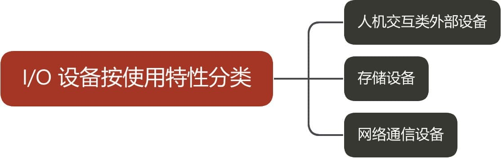

- <span style="color:#E14434">**人机交互类外设**</span>：鼠标、键盘、打印机等；数据传输速度慢
- <span style="color:#E14434">**存储设备**</span>：移动硬盘、光盘等；数据传输速度快
- <span style="color:#E14434">**网络通信设备**</span>：调制解调器等；数据传输速度介于二者之间

### I/O 设备的分类——按传输速率分类


- <span style="color:#BA487F; font-weight:bold">低速设备</span>：鼠标、键盘等；传输速率为每秒几个至几百字节
- <span style="color:#BA487F; font-weight:bold">中速设备</span>：激光打印机等；传输速率为每秒数千至上万个字节
- <span style="color:#BA487F; font-weight:bold">高速设备</span>：磁盘等；传输速率为每秒数千字节至千兆字节的设备

### I/O 设备的分类——按信息交换的单位分类


- <span style="color:#FE7743; font-weight:bold">块设备</span>：如磁盘等；数据传输的基本单位是**块**；传输速率较高，可寻址，即对它可随机地读/写任一块
- <span style="color:#FE7743; font-weight:bold">字符设备</span>：鼠标、键盘等；数据传输的基本单位是**字符**；传输速率较慢，不可寻址，在输入/输出时常采用中断驱动方式

---

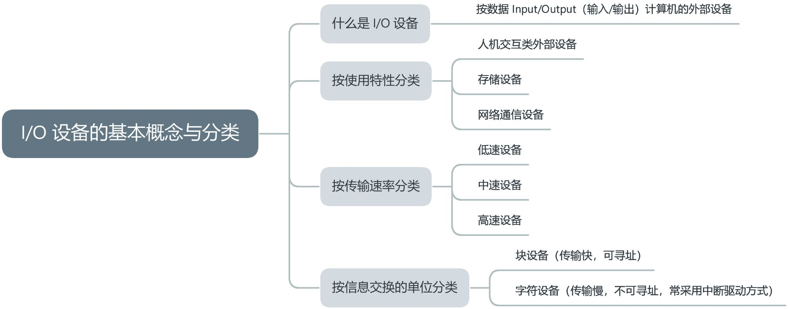

## I/O 控制器

**知识总览**：


I/O 设备由机械部件和电子部件组成。

### I/O 设备的机械部件


I/O 设备的<span style="color:#BA487F; font-weight:bold">机械部件</span>主要用来执行具体 I/O 操作。如我们看得见、摸得着的鼠标、键盘的按钮；显示器的 LED 屏；移动硬盘的磁臂、磁盘背面。

I/O 设备的<span style="color:#0D5EA6; font-weight:bold">电子部件</span>通常是一块插入主板扩充槽的印刷电路板。

### I/O 设备的电子部件（I/O 控制器）

CPU 无法直接控制 I/O 设备的机械部件，因此 I/O 设备还要有一个电子部件作为 CPU 和 I/O 设备机械部件之间的<span style="color:#ED3500; font-weight:bold">中介</span>，用于实现 CPU 对设备的控制。

这个电子部件就是 <span style="color:#093FB4; font-weight:bold">I/O 控制器</span>，又称<span style="color:#093FB4; font-weight:bold">设备控制器</span>。CPU 可控制 I/O 控制器，又由 I/O 控制器来控制设备的机械部件。


- **接受和识别 CPU 发出的命令**：如 CPU 发出的 `read`、`write` 命令，I/O 控制器中会有相应的<span style="color:#E67514">**控制寄存器**</span>来存放命令和参数
- **向 CPU 报告设备的状态**：I/O 控制器中会有相应的<span style="color:#471396">**状态寄存器**</span>，用于记录 I/O 设备的当前状态；例如，1 表示空闲，0 表示忙碌
- **数据交换**：I/O 控制器中会设置相应的<span style="color:#347433">**数据寄存器**</span>；输出时，数据寄存器用于暂存 CPU 发来的数据，之后再由控制器传送到设备；输入时，数据寄存器用于暂存设备发来的数据，之后 CPU 从数据寄存器中取走数据
- **地址识别**：类似于内存的地址，为了区分设备控制器中的各个寄存器，也需要给各个寄存器设置一个<span style="color:#00809D">**地址**</span>；I/O 控制器通过 CPU 提供的<span style="color:#00809D">**地址**</span>来判断 CPU 要读/写的是哪个寄存器

### I/O 控制器的组成


- <span style="color:#EA2F14; font-weight:bold">CPU 与控制器的接口</span>：用于实现 CPU 与控制器之间的通信；CPU 通过控制线发出命令；通过地址线指明要操作的设备；通过数据线来取出（输入）数据，或放入（输出）数据
- <span style="color:#EA2F14; font-weight:bold">I/O 逻辑</span>：负责接收和识别 CPU 的各种命令（如地址译码），并负责对设备发出命令
- <span style="color:#EA2F14; font-weight:bold">控制器和设备的接口</span>：用于实现控制器与设备之间的通信
- <span style="color:#EA2F14; font-weight:bold">数据</span>：传送输入/输出数据
- <span style="color:#EA2F14; font-weight:bold">状态</span>：设备要反馈状态（忙碌/空闲）
- <span style="color:#EA2F14; font-weight:bold">控制</span>：控制器向设备发出控制信息

> **注意**：
>
> 1. 一个 I/O 控制器可能会对应多个设备
> 2. 数据寄存器、控制寄存器、状态寄存器可能有多个（例如，每个控制/状态寄存器对应一个具体的设备），且这些寄存器都要有相应的地址，才能方便 CPU 操作；有的计算机会让这些寄存器占用内存地址的一部分，称为<span style="color:#B33791">**内存映像 I/O**</span>；另一些计算机则采用 I/O 专用地址，即<span style="color:#B33791">**寄存器独立编址**</span>

### 内存映像 I/O vs. 寄存器独立编址


内存映射 I/O，控制器中的寄存器与内存统一编址；优点是简化了指令，可以采用对内存进行操作的指令来对控制器进行操作。

寄存器独立编址，控制器中的寄存器使用单独的地址；缺点是需要设置专门的指令来实现对控制器的操作，不仅要指明寄存器的地址，还要指明控制器的编号。

---

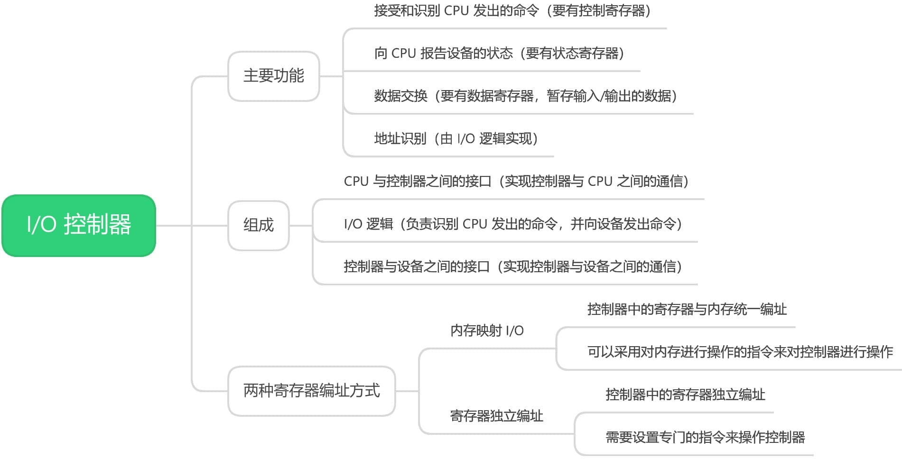

## I/O 控制方式

**知识总览**：


> **注意**：
>
> 1. 完成一次读/写操作的流程
> 2. CPU 干预的频率
> 3. 数据传送的单位
> 4. 数据的流向
> 5. 主要缺点和主要优点

### 程序直接控制方式

完成一次读/写操作的流程（以<span style="color:#E6521F">**读操作**</span>为例）：


1. CPU 向控制器发出读指令；于是设备启动，并且状态寄存器设为 1（未就绪）
2. 轮询检查控制器的状态（本质上就是不断执行程序的循环；若是状态位始终为 1，说明设备还没准备好要输入的数据，于是 CPU 会不断地轮询）
3. 输入设备准备好数据后将数据传给控制器，并报告自身状态
4. 控制器将输入的数据放到数据寄存器中，并将状态改为 0（已就绪）
5. CPU 发现设备已就绪，即可将寄存器中的内容读入 CPU 的寄存器中，再把 CPU 寄存器中的内容放入内存
6. 若还要继续读入数据，则 CPU 继续发出指令


```c
#include <stdio.h>
#include <stdlib.h>

int main() {
    int a, b, c, d;
    scanf("%d", &a);  // 输入整数并赋值给变量 a
    scanf("%d", &b);  // 输入整数并赋值给变量 b
    printf("a + b = %d\n", a + b); // 计算 a + b 的值
    scanf("%d %d", &c, &d);        // 输入两个整数并赋值给 c、d
    printf("c * d = %d\n", c * d); // 计算 c * b 的值
    
    system("pause");
    return 0;
}
```

由代码可知，输入的数据最终要放到内存中（因为 `a`、`b`、`c`、`d` 等变量存放在内存中）；同理，输出的数据也存放在内存中，需要从内存中取出。

在使用<span style="color:#0046FF">**轮询**</span>这种方式时，CPU 干预的频率很频繁，I/O 操作开始之前、开始之后需要 CPU 介入，并且<span style="color:#E43636; font-weight:bold">在等待 I/O 完成的过程中，CPU 需要不断地轮询检查</span>。

数据传送的单位是每次读/写<span style="color:#7ADAA5; font-weight:bold">一个字</span>。

数据的流向：

- <span style="color:#B9375D">**读操作（数据输入）**</span>：I/O 设备 → CPU（指的是 CPU 的寄存器） → 内存
- <span style="color:#B9375D; font-weight:bold">写操作（数据输出）</span>：内存 → CPU → I/O 设备

每个字的读/写都需要 CPU 的帮助。

- <span style="color:#386641; font-weight:bold">优点</span>：实现简单；在读/写指令之后，加上实现循环检查的一系列指令即可（因此才称为**程序直接控制方式**）
- <span style="color:#386641; font-weight:bold">缺点</span>：<span style="color:#FB4141">CPU 和 I/O 设备只能**串行**工作，CPU 需要一直轮询检查，长期处于**忙等**状态</span>，CPU 利用率低

### 中断驱动方式

引入<span style="color:#001BB7">中断机制</span>；由于 I/O 设备速度很慢，因此在 CPU 发出读/写命令后，可<span style="color:#001BB7">将等待 I/O 的进程阻塞</span>，先切换到别的进程执行；当 I/O 完成后，控制器会向 CPU 发出一个中断信号，CPU <span style="color:#001BB7">检测到中断信号后</span>，会保存当前进程的运行环境信息，转去执行中断处理程序处理该中断。处理中断的过程中，CPU 从 I/O 控制器读一个字的数据传送到 CPU 寄存器，再写入主存。接着，<span style="color:#001BB7">CPU 恢复等待 I/O 的进程（或其他进程）的运行环境，然后继续执行</span>。


> **注意**：
>
> 1. CPU 会在每个指令周期的末尾检查中断
> 2. 中断处理过程中需要保存、恢复进程的运行环境，这个过程是需要一定的时间开销的；可见，如果中断发生的频率太高，也会降低系统性能（每次中断读取一个字，因此读取大量数据会产生大量的中断）

CPU 干预频率，在每次 I/O 操作开始之前、完成之后需要 CPU 介入；<span style="color:#B9375D">等待 I/O 完成的过程中，CPU 可以切换到别的进程执行</span>。

数据传送的单位为每次读/写<span style="color:#B9375D">一个字</span>。

数据的流向：

- <span style="color:#F97A00">**读操作（数据输入）**</span>：I/O 设备 → CPU（指的是 CPU 的寄存器） → 内存
- <span style="color:#F97A00; font-weight:bold">写操作（数据输出）</span>：内存 → CPU → I/O 设备

主要缺点与主要优点：

- <span style="color:#799EFF; font-weight:bold">优点</span>：与**程序直接控制方式**相比，在**中断驱动方式**中，I/O 控制器会通过中断信号主动报告 I/O 已完成，CPU 不再需要不停地轮询；<span style="color:#9929EA">CPU 和 I/O 设备可并行工作</span>，CPU 利用率得到明显提升
- <span style="color:#799EFF; font-weight:bold">缺点</span>：每个字在 I/O 设备和内存之间的传输，都需要经过 CPU；而<span style="color:#9929EA">频繁的中断处理会消耗较多的 CPU 时间</span>

### DMA 方式

与**中断驱动方式**相比，<span style="color:#FF2DD1">DMA 方式</span>（Direct Memory Access，<span style="color:#FF2DD1">直接存储器存取</span>；主要用于块设备的 I/O 控制）有以下改进：

1. <span style="color:#ED3500">数据的传送单位是**块**</span>；不再是字单位的传送
2. 数据的流向是从设备直接放入内存，或者从内存直接到设备；不再需要 CPU 作为中介
3. 仅在传送一个或多个数据块的开始和结束时，才需要 CPU 干预


CPU 指明此次<span style="color:#E43636">要进行的操作</span>（如读操作），并说明<span style="color:#E43636">要读入多少数据</span>、数据<span style="color:#E43636">要存放在内存的什么位置</span>、数据<span style="color:#E43636">在外部设备上的地址</span>（如磁盘上的地址）。

控制器会根据 CPU 提出的要求完成数据的读/写工作，整块数据的传输完成后，才向 CPU <u>发出中断信号</u>。


- <span style="color:#FF7D29; font-weight:bold">DR（Data Register，数据寄存器）</span>：暂存从设备到内存或从内存到设备的数据
- <span style="color:#FF7D29; font-weight:bold">MAR（Memory Address Register，内存地址寄存器）</span>：在输入时，MAR 表示数据存放到内存的位置；输出时，MAR 表示要输出的数据存放在内存中的位置
- <span style="color:#FF7D29; font-weight:bold">DC（Data Counter，数据计算器）</span>：表示<u>剩余</u>要读/写的字节数
- <span style="color:#FF7D29; font-weight:bold">CR（Command Register，命令/状态寄存器）</span>：用于存放 CPU 发来的 <u>I/O 命令</u>，或设备的<u>状态信息</u>

> **注意**：DMA 控制器读取数据也是以字为单位读取，暂存于 DR 中。

---

CPU 仅在传送一个或多个数据块的开始和结束时进行干预。

每次读/写<span style="color:#725CAD">**一个或多个块**</span>。（每次读写的只能是连续的多个块，且这些块读入内存后在内存中也必须是连续的）

数据的流向（<span style="color:#0ABAB5; font-weight:bold">不再需要经过 CPU</span>）：

- <span style="color:#B33791; font-weight:bold">读数据（数据输入）</span>：I/O 设备 → 内存
- <span style="color:#B33791; font-weight:bold">写数据（数据输出）</span>：内存  → I/O 设备

主要缺点与主要优点：

- <span style="color:#254D70; font-weight:bold">优点</span>：数据传输以<span style="color:#FF8040">**块**</span>为单位，CPU 介入频率进一步减低；数据的传输不再需要先经过 CPU 再写入内存，数据传输效率进一步增加；CPU 和 I/O 设备的并行性得到提高
- <span style="color:#254D70; font-weight:bold">缺点</span>：CPU 每发出一条 I/O 指令，只能读/写一个或多个连续的数据块

如果要读/写多个<u>离散存储</u>的数据块，或者要将数据分别写到<u>不同的内存区域</u>时，CPU 要分别发出多条 I/O 指令，进行多次中断处理才能完成。

### 通道控制方式

<span style="color:#B9375D">**通道（Channel，即 I/O 通道处理器）**</span>，一种<span style="color:#B9375D">硬件</span>，可以理解为<span style="color:#B9375D; font-weight:bold">弱化版的 CPU</span>；通道可以识别并执行一系列的<span style="color:#B9375D">通道指令</span>。

1. CPU 向通道发出 I/O 指令；指明<u>通道程序</u>在内存中的位置，并指明要操作的是<u>哪个 I/O 设备</u>；之后，CPU 就切换到其他进程执行了
2. 通道执行内存中的<u>通道程序</u>（Channel Program，也叫 Channel Command Word 列表；其中指明了要读入/写出多少数据，读/写的数据应放在内存的什么位置等信息）
3. 通道执行完规定的任务后，向 CPU 发出中断信号，之后 CPU 对中断进行处理


与 CPU 相比，通道可以执行的指令很单一，并且通道程序是放在主机内存中的，也就是说通道与 CPU <u>共享内存</u>。

CPU 的干预频率极低，通道会根据 CPU 的指示执行相应的通道程序，只有完成一组数据块的读/写后才需要发出中断信号，请求 CPU 干预。


数据传送的单位是每次读/写<span style="color:#BA487F">一组数据块</span>。

数据的流向（<span style="color:#C83F12">在通道的控制下进行</span>）：

- <span style="color:#C68EFD; font-weight:bold">读操作（数据输入）</span>：I/O 设备 → 内存
- <span style="color:#C68EFD; font-weight:bold">写操作（数据输出）</span>：内存 → I/O 设备

主要缺点和主要优点：

- <span style="color:#3674B5; font-weight:bold">缺点</span>：实现复杂，需要专门的通道硬件支持
- <span style="color:#3674B5; font-weight:bold">优点</span>：CPU、通道、I/O 设备可并行工作，资源利用率很高

---

<table>
  <thead>
    <tr>
      <th></th>
      <th>完成一次读/写的过程</th>
      <th>CPU 干预频率</th>
      <th>每次 I/O 的数据传输单位</th>
      <th>数据流向</th>
      <th>优缺点</th>
    </tr>
  </thead>
  <tbody>
    <tr>
      <td>程序直接控制方式</td>
      <td>CPU 发出 I/O 命令后需要不断轮询</td>
      <td>极高</td>
      <td>字</td>
      <td class="data-flow-cell">设备 → CPU → 内存, 内存 → CPU → 设备</td>
      <td rowspan="4" class="advantages-cell">
        每一个阶段的优点都是解决了上一阶段的最大缺点。总体来说，整个发展过程就是要尽量减少 CPU 对 I/O 过程的干预，把 CPU 从繁杂的 I/O 控制事务中解脱出来，以便更多地去完成数据处理任务。
      </td>
    </tr>
    <tr>
      <td>中断驱动方式</td>
      <td>CPU 发出 I/O 命令后可以做其他事，本次 I/O 完成后设备控制器发出中断信号</td>
      <td>高</td>
      <td>字</td>
      <td class="data-flow-cell">设备 → CPU → 内存, 内存 → CPU → 设备</td>
    </tr>
    <tr>
      <td>DMA 方式</td>
      <td>CPU 发出 I/O 命令后可以做其他事，本次 I/O 完成后 DMA 控制器发出中断信号</td>
      <td>中</td>
      <td>块</td>
      <td class="data-flow-cell">设备 → 内存, 内存 → 设备</td>
    </tr>
    <tr>
      <td>通道控制方式</td>
      <td>CPU 发出 I/O 命令后可以做其他事。通道会执行通道程序以完成 I/O，完成后通道向 CPU 发出中断信号</td>
      <td>低</td>
      <td>一组块</td>
      <td class="data-flow-cell">设备 → 内存, 内存 → 设备</td>
    </tr>
  </tbody>
</table>

## I/O 软件层次结构

**知识总览**：


每一层会利用其下层提供的服务，实现某些功能，并屏蔽实现的具体细节，向高层提供服务。（<span style="color:#E43636">封装思想</span>）

### 用户层软件



