# 设备管理

## I/O 设备的基本概念和分类

**知识总览**：


### I/O 设备的定义

**I/O** 就是**输入/输出**（Input/Output）；I/O 设备就是可以将数据输出到计算机，或者可以接收计算机输出数据的外部设备，属于计算机中的硬件部件。

- 鼠标、键盘——典型的输入型设备
- 显示器——输出型设备
- 移动硬盘——即可输入、又可输出的设备

UNIX 系统将外部设备抽象为一种<span style="color:#F68537">**特殊的文件**</span>，用户可以使用与文件操作相同的方式对外部设备进行操作；例如，`write` 操作就是向外部设备写出数据，`read` 操作就是从外部设备读入数据。

### I/O 设备的分类——按使用特性


- <span style="color:#E14434">**人机交互类外设**</span>：鼠标、键盘、打印机等；数据传输速度慢
- <span style="color:#E14434">**存储设备**</span>：移动硬盘、光盘等；数据传输速度快
- <span style="color:#E14434">**网络通信设备**</span>：调制解调器等；数据传输速度介于二者之间

### I/O 设备的分类——按传输速率分类


- <span style="color:#BA487F; font-weight:bold">低速设备</span>：鼠标、键盘等；传输速率为每秒几个至几百字节
- <span style="color:#BA487F; font-weight:bold">中速设备</span>：激光打印机等；传输速率为每秒数千至上万个字节
- <span style="color:#BA487F; font-weight:bold">高速设备</span>：磁盘等；传输速率为每秒数千字节至千兆字节的设备

### I/O 设备的分类——按信息交换的单位分类


- <span style="color:#FE7743; font-weight:bold">块设备</span>：如磁盘等；数据传输的基本单位是**块**；传输速率较高，可寻址，即对它可随机地读/写任一块
- <span style="color:#FE7743; font-weight:bold">字符设备</span>：鼠标、键盘等；数据传输的基本单位是**字符**；传输速率较慢，不可寻址，在输入/输出时常采用中断驱动方式

---

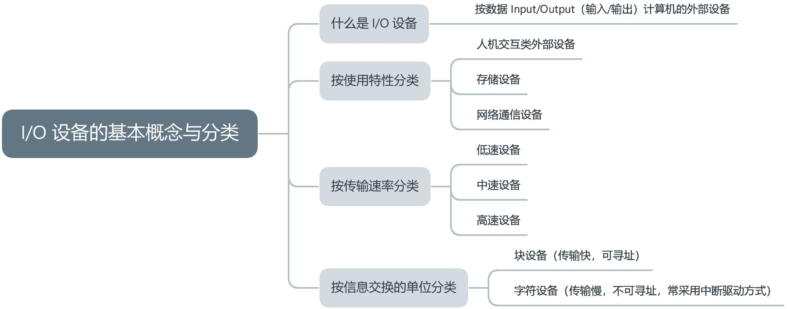

## I/O 控制器

**知识总览**：


I/O 设备由机械部件和电子部件组成。

### I/O 设备的机械部件


I/O 设备的<span style="color:#BA487F; font-weight:bold">机械部件</span>主要用来执行具体 I/O 操作。如我们看得见、摸得着的鼠标、键盘的按钮；显示器的 LED 屏；移动硬盘的磁臂、磁盘背面。

I/O 设备的<span style="color:#0D5EA6; font-weight:bold">电子部件</span>通常是一块插入主板扩充槽的印刷电路板。

### I/O 设备的电子部件（I/O 控制器）

CPU 无法直接控制 I/O 设备的机械部件，因此 I/O 设备还要有一个电子部件作为 CPU 和 I/O 设备机械部件之间的<span style="color:#ED3500; font-weight:bold">中介</span>，用于实现 CPU 对设备的控制。

这个电子部件就是 <span style="color:#093FB4; font-weight:bold">I/O 控制器</span>，又称<span style="color:#093FB4; font-weight:bold">设备控制器</span>。CPU 可控制 I/O 控制器，又由 I/O 控制器来控制设备的机械部件。


- **接受和识别 CPU 发出的命令**：如 CPU 发出的 `read`、`write` 命令，I/O 控制器中会有相应的<span style="color:#E67514">**控制寄存器**</span>来存放命令和参数
- **向 CPU 报告设备的状态**：I/O 控制器中会有相应的<span style="color:#471396">**状态寄存器**</span>，用于记录 I/O 设备的当前状态；例如，1 表示空闲，0 表示忙碌
- **数据交换**：I/O 控制器中会设置相应的<span style="color:#347433">**数据寄存器**</span>；输出时，数据寄存器用于暂存 CPU 发来的数据，之后再由控制器传送到设备；输入时，数据寄存器用于暂存设备发来的数据，之后 CPU 从数据寄存器中取走数据
- **地址识别**：类似于内存的地址，为了区分设备控制器中的各个寄存器，也需要给各个寄存器设置一个<span style="color:#00809D">**地址**</span>；I/O 控制器通过 CPU 提供的<span style="color:#00809D">**地址**</span>来判断 CPU 要读/写的是哪个寄存器

### I/O 控制器的组成



- <span style="color:#EA2F14; font-weight:bold">CPU 与控制器的接口</span>：用于实现 CPU 与控制器之间的通信；CPU 通过控制线发出命令；通过地址线指明要操作的设备；通过数据线来取出（输入）数据，或放入（输出）数据
- <span style="color:#EA2F14; font-weight:bold">I/O 逻辑</span>：负责接收和识别 CPU 的各种命令（如地址译码），并负责对设备发出命令
- <span style="color:#EA2F14; font-weight:bold">控制器和设备的接口</span>：用于实现控制器与设备之间的通信
- <span style="color:#EA2F14; font-weight:bold">数据</span>：传送输入/输出数据
- <span style="color:#EA2F14; font-weight:bold">状态</span>：设备要反馈状态（忙碌/空闲）
- <span style="color:#EA2F14; font-weight:bold">控制</span>：控制器向设备发出控制信息

> **注意**：
>
> 1. 一个 I/O 控制器可能会对应多个设备
> 2. 数据寄存器、控制寄存器、状态寄存器可能有多个（例如，每个控制/状态寄存器对应一个具体的设备），且这些寄存器都要有相应的地址，才能方便 CPU 操作；有的计算机会让这些寄存器占用内存地址的一部分，称为<span style="color:#B33791">**内存映像 I/O**</span>；另一些计算机则采用 I/O 专用地址，即<span style="color:#B33791">**寄存器独立编址**</span>

### 内存映像 I/O vs. 寄存器独立编址



内存映射 I/O，控制器中的寄存器与内存统一编址；优点是简化了指令，可以采用对内存进行操作的指令来对控制器进行操作。

寄存器独立编址，控制器中的寄存器使用单独的地址；缺点是需要设置专门的指令来实现对控制器的操作，不仅要指明寄存器的地址，还要指明控制器的编号。

---


## I/O 控制方式

**知识总览**：


> **注意**：
>
> 1. 完成一次读/写操作的流程
> 2. CPU 干预的频率
> 3. 数据传送的单位
> 4. 数据的流向
> 5. 主要缺点和主要优点

### 程序直接控制方式

完成一次读/写操作的流程（以<span style="color:#E6521F">**读操作**</span>为例）：



1. CPU 向控制器发出读指令；于是设备启动，并且状态寄存器设为 1（未就绪）
2. 轮询检查控制器的状态（本质上就是不断执行程序的循环；若是状态位始终为 1，说明设备还没准备好要输入的数据，于是 CPU 会不断地轮询）
3. 输入设备准备好数据后将数据传给控制器，并报告自身状态
4. 控制器将输入的数据放到数据寄存器中，并将状态改为 0（已就绪）
5. CPU 发现设备已就绪，即可将寄存器中的内容读入 CPU 的寄存器中，再把 CPU 寄存器中的内容放入内存
6. 若还要继续读入数据，则 CPU 继续发出指令


```c
#include <stdio.h>
#include <stdlib.h>

int main() {
    int a, b, c, d;
    scanf("%d", &a);  // 输入整数并赋值给变量 a
    scanf("%d", &b);  // 输入整数并赋值给变量 b
    printf("a + b = %d\n", a + b); // 计算 a + b 的值
    scanf("%d %d", &c, &d);        // 输入两个整数并赋值给 c、d
    printf("c * d = %d\n", c * d); // 计算 c * b 的值
    
    system("pause");
    return 0;
}
```

由代码可知，输入的数据最终要放到内存中（因为 `a`、`b`、`c`、`d` 等变量存放在内存中）；同理，输出的数据也存放在内存中，需要从内存中取出。

在使用<span style="color:#0046FF">**轮询**</span>这种方式时，CPU 干预的频率很频繁，I/O 操作开始之前、开始之后需要 CPU 介入，并且<span style="color:#E43636; font-weight:bold">在等待 I/O 完成的过程中，CPU 需要不断地轮询检查</span>。

数据传送的单位是每次读/写<span style="color:#7ADAA5; font-weight:bold">一个字</span>。

数据的流向：

- <span style="color:#B9375D">**读操作（数据输入）**</span>：I/O 设备 → CPU（指的是 CPU 的寄存器） → 内存
- <span style="color:#B9375D; font-weight:bold">写操作（数据输出）</span>：内存 → CPU → I/O 设备

每个字的读/写都需要 CPU 的帮助。

- <span style="color:#386641; font-weight:bold">优点</span>：实现简单；在读/写指令之后，加上实现循环检查的一系列指令即可（因此才称为**程序直接控制方式**）
- <span style="color:#386641; font-weight:bold">缺点</span>：<span style="color:#FB4141">CPU 和 I/O 设备只能**串行**工作，CPU 需要一直轮询检查，长期处于**忙等**状态</span>，CPU 利用率低

### 中断驱动方式

引入<span style="color:#001BB7">中断机制</span>；由于 I/O 设备速度很慢，因此在 CPU 发出读/写命令后，可<span style="color:#001BB7">将等待 I/O 的进程阻塞</span>，先切换到别的进程执行；当 I/O 完成后，控制器会向 CPU 发出一个中断信号，CPU <span style="color:#001BB7">检测到中断信号后</span>，会保存当前进程的运行环境信息，转去执行中断处理程序处理该中断。处理中断的过程中，CPU 从 I/O 控制器读一个字的数据传送到 CPU 寄存器，再写入主存。接着，<span style="color:#001BB7">CPU 恢复等待 I/O 的进程（或其他进程）的运行环境，然后继续执行</span>。


> **注意**：
>
> 1. CPU 会在每个指令周期的末尾检查中断
> 2. 中断处理过程中需要保存、恢复进程的运行环境，这个过程是需要一定的时间开销的；可见，如果中断发生的频率太高，也会降低系统性能（每次中断读取一个字，因此读取大量数据会产生大量的中断）

CPU 干预频率，在每次 I/O 操作开始之前、完成之后需要 CPU 介入；<span style="color:#B9375D">等待 I/O 完成的过程中，CPU 可以切换到别的进程执行</span>。

数据传送的单位为每次读/写<span style="color:#B9375D">一个字</span>。

数据的流向：

- <span style="color:#F97A00">**读操作（数据输入）**</span>：I/O 设备 → CPU（指的是 CPU 的寄存器） → 内存
- <span style="color:#F97A00; font-weight:bold">写操作（数据输出）</span>：内存 → CPU → I/O 设备

主要缺点与主要优点：

- <span style="color:#799EFF; font-weight:bold">优点</span>：与**程序直接控制方式**相比，在**中断驱动方式**中，I/O 控制器会通过中断信号主动报告 I/O 已完成，CPU 不再需要不停地轮询；<span style="color:#9929EA">CPU 和 I/O 设备可并行工作</span>，CPU 利用率得到明显提升
- <span style="color:#799EFF; font-weight:bold">缺点</span>：每个字在 I/O 设备和内存之间的传输，都需要经过 CPU；而<span style="color:#9929EA">频繁的中断处理会消耗较多的 CPU 时间</span>

### DMA 方式

与**中断驱动方式**相比，<span style="color:#FF2DD1">DMA 方式</span>（Direct Memory Access，<span style="color:#FF2DD1">直接存储器存取</span>；主要用于块设备的 I/O 控制）有以下改进：

1. <span style="color:#ED3500">数据的传送单位是**块**</span>；不再是字单位的传送
2. 数据的流向是从设备直接放入内存，或者从内存直接到设备；不再需要 CPU 作为中介
3. 仅在传送一个或多个数据块的开始和结束时，才需要 CPU 干预



CPU 指明此次<span style="color:#E43636">要进行的操作</span>（如读操作），并说明<span style="color:#E43636">要读入多少数据</span>、数据<span style="color:#E43636">要存放在内存的什么位置</span>、数据<span style="color:#E43636">在外部设备上的地址</span>（如磁盘上的地址）。

控制器会根据 CPU 提出的要求完成数据的读/写工作，整块数据的传输完成后，才向 CPU <u>发出中断信号</u>。



- <span style="color:#FF7D29; font-weight:bold">DR（Data Register，数据寄存器）</span>：暂存从设备到内存或从内存到设备的数据
- <span style="color:#FF7D29; font-weight:bold">MAR（Memory Address Register，内存地址寄存器）</span>：在输入时，MAR 表示数据存放到内存的位置；输出时，MAR 表示要输出的数据存放在内存中的位置
- <span style="color:#FF7D29; font-weight:bold">DC（Data Counter，数据计算器）</span>：表示<u>剩余</u>要读/写的字节数
- <span style="color:#FF7D29; font-weight:bold">CR（Command Register，命令/状态寄存器）</span>：用于存放 CPU 发来的 <u>I/O 命令</u>，或设备的<u>状态信息</u>

> **注意**：DMA 控制器读取数据也是以字为单位读取，暂存于 DR 中。

---

CPU 仅在传送一个或多个数据块的开始和结束时进行干预。

每次读/写<span style="color:#725CAD">**一个或多个块**</span>。（每次读写的只能是连续的多个块，且这些块读入内存后在内存中也必须是连续的）

数据的流向（<span style="color:#0ABAB5; font-weight:bold">不再需要经过 CPU</span>）：

- <span style="color:#B33791; font-weight:bold">读数据（数据输入）</span>：I/O 设备 → 内存
- <span style="color:#B33791; font-weight:bold">写数据（数据输出）</span>：内存  → I/O 设备

主要缺点与主要优点：

- <span style="color:#254D70; font-weight:bold">优点</span>：数据传输以<span style="color:#FF8040">**块**</span>为单位，CPU 介入频率进一步减低；数据的传输不再需要先经过 CPU 再写入内存，数据传输效率进一步增加；CPU 和 I/O 设备的并行性得到提高
- <span style="color:#254D70; font-weight:bold">缺点</span>：CPU 每发出一条 I/O 指令，只能读/写一个或多个连续的数据块

如果要读/写多个<u>离散存储</u>的数据块，或者要将数据分别写到<u>不同的内存区域</u>时，CPU 要分别发出多条 I/O 指令，进行多次中断处理才能完成。

### 通道控制方式

<span style="color:#B9375D">**通道（Channel，即 I/O 通道处理器）**</span>，一种<span style="color:#B9375D">硬件</span>，可以理解为<span style="color:#B9375D; font-weight:bold">弱化版的 CPU</span>；通道可以识别并执行一系列的<span style="color:#B9375D">通道指令</span>。

1. CPU 向通道发出 I/O 指令；指明<u>通道程序</u>在内存中的位置，并指明要操作的是<u>哪个 I/O 设备</u>；之后，CPU 就切换到其他进程执行了
2. 通道执行内存中的<u>通道程序</u>（Channel Program，也叫 Channel Command Word 列表；其中指明了要读入/写出多少数据，读/写的数据应放在内存的什么位置等信息）
3. 通道执行完规定的任务后，向 CPU 发出中断信号，之后 CPU 对中断进行处理


与 CPU 相比，通道可以执行的指令很单一，并且通道程序是放在主机内存中的，也就是说通道与 CPU <u>共享内存</u>。

CPU 的干预频率极低，通道会根据 CPU 的指示执行相应的通道程序，只有完成一组数据块的读/写后才需要发出中断信号，请求 CPU 干预。


数据传送的单位是每次读/写<span style="color:#BA487F">一组数据块</span>。

数据的流向（<span style="color:#C83F12">在通道的控制下进行</span>）：

- <span style="color:#C68EFD; font-weight:bold">读操作（数据输入）</span>：I/O 设备 → 内存
- <span style="color:#C68EFD; font-weight:bold">写操作（数据输出）</span>：内存 → I/O 设备

主要缺点和主要优点：

- <span style="color:#3674B5; font-weight:bold">缺点</span>：实现复杂，需要专门的通道硬件支持
- <span style="color:#3674B5; font-weight:bold">优点</span>：CPU、通道、I/O 设备可并行工作，资源利用率很高

---

<table>
  <thead>
    <tr>
      <th></th>
      <th>完成一次读/写的过程</th>
      <th>CPU 干预频率</th>
      <th>每次 I/O 的数据传输单位</th>
      <th>数据流向</th>
      <th>优缺点</th>
    </tr>
  </thead>
  <tbody>
    <tr>
      <td>程序直接控制方式</td>
      <td>CPU 发出 I/O 命令后需要不断轮询</td>
      <td>极高</td>
      <td>字</td>
      <td class="data-flow-cell">设备 → CPU → 内存, 内存 → CPU → 设备</td>
      <td rowspan="4" class="advantages-cell">
        每一个阶段的优点都是解决了上一阶段的最大缺点。总体来说，整个发展过程就是要尽量减少 CPU 对 I/O 过程的干预，把 CPU 从繁杂的 I/O 控制事务中解脱出来，以便更多地去完成数据处理任务。
      </td>
    </tr>
    <tr>
      <td>中断驱动方式</td>
      <td>CPU 发出 I/O 命令后可以做其他事，本次 I/O 完成后设备控制器发出中断信号</td>
      <td>高</td>
      <td>字</td>
      <td class="data-flow-cell">设备 → CPU → 内存, 内存 → CPU → 设备</td>
    </tr>
    <tr>
      <td>DMA 方式</td>
      <td>CPU 发出 I/O 命令后可以做其他事，本次 I/O 完成后 DMA 控制器发出中断信号</td>
      <td>中</td>
      <td>块</td>
      <td class="data-flow-cell">设备 → 内存, 内存 → 设备</td>
    </tr>
    <tr>
      <td>通道控制方式</td>
      <td>CPU 发出 I/O 命令后可以做其他事。通道会执行通道程序以完成 I/O，完成后通道向 CPU 发出中断信号</td>
      <td>低</td>
      <td>一组块</td>
      <td class="data-flow-cell">设备 → 内存, 内存 → 设备</td>
    </tr>
  </tbody>
</table>

## I/O 软件层次结构

**知识总览**：


每一层会利用其下层提供的服务，实现某些功能，并屏蔽实现的具体细节，向高层提供服务。（<span style="color:#E43636">封装思想</span>）

### 用户层软件


用户层软件（又称系统调用处理层），<span style="color:#0046FF">实现了与用户交互的接口</span>，用户可直接使用该层提供的、与 I/O 操作相关的<u>库函数</u>对设备进行操作。（例如 `printf("Hello World!");`）

用户层软件将用户请求翻译成格式化的 I/O 请求，并通过<span style="color:#239BA7">系统调用</span>请求系统内核的服务。（`printf("Hello World!");` 会被翻译为等价的 `write` 系统调用，当然，用户层软件也会在系统调用时填入相应参数）

Windows 操作系统向外提供的一系列系统调用，但是由于系统调用的格式严格、使用麻烦，因此在用户层上封装了一系列更方便的库函数接口供用户使用。（Windows API）

### 设备独立性软件

<span style="color:#689B8A">**设备独立性软件**</span>，又称<span style="color:#3B38A0">设备无关性软件</span>；与设备的硬件特性无关的功能几乎均在这层实现。


主要实现的功能：

- 向上层提供统一的调用接口（如 `read`、`write` 系统调用）

- 设备的保护：原理类似于<u>文件保护</u>。设备被看做是一种特殊的文件，不同用户对各个文件的访问权限是不一样的；同理，对设备的访问权限也不一样

- 差错处理：设备独立性软件需要对一些设备的错误进行处理

- 设备的分配与回收（设备是一种<u>临界资源</u>）

- 数据缓冲区管理：可以通过缓冲技术屏蔽设备之间数据交换单位大小和传输速度的差异

- 建立逻辑设备名到物理设备名的映射关系；根据设备类型选择调用相应的驱动程序。

  例如用户或用户层软件发出 I/O 操作相关系统调用的系统调用时，需要指明此次要操作的 I/O 设备的逻辑设备名。（举例，去学校打印店打印时，需要选择“打印机 1”、“打印机 2”、“打印机 3”，其实这些都是<span style="color:#FF7A30">逻辑设备名</span>）

  <span style="color:#B12C00">设备独立性软件</span>需要通过<span style="color:#B12C00; font-weight:bold">逻辑设备表（LUT，Logical Unit Table）</span>来确定设备对应的<span style="color:#B12C00">物理设备</span>，并找到该设备对应的<span style="color:#B12C00">设备驱动程序</span>。

  | 逻辑设备名      | 物理设备名 | 驱动程序入口地址 |
  | --------------- | ---------- | ---------------- |
  | `/dev/打印机 1` | 3          | 1024             |
  | `/dev/打印机 2` | 5          | 2046             |
  | $\cdots$        | $\cdots$   | $\cdots$         |

  > **注意**：
  >
  > - I/O 设备被当做一种特殊的文件
  > - 不同类型的 I/O 设备需要有不同的驱动程序处理

  操作系统可以采用两种方式管理<span style="color:#34699A">逻辑设备表（LUT）</span>。

  1. <span style="color:#34699A">**整个系统**只设置一份 LUT</span>，代表所有用户不能使用相同的逻辑设备名，因此该方式仅适用于单用户操作系统
  2. <span style="color:#34699A">为**每个用户**设置一份 LUT</span>，各个用户使用的逻辑设备名可重复，适用于多用户操作系统；系统会在用户登陆时为其建立一个<u>用户管理进程</u>，而 LUT 就存放在用户管理进程的 PCB 中

### 设备驱动程序

**为什么不同类型的 I/O 设备需要有不同的驱动程序处理？**

各式各样的设备，外形不同，其内部的<u>电子部件（I/O 控制器）</u>也可能不同。


不同设备的内部硬件特性也不同，这些特性仅有厂家知晓，因此厂家须提供与设备相对应的驱动程序，CPU 执行驱动程序的指令序列，来完成设置设备寄存器、检查设备状态等工作。

---

<span style="color:#FE7743">**设备驱动程序**</span>，主要负责对硬件设备的具体控制，将上层发出的一系列命令（如 `read`、`write`）转化为特定设备<span style="color:#FF9898; font-weight:bold">能听得懂</span>的一系列操作，包括设置设备寄存器、检查设备状态等。

不同的 I/O 设备有不同的硬件特性，具体细节只有设备厂家知晓。因此厂家需要根据设备的硬件特性设计并提供相应的驱动程序。

> **注意**：驱动程序一般会以一个<u>独立进程</u>的方式存在。

### 中断处理程序

当 I/O 任务完成后，I/O 控制器会发送一个<span style="color:#FF9B45">**中断信号**</span>，系统会根据<span style="color:#CD5656">根据中断信号类型</span>找到相应的<span style="color:#CD5656">中断处理程序</span>并执行。中断处理程序的处理流程如下：



可见，中断处理程序也会<u>和硬件打交道</u>。

## 输入/输出应用程序接口、设备驱动程序接口

**知识总览**：


### 输入/输出应用程序接口



显然，用户层的应用程序无法用一个<span style="color:#239BA7"><u>统一的系统调用</u></span>接口来完成所有类型设备的 I/O。



- <span style="color:#6C8EBF; font-weight:bold">字符设备接口</span>：`get`、`put` 系统调用，向字符设备读/写一个字符

- <span style="color:#9673A6">**块设备接口**</span>：

  - `read`、`write` 系统调用：向块设备的<span style="color:#BB6653">读写指针位置</span>读/写多个字符
  - `seek` 系统调用：<span style="color:#BB6653">修改**读写指针**位置</span>

- 网络设备接口，又称**<span style="color:#D92C54">网络套接字（`socket`）接口</span>**：

  - `socket` 系统调用，<span style="color:#0D5EA6">创建一个网络套接字</span>，需指明网络协议（TCP、UDP 等）
  - `bind`：将套接字绑定到某个本地<span style="color:#954C2E">**端口**</span>
  - `connect`：将套接字连接到远程地址
  - `read` / `write`：从套接字读/写数据

  

### 阻塞/非阻塞 I/O

- <span style="color:#FF9898; font-weight:bold">阻塞 I/O</span>：应用程序发出 I/O 系统调用，<span style="color:#CA7842">进程需转为阻塞态等待</span>（例如字符设备接口——从键盘读一个字符，`get`）
- <span style="color:#FF9898; font-weight:bold">非阻塞 I/O</span>：应用程序发出 I/O 系统调用，系统调用可迅速返回，<span style="color:#129990">进程无需阻塞等待</span>（例如块设备接口——往磁盘写数据，`write`）

> **注意**：即使磁盘正在忙碌，也不需要用户进程等待；因为进程准备的数据位于用户区，操作系统又存在内核区；发出 `write` 系统调用时，即使磁盘正在忙碌，设备独立性软件也会迅速地响应系统调用请求，将数据复制到内核区的缓存，之后内核将数据读入磁盘。

### 设备驱动程序接口



若各公司开发的设备驱动程序接口不统一，则操作系统很难调用设备驱动程序。



操作系统规定好设备驱动程序的接口标准，各厂商必须按要求开发设备驱动程序。不同的操作系统，对设备驱动程序接口的标准各不相同。

## I/O 核心子系统

**知识总览**：


因此 I/O 核心子系统要实现的功能其实就是中间三层要实现的功能。


### I/O 调度

<span style="color:#FF2DD1">**I/O 调度**</span>，用某种算法确定一个好的顺序来处理各个 I/O 请求。

例如，磁盘调度（先来先服务算法、最短寻道有限算法、SCAN 算法、C-SCAN 算法、LOOK 算法、C-LOOK 算法）。当多个磁盘 I/O 请求到来时，用某种调度算法来确定满足 I/O 请求的顺序。

同理，打印机等设备也可以用先来先服务算法、优先级算法、短作业优先等算法来确定 I/O 调度顺序。

### 设备保护

操作系统需要实现<span style="color:#6420AA">文件保护功能</span>，不同的用户对各个文件有不同的访问权限。（例如，只读、读和写等）

在 UNIX 系统中，<span style="color:#FF004D">设备被看作是一种特殊的文件</span>，每个设备也会有对应的 FCB。当用户请求访问某个设备时，系统根据 FCB 中记录的信息来判断该用户是否有相应的访问权限，以此实现**设备保护**功能。（可以参考<u>文件保护</u>）

## 假脱机技术（SPOOLing 技术）

**知识总览**：

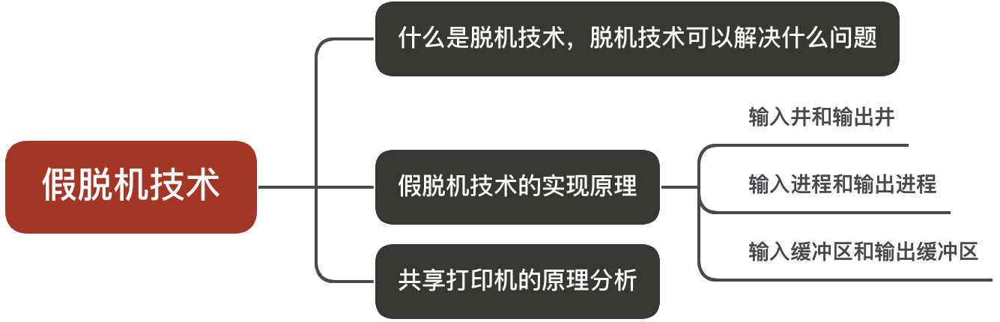

### 脱机技术的定义


<span style="color:#687EFF">手工操作阶段</span>，主机直接从 I/O 设备获得数据，由于设备速度慢，主机速度快。人机速度矛盾明显，主机要浪费很多时间来等待设备。

批处理阶段引入了<span style="color:#9400FF">脱机输入/输出技术</span>（用磁带完成）：



在外围控制机的控制下，慢速输入设备的数据先被输入到更快速的磁盘上。之后主机可以从快速的磁带上读入数据，从而缓解了速度矛盾。

> **注意**：之所以称之为“脱机”，因为其<u>脱离主机的控制</u>进行的输入/输出操作。

引入脱机技术后，缓解了 CPU 与慢速 I/O 设备的速度矛盾。另一方面，即使 CPU 在忙碌，也可以提前将数据输入到磁带；即使慢速的输出设备正在忙碌，也可以提前将数据输出到磁盘。

### 假脱机技术——输入井和输出井

<span style="color:#C70039; font-weight:bold">*假*脱机技术</span>，又称<span style="color:#C70039; font-weight:bold"> SPOOLing 技术</span>使用软件的方式模拟脱机技术。SPOOLing 系统的组成如下：



在<u>磁盘</u>上开辟出两个存储区域——**输入井**和**输出井**。

- <span style="color:#0B666A">**输入井**</span>模拟脱机输入时的磁带，用于收容 I/O 设备输入的数据
- <span style="color:#0B666A">**输出井**</span>模拟脱机输出时的磁带，用于收容用户进程输出的数据
- <span style="color:#0F6292; font-weight:bold">输入进程</span>模拟脱机输入时的外围控制机
- <span style="color:#0F6292; font-weight:bold">输出进程</span>模拟脱机输出时的外围控制机

要实现 SPOOLing 技术，<span style="color:#FB2576">必须要有**多道程序技术**的支持</span>；系统会建立**输入进程**和**输出进程**。

### 假脱机技术——输入/输出缓冲区


在输入进程的控制下，**输入缓冲区**用于暂存从输入设备输入的数据，之后再转存到输入井中。

在输出进程的控制下，**输出缓冲区**用于暂存从输出井输出的数据，之后再转存到输出设备上。

> **注意**：输入缓冲区和输出缓冲区是在<u>内存</u>中的缓冲区。

### 共享打印机原理分析

- <span style="color:#FF6464">**独占式设备**</span>，只允许各个进程**串行**使用的设备；一段时间内只能满足一个进程的请求
- <span style="color:#FF6464">**共享设备**</span>，允许多个进程**同时**使用的设备（宏观上同时使用，微观上可能是交替使用）；可以同时满足多个进程的使用请求

打印机是一种<u>独占式设备</u>，但是可用 SPOOLing 技术改造成<u>共享设备</u>。

举例，对于独占式设备，若进程 1 正在使用打印机，则进程 2 请求使用打印机时必然<u>阻塞等待</u>。



当多个用户进程提出打印请求时，系统会答应它们的请求，但是并不是真正把打印机分配给它们，而是由假脱机管理进程为每个进程做两件事：

1. 在磁盘输出井中为进程申请一个<span style="color:#00879E">**空闲缓冲区**</span>（也就是说，这个缓冲区是在<span style="color:#00879E">磁盘</span>上的），并将要打印的数据送入其中

2. 为用户进程申请一张空白的<span style="color:#00879E">**打印请求表**</span>，并将用户的打印请求填入表中（用来说明用户的打印数据存放位置等信息），再将该表挂到<span style="color:#00879E">假脱机文件队列</span>上（即打印任务队列）。

   当打印机空闲时，输出进程会从文件队列的<span style="color:#00879E">队头</span>取出一张打印请求表，并根据表中的要求将要打印的数据从<span style="color:#00879E">输出井</span>传送到输出缓冲区，再输出到打印机进行打印；用这种方式可依次处理完全部的打印任务。

虽然系统中只有一台打印机，但每个进程提出打印请求时，系统都会为在输出井中为其分配一个存储区（相当于<span style="color:#00879E">分配了一个逻辑设备</span>），使每个用户进程都觉得自己在独占一台打印机，从而实现对打印机的共享。



SPOOLing 技术可以把一台物理设备<span style="color:#EA047E">虚拟</span>成逻辑上的多台设备，<span style="color:#EA047E">可将独占式设备改造成共享设备</span>。

---


## 设备的分配与回收

**知识总览**：



### 设备分配时应考虑的因素


设备的固有属性可分为三种：独占设备、共享设备、虚拟设备。

- <span style="color:#7E2553; font-weight:bold">独占设备</span>：一个时段只能分配给一个进程（如打印机）
- <span style="color:#7E2553; font-weight:bold">共享设备</span>：可同时分配给多个进程使用（如磁盘），各进程往往是宏观上同时共享使用设备，而微观上交替使用
- <span style="color:#7E2553; font-weight:bold">虚拟设备</span>：采用 SPOOLing 技术将独占设备改造成虚拟的共享设备

设备的分配算法：先来先服务、优先级高者优先、短任务优先……

从进程运行的安全性上考虑，设备分配有两种方式：

- <span style="color:#0002A1; font-weight:bold">安全分配方式</span>：为进程分配一个设备后就将进程阻塞，本次 I/O 完成后才将其唤醒（例如，进程请求打印机打印输出）。一个时间段内每个进程只能使用一个设备。
  - <span style="color:#D61C4E">**优点**</span>：破坏了**请求和保持**条件，不会死锁
  - <span style="color:#D61C4E">**缺点**</span>：对于一个进程来说，CPU 和 I/O 设备只能**串行**工作
- <span style="color:#0002A1; font-weight:bold">不安全分配方式</span>：进程发出 I/O 请求后，系统为其分配 I/O 设备，进程可继续执行，之后还可以发出新的 I/O 请求；只有某个 I/O 请求得不到满足时才将进程阻塞。一个进程可以同时使用多个设备。
  - <span style="color:#D61C4E">**优点**</span>：进程的计算人物和 I/O 任务可以并行处理，使进程迅速推进
  - <span style="color:#D61C4E">**缺点**</span>：有可能发生死锁（死锁避免、死锁的检测和解除）

### 静态分配和动态分配

- <span style="color:#FEB139; font-weight:bold">静态分配</span>：进程运行前为其分配全部所需资源，运行结束后归还资源（破坏了**请求和保持**条件，不会发生死锁）
- <span style="color:#FEB139; font-weight:bold">动态分配</span>：进程运行过程中动态申请设备资源

### 设备分配管理中的数据结构

设备、控制器、通道之间的关系：



一个通道可以控制多个设备控制器，每个设备控制器可控制多个设备。

<span style="color:#94ADD7; font-weight:bold">设备控制表（DCT, Device Control Table）</span>：系统为每个设备配置一张 DCT，用于记录设备情况。



> **注意**：系统会根据阻塞原因的不同，将进程 PCB 挂到不同的阻塞队列中。

<span style="color:#6A0066; font-weight:bold">控制器控制表（COCT, Controller Control Table）</span>：每个设备控制器会对应一张 COCT，操作系统会根据 COCT 的信息对控制器进行操作和管理。



<span style="color:#ED3500; font-weight:bold">通道控制表（CHCT, Channel Control Table）</span>：每个通道都会对应一张 CHCT，操作系统根据 CHCT 的信息对通道进行操作和管理。


<span style="color:#06923E; font-weight:bold">系统设备表（SDT）</span>：记录了<span style="color:#FF6F3C">系统中全部设备</span>的情况，每个设备对应一个表目。


### 设备分配的步骤

1. 根据进程请求的<span style="color:#FE7743">物理设备名</span>查找 SDT（物理设备名是进程请求分配设备时提供的参数）
2. 根据 SDT 找到 DCT，若<span style="color:#FE7743">设备</span>忙碌则将进程 PCB 挂到<span style="color:#FE7743">设备等待队列</span>中，不忙碌则将<span style="color:#FE7743">设备</span>分配给进程
3. 根据 DCT 找到 COCT，若<span style="color:#FE7743">控制器</span>忙碌则将进程 PCB 挂到<span style="color:#FE7743">控制器等待队列</span>中，不忙碌则将<span style="color:#FE7743">控制器</span>分配给进程
4. 根据 COCT 找到 CHCT，若<span style="color:#FE7743">通道</span>忙碌则将进程 PCB 挂到<span style="color:#FE7743">通道等待队列</span>中，不忙碌则将<span style="color:#FE7743">通道</span>分配给进程

> **注意**：只有设备、控制器、通道三者都分配成功时，这次设备分配才算成功，之后便可启动 I/O 设备进行数据传送。

**缺点**：

- 用户编程时必须使用**物理设备名**，底层细节对用户不透明，不方便编程
- 若换了一个物理设备，则程序无法运行
- 若进程请求的物理设备正在忙碌，则即使系统中还有同类型的设备，进程也必须阻塞等待

改进方法就是建立<span style="color:#B771E5">逻辑设备名</span>和<span style="color:#B771E5">物理设备名</span>的映射机制，用户编程时只需提供逻辑设备名。

### 设备分配步骤的改进

1. 根据进程请求的<span style="color:#780C28">逻辑设备名</span>查找 SDT（<span style="color:#780C28">用户编程时提供的逻辑设备名其实就是**设备类型**</span>）
2. 查找 SDT，找到用户进程<span style="color:#780C28">**指定类型的**、并且空闲</span>的设备，将其分配给该进程；操作系统<span style="color:#780C28">在该进程的逻辑设备表（LUT）中新增一个表项</span>
3. 根据 DCT 找到 COCT，若<span style="color:#FE7743">控制器</span>忙碌则将进程 PCB 挂到<span style="color:#FE7743">控制器等待队列</span>中，不忙碌则将<span style="color:#FE7743">控制器</span>分配给进程
4. 根据 COCT 找到 CHCT，若<span style="color:#FE7743">通道</span>忙碌则将进程 PCB 挂到<span style="color:#FE7743">通道等待队列</span>中，不忙碌则将<span style="color:#FE7743">通道</span>分配给进程

| 逻辑设备名      | 物理设备名 | 驱动程序入口地址 |
| --------------- | ---------- | ---------------- |
| `/dev/打印机 1` | 3          | 1024             |
| `/dev/打印机 2` | 5          | 2046             |
| $\cdots$        | $\cdots$   | $\cdots$         |

<span style="color:#F26B0F">逻辑设备表（LUT）建立了**逻辑设备名**与**物理设备名**之间的映射关系。</span>

某用户进程第一次使用设备时使用逻辑设备名向操作系统发出请求，操作系统根据用户进程指定的设备类型（逻辑设备名）查找系统设备表，找到一个空闲设备分配给进程，并在 LUT 中增加相应表项。

<span style="color:#F26B0F">如果之后用户进程再次通过相同的逻辑设备名请求使用设备，则操作系统通过 LUT 表即可知道用户进程实际要使用的是哪个物理设备了，并且也能知道该设备的驱动程序入口地址。</span>

逻辑设备表的设置问题：

- 整个系统只有一张 LUT：各用户所用的<span style="color:#DA498D">逻辑设备名不允许重复</span>，适用于单用户操作系统
- 每个用户一张 LUT：<span style="color:#DA498D">不同用户的逻辑设备名可重复</span>，适用于多用户操作系统

---

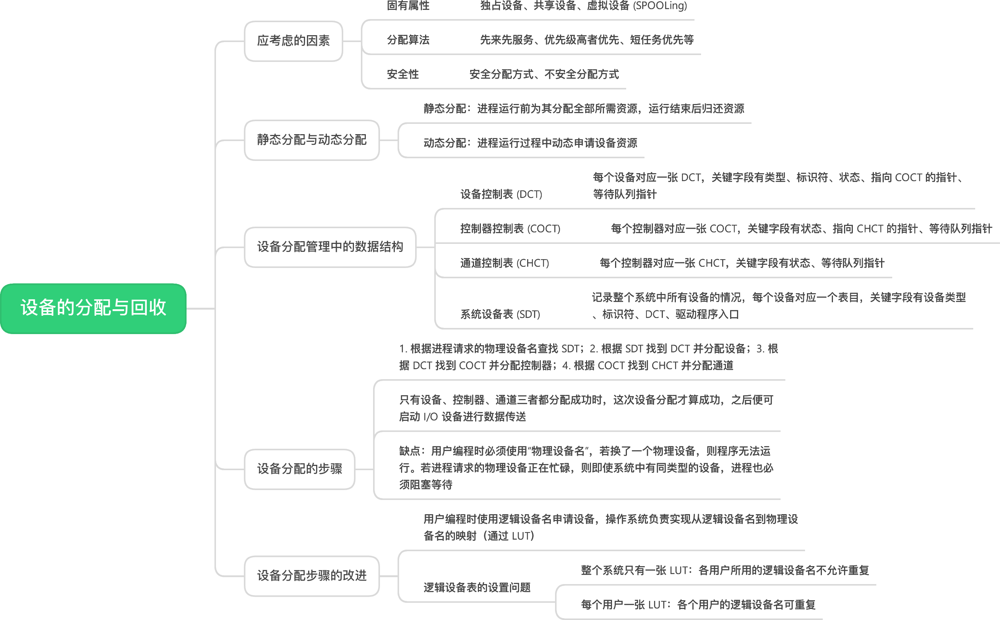

## 缓冲区管理

**知识总览**：



### 缓冲区的定义

缓冲区是一个存储区域，可以由专门的硬件寄存器组成，也可利用内存作为缓冲区。

使用<span style="color:#A55B4B">**硬件作为缓冲区**</span>的<span style="color:#A55B4B">**成本较高**</span>，<span style="color:#A55B4B">**容量也较小**</span>，一般仅用在对速度要求非常高的场合。（如存储器管理中所用的联想寄存器，由于对页表的访问频率极高，因此使用速度很快的联想寄存器来存放页表项的副本）

一般情况下，更多的是利用<span style="color:#E4004B">内存作为缓冲区</span>，**设备独立性软件**的缓冲区管理就是要组织管理好这些缓冲区。

### 缓冲区的作用




CPU 可以将要输出的数据<u>快速地</u>放入缓冲区，之后就可以做其他事；慢速的 I/O 设备可以<u>慢慢</u>从缓冲区取走数据；数据输入时类似。


如果是字符型设备，则每输出完一个字符就要向 CPU 发生一次**中断信号**。

对于数据粒度方面，例如输出进程每次可以生成一块数据，但 I/O 设备每次只能输出一个字符。

### 单缓冲

假设某用户进程请求某种块设备读入若干块的数据。若采用<span style="color:#E43636">**单缓冲**</span>的策略，操作系统会<span style="color:#E43636">在**主存**中为其分配一个缓冲区</span>。（一般而言，一个缓冲区的大小就是一个块）

> **注意**：
>
> - 当缓冲区数据非空时，不能往缓冲区充入数据，只能从缓冲区把数据传出
> - 当缓冲区为空时，可以往缓冲区冲充入数据，但必须把缓冲区充满以后，才能从缓冲区把数据传出

用户进程的内存空间中，会分出一片工作区来接受输入/输出数据。（一般也默认工作区大小与缓冲区相同）


**计算每处理一块数据平均需要多久？**

假定一个初始状态，分析下次到达相同状态需要多少时间，这就是处理一块数据平均所需时间。

一般而言，可以假设初始状态为工作区满、缓冲区空。

**初始状态**：工作区满、缓冲区空。

- **<span style="color:#001BB7">假设 T > C</span>**，因此 CPU 处理完数据后暂时不能将下一块数据传送到工作区，必须等待缓冲区中充满数据。

  

  处理一块数据的平均用时为 T + M。

- **<span style="color:#001BB7">假设 T < C</span>**，因此缓冲区中充满数据后暂时不能继续充入下一块数据，必须等待 CPU 处理结束后将数据从缓冲区传送到工作区。

  

  处理一块数据的平均用时为 C + M。

因此，采用单缓冲策略，处理一块数据平均耗时 $\max\{C,\, T\} + M$。

### 双缓冲

假设某用户进程请求某种块设备读入若干块的数据。若采用<span style="color:#E43636">双缓冲</span>的策略，操作系统会<span style="color:#E43636">在主存中为其分配两个缓冲区</span>。（一般而言，一个缓冲区的大小就是一个块）


若初始状态为<span style="color:#1679AB">工作区空，其中一个缓冲区满，另一个缓冲区空</span>。

- <span style="color:#266352">**假设 T > C + M**</span>：

  

  处理一份数据的平均用时为 T。

- <span style="color:#266352">**假设 T < C + M**</span>：

  > **注意**：M(1) 表示“将缓冲区 1 中的数据传送到工作区“；M(2) 表示”将缓冲区 2 中的数据传送到工作区“。

  假设 2T < 2M + C，则 I/O 设备将缓冲区 1 充满时，缓冲区 2 的数据尚未取空，因此 I/O 设备暂时不能充入数据。

  

  总之，T < C + M 意味着设备输入数据块的速度要比处理机处理数据块的速度更快，每处理一个数据块平均耗时 C + M。

因此，采用双缓冲策略，处理一个数据块的平均耗时为 $\max\{T, \, C + M \}$。

### 使用单/双缓冲在通信时的区别

两台机器通信时，可以配置缓冲区用于数据的发送和接收。



显然，若两个相互通信的机器只设置单缓冲区，在任一时刻只能实现数据的<span style="color:#FF76CE; font-weight:bold">单向传输</span>。



若两个相互通信的机器设置双缓冲区，则同一时刻可以实现双向的数据传输。

### 循环缓冲区

将多个<span style="color:#74C7B8">**大小相等**</span>的缓冲区链接成一个<span style="color:#74C7B8">**循环队列**</span>。



### 缓冲池

<span style="color:#FF004D">缓冲池</span>由系统中**共用的**缓冲区组成，这些缓冲区按使用情况可以分为：空缓冲队列、装满输入数据的缓冲队列（输入队列）、装满输出数据的缓冲队列（输出队列）。

另外，根据一个缓冲区在实际运算中扮演的角色不同，又设置了四种<span style="color:#083358">**工作缓冲区**</span>：用于收容输入数据的工作缓冲区（hin, Input Holding Buffer）、用于提取输入数据的工作缓冲区（sin, Input Service Buffer）、用于收容输出数据的工作缓冲区（hout, Output Hodling Buffer）、用于提取输出数据的工作缓冲区（sout, Output Service Buffer）。




1. <span style="color:#0D63A5">**输入进程请求输入数据**</span>：从空缓冲队列中取出一块作为“收容输入数据的工作缓冲区（hin）“；充满数据后将缓冲区挂到输入队列队尾
2. <span style="color:#0D63A5">**计算进程想要取得一块输入数据**</span>：从输入队列中去得一块输满输入数据的缓冲区作为“提取输入数据的工作缓冲区（sin）”；缓冲区读空后挂到空缓冲区队列
3. <span style="color:#0D63A5">**计算进程想要将准备好的数据充入缓冲区**</span>：从空缓冲队列中取出一块作为“收容输出数据的工作缓冲区（hout）”；数据充满后将缓冲区挂到输出队列队尾
4. <span style="color:#0D63A5">**输出进程请求输出数据**</span>：从输出队列中取得一块充满输出数据的缓冲区作为“提取输出数据的工作缓冲区（sout）”；缓冲区读空后挂到空缓冲区队列

---

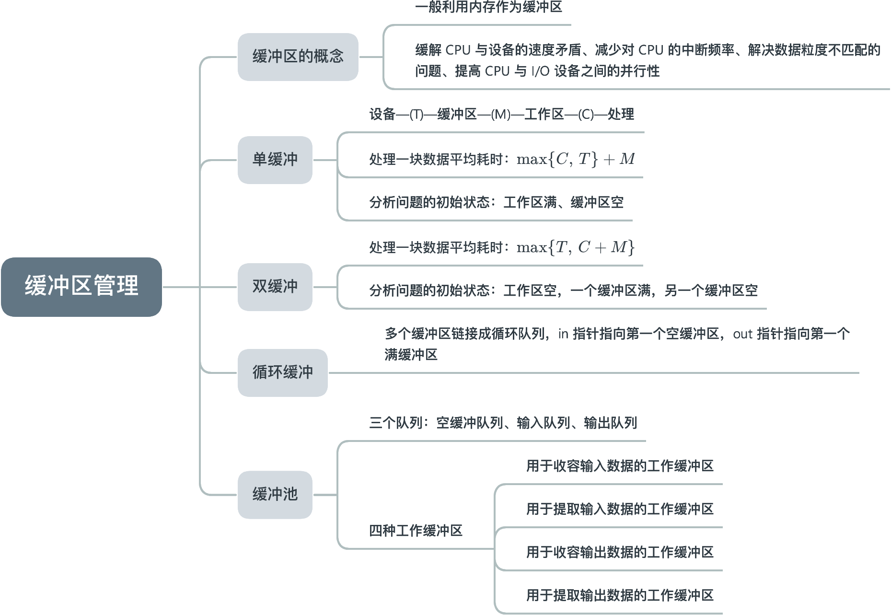

## 磁盘的结构

**知识总览**：



### 磁盘、磁道、扇区

磁盘的表面由一些磁性物质组成，可以用这些磁性物质来记录二进制数据。

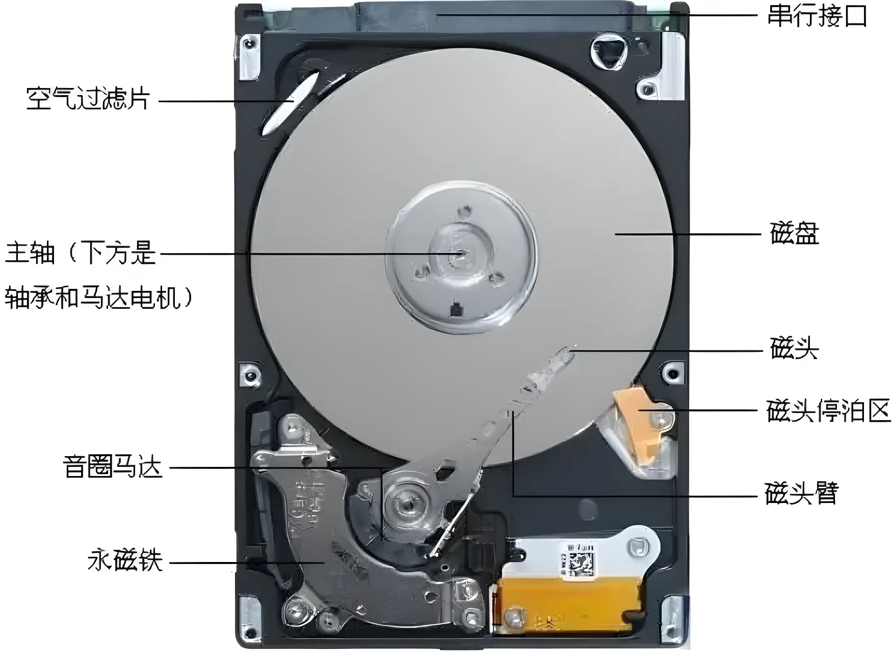

磁盘的盘片被划分为一个个磁道，这样的一个“圈”就是磁道。

一个磁道又被划分为一个个扇区，每个扇区就是一个“磁盘块”。<span style="color:#76A21E">**各个扇区存放的数据量相同（如 1KB）。**</span>

最内侧的扇区**面积最小**，因此**数据密度最大**。


### 如何在磁盘中读/写数据

需要把“磁头”移动到想要读/写的扇区所在的磁道。磁盘会转起来，让目标扇区从磁头下面划过，才能完成对扇区的读/写操作。


### 盘面、盘柱



### 磁盘的物理地址

可以用 `(柱面号, 盘面号, 扇区号)` 来定位任意一个**磁盘块**。（例如，文件存储在外存的几号块便可以转化为上述地址形式）

可根据该地址读取一个“块”：

1. 根据<span style="color:#2A629A">**柱面号**</span>移动磁臂，让磁头指向指定磁道
2. 激活指定盘面对应的磁头
3. 磁盘旋转的过程中，指定的扇区会从磁头下面划过，这样就完成了对指定扇区的读/写

### 磁盘的分类

磁头可以移动的称为<span style="color:#FF0000">活动磁头磁盘</span>。磁臂可以来回伸缩来带动磁头定位磁道。

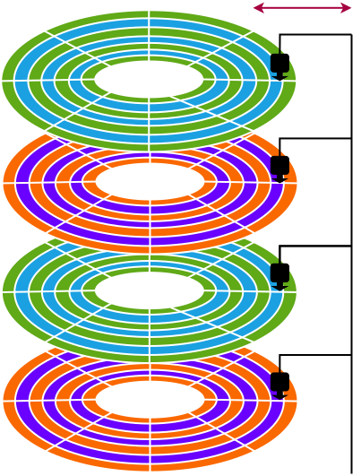

磁头不可移动的称为<span style="color:#D32626">固定磁头磁盘</span>。这种磁盘中每个磁道有一个磁头。

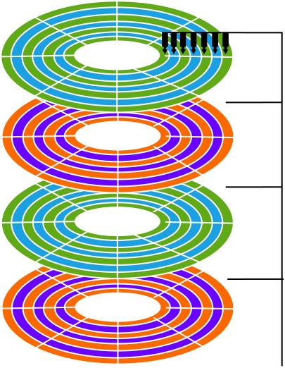

根据盘片是否可以更换分为<span style="color:#F05D23">可换盘磁盘</span>、<span style="color:#F05D23">固定盘磁盘</span>。

---

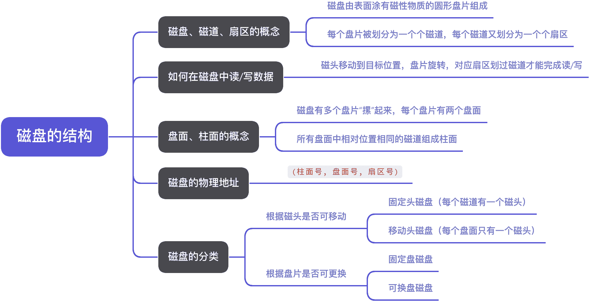

## 磁盘调度算法

**知识总览**：



### 一次磁盘读/写操作需要的时间


- **<span style="color:#FA163F">寻找时间（寻道时间）$T_S$</span>**：在读/写数据前，将磁头移动到指定磁道所花的时间。

  1. **<span style="color:#A45D5D">启动磁头臂</span>**是需要时间的；假设耗时为 s。

  2. **<span style="color:#A45D5D">移动磁头</span>**也是需要时间的；假设磁头匀速移动，每跨越一个磁道耗时 m，总共需要跨越 n 条磁道；则寻道时间为：
     $$
     T_S = s + m \times n
     $$
     现在的硬盘移动一个磁道大约需要 0.2ms，磁臂启动时间约为 2ms。

- **<span style="color:#FA163F">延迟时间 $T_R$</span>**：通过旋转磁盘，使磁头定位到目标扇区所需要的时间；设磁盘转速为 r（单位：转/秒，或转/分），则平均所需的延迟时间：
  $$
  T_R = \left(\frac{1}{2}\right) \times \left(\frac{1}{r}\right) = \frac{1} {2r}
  $$
  $\dfrac{1} {r}$ 就是转一圈需要的时间。找到目标扇区平均需要转半圈，因此再乘 $\dfrac{1}{2}$；硬盘的典型转速为 5400 转/分，或 7200 转/分。

- **<span style="color:#FA163F">传输时间 $T_t$</span>**：从磁盘读出或向磁盘写入数据所经历的时间，假设磁盘转速为 r，此次读/写的字节数为 b，每个磁道上的字节数为 N；则传输时间为：
  $$
  T_t = \left(\frac{1}{r}\right) \times \left(\frac{b}{N}\right) = \frac{b}{rN}
  $$
  每个磁道要可存 N 字节的数据，因此 b 字节的数据需要 $\dfrac{b}{N}$ 个磁道才能存储；而读/写一个磁道所需的时间刚好又是转一圈所需要的时间 $\dfrac{1}{r}$。

总的平均存取时间为 $T_a = T_S + \dfrac{1}{2r} + \dfrac{b}{rN}$。

**延迟时间**和**传输时间**都是<span style="color:#DA4949">磁盘转速</span>相关，且为线性相关；而转速是<span style="color:#DA4949">硬件固有属性</span>，因此操作系统也无法优化**延迟时间**和**传输时间**。

但是操作系统的<span style="color:#B3541E">磁盘调度算法</span>会直接影响<span style="color:#B3541E">寻道时间</span>。

### 先来先服务算法（FCFS）

根据进程<span style="color:#FF5733">请求访问磁盘的先后顺序</span>进行调度。

假设磁盘的初始位置是 100 号磁道，有多个进程先后陆续地请求 55、58、39、18、90、160、150、38、184 号磁道。

按照 FCFS 的规则，按照请求到达的顺序，磁头需要一次移动到 55、58、39、18、90、160、150、38、184 号磁道。


磁头总共移动了 45 + 3 + 19 + 21 + 72 + 70 +10 +112 +146 = 498 个磁道。

响应一个请求平均需要移动 498 ÷ 9 = 55.3 个磁道（平均寻找长度）。

- **<span style="color:#FF5733">优点</span>**：公平；若请求访问的磁道<u>比较集中</u>的话，算法性能尚可
- <span style="color:#FF5733; font-weight:bold">缺点</span>：若有大量进程竞争使用磁盘，请求访问的磁道很分散，则 FCFS 在性能上很差，寻道时间长

### 最短寻找时间优先（SSTF）

SSFT 算法会优先处理的磁道是与<span style="color:#FF4191">**当前磁头最近的磁道**</span>。可以保证每次的寻道时间最短，但是并不能保证总的寻道时间最短。（本质上是贪心算法的思想，只是选择眼前最优，但是总体未必最优）

假设磁头的初始位置是 100 号磁道，有多个进程先后陆续地请求访问 55、58、39、18、90、160、150、38、184 号磁道。


磁头总共移动了 (100 -18) + (184 - 18) = 248 个磁道。

响应一个请求平均需要移动 248 ÷ 9 = 27.5 个磁道（平均寻找长度）。

- <span style="color:#3AB0FF; font-weight:bold">优点</span>：性能较好，平均寻道时间短
- <span style="color:#3AB0FF; font-weight:bold">缺点</span>：可能产生“<u>饥饿</u>”现象

例如，如果在处理 18 号磁道的访问请求时又来了一个 38 号磁道的访问请求，处理 38 号磁道的访问请求时又来了一个 18 号磁道的访问请求。如果有源源不断的 18 号、38 号磁道的访问请求到来的话，150、160、184 号磁道的访问请求就永远得不到满足，从而产生“饥饿”现象。

产生饥饿的原因在于，<span style="color:#FF4191">磁头在一个小区域内来回地移动</span>。

### 扫描算法（SCAN）

SSTF 算法会产生饥饿的原因在于：磁头有可能在一个小区域内来回来去地移动。为了防止这个问题，可以规定只有磁头移动到<span style="color:#B983FF">**最外侧磁道**</span>的时候才能<span style="color:#B983FF">**往内移动**</span>，移动到<span style="color:#B983FF">**最内侧磁道**</span>的时候才能**<span style="color:#B983FF">往外移动</span>**。这就是扫描算法（SCAN）的思想。由于磁头移动的方式很像电梯，因此也叫<span style="color:#CF7500">**电梯算法**</span>。

假设某磁盘的磁道为 0~200 号，磁头的初始位置是 100 号磁道，且<span style="color:#004A2F">**此时磁头正在往<u>磁道号增大</u>的方向移动**</span>，有多个进程先后陆续地请求访问 55、58、39、18、90、160、150、38、184 号磁道：



磁头总共移动了 (200 - 100) + (200 - 18) = 282 个磁道。

响应一个请求平均需要移动 282 ÷ 9 = 31.3 个磁道（平均寻找长度）。

- <span style="color:#413543; font-weight:bold">优点</span>：性能较好，平均寻道时间较短，不会产生饥饿现象
- <span style="color:#413543;font-weight:bold">缺点</span>：
  1. 只有到达<span style="color:#4A47A3">**最边缘**</span>的磁道时才能改变磁头移动方向；事实上，处理了 184 号磁道的访问请求之后就不需要再往右移动磁头了
  2. SCAN 算法对于各个位置磁道的<span style="color:#891652">**响应频率不平均**</span>（例如，假设此时磁头正在往右移动，且刚处理过 90 号磁道，那么下次处理 90 号磁道的请求就需要等磁头移动很长一段距离；而响应了 184 号磁道的请求之后，很快又可以再次响应 184 号磁道的请求了）

### LOOK 调度算法

<span style="color:#2F0F5D">**扫描算法（SCAN）**</span>中，只有到达最边上的磁道时才能改变磁头移动方向。事实上，处理了 184 号磁道的访问请求之后就不需要再往右移动磁头了。<span style="color:#2F0F5D; font-weight:bold">LOOK 调度算法</span>就是为了解决这个问题，<span style="color:#2F0F5D">**如果在磁头移动方向上已经没有别的请求，就可以立即改变磁头移动方向**</span>。（边移动边观察，因此叫 LOOK）

假设某磁盘的磁道为 0~200 号，磁头的初始位置是 100 号磁道，且<span style="color:#004A2F">**此时磁头正在往磁道号增大的方向移动**</span>，有多个进程先后陆续地请求访问 55、58、39、18、90、160、150、38、184 号磁道：



磁头总共移动了 (184 -100) + (184 - 18) = 250 个磁道。

响应一个请求平均需要移动 250 ÷ 9 = 27.5 个磁道（平均寻找长度）。

**优点**：相对于 SCAN 算法，不需要每次都移动到最外侧或最内侧才改变磁头方向，使寻道时间进一步缩短。

### 循环扫描算法（C-SCAN）

SCAN 算法对于各个位置磁道的响应频率不平均，而**<span style="color:#8576FF"> C-SCAN 算法</span>**就是为了解决这个问题。规定只有磁头朝某个特定方向移动时才处理磁道访问请求，而<span style="color:#C00000">返回时直接快速移动至起始端而**不处理任何请求**</span>。

假设某磁盘的磁道为 0~200 号，磁头的初始位置是 100 号磁道，且<span style="color:#004A2F">**此时磁头正在往磁道号增大的方向移动**</span>，有多个进程先后陆续地请求访问 55、58、39、18、90、160、150、38、184 号磁道：


磁头总共移动了 (200 - 100) + (200 - 0) + (90 - 0) = 390 个磁道。

响应一个请求平均需要移动 390 ÷ 9 = 43.3 个磁道（平均寻找长度）。

- <span style="color:#898121; font-weight:bold">优点</span>：比起 SCAN 来，对于各个位置磁道的<span style="color:#F87A53">**响应频率很平均**</span>
- <span style="color:#898121; font-weight:bold">缺点</span>：只有到达<span style="color:#F87A53">**最边上**</span>的磁道时才能改变磁头移动方向，事实上，处理了 184 号磁道的访问请求之后就不需要再往右移动磁头了；并且，磁头返回时其实只需要返回到 18 号磁道即可，不需要返回到最边缘的磁道。另外，比起 SCAN 算法来，<span style="color:#F87A53">**平均寻道时间更长**</span>

### C-LOOK 算法

C-SCAN 算法的主要缺点是只有到达最边上的磁道时才能改变磁头移动方向，并且磁头返回时<u>不一定</u>需要返回到最边缘的磁道上，C-LOOK 算法就是为了解决这个问题。如果磁头移动的方向上<span style="color:#377FD9">**已经没有磁道访问请求**</span>了，就可以立即让磁头返回，并且磁头只需要<span style="color:#377FD9">**返回到有磁道访问请求的位置**</span>即可。

假设某磁盘的磁道为 0~200 号，磁头的初始位置是 100 号磁道，且<span style="color:#004A2F">**此时磁头正在往磁道号增大的方向移动**</span>，有多个进程先后陆续地请求访问 55、58、39、18、90、160、150、38、184 号磁道：



磁头总共移动了 (184 - 100) + (184 - 0) + (90 - 18) = 322 个磁道。

响应一个请求平均需要移动 322 ÷ 9 = 35.8 个磁道（平均寻找长度）。

**优点**：比起 C-SCAN 算法来，不需要每次都移动到<span style="color:#EA4C4C">最外侧</span>或<span style="color:#EA4C4C">最内侧</span>才改变磁头方向，使寻道时间进一步缩短。

---

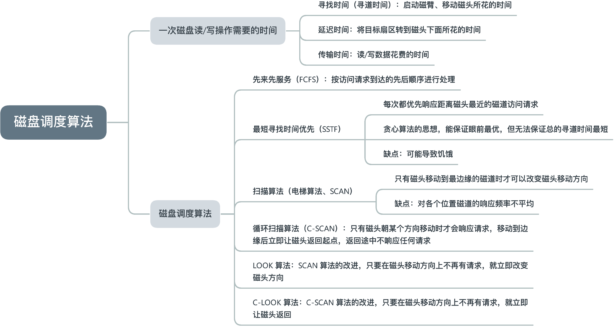


## 减少延迟时间的方法


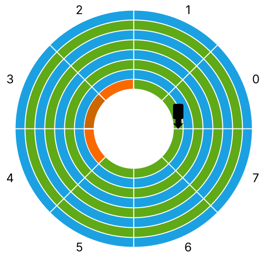

假设要连续读取橙色区域的 2、3、4 扇区：

磁头读取一块的内容（也就是一个扇区的内容）后，**<span style="color:#524C84">需要<u>一小段时间</u>处理</span>**，而扇片又在不停地旋转。

因此，如果 2、3 号扇区相邻着排列，则读完 2 号扇区后<span style="color:#900C3F">**无法连续不断地**</span>读入 3 号扇区。

<span style="color:#CD4545">**必须等盘片继续旋转**</span>，3 号扇区再次划过磁头，才能完成扇区读入。

**结论**：磁头读入一个扇区数据后需要一小段时间处理，如果<span style="color:#387ADF">逻辑上</span>相连的扇区<span style="color:#387ADF">物理上</span>也相邻，则读入几个连续的逻辑扇区，可能需要很长的**延迟时间**。

### 减少延迟时间的方法：交替编号


若采用<span style="color:#56776C; font-weight:bold">交替编号</span>的策略，即让<span style="color:#3AB0FF; font-weight:bold">逻辑上相邻</span>的扇区在<span style="color:#3AB0FF; font-weight:bold">物理上有一定的间隔</span>，可以使读取连续的逻辑扇区所需要的延迟时间更小。

### 磁盘地址结构的设计

**磁盘的物理地址为什么是 `(柱面号, 盘面号, 扇区号)`，而不是 `(盘面号, 柱面号, 扇区号)`？**


假设某磁盘有 8 个柱面/磁道（假设最内侧柱面/磁道号为 0），4 个盘面，8 个扇区。则可用 3 个二进制位表示柱面，2 个二进制位表示盘面，3 个二进制位表示扇区。

若物理地址结构是 `(盘面号, 柱面号, 扇区号)`，且需要连续读取物理地址 `(00, 000, 000)` 至 `(00, 001, 111)` 的扇区：

`(00, 000, 000)` 至 `(00, 000, 111)` 转两圈可读完。

之后再读取物理地址相邻的区域，即 `(00, 001, 000)` 至 `(00, 001, 111)`，<span style="color:#921A40">需要**启动磁头臂**，将磁头**移动到下一个磁道**</span>。

---

假设某磁盘有 8 个柱面/磁道（假设最内侧柱面/磁道号为 0），4 个盘面，8 个扇区。则可用 3 个二进制位表示柱面，2 个二进制位表示盘面，3 个二进制位表示扇区。

若物理地址结构是 `(柱面号, 盘面号, 扇区号)`，且需要连续读取物理地址 `(00, 000, 000)` 至 `(00, 001, 111)` 的扇区：

`(000, 00, 000)` 至 `(000, 00, 111)` 由盘面 0 的磁头读入数据。

之后再读取物理地址相邻的区域，即 `(000, 01, 000)` 至 `(000, 01, 111)`，<span style="color:#E90074">由于柱面号/磁道号相同，只是**盘面号不同**，因此**不需要移动磁头臂**。只需要**激活相邻盘面的磁头**即可</span>。


---

读取地址连续的磁盘块时，采用  `(柱面号, 盘面号, 扇区号)` 的地址结构可以<span style="color:#8F43EE">减少磁头移动消耗的时间</span>。

### 减少延迟时间的方法：错位命名

**方案一**：若相邻扇面相对位置相同处扇区编号相同。


> **注意**：所有盘面都是一起<span style="color:#E14D2A">连轴转</span>的。

读取完磁盘块 `(000, 00, 111)` 之后，需要<span style="color:#3E6D9C">**短暂的时间处理**</span>，而盘面又在不停地转动，因此当 `(000, 01, 000)` 第一次划过 1 号盘面的磁头下方时，并不能读取数据，只能再等该扇区<u>再次</u>划过磁头。

**方案二**：错位命名。


由于采用错位命名法因此读取完磁盘块 `(000, 00, 111)` 之后，还有<span style="color:#FBA834">**一段时间处理**</span>，当 `(000, 01, 000)` 第一次划过 1 号盘面的磁头下方时，就可以直接<span style="color:#FBA834">**读取数据**</span>。从而减少了延退时间。

---

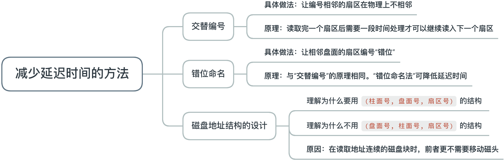

## 磁盘的管理

**知识总览**：



### 磁盘初始化


**磁盘初始化**：

1. 进行<span style="color:#EF4B4B">**低级格式化（物理格式化）**</span>，将磁盘的各个磁道<span style="color:#EF4B4B">**划分为扇区（磁盘的最小存储单元）**</span>。一个扇区通常可分为头、数据区域（如 512B 大小）、尾三个部分组成。管理扇区所需要的各种数据结构一般存放在头、尾两个部分，包括扇区校验码（如奇偶校验、CRC 循环冗余校验码等，校验码用于校验扇区中的数据是否发生错误）。

   

2. 将磁盘分区，每个分区由<span style="color:#02A8A8">**若干柱面**</span>组成（即分为我们熟悉的 C 盘、D 盘、E 盘）。

   

3. 进行<span style="color:#FD841F">**逻辑格式化**</span>，创建文件系统。包括创建文件系统的根目录、初始化存储空间管理所用的数据结构（如位示图、空闲分区表）。

### 引导块

计算机开机时需要运行一系列初始化工作，这些初始化工作是通过执行<span style="color:#FF5A5A">**初始化程序（自举程序）**</span>完成的。

初始化程序可以放入 ROM（只读存储器）中，但 ROM 中的数据在出厂时就写入了，并且<span style="color:#CF1B1B">以后**不能再修改**</span>。


> **注意**：ROM 一般是出厂时就集成在主板上。

**初始化程序（自举程序）放在 ROM 中存在什么问题？**

**万一需要更新自举程序，将会很不方便，因此 ROM 中的数据无法更改，怎么解决呢？**

现代操作系统，ROM 只存放很小的<span style="color:#B31E6F">**自举<u>装入</u>程序**</span>。

完整的自举程序放在磁盘的<span style="color:#D869C0">**启动块（即引导块/启动分区）**</span>上，启动块位于磁盘的固定位置。


开机时计算机先运行<span style="color:#B31E6F">**自举装入程序**</span>，通过执行该程序就可以找到引导块，并将完整的**自举程序**读入内存，完成初始化。

拥有启动分区的磁盘被称为<span style="color:#900D0D">**启动磁盘**</span>或<span style="color:#900D0D">**系统磁盘**</span>（C 盘）。

### 坏块的管理

坏了、无法正常使用的扇区就是**坏块**。这属于硬件故障，操作系统是无法修复的。应该将坏块标记出来，以免错误地使用到它。

对于<span style="color:#FE6845">**简单的磁盘**</span>，可以在逻辑格式化时（建立文件系统时）对整个磁盘进行坏块检查，标明哪些扇区是坏扇区，例如在 FAT 表上标明。（在该方式下，<span style="color:#6B206A">**坏块对操作系统不透明**</span>）


对于<span style="color:#FE6845">**复杂的磁盘**</span>，磁盘控制器（磁盘设备内部的一个硬件部件）会维护一个坏块链表。

在磁盘出厂前进行低级格式化（物理格式化）时就将坏块链进行初始化。

会保留一些<span style="color:#FF2E63; font-weight:bold">备用扇区</span>，用来替换坏块。这种方案称为<span style="color:#387ADF">***扇区备用***</span>。且这种处理方式中，<span style="color:#387ADF">**坏块对操作系统透明**</span>。


---


## 固态硬盘 SSD

**知识总览**：

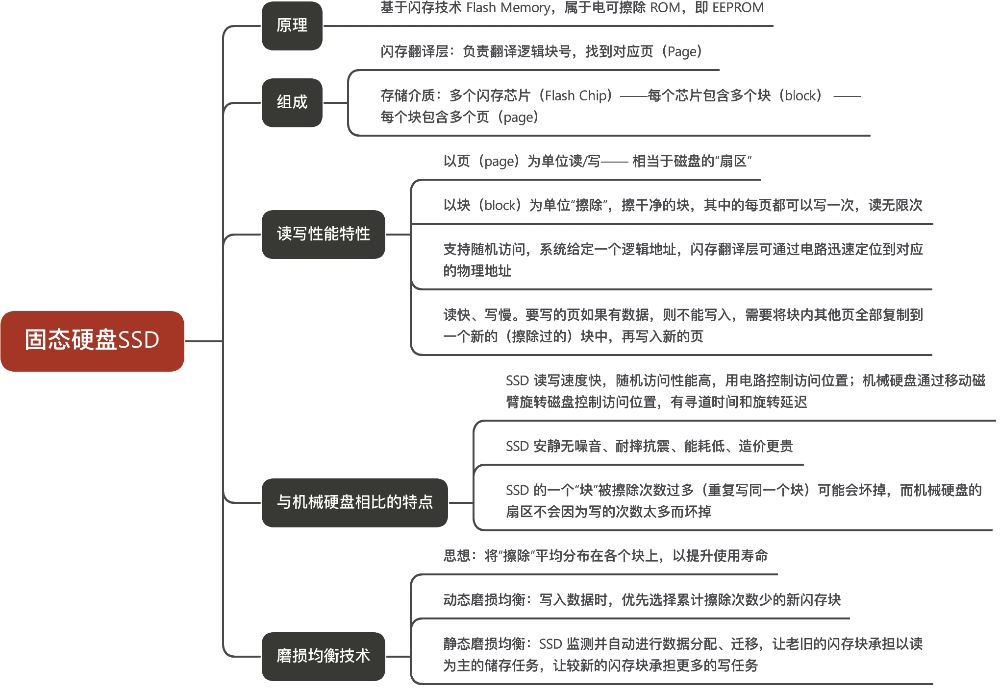

### 机械硬盘 vs. 固态硬盘

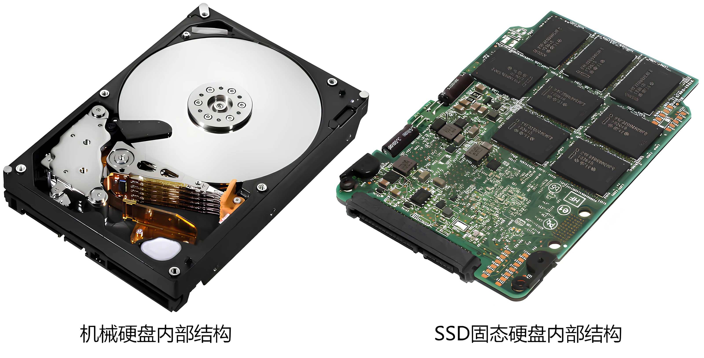

### 固态硬盘的结构



> **注意**：在机械硬盘中，一个逻辑块号对应一个磁盘块或者一个扇区；而在固态硬盘中，一个逻辑块号对应一页，而固态硬盘中的块可以类比为机械硬盘的磁道。

### 固态硬盘的寿命（理想状态下）

某固态硬盘采用磨损均衡技术，大小为 $2^{40} \text{B} = 1 \text{TB}$，闪存块的擦写寿命只有 $2^{10}=1 \text{K}$ 次。某男子平均每天会对该固态硬盘写 $2^{37} \text{B} = 128 \text{GB}$ 数据。在最理想的情况下，这个固态硬盘可以用多久？

SSD 采用磨损均衡技术，最理想情况下，SSD 中每个块被擦除的次数都是完全均衡的。
$$
\frac{1 \text{TB}}{128 \text{GB}} = 8
$$
因此，平均每 8 天，每个闪存块需要擦除一次。

每个闪存块可以被擦除 1K 次。因此，经过 8K 天，约 23 年后，该固态硬盘被男子玩环。
