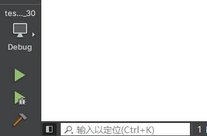
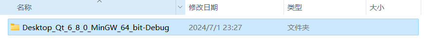
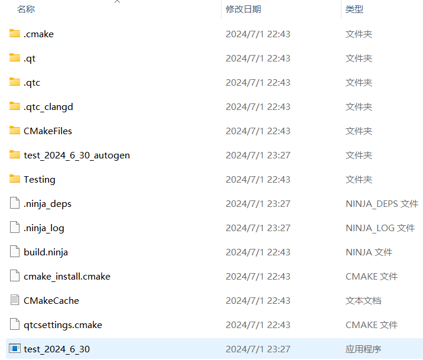
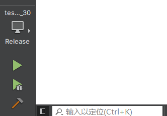
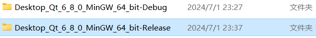
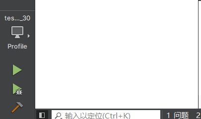

# 程序发布

程序分为 Debug 版本和 Release 版本。

## 编译 Debug 版本程序

首先选择 Debug 版本编译：

然后在查看项目所在目录，发现多了一个 Debug 目录：

打开目录发现里面有相应的 exe 程序：

可以看到 Debug 版本的可执行文件需要的 dll 文件很大，因为其中包含了调试信息。

## 编译 Release 程序

使用 Release 版本编译：

然后再一次查看，发现多了 Release 目录：

## 编译 Profile 程序

Profile 则是在这两种之中取一个平衡，兼顾性能和调试，可以类似的看做是性能更优但是又方便调试的版本。

