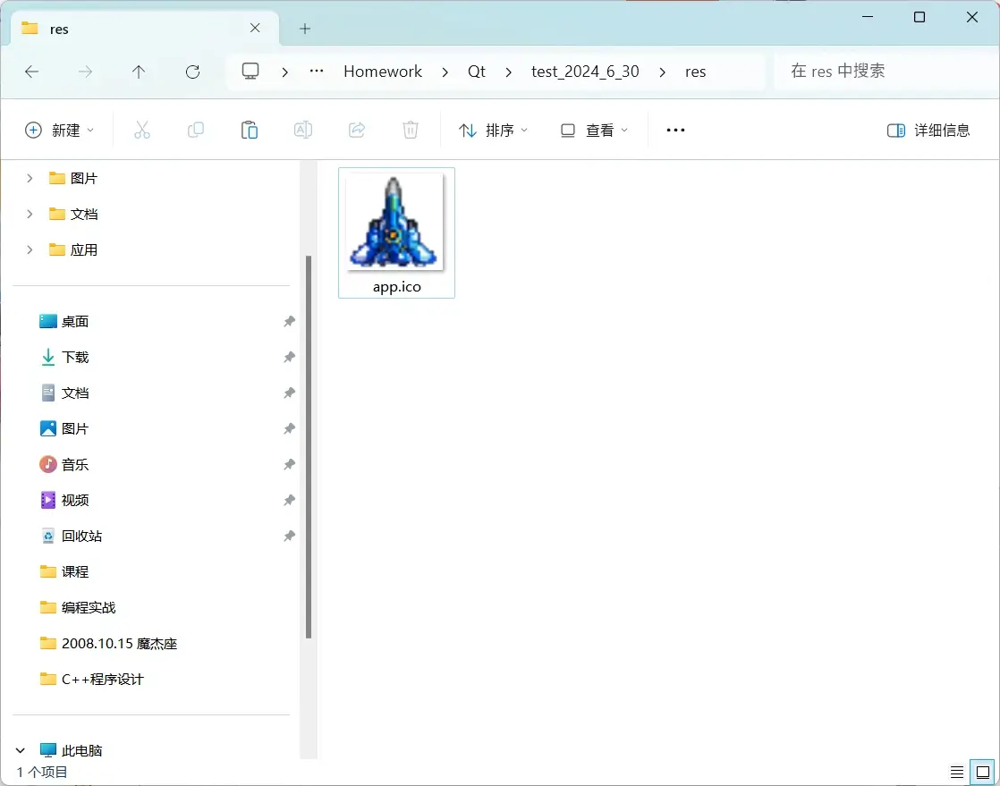

# 设置应用程序图标

将制作好的 ico 图标文件放在 res 目录（资源目录）下：



在项目根目录新建 app.rc （自定义的名字）资源文件，添加语句，**注意相对路径**：

```cmd
IDI_ICON_LOGO ICON DISCARDABLE "res/app.ico"
```

而后，在 `CMakeLists.txt` 中添加如下内容，引入 `app.ico`：

```cmake
set(PROJECT_SOURCES
        main.cpp
        mainwindow.cpp
        singleslice.cpp
        widgetitem.cpp
        mainwindow.h
        singleslice.h
        noncopyable.h
        nonmoveable.h
        config.hpp
        widgetitem.h
        mainwindow.ui
        ${RES_FILES}
        app.rc # 资源文件
        ${TS_FILES}
)
```

发现编译出的图标变成了：


