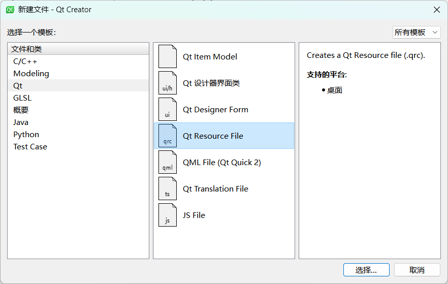
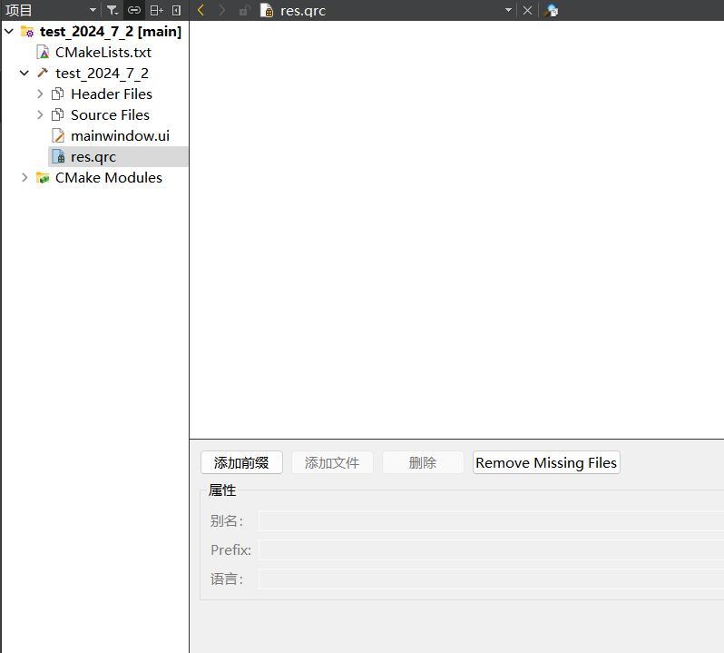
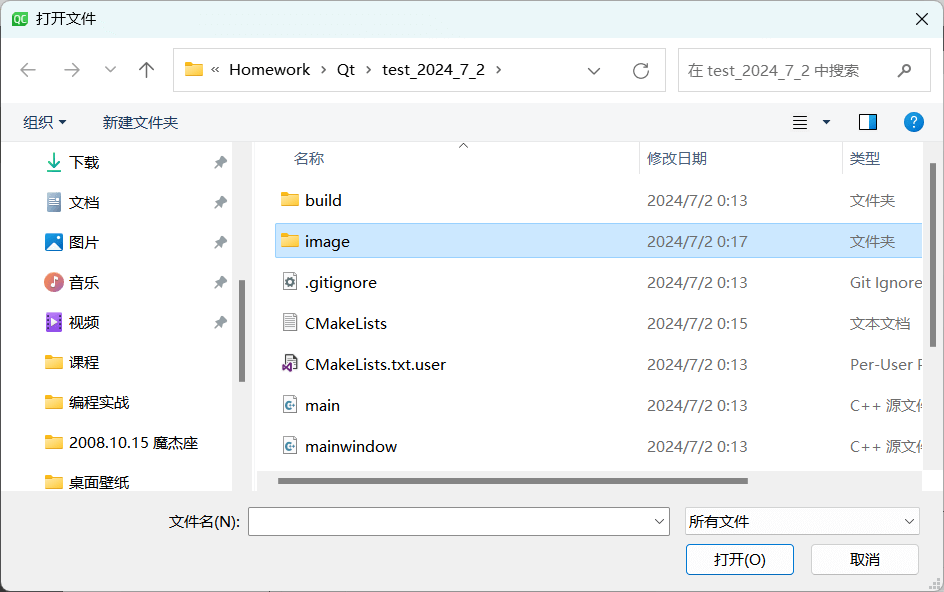
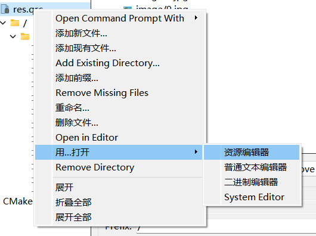
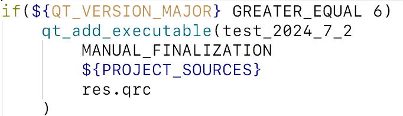

# 资源文件的使用

## 添加 qrc 文件



生成完以后有：



然后添加前缀，我们直接使用 `/` ：


然后添加文件，将 image 中的内容全部拷贝进去（这里的 image 目录是项目根目录的子目录）：




然后我们就可以看到：


如果还要添加，则这样操作，便可以继续操作：



## CMakeLists 设置

在 CMakeLists 中添加（一般都有）：

```cmake
set(CMAKE_AUTORCC ON)
```

与 `CMAKE_AUTOUIC`、`CMAKE_AUTOMOC` 一致，自动完成对 qrc 程序的编译。

然后如果使用 Qt Creator，则它会在有：



可以看到 `res.qrc` 被自动编译。

## 资源文件使用

图片路径的写法举例：

```cmd
:/image/1.png
```

注意那个**冒号**。

以 **QLabel** 和 **QPushButton** 为例添加图片；代码如下：

```cpp
MainWindow::MainWindow(QWidget *parent)
    : QMainWindow(parent)
    , ui(new Ui::MainWindow)
{
    ui->setupUi(this);

    //标签加载图片
    QLabel *imgLabel = new QLabel(this);
    imgLabel->resize(64,64);
    imgLabel->move(200,100);
    imgLabel->setPixmap(QPixmap(":/image/1.jpg").scaled(64,64));

    //按钮加载图片
    QPushButton *imgBtn = new QPushButton(this);
    imgBtn->resize(64,64);
    imgBtn->move(200,300);
    imgBtn->setStyleSheet("QPushButton {background-image: url(:/image/3.jpg)}");
}
```


