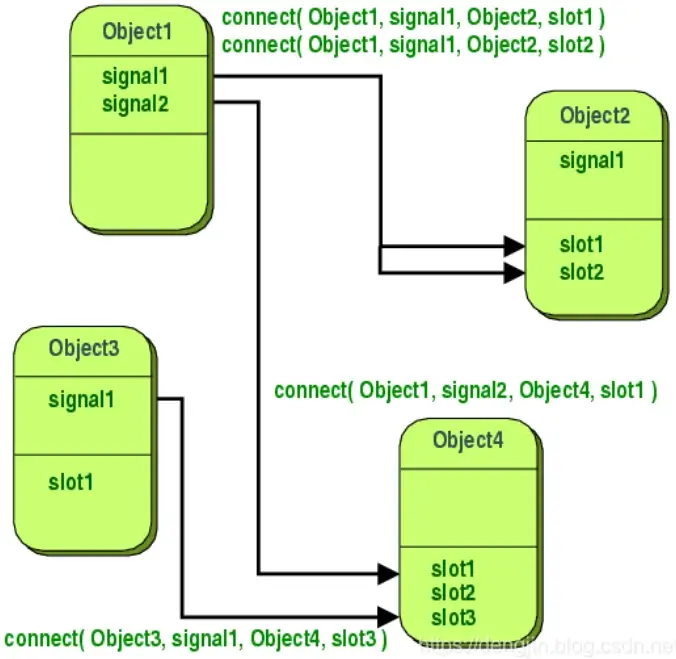

# 信号与槽

信号与槽用于对象之间的通信。信号与插槽机制是 Qt 的核心功能。Qt 的元对象系统使信号与槽成为可能。

## 介绍

在 GUI 编程中，我们更改一个小部件时，我们经常需要通知另一个小部件。更一般地说，我们希望任何类型的对象能够彼此通信。例如，如果用户单击“**关闭**”按钮，我们可能希望调用 `close()` 函数。

其他工具包使用回调这种通信。回调是指向函数的指针，因此如果您希望处理函数通知您某些事件，则将指针传递给处理函数的另一个函数（回调）。然后，处理函数在适当的时候调用回调。

## 信号与槽

在 Qt 中，有替代回调的技术：使用**信号与槽**。

发生特定事件时会**发出信号**。Qt 的小部件有许多预定义信号，但是我们总可以将**部件子类化**为了向它们添加我们自己的信号。槽是响应于特定信号而被调用的函数。Qt 的部件中有许多预定义的槽函数，但通常将部件子类化并添加自己的槽，以便可以处理感兴趣的信号。



信号和槽机制是**类型安全**的：**信号的签名必须与接收槽的签名匹配**。（事实上，一个槽可能比它收到的信号具有更短的签名，因为它可以忽略额外的参数）由于签名是兼容的，编译器可以帮助我们在使用基于函数指针的语法时检测类型不匹配。基于字符串的 SIGNAL 和 SLOT 语法将在运行时检测类型不匹配。信号和槽是**松散耦合**：发出信号的类不知道也不关心哪个槽接收该信号。Qt 的信号与槽机制确保如果您将信号连接到槽，将在适当的时间使用信号的参数调用槽。信号与槽可以采用任何类型的参数，它们完全是类型安全的。

从 QObject 或其子类之一（例如，QWidget）继承的所有类都可以包含**信号与槽**。当它们以某种方式改变它的状态时，信号就会被发送，其他对象可能对该信号感兴趣。这样的话所有的对象都可以通讯。它不知道或关心是否有任何东西正在接受它发出的信号。这是真正的信息封装，并确保该对象可以用作软件组件。

槽可用于接受信号，但它们也是普通的**成员函数**。就像一个对象不知道是否有任何东西接收到它的信号一样，一个槽函数不知道它是否有任何信号连接到它。这确保了可以使用 Qt 创建真正的组件。

可以将任意数量的信号连接到一个槽，并且可以根据需要将信号连接到任意数量的槽。甚至可以**将信号直接连接到另一个信号**。（每当发射第一个信号时，将立即发射出第二个信号）

信号与槽共同构成了一个强大的组件编程机制。

## 信号

当对象的内部状态以某种可能对对像的客户端或所有者**感兴趣的方式**发生更改时，对象会发出信号。信号是**公共访问函数**，可以从任何地方发出，但我们建议**只从定义信号及其子类的类中发出它们**。

当信号发出时，通常会立即执行与其连接的槽函数，就像正常的函数调用一样。发生这种情况时，信号与槽机制完全独立于任何 GUI 事件循环。`emit` 发出信号后，所有与**它关联的槽函数都将会执行**。这种情形与使用**排队连接**时情况略有不同；在这种情况下，`emit` 关键字后面的代码将立即继续，并且稍后将执行槽函数。

如果多个槽连接到一个信号，则在发出信号时，槽函数将按照它们**已连接的顺序依次执行**。

信号由 MOC 自动生成，不可以在 `.cpp` 文件中实现；它们永远不会有返回类型（即使用 `void` ）。

> **关于参数的说明**：
>
> 我们的经验表明，如果信号和槽不使用特殊类型，则它们可以**重复使用**。如果 `QScrollBar::valueChanged()` 使用特殊类型，例如假设的 `QScrollBar::Range` ，则它只能连接到专门为 `QScroolBar` 设计的槽函数。将**不同的输入控件**连接在一起是不可能的。

在 Qt 中，MOC 指的是 Meta Object Compiler（元对象编译器）。Qt 使用 MOC 来实现其元对象系统（Meta Object System），这是 Qt 中一种高级的对象特性，使得 Qt 能够支持信号和槽机制、动态属性、运行时类型信息等特性。

具体来说，MOC 是一个预处理器，它读取包含特殊宏的 C++ 源文件（通常以 `.h` 结尾），并生成标准 C++ 源文件。这些特殊的宏用于定义 Qt 特有的元对象信息，例如*<u>信号、槽、属性</u>*等。通过 MOC，Qt 能够在编译时生成额外的代码来支持这些特性，使得 Qt 的信号和槽机制能够在 C++ 编译器的限制下工作。

因此，MOC 在 Qt 中是一个非常重要的工具，它使得 Qt 能够提供强大的反射和元编程能力，为 Qt 的高级功能提供基础支持。

> **注意**：
>
> 使用 `emit` 跟随信号函数发出信号；信号在类的声明中只需要声明（**但槽函数需要实现**），而不需要实现。这是因为信号的发出和连接并不需要在类的定义中具体实现其行为，而是通过 Qt 的元对象系统（Meta Object System）来管理和调度。

## 槽

当连接的信号被发送时，对应的槽函数将会被执行。槽函数是**普通的 C++ 函数**，可以正常调用；它们唯一的特点是**信号可以连接到它们**。

由于插槽是普通的成员函数，因此它们在直接调用是遵循正常的 C++ 规则。但是，作为槽，它们可以通过信号与槽连接由任何组件调用，而**不管其访问级别如何**。这意味着从任意类的实例发出的信号可以导致在**不相关的类的实例中调用私有槽**。

我们发现这些槽在实践中非常有用，还可以将槽函数定义为虚槽函数。

与回调相比，信号与槽稍微慢一些，因为它们提供了更大的灵活性，尽管实际应用的差异是微不足道的。通常，**发射连接到某些槽的信号与使用非虚函数直接调用槽函数大约慢十倍**。这是定位连接对象，安全地遍历所有连接（即检测后续槽函数在发射期间没有被销毁）以及以通用方式编组任何参数所需的开销。虽然十个非虚函数调用可能听起来很多，但它的开销比任何 `new` 和 `delete` 操作都少得多。例如，只有执行场景后面的字符串， `vector` 或 `list` 操作，就需要 `new` 或 `delete` ，信号和槽的开销仅仅是函数调用开销的一小部分。无论何时在槽函数中进行系统调用，情况都是如此；或间接调用十多个函数。由于信号与槽机制的简单性和灵活性，这一点开销非常值得，甚至不会注意到。

**定义变量的其他库**在与基于 Qt 的应用程序一起编译时调用 `signals` 或 `slots` 可能导致编译器警告和错误。要解决这个问题，`#undef` 违规的预处理器符号。

## 示范案例

最小的 C++ 类声明可能是：

```cpp
class Counter
{
public:
    Counter() { m_value = 0; }

    int value() const { return m_value; }
    void setValue(int value);

private:
    int m_value;
};
```

一个小的基于 QObject 的类可能是：

```cpp
#include <QObject>

class Counter : public QObject
{
    Q_OBJECT

public:
    Counter() { m_value = 0; }

    int value() const { return m_value; }

public slots:
    void setValue(int value);  // 槽函数

signals:
    void valueChanged(int newValue);  // 信号函数

private:
    int m_value;
};
```

基于 QObject 的版本具有相同的内部状态，并提供访问状态的公共方法，但此外它还支持使用信号和槽进行组件编程。这个类可以通过**发出信号**告诉外面世界它的状态它的状态已经改变了 `valueChanged()`，并且**它有一个其他对象可以发送信号的槽**。

**包含信号或槽**的所有类必须在其声明的顶部提及 `Q_OBJECT`。它们还必须直接或间接从 QObject 派生。槽函数由应用程序员实现。以下是 `Counter::setValue()` 槽函数的可能实现：

```cpp
void Counter::setValue(int value) {
  if (value != m_value) {
    m_value = value;
    emit valueChanged(value);
  }
}
```

该 `emit` 行**发出 `valueChanged()` 来自对象的信号**，新值作为参数。

在下面的代码片段中，创建了两个 `Counter` 对象，并使用 `QObject::connect()` 将第一个对象的 `valueChanged()` 信号连接到第二个对象的 `setValue()` 槽：

```cpp
	Counter a, b;
	QObject::connect(&a, &Counter::valueChanged,
                   &b, &Counter::setValue);
	a.setValue(12);  // a.value() == 12, b.value() == 12
	b.setValue(48);  // a.value() == 12, b.value() == 48
```

调用 `a.setValue(12)` 导致对象 `a` 发出一个 `valueChanged(12)` 信号，该信号对象 `b` 将会被接收，并且执行槽函数 `setValue()` ，即被 `b.setValue()` 调用。然后 `b` 发射相同的 `valueChanged()` 信号，但是由于没有槽函数被连接到 `b` 的 `valueChanged()` 信号，该信号被忽略。

> **注意**：
>
> `setValue()` 函数仅设置值并发出信号 `value != m_value`。这样可以防止在循环连接的情况下无限循环（例如，如果 `b.valueChanged()` 连接到 `a.setValue()`）。

默认情况下，所做的每个连接都会发出一个信号；发出两个信号用于重复连接。可以通过一次 `disconnect()` 调用来中断所有连接。如果传递 `Qt::UniqueConnection` 类型，则只有在不是重复的情况下才会建立连接。如果已经有重复（完全相同的信号到相同对象上的完全相同的槽），连接将失败并且 `connect` 将会返回 `false`。

说明对象可以一起工作，**无需了解彼此的信息**。实现这一点，只需将对象连接在一起，可以用简单的实现 `QObject::connect()` 函数调用，或者与 `uic` 的自动连接功能。

## 真实案例

简单评论案例：

```cpp
#ifndef LCDNUMBER_H
#define LCDNUMBER_H

#include <QFrame>

class LcdNumber : public QFrame {
  Q_OBJECT
```

`LcdNumber` 通过 `QFrame` 和 `QWidget` 继承具有大部分信号槽知识的 `QObject` 。它有点类似于内置的 `QLCDNumber` 小部件。

`Q_OBJECT` 宏由预处理器扩展来声明由 `moc` 实现的几个成员函数；如果在未定义的 `vtable` 引用中遇到编译器错误 `LcdNumber` ，可能忘记 `moc` 或在链接命令中包含 `moc` 输出。

```cpp
	public:
		LcdNumber(QWidget *parent = 0);
```

它显然与 `moc` 不相关，如果继承了 `QWidget` ，你几乎肯定希望 `parent` 在构造函数中使用该参数并将其传递给基类的构造函数。这里省略了一些析构函数和成员函数；该 `moc` 忽略成员函数。

```cpp
	signals:
		void overflow();
```

当要求显示不可能的值时，`LcdNumber` 发出信号。

如果不关心溢出或不会发生溢出，则可以忽略 `overflow()` 信号，即不要链接到任何槽。

另一方面，如果要在数学溢出时调用两个不同的错误函数，只需将信号连接到两个不同的槽即可。Qt 将调用它们（按照它们连接的顺序）。

```cpp
	public slots:
		void display(int num);
		void display(double num);
		void display(const QString &str);
		void setHexMode();
		void setDecMode();
		void setOctMode();
		void setBinMode();
		void setSmallDecimalPoint(bool point);
};

#endif
```

槽是一种接收信号，用于获取有关其他小部件中状态更改的信息。`LcdNumber` 如上面的代码所示，使用它来设置显示的数字。由于 `display()` 该类是与该程序其余部分的接口的一部分，因此该槽是公共的。

有几个示例程序将 `QScroollBar` 的 `valueChanged()` 信号连接到插槽，因此 `LcdNumber` 会连续显示滚动条的值。

注意 `display()` 重载；当你将信号连接到槽时，Qt 将选择适合的版本。使用回调，必须找到五个不同的名称并自己跟踪类型。

此示例中省略了一些不相关的成员函数。

## 信号和槽使用默认参数

信号和槽的签名可以包含参数，参数可以具有默认值。考虑 `QObject::destroyed()`：

```cpp
void destroyed(QObject* = 0);
```

当 `QObject` 的被删除时，它发射这个 `QObject::destroyed()` 信号。我们希望捕获这个信号，无论我们对删除的 `QObject` 有何悬空引用，我们都可以清理它。合适的槽函数可能是：

```cpp
void objectDestroyed(QObject* obj = 0);
```

要将信号连接到槽，使用 `QObject::connect()` 。有几种方法可以连接信号与插槽。

**第一种是使用函数指针**：

```cpp
connect(sender, &QObject::destroyed,
        this, &MyObject::objectDestroyed);
```

将 `QObject::connect()` 与函数指针一起使用有几个优点。首先，它允许编译器检查信号的参数是否与槽的参数兼容。如果需要，编译器也可以隐式转换参数。

也可以使用仿函数或 `lambda`：

```cpp
connect(sender, &QObject::destroyed,
        [=](){ this->m_objects.remove(sender); });
```

**第二种方式是**：

使用 `QObject::connect()` 和 `SIGNAL` 以及 `SLOT` 宏。规则是否包含参数在 `SIGNAL()` 和 `SLOT()` 宏中，如果参数有默认值，是**传递给签名 `SIGNAL()` 宏必须不能比传递到 `SLOT()` 宏签名参数少**。

所有以下均可行：

```cpp
connect(sender, SIGNAL(destroyed(QObject*)), this, SLOT(objectDestroyed(Qbject*)));
connect(sender, SIGNAL(destroyed(QObject*)), this, SLOT(objectDestroyed()));
connect(sender, SIGNAL(destroyed()), this, SLOT(objectDestroyed()));
```

但以下这个不可（因为传递给 `SIGNAL()` 宏的参数比传给 `SLOT()` 的参数更少）：

```cpp
connect(sender, SIGNAL(destroyed()), this, SLOT(objectDestroyed(QObject*)));
```

因为槽将期望信号不会发送的 `QObject`；此连接将报告运行时错误。

请注意，使用 `QObject::connect()` 重载时，编译器不会检查 `SIGNAL` 和 `SLOT` 参数。

## 信号与槽高级用法

需要有关信号**发送者**的信息的情况，Qt 提供 `QObject::sender()` 函数，该函数将返回指向发送信号的对象的指针。

所述 `QSignalMapper` 类提供了一种用于有许多信号被连接到相同的槽和槽需要不同的方式处理每一个信号的情况。

假设有三个按钮，用于确定要打开的文件：“税务文件”、“账户文件”或“报告文件”。

要打开正确的文件，可以使用 `QSignalMapper::setMapping()` 将所有 `QPushButton::clicked()` 信号映射到 `QSignalMapper` 对象。然后将文件的 `QPushButton::clicked()` 信号连接到 `QSignalMapper::map()` 槽。

```cpp
      signalMapper = new QSignalMapper(this);
      signalMapper->setMapping(taxFileButton, QString("taxfile.txt"));
      signalMapper->setMapping(accountFileButton, QString("accountsfile.txt"));
      signalMapper->setMapping(reportFileButton, QString("reportfile.txt"));

      connect(taxFileButton, &QPushButton::clicked,
          signalMapper, &QSignalMapper::map);
      connect(accountFileButton, &QPushButton::clicked,
          signalMapper, &QSignalMapper::map);
      connect(reportFileButton, &QPushButton::clicked,
          signalMapper, &QSignalMapper::map);

```

然后将 `mapped()` 信号连接到 `readFile()` 将打开其他文件的位置，具体取决于按下的按钮。

```cpp
	connect(signalMapper, SIGNAL(mapped(QString)),
          this, SLOT(readFile(QString)));
```

## 使用 Qt 与第三方信号和插槽

可以将 Qt 与第三方信号、插槽机制一起使用。甚至可以在同一个项目中使用两种机制。只需将以下行添加到 `qmake` 项目 （`.pro`）文件即可。

```cpp
CONFIG += no_keywords
```

告诉 Qt 不要定义 `moc` 关键字 `signal`、`slots` 和 `emit`，因为这些名称将由第三方库可以使用，例如 `boost`。然后继续使用带有 `no_keywords` 标志的 Qt 信号和插槽，只需将源种的 Qt `moc` 关键字的所有使用替换为相应的 Qt 宏 `Q_SIGNALS` （或`Q_SIGNAL`）、`Q_SLOTS`（或`Q_SLOT`）和 `Q_EMIT`。
