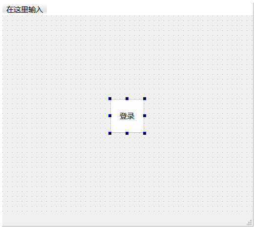
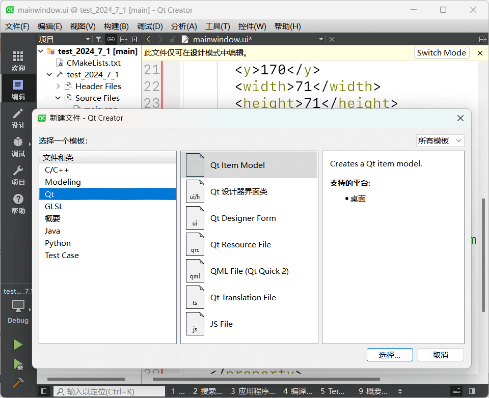
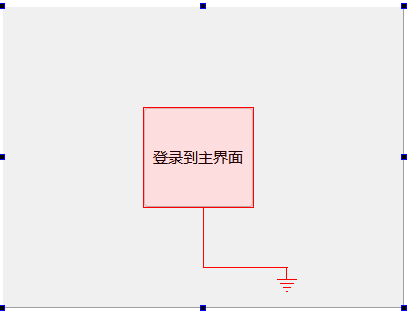
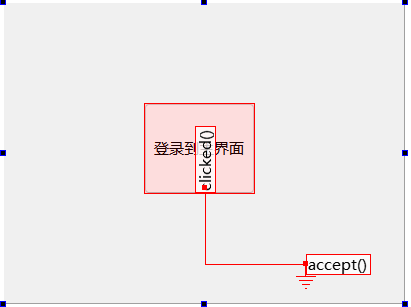
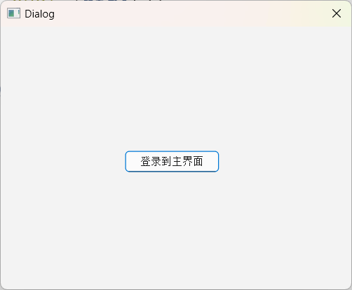
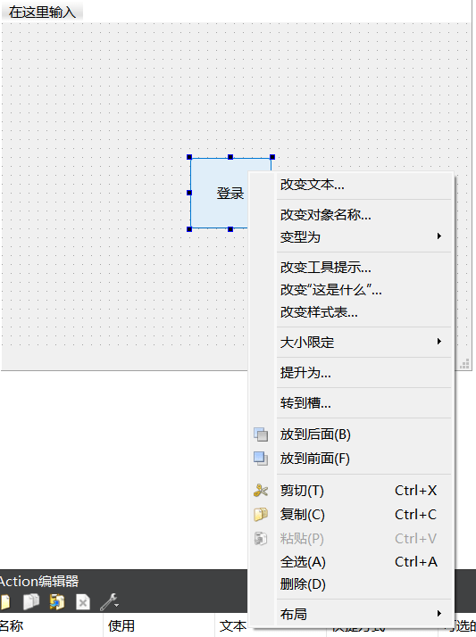
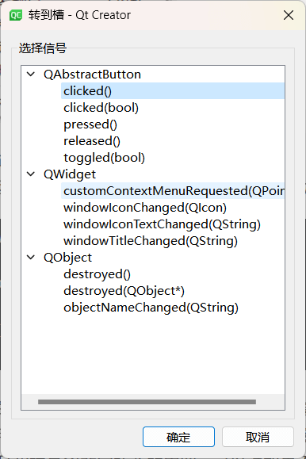

# 窗口文件

## 实现功能

程序要实现的功能是：运行开始出现一个对话框，**按下登录**主界面按钮后该对话框消失并**进入主窗口**，如果**直接关闭**这个对话框，便**不能进入**主窗口，整个程序也将退出。进入主窗口后，按下显示对话框按钮，会弹出一个对话框，无论如何关闭这个对话框，都会回到主窗口。

## 程序设计

### 实现方法一

在设计模式下，先在 `mainwindow.ui` 中添加登录按钮：



然后添加登录对话框：



在 Qt 设计器界面类中选择界面模板 Dialog without Buttons 。


然后进行添加：


当完成后会自动跳转到设计模式，可以对新添加的对话框进行设计。我们向界面上拖入一个 Push Button ，然后更改显示文本为“登录到主界面”。为了实现点击这个按钮后可以关闭该对话框并显示主窗口，我们需要设置信号和槽的关联。按下 `F4` （按下 `F3` 返回设计模式），便进入了信号和槽编辑模式。按着鼠标左键，从按钮上拖向界面，如下图所示：



选择 Push Button 的 `clicked()` 信号和 Login Button 的 `accept()` 槽：


设计好信号与槽的关联后，界面如下：



在 `main.cpp` 中添加：

```cpp
#include "mainwindow.h"
#include "logindialog.h"

#include <QApplication>

int main(int argc, char *argv[])
{
    QApplication a(argc, argv);
    MainWindow w;
    LoginDialog dlg;  // 创建 LoginDialog 的对象 dlg

    // 执行 exec() 代表 dlg 运行
    // 判断 exec() 的返回值
    // 如果用户按下登录按钮，返回值就是 Accepted ，这时就显示主窗口，正常执行程序
    // 否则没有按下登录按钮，结束程序
    if (dlg.exec() == QDialog::Accepted)
    {
        w.show();
        return a.exec();
    }
    else
    {
        return 0;
    }
}
```

运行结果：




### 实现方法二

在设计模式中，对 Push Button 右键选择 ”转到槽“。



选择 `clicked()` 后，会自动生成对应的函数（在 `.h` 和 `.cpp` 文件中）：



```c++
void MainWindow::on_pushButton_clicked() {
    
}
```

然后实现函数：

```cpp
void MainWindow::on_pushButton_clicked()
{
    auto pDlg = new QDialog(this);
    pDlg -> show();
}
```

运行结果：

