# 登录对话框

在弹出对话框中填写用户名和密码，如果用户名和密码均正确进入主窗口，如果有错则弹出警告对话框。

## 设计器实现

先新建 Qt Widgets Application，类名和基类保持 `MainWindow` 和 `QMainWindow` 不变。

完成项目创建后，向项目中添加新的 Qt 设计师界面类，模板选择 Dialog without Buttons，类名更改为 `LoginDialog`。完成后向界面上添加两个标签 Label 、两个行编辑器 Line Edit 和两个按钮 Push Button，设计界面如下：

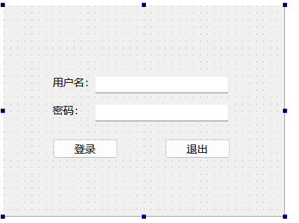

先选中用户名后面的行编辑器部件，然后再属性编辑器中将 `objectName` 属性更改为 `usrLineEdit`，如下图所示。下面依次更改其他部件的 `objectName` 属性，密码后面的行编辑器为 `pwdLineEdit`，登录按钮为 `loginBtn` 退出按钮为 `exitBtn`。

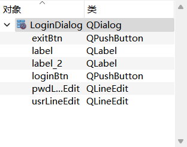

使用另外一种信号和槽的关联方法来设置退出按钮。在设计模式下方的信号和槽编辑器（Signals & Slots Editor）中，先点击左上角的绿色加号添加关联，然后选择发送者为 `exitBtn`，信号为 `clicked()`，接收者为 `LoginDialog`，槽为 `close()`，如下图所示。如此，当单击退出按钮时，就会关闭对话框。

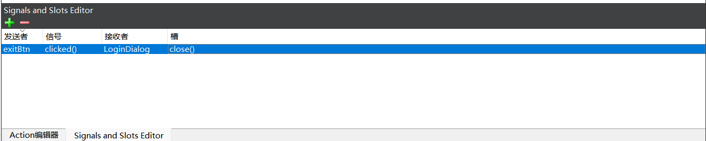

右击登录按钮，在弹出的菜单中选择“转到槽”，然后选择 `clicked()` 信号并确定。转到相应的槽以后，添加函数调用：

```cpp
void LoginDialog::on_loginBtn_clicked()
{
    accept();
}
```

在 `main.cpp` 文件中，更改内容如下：

```cpp
#include "mainwindow.h"
#include "logindialog.h"

#include <QApplication>

int main(int argc, char *argv[])
{
    QApplication a(argc, argv);
    MainWindow w;
    LoginDialog dlg;

    if (dlg.exec() == QDialog::Accepted) {
        w.show();

        return a.exec();
    } else {
        return 0;
    }
}
```

运行程序，按下退出按钮就会退出程序，按下登录按钮会关闭登录对话框，并显示主窗口。

接下来添加代码实现用户名和密码登录，这里只是简单将用户名和密码设置为固定的字符串，学习数据库后，还可以通过读取数据库来获取用户名和密码。到 `logindialog.cpp` 文件中将登录按钮的单击信号对应的槽代码更改为：

```cpp
void LoginDialog::on_loginBtn_clicked()
{
    // 判断用户名和密码是否正确
    if (ui->usrLineEdit->text() == tr("tom")
        && ui->pwdLineEdit->text() == tr("123456")) {
        accept();
    } else {
        QMessageBox::warning(this, tr("警告"),tr("用户名和密码错误"),QMessageBox::Yes);
    }
}
```

> **注意**：
>
> 在 Qt 中，`tr` 函数用于实现字符串的国际化和本地化。具体来说，`tr` 函数将指定的字符串为翻译，并在运行时根据当前的语言环境加载相应的翻译。**简而言之，它可以返回一个 `QString` 对象。**

对于输入的密码，我们常见显示的是**小黑点**的样式。下面在 `logindialog.ui` 文件进入设计模式，然后选中界面上的密码行编辑器，在属性编辑器中将 `echoMode` 属性选择为 Password。

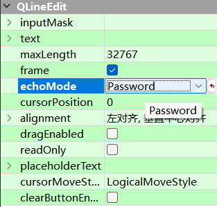

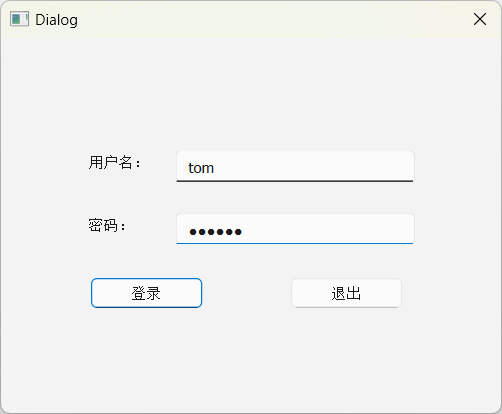

> **注意**：
>
> 除了在属性编辑器中进行更改，也可以在 loginDialog 类的构造函数使用 `setEchoMode(QLineEdit::Password)` 函数来设置。

在行编辑器的属性栏中还可以**设置占位符**，就是没有输入信息前的一些提示语句。例如将密码行编辑器的 `placeholderText` 属性更改为 “请输入密码”，将用户名行编辑器的更改为“请输入用户名”。

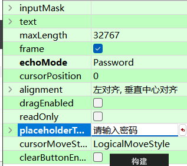

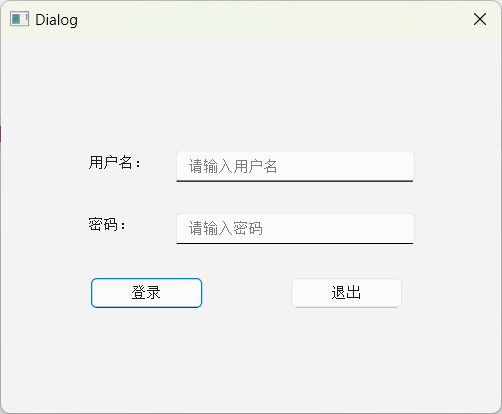

对于行编辑器，比如我们输入用户名，在前面添加了一个空格，也可以保证输入是正确的，这个可以**使用 QString 类的 `trimmed()` 函数来实现**，它可以去除字符串前后的空白字符。下面将 `logindialog.cpp` 文件中登录按钮单击信号槽函数中的判断代码更改为：

```cpp
void LoginDialog::on_loginBtn_clicked()
{
    // 判断用户名和密码是否正确
    if (ui->usrLineEdit->text().trimmed() == tr("tom")
        && ui->pwdLineEdit->text() == tr("123456")) {
        accept();
    } else {
        QMessageBox::warning(this, tr("警告"),tr("用户名和密码错误"),QMessageBox::Yes);
    }
}
```

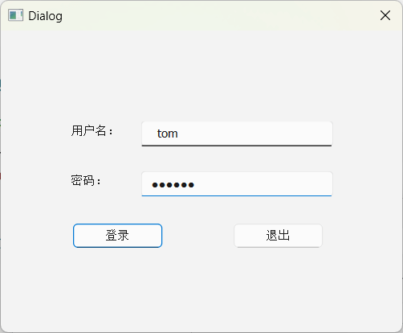

最后，当登录失败后，可以清空用户名和密码信息，并将光标定位到用户名输入框。可以在通过判断用户名和密码错误后添加相应的代码来实现：

```cpp
void LoginDialog::on_loginBtn_clicked()
{
    // 判断用户名和密码是否正确
    if (ui->usrLineEdit->text().trimmed() == tr("tom")
        && ui->pwdLineEdit->text() == tr("123456")) {
        accept();
    } else {
        QMessageBox::warning(this, tr("警告"),tr("用户名和密码错误"),QMessageBox::Yes);

        ui->usrLineEdit->clear();
        ui->pwdLineEdit->clear();
        ui->usrLineEdit->setFocus();
    }
}
```

## 纯代码实现

在构建项目时，便不要勾选 Generate form。

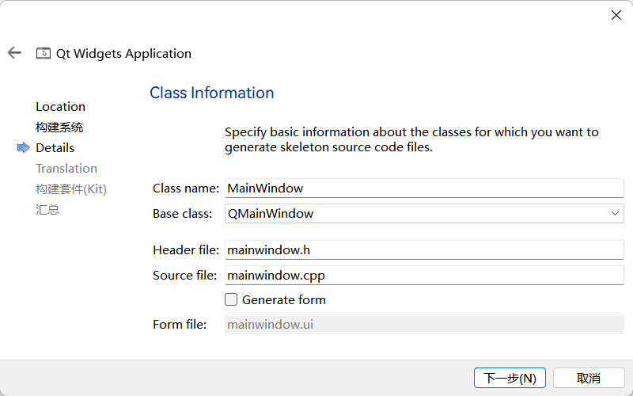

然后创建一个 C++ 类为：

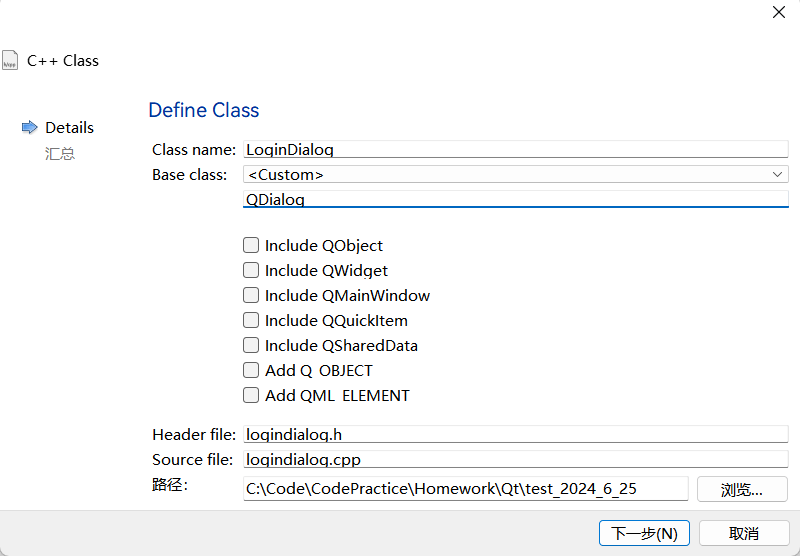

设置完成后，先打开 `logindialog.h` 文件，将其内容修改为：

```cpp
#ifndef LOGINDIALOG_H
#define LOGINDIALOG_H

#include <QDialog>

class QLabel;
class QLineEdit;
class QPushButton;

class LoginDialog : public QDialog
{
    Q_OBJECT
public:
    explicit LoginDialog();
    ~LoginDialog();

private:
    QLabel *usrLabel;
    QLabel *pwdLabel;

    QLineEdit *usrEditLine;
    QLineEdit *pwdEditLine;

    QPushButton *loginBtn;
    QPushButton *exitBtn;
};

#endif // LOGINDIALOG_H
```

先添加了 QDialog 类的头文件，然后前置声明了 QLabel 、QLineEdit 和 QPushButton 类，因为在下面只是定义了这些对象的指针，并不需要该类的完整的定义，所以可以将它们的包含语句放在源文件中进行。在 LoginDialog 类声明的开始需要添加 `Q_OBJECT` 宏才能使用信号和槽等元对象系统功能。`private` 部分定义了一些界面上需要用到的部件和指针。下面到 `logindialog.cpp` 文件中对这些部件对象进行初始化，其内容如下图所示：

```cpp
#include "logindialog.h"

#include <QLabel>
#include <QLineEdit>
#include <QPushButton>
#include <QMessageBox>

LoginDialog::LoginDialog(QWidget *parent) : QDialog(parent) {
    usrLabel = new QLabel(this);
    usrLabel->move(70, 80);
    usrLabel->setText(tr("用户名"));

    usrEditLine = new QLineEdit(this);
    usrEditLine->move(140, 80);
    usrEditLine->setPlaceholderText(tr("请输入用户名"));

    pwdLabel = new QLabel(this);
    pwdLabel->move(70, 130);
    pwdLabel->setText(tr("密码"));

    pwdEditLine = new QLineEdit(this);
    pwdEditLine->move(140, 130);
    pwdEditLine->setPlaceholderText(tr("请输入密码"));

    loginBtn = new QPushButton(this);
    loginBtn->move(50, 200);
    loginBtn->setText(tr("登录"));

    exitBtn = new QPushButton(this);
    exitBtn->move(210, 200);
    exitBtn->setText(tr("退出"));
}

LoginDialog::~LoginDialog() {}
```

这里定义了构造函数和析构函数，在构造函数中对界面进行了初始化，设置了它们的坐标及要显示的文本。这些代码实现的效果与前面在设计模式实现的效果一致。

简单举例：

`move(70, 80)` 就是将部件左上角的坐标设置为 $(70,\ 80)$ ，这个坐标是父窗口部件的，这就是登录对话框，对话框的左上角是 $(0,\ 0)$ 点；`setText()` 就是设置显示文本；`setPlaceholderText()` 是设置占位符文本。

修改 `main.cpp` 文件：

```cpp
#include "mainwindow.h"
#include "logindialog.h"

#include <QApplication>

int main(int argc, char *argv[])
{
    QApplication a(argc, argv);
    MainWindow w;

    LoginDialog dlg;

    if (dlg.exec() == QDialog::Accepted) {
        w.show();
        return a.exec();
    } else {
        return 0;
    }
}

```

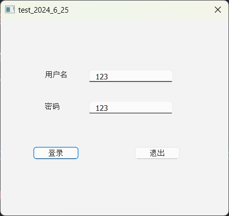

为了登录功能的实现，在 `loginfialog.h` 文件的类的声明的最后添加：

```cpp
#ifndef LOGINDIALOG_H
#define LOGINDIALOG_H

#include <QDialog>

class QLabel;
class QLineEdit;
class QPushButton;


class LoginDialog : public QDialog
{
    Q_OBJECT
public:
    explicit LoginDialog(QWidget *parent = 0);
    ~LoginDialog();

// 槽函数
private slots:
    void login();

private:
    QLabel *userLabel;
    QLabel *pwdLabel;

    QLineEdit *userEditLine;
    QLineEdit *pwdEditLine;

    QPushButton *loginBtn;
    QPushButton *exitBtn;
};

#endif // LOGINDIALOG_H
```

打开 `logindialog.cpp` 文件，在构造函数的最后添加如下图所示的两行代码。

```cpp
connect(loginBtn, &QPushButton::clicked, this, &LoginDialog::login);
    connect(exitBtn, &QPushButton::clicked, this, &LoginDialog::close);
```

之后在 `logindialog.cpp` 文件添加槽的定义：

```cpp
void LoginDialog::login() {
    if (usrEditLine->text().trimmed() == tr("tom")
        && pwdEditLine->text() == tr("123456")) {
        accept();
    } else {
        QMessageBox::warning(this, tr("警告"), tr("用户名或者密码错误"), QMessageBox::Yes);
    }

    usrEditLine->clear();
    pwdEditLine->clear();
    usrEditLine->setFocus();
}
```
