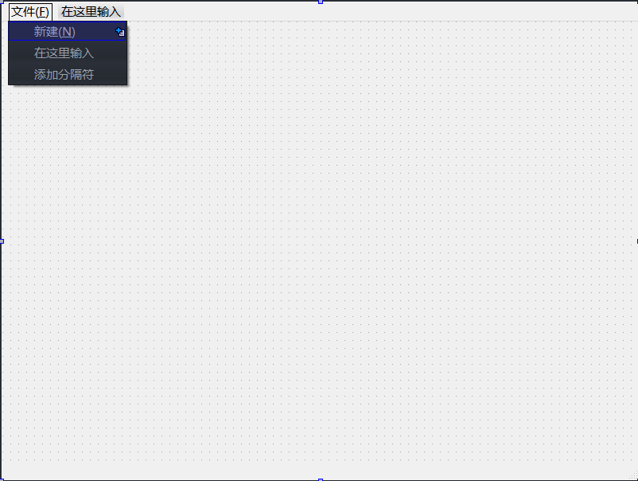
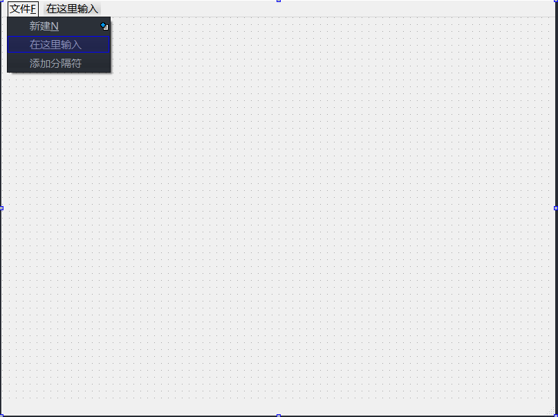
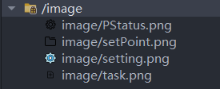
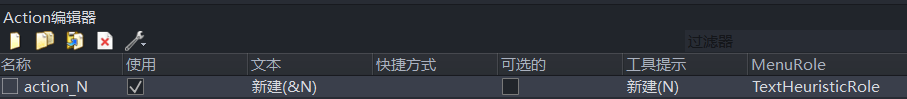
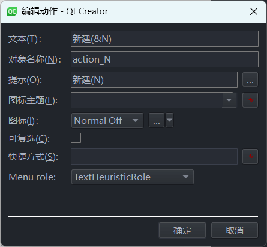
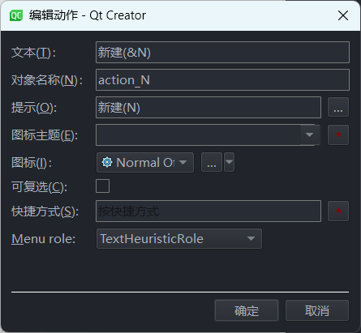
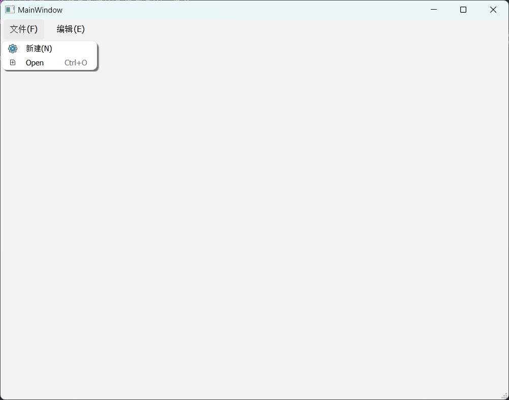

# 资源应用

主窗口部件就是一般的应用程序主窗口，它包含了菜单栏、工具栏、中心部件、状态栏和可停靠部件等。

打开 `mainwindow.ui` 文件进入设计模式，从这里可以看到左上角的“在这里输入”，可以在这里添加菜单等。将“从这里输入”更改为“文件(&F)”。者相当于将菜单的快捷键设置为了 `Alt + F` ，可以看到，实际显示效果中 `&` 符号是隐藏的。



在菜单中添加“新建(&N)”子菜单，效果如下。菜单后面那个加号是用来创建下一级菜单的。

> **注意**：菜单中如果无法输入中文，可以从别处复制粘贴。



在根目录下创建图片文件夹，将图片放进去；然后“添加前缀”，可将前缀改为 `/image`，然后再添加文件。有：



在 `mainwindow.ui` 中使用 Action ，在下面的 Action 编辑器（Action Editor）中可以看到刚才的“新建”菜单，如下图：



双击该条目，会弹出编辑动作对话框，这里可以进行各项设置，比如可以设置菜单项的快捷键，点击一下 Shortcut 后面的行编辑器，然后按下键盘的 `Ctrl + N` ，这样就可以将菜单项的快捷键设置为 `Ctrl + N` 。此时，该菜单键的快捷键为 `Ctrl + N` 。菜单中的“新建(N)”中 N 是当文件菜单处于激活（显示）状态时，按下 N 键才会执行新建菜单的功能。



而后选择一个图标文件：



然后再使用代码来添加一个菜单项，并为其设置图标。在编辑模式下打开 `mainwindow.cpp` 文件，并在构造函数中添加如下所示代码：

```cpp
#include "mainwindow.h"
#include "./ui_mainwindow.h"

MainWindow::MainWindow(QWidget *parent)
    : QMainWindow(parent)
    , ui(new Ui::MainWindow) {
    ui->setupUi(this);

    QAction *openAction = new QAction(tr("&Open"), this);  // 创建一个 openAction 对象
    QIcon icon(":/image/image/task.png");                  // 创建一个图标
    openAction->setIcon(icon);                             // 设置图标

    openAction->setShortcut(QKeySequence(tr("Ctrl+O")));   // 设置 openAction 图标
    ui->menu_F->addAction(openAction);                     // 添加动作 menu_F

    QMenu *menu_E = ui->menubar->addMenu(tr("编辑(&E)"));   // 创建 menu_E
    QAction *findAction = new QAction(tr("&Find"), this);  // 创建一个 findAction
    QIcon icon2(":image/image/setting.png");               // 创建一个图标

    findAction->setIcon(icon2);                            // 加载图标
    findAction->setShortcut(QKeySequence(tr("Ctrl+F")));   // 创建快捷键

    menu_E->addAction(findAction);                         // 添加新的功能
}

MainWindow::~MainWindow() {
    delete ui;
}
```

实现效果如下：


