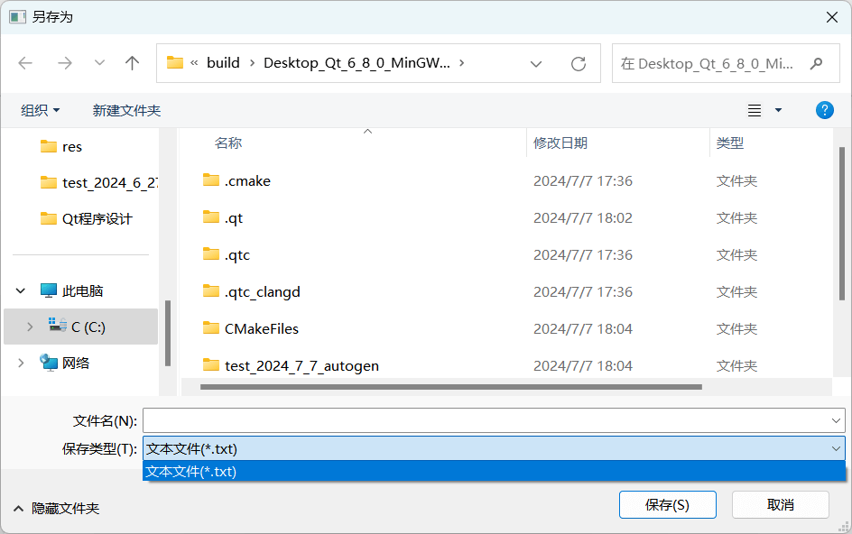

# 文件编辑器

**功能**：

- 编辑文本保存为 `txt`
- 打开一个 `txt` 文件，可编辑可保存
- **文本编辑功能**：剪切、复制、粘贴、加粗、斜体、下划线、设置颜色、字体

## UI 布局设计

**设计思路**：

1. **菜单栏**：依次添加需要的菜单
2. **工具栏**：每个小块为一个动作（Action），新建动作后添加到对应菜单
3. 字体大小用 `QspinBox` 控件（QSpinBox 类），字体设置用 `QFontComboBox` 控件（QFontComboBox 类）。**不可以在可视化设计里拖到工具栏，只能通过代码的形式添加**
4. **编辑区**：用一个 `plainTextEdit` 控件即可
5. 状态栏：拖一个 `QLabel` 控件进去显示当前正在编辑的文件

设置按钮时，将三个按钮（粗体、斜体、下划线）设置为可复选，代表按下后不会弹起：


在工具栏中，每个 Action 默认只显示图标，设置下图：


即可实现图标和文字并存。

## 添加 `spinBox` 控件和 `FontComboBox` 控件

这两个控件分别用于设置字体大小和字体的，无法直接拖入工具栏中，需要通过代码实现。

```cpp
void MainWindow::initUI() {
    // 设置字体大小控件
    spinFontSize = new QSpinBox();
    spinFontSize->setMinimum(5);   // 最小值 5
    spinFontSize->setMaximum(50);  // 最大值 50
    ui->toolBar->addWidget(new QLabel(tr("字体大小:")));
    ui->toolBar->addWidget(spinFontSize);

    // 设置字体样式控件
    comboFont = new QFontComboBox();
    ui->toolBar->addWidget(new QLabel(tr("字体:")));
}
```

## 完成剪切、复制和粘贴等功能

在信号与槽编辑器实现这些功能：


## 实现粗体、斜体和下划线等功能

编写槽函数，选择带 `bool` 参数的。使用 `QTextCharFormat` 设置字体格式，该 `bool` 参数会被传递到其方法。

> **注意**：对于粗体、斜体和下划线等，这些功能的实现依赖于选中与未选中，因此需要传递 `bool` 参数。

**粗体**：

```cpp
void MainWindow::on_actionBold_triggered(bool checked) {
    QTextCharFormat fmt;  // 文本字体格式
    if (checked) {  // 检查
        fmt.setFontWeight(QFont::Bold);  // 如果按下粗体按钮，则设置字体为粗体
    } else {
        fmt.setFontWeight(QFont::Normal);  // 没有就设置为正常
    }
    ui->plainTextEdit->mergeCurrentCharFormat(fmt);  // 融合原本字体样式
}
```

**斜体**：

```cpp
void MainWindow::on_actionItalic_triggered(bool checked)
{
    QTextCharFormat fmt;
    fmt.setFontItalic(checked);
    ui->plainTextEdit->mergeCurrentCharFormat(fmt);
}
```

**下划线**：

```cpp
void MainWindow::on_actionUnderscore_triggered(bool checked)
{
    QTextCharFormat fmt;
    fmt.setFontUnderline(checked);
    ui->plainTextEdit->mergeCurrentCharFormat(fmt);
}
```

> **注意**：
>
> `mergeCurrentCharFormat(fmt)` 是一个与文本编辑相关的 Qt 函数，通常用于 `QTextEdit` 或 `QTextDocument`。它的作用是将传入的 `QTextCharFormat` 对象 `fmt` 与当前光标位置的字符格式合并。具体来说，它会将 `fmt` 中设置的格式属性应用到当前光标所在的文本，而不会覆盖当前文本已有的格式属性。

## 实现字体大小和样式设置

将信号和槽函数写到 `initConnections()` 里，和 `initUI()` 一起初始化。

```cpp
void MainWindow::initConnections() {
    // 连接字体 spinBox
    connect(spinFontSize, SIGNAL(valueChanged(int)),
            this, SLOT(on_spinFontSize_valueChanged(int)));
    // 连接字体 comboBox
    connect(comboFont, SIGNAL(currentIndexChanged(QString)),
            this, SLOT(on_comboFont_currentIndexChanged(QString)));
}
```

> **注意**：
>
> `valueChanged` 是 Qt 的一种信号，它在某些控件的值发生改变时发出信号。
>
> `currentIndexChanged` 是 Qt 的一个信号，通常用于 `QComboBox` 控件。这个信号在 `QComboBox` 的当前选择项发生变化时被触发。

设置字体大小槽函数：

```cpp
// 设置字体大小的槽函数
void MainWindow::on_spinFontSize_valueChanged(int aFontSize) {
    QTextCharFormat fmt;
    fmt.setFontPointSize(aFontSize);  // 字体大小
    ui->plainTextEdit->mergeCurrentCharFormat(fmt);
}
```

设置字体样式槽函数：

```cpp
// 设置特定字体的槽函数
void MainWindow::on_comboFont_currentIndexChanged(const QString &text) {
    QTextCharFormat fmt;
    fmt.setFontFamilies({text});
    ui->plainTextEdit->mergeCurrentCharFormat(fmt);
}
```

## 设置字体颜色设置

plainTextEdit 控件的 `palette()` 方法可以拿到一个调色板对象，用调色板可以获取和设置颜色，然后再调用 `setPalette()` 方法应用到 plainTextEdit 控件，但这样会将整个文本的颜色改变。

参考上面的实现，使用 `QTextCharFormat` 的 `setForeground()` 方法设置字体颜色，然后合并过去。

```cpp
// 设置颜色的槽函数
void MainWindow::on_actionColor_triggered() {
    QPalette pal = ui->plainTextEdit->palette();  // 获取一个调色板
    QColor iniColor = pal.color(QPalette::Text);  // 从调色板中获取当前文本信息
    // 弹出对话框来获取颜色
    // initial: 默认颜色
    // parent: 父窗口
    // title: 窗口标题
    QColor color = QColorDialog::getColor(iniColor, this, tr("选择颜色"));

    // 检查颜色是否有效
    if (!color.isValid()) {
        return ;
    }

    QTextCharFormat fmt;
    fmt.setForeground(color);
    ui->plainTextEdit->mergeCurrentCharFormat(fmt);
}
```

## 实现打开和保存文件

使用 `QFileDialog` 的 `getOpenFileName` 方法，会弹出文件选择对话框，让用户选择一个文件。这里设置四个参数：

- 父对象
- 对话框标题
- 当前路径（打开窗口时显示的路径）
- 过滤器

调用 `QDir::currentPath()` 方法可以拿到项目当前路径。

过滤器值写文本文件，如果想再添加其他格式文件，用双分号分开，举例：

```cpp
QString filter = "文本文件(*.txt);;其他文件(*.*)";
```

获取到文件名后，在最下方的 `label` 显示当前处理的文件。

初始化一个 QFile 对象，调用 `file.open(QIODevice::ReadWrite)` 方法按可读可写方式打开文件。调用 `readAll()` 方法读取所有文本填充到 `plainTextEdit` 控件中。

```cpp
void MainWindow::on_actionOpen_triggered()
{
    QString curPath = QDir::currentPath();  // 当前文件路径
    QString filter = "文本文件(*.txt)";  // 限制对话框只显示文本文件
    QString fileName = QFileDialog::getOpenFileName(this,  // 父窗口
                                                    tr("打开文本文件"),  // 标题
                                                    curPath,  // 当前路径
                                                    filter);  // 过滤器

    // 空的就代表直接关闭对话框
    if (fileName.isEmpty()) {
        return;
    }

    // 当前文件名
    QString curFileName = "当前文件: " + fileName;
    // 更新 label 名
    ui->label->setText(curFileName);

    QFile file(fileName);  // 创建一个 QFile 对象，代表选择的文件
    if (file.open(QIODevice::ReadWrite)) {  // 按照读入写入模式打开文件
        ui->plainTextEdit->setPlainText(file.readAll());  // 将文本文件的内容
        file.close();  // 关闭文件
    }
}
```

类似的，使用写方法：

```cpp
void MainWindow::on_actionSave_triggered()
{
    QString curPath = QDir::currentPath();
    QString filter = "文本文件(*.txt)";
    QString fileName = QFileDialog::getSaveFileName(this,
                                                    "另存为",
                                                    curPath,
                                                    filter);

    if (fileName.isEmpty()) {
        return;
    }

    QFile file(fileName);

    if (file.open(QIODevice::WriteOnly)) {
        QString content = ui->plainTextEdit->toPlainText();  // 获取文本内容
        QByteArray strBytes = content.toUtf8();  // 转换为 Utf-8 的字节流内容
        file.write(strBytes, strBytes.length());  // 写入数据
    }
}
```


