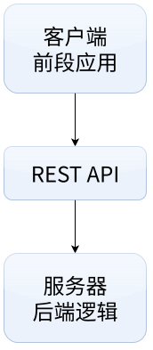

# RESTful API 概念

REST API（Representational State Transfer Application Programming Interface）是一种**基于 HTTP 协议的软件架构风格**，主要用于设计与实现网络应用程序的接口。

作为主流的 API 设计范式，REST API 也是当前 Web 服务开发中**应用最广泛**的接口方案之一。

## 什么是 API？

### API 的基本概念

API（Application Programming Interface，应用程序编程接口）是连接不同软件系统的桥梁。就像在餐厅点餐：你不会直接找厨师，而是把需求告诉**服务员（API）**，服务员将订单传达给**后厨（服务器）**，再把做好的菜**端回给你（返回数据）**。

在编程中，API 让独立运行的系统能够无缝交流与协作。日常场景随处可见：

- **天气 APP**：通过 API 调取气象局的实时数据。
- **购物 APP**：通过 API 调用微信/支付宝的支付功能。
- **社交 APP**：通过 API 访问手机相册并上传照片。

### API 的作用

**API 的四大核心作用**：

- **数据交换**：**打破**信息孤岛，实现跨系统的数据互通。
- **功能复用**：**调用**现成服务，告别“重复造轮子”，提高开发效率。
- **系统解耦**：**分离**前后端逻辑，双方只需遵循接口标准即可独立开发。
- **安全控制**：**隐藏**底层逻辑，集中管控谁能访问什么数据。

### 生活中的 API 类比

把使用 API 的过程，想象成一次在餐厅点餐的体验：

- 📜 **菜单** → **API 文档**（告诉你“有什么可点”）
- 🗣️ **点菜** → **发送请求 / Request**（告诉系统“你要什么”）
- 🤵 **服务器** → **API 接口**（负责“传递指令”给后厨）
- 🍽️ **上菜** → **接收响应 / Response**（服务器“返回结果”给你）

## REST 是什么？

### REST 的含义

REST（Representational State Transfer，表述性状态转移）并非具体的代码或计数，而是一种**架构风格**与**设计规范**。

如果说 API 是连接系统的“高速公路”，那么 REST 就是这条路上的“交通规则”。只要遵循这套规则设计的 API，我们就称之为 **RESTful API**。

### REST 的六大核心原则

遵循以下原则，才能打造出标准、高效的 REST 架构：

1. **C-S 架构（Client-Server）：职责分离。**前段专注用户界面，后端专注数据存储。

   类比：餐厅前厅负责接待点单，后厨只负责炒菜，互不干涉。

2. **无状态（Stateless）：不记仇也不报恩。**每次请求都必须包含完整的所需信息，服务器不保存客户端的上下文状态。

   类比：去银行办业务，无论你去过多少次，每次办理都需要重新出示身份证。

3. **可缓存（Cacheable）：避免重复劳动。**服务器必须指明哪些响应数据可以被客户端缓存，以降低网络延迟。

   类比：你把常用的外卖菜单贴在冰箱上，想点餐时直接看冰箱，不用再跑去店里拿菜单。

4. **统一接口（Uniform Interface）：标准化交互。**所有 API 使用统一的规范（如标准的 HTTP 方法和数据格式）进行通信。

   类比：全国设置全球的红绿灯规则都是“红灯停绿灯行”，不需要到新城市重新学习。

5. **分层系统（Layered System）：透明的中转站。**允许在客户端和目标服务器之间增加中间层（如网关、负载均衡），且客户端对此无感知。

   类比：你寄快递只管交给快递员，不需要知道包裹经过了多少个中转站才到达目的地。

6. **按需代码（Code on Demand，可选）：动态扩展。**服务器可以临时向客户端下发可执行代码（如 JavaScript 脚本）来扩展客户端功能。

### 为什么主流都在用 REST？

- **简单直观**：深度复用 HTTP 协议原生特性（如 GET/POST），学习门槛极低。
- **轻量高效**：通常采用 JSON 格式传输数据，无冗余头部，解析速度快、带宽占用小。
- **高扩展性**：得益于“无状态”和“分层系统”设计，服务端可以轻松进行横向扩容（加机器）。
- **极致兼容**：语言无关、平台无关，任何能发起 HTTP 请求的设备（手机、手表、甚至冰箱）都能无缝接入。